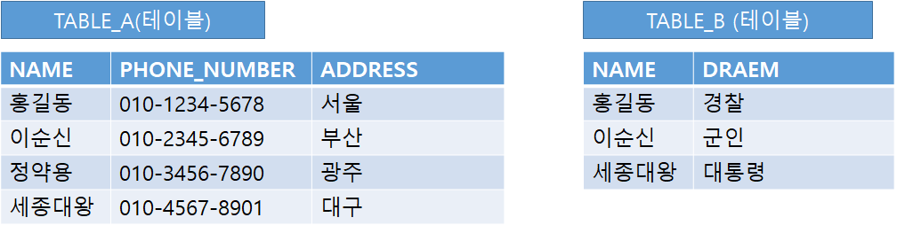

## 2021.11.30_SQL문의WITH

## WITH란?

- 임시테이블을 만들때 사용
- 작성하는 쿼리에서 특정 복잡한 쿼리 결과 셋을 여러번 사용해야하는 경우에
  - 그 장문의 쿼리결과 셋을 계속해서 쿼리내에 삽입하고, 매번 그 데이터를 중복해서 조회하면 성능도 떨어지고 비효율적일 수 있음
- 작성하는 쿼리 상단에 뷰 변수 개념으로 정의해서 쿼리 실행시 최초 한번만 구해서 그 쿼리 결과 셋을 특정 이름으로 정의할 수 있음
- 본문에서 사용하고 싶은 만큼 사용 가능하고 좋음
- 변수라고 생각해도 좋을 정도로 활용도 좋음

## MSSQL, ORACLE

- 두개 문법이 같음

### 단일 WITH문

```SQL
WITH TABLE_A AS
(
    SELECT NAME, PHONE_NUMBER, ADDRESS FROM STUDENT_DATA
)
SELECT * FROM TABLE_A;
```

- 이렇게 사용 할 수 있음

## 다중 WITH문

```SQL
WITH TABLE_A AS
(
    SELECT NAME, PHONE_NUMBER, ADDRESS FROM STUDENT_DATA
),
TABLE_B AS
(
    SELECT NAME, DREAM FROM STUDENT_DRAEM
)
SELECT A.NAME, A.PHONE_NUMBER, A.ADDRESS, B.DREAM FROM TABLE_A A
LEFT OUTER JOIN TABLE_B B ON A.NAME = B.NAME;
```



- 이런 상황에서 저 DRAEM이라는 부분을 추가하고 싶었음
- 그래서 임시 테이블을 두개를 만들고 JOIN을 이용하여 아래와 같은 결과를 얻음


- 이렇게 활용해도 되는지 모르겠지만 기존 쿼리 자체가 복잡했고, 그자체는 그대로 두고 필요한 컬럼 한개를 추가해야하는 상황에서 사용함