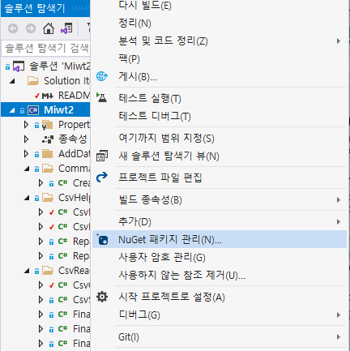

## 2021.12.07_CsvHelper사용법

## 목차

1. CsvHelper설치
2. 기본소스
   - 결과확인하기
3. 다른 자료형 받아오기
   - 기본예제
   - 내 소스에 적용해보기
   - 결과확인

## 1. CsvHelper설치



- NuGet 패키지 관리 클릭


- CsvHelper 검색 후 설치 진행

## 2. 기본소스

- Before

  ```c#
  using System;
  
  namespace csvHelperTest
  {
      class Program
      {
          static void Main(string[] args)
          {
              using (var reader = new StreamReader("path\\to\\file.csv"))
              using (var csv = new CsvReader(reader, CultureInfo.InvariantCulture))
              {
                  csv.Context.RegisterClassMap<FooMap>();
                  var records = csv.GetRecords<Foo>();
              }
          }
      }
      public class Foo
      {
          public int Id { get; set; }
          public string Name { get; set; }
      }
  
      public sealed class FooMap : ClassMap<Foo>
      {
          public FooMap()
          {
              Map(m => m.Id);
              Map(m => m.Name);
          }
      }
  }
  ```

- After

  ```c#
  using System;
  
  namespace csvHelperTest
  {
      class Program
      {
       private string _path = Environment.GetFolderPath(Environment.SpecialFolder.Desktop) + "@/csv/file.csv";
          static void Main(string[] args)
          {
              using (var reader = new StreamReader(_path))
              using (var csv = new CsvReader(reader, CultureInfo.InvariantCulture))
              {
                  csv.Context.RegisterClassMap<FooMap>();
                  var records = csv.GetRecords<Foo>();
              }
          }
      }
      public class Foo
      {
          public int Id { get; set; }
          public string Name { get; set; }
      }
  
      public sealed class FooMap : ClassMap<Foo>
      {
          public FooMap()
          {
              Map(m => m.Id);
              Map(m => m.Name);
          }
      }
  }
  ```


- 위와 같이 file.csv파일이 존재해야함

### 결과 확인하기


- 기본적인 자료형의 경우는 잘 받아옴

## 3. 다른 자료형 받아오기


- 데이터가 enum 타입인 경우

```C#
    public enum ClassInfo
    {
        oneGrade,
        twoGrade,
        threeGrade
    }
    public class Foo
    {
        public int Id { get; set; }
        public string Name { get; set; }
        public ClassInfo Class { get; set; }
    }
    public sealed class FooMap : ClassMap<Foo>
    {
        public FooMap()
        {
            Map(m => m.Id);
            Map(m => m.Name);
            Map(m => m.Class);
        }
    }
```

### 기본예제

```c#
void Main()
{
    using (var reader = new StreamReader("path\\to\\file.csv"))
    using (var csv = new CsvReader(reader, CultureInfo.InvariantCulture))
    {
        csv.Context.RegisterClassMap<FooMap>();
        csv.GetRecords<Foo>().ToList().Dump();
    }
}

public class Foo
{
    public int Id { get; set; }
    public string Name { get; set; }
    public Json Json { get; set; }
}

public class Json
{
    public string Foo { get; set; }
}

public class JsonConverter<T> : DefaultTypeConverter
{
    public override object ConvertFromString(string text, IReaderRow row, MemberMapData memberMapData)
    {
        return JsonConvert.DeserializeObject<T>(text);
    }

    public override string ConvertToString(object value, IWriterRow row, MemberMapData memberMapData)
    {
        return JsonConvert.SerializeObject(value);
    }
}

public class FooMap : ClassMap<Foo>
{
    public FooMap()
    {
        Map(m => m.Id);
        Map(m => m.Name);
        Map(m => m.Json).TypeConverter<JsonConverter<Json>>();
    }
}
```

### 내 소스에 적용해보기

#### ClassInfoConverter class

- Before

  ```c#
  public class JsonConverter<T> : DefaultTypeConverter
  {
      public override object ConvertFromString(string text, IReaderRow row, MemberMapData memberMapData)
      {
          return JsonConvert.DeserializeObject<T>(text);
      }
  
      public override string ConvertToString(object value, IWriterRow row, MemberMapData memberMapData)
      {
          return JsonConvert.SerializeObject(value);
      }
  }
  ```

- After

  ```c#
      public class ClassInfoConverter<T> : DefaultTypeConverter
      {
          public override object ConvertFromString(string text, IReaderRow row, MemberMapData memberMapData)
          {
             // return ClassInfoConverter.DeserializeObject<T>(text);
             return Enum.Parse<ClassInfo>(text);
          }
  
          public override string ConvertToString(object value, IWriterRow row, MemberMapData memberMapData)
          {
              //return ClassInfoConverter.SerializeObject(value);
              return value.ToString();
          }
      }
  ```
#### FooMap class 변경

- Before

  ```c#
      public sealed class FooMap : ClassMap<Foo>
      {
          public FooMap()
          {
              Map(m => m.Id);
              Map(m => m.Name);
              Map(m => m.Class);
          }
      }
  ```

- After

  ```c#
      public sealed class FooMap : ClassMap<Foo>
      {
          public FooMap()
          {
              Map(m => m.Id);
              Map(m => m.Name);
              Map(m => m.Class).TypeConverter<ClassInfoConverter<ClassInfo>>();
          }
      }
  ```

  ### 결과 확인하기    
  


