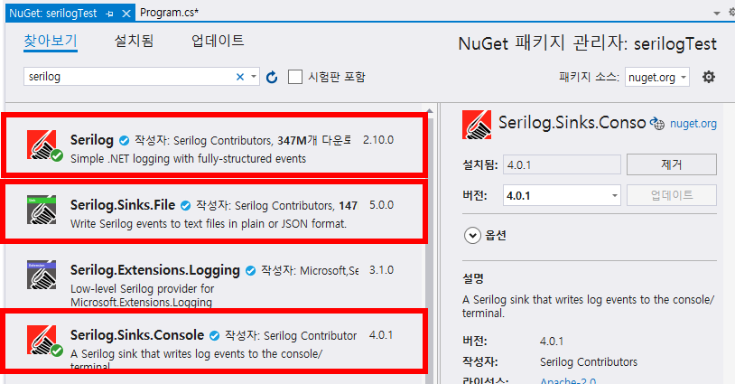
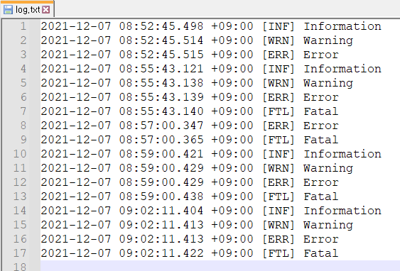

## 2021.12.07_Serilog사용법

## 목차

1. seriog 설치

2. 기본소스

3. 콘솔과 파일 출력 범위 나누기

   - Console창 확인하기

   - log.txt 파일 확인하기

## 1. Serilog 설치


- NuGet 패키지 관리 클릭



- Serilog, Serilog.Sinks.File, Serilog.Sinks.console 설치

## 2. 기본 소스

```C#
            var log = new LoggerConfiguration()
                .WriteTo.Console()
                .WriteTo.File("log.txt")
                .CreateLogger();
            
            log.Debug("Debug");
            log.Information("Information");
            log.Warning("Warning");
            log.Error("Error");
            log.Fatal("Fatal");

            Log.CloseAndFlush();
```

- ALL < DEBUG < INFO < WARN < ERROR < FATAL < OFF

- WARN을 로그 레벨로 설정하면 WARN, ERROR, FATAL 로그가 찍힘

- 위의 상태에서는 아래와 같은 결과가 나온다.


- 이유는 기본이 Informaion 레벨이기 때문에 DEBUG는 안나오고 그 아래가 찍히게 되는 것
- 만약에 ERROR 아래 로그를 찍고 싶다면 아래와 같이 코드를 구성하면된다.

```  C#
            var log = new LoggerConfiguration()
                .MinimumLevel.Error()
                .WriteTo.Console()
                .WriteTo.File("log.txt")
                .CreateLogger();
            
            log.Debug("Debug");
            log.Information("Information");
            log.Warning("Warning");
            log.Error("Error");
            log.Fatal("Fatal");

            Log.CloseAndFlush();
```

- Before

  ```c#
  .WriteTo.Console()
  ```

- After

  ```c#
  .MinimumLevel.Error()
  .WriteTo.Console()
  ```

- .MinimumLevel.Error() 을 추가해주면 전체에 적용 된다. 

## 3. 콘솔과 파일 출력 범위 나누기

- 만약에 콘솔에는 ERROR 로그만 나오게 하고 싶고 파일에 log 기록은 전체가 남기게 하고 싶다면 
- 아래와 같이 소스를 구성하면됨

```
            var log = new LoggerConfiguration()
                .MinimumLevel.Information()
                .WriteTo.Console(restrictedToMinimumLevel:LogEventLevel.Error)
                .WriteTo.File("log.txt")
                .CreateLogger();
            
            log.Debug("Debug");
            log.Information("Information");
            log.Warning("Warning");
            log.Error("Error");
            log.Fatal("Fatal");

            Log.CloseAndFlush();
```

- Before

  ```c#
  .MinimumLevel.Error()
  .WriteTo.Console()

- After

  ```c#
  .MinimumLevel.Information()
  .WriteTo.Console(restrictedToMinimumLevel:LogEventLevel.Error)
  ```

###  Console창 확인하기


### log.txt 파일 확인하기



- 이렇게 구분해서 적용이 가능하다는 것을 알 수 있음