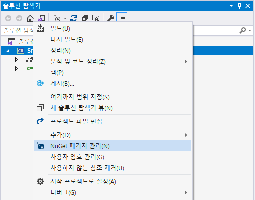
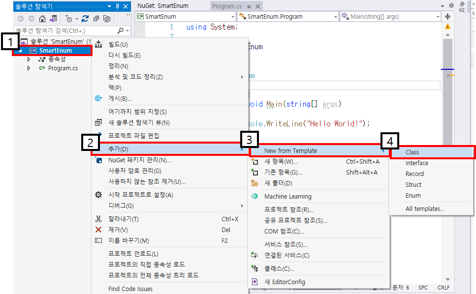
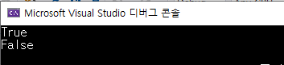
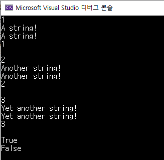
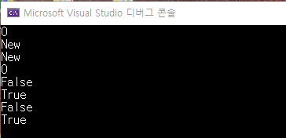
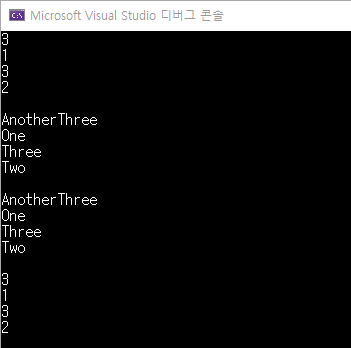
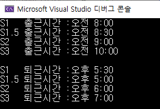

## 2021.12.08_SmartEnum-Enum을개선해보자

## 목차

1. 사용하게된 배경

   1.1 Enum이란?

   1.2 Enum을 사용하면서 느꼈던 단점

2. 패키지 설치

3. 기본사용법

   3.1 Default

   3.2 List

   3.3 FormName()

   3.4 FromValue()

4. 응용 해보기

## 1. 사용하게된 배경

### 1.1 Enum이란?

-  **열거형**(enumerated type, enumeration), **이넘**(enum), **팩터**(factor ← [R 프로그래밍 언어](https://ko.wikipedia.org/wiki/R_(프로그래밍_언어))와 통계학의 [범주형 변수](https://ko.wikipedia.org/w/index.php?title=범주형_변수&action=edit&redlink=1)에서 부르는 명칭)는 요소, 멤버라 불리는 명명된  값의 집합을 이루는 자료형
- 열거형의 값과 변수는 일반적으로 고정 길이의 [비트 문자열](https://ko.wikipedia.org/w/index.php?title=비트_문자열&action=edit&redlink=1)로 구현됨

### 1.2 Enum을 사용하면서 느꼈던 단점

- 가령, Month.1을 Enum에 쓰고 싶다면 Enum에서는 Month.1 받아서 써야하는 상황에서 저대로 쓸 수 없음
  - 에러가 발생함 그렇기 때문에  Month_1으로 해야 했음
- "", null이라는 것이 들어 올 수 없었음 그래서 None으로 해서 다시 null이나 "" 값으로 변경함
- Weather이라는 Enum 변수가 있을때 Enum 자체에 따로 시간이나, 문자열 추가적으로 사용할 수 없었음
  - 쉽게 말하면 하나의 변수가 여러개의 다른 자료형을 가지지 못함
  - Weather.Spring.SunsetTime
  - Weather.Summer.SunsetTime
  - Weather.Autumn.SunsetTime
  - Weather.Winter.SunsetTime
    - 계절 별 일몰 시간을 Weather이라는 곳에 한번에 담아서 쓰고 싶은데 그렇게 못했음
- 위의 단점을 Smart Enum은 해결을 가능하게 해줌.
  - 특히 따로 None을 지정을 하지 않더라도 값이 없는 경우 null로 처리됨

## 2. 패키지 설치



- NuGet패키지 관리 클릭


## 3. 기본사용법

### 3.1 Default

#### TestEnum.class 생성



### TestEnum : SmartEnum<TestEnum>

```c#
using Ardalis.SmartEnum;

namespace SmartEnum1
{
    public sealed class TestEnum : SmartEnum<TestEnum>
    {
        public static readonly TestEnum One = new TestEnum(nameof(One), 1);
        public static readonly TestEnum Two = new TestEnum(nameof(Two), 2);
        public static readonly TestEnum Three = new TestEnum(nameof(Three), 3);
        public TestEnum(string name, int value) : base(name, value)
        {
        }
    }
}
```

- 기본 스마트 열거형 정의

#### 출력 확인

```c#
            Console.WriteLine(TestEnum.One);
            Console.WriteLine(TestEnum.One.ToString());
            Console.WriteLine(TestEnum.One.Name);
            Console.WriteLine(TestEnum.One.Value+"\n");

            Console.WriteLine(TestEnum.Two);
            Console.WriteLine(TestEnum.Two.ToString());
            Console.WriteLine(TestEnum.Two.Name);
            Console.WriteLine(TestEnum.Two.Value + "\n");


            Console.WriteLine(TestEnum.Three);
            Console.WriteLine(TestEnum.Three.ToString());
            Console.WriteLine(TestEnum.Three.Name);
            Console.WriteLine(TestEnum.Three.Value + "\n");
```


#### 값 비교해보기

```c#
Console.WriteLine(TestEnum.One.ToString().Equals(TestEnum.One.Name));
Console.WriteLine(TestEnum.One.Equals(TestEnum.One.Value));
```

#### 출력 확인



- One이라는 출력 비교
  - TestEnum.One.ToString()
  - TestEnum.One.Name
    - 위의 두개는 같은 것
- 1이라는 출력 비교
  - TestEnum.One
  - TestEnum.One.Value
    - 위의 두개는 다른 것

### TestEnum : SmartEnum<TestEnum, ushort>

    public sealed class TestEnum : SmartEnum<TestEnum, ushort>
    {
        public static readonly TestEnum One = new TestEnum("A string!", 1);
        public static readonly TestEnum Two = new TestEnum("Another string!", 2);
        public static readonly TestEnum Three = new TestEnum("Yet another string!", 3);
        public TestEnum(string name, ushort value) : base(name, value)
        {
        }
    }

- 위와 같이 문자열로 인수를 줄 수 있음

#### 출력 확인



```c#
public sealed class TestEnum : SmartEnum<TestEnum>
{
    public static readonly TestEnum One = new TestEnum(nameof(One), 1);
    public static readonly TestEnum Two = new TestEnum(nameof(Two), 2);
    public static readonly TestEnum Three = new TestEnum(nameof(Three), 3);
    public static readonly TestEnum AnotherThree = new TestEnum(nameof(AnotherThree), 3);
    public TestEnum(string name, int value) : base(name, value)
    {
    }
  }
```

- 위와 같이 3이라는 동일한 값에는 둘 이상의 문자열을 할당 할 수 있음

- 하지만, 문자열에는 하나의 값만 할당 할 수 있음

  ```c#
  public static TestEnum Three = new TestEnum(nameof(Three), 4); -> throws exception
  ```

  - 위와 같이 하면 같은 에러가 발생한다.

#### 출력 확인


```c#
        Console.WriteLine(TestEnum.Three.Equals(TestEnum.AnotherThree));
        Console.WriteLine(TestEnum.Three.Value.Equals(TestEnum.AnotherThree.Value));
```


- 3 이라는 값의 비교
  - TestEnum.Three
  -  TestEnum.AnotherThree
    -  같은 값
  - TestEnum.Three.Value
  -  TestEnum.AnotherThree.Value
    - 같은 값

### Smart Enum에 behavior 추가 

### EmployeeType

``` c#
using Ardalis.SmartEnum;

namespace SmartEnum1
{
    public abstract class EmployeeType : SmartEnum<EmployeeType>
    {
        public static readonly EmployeeType Manager = new ManagerType();
        public static readonly EmployeeType Assistant = new AssistantType();

        protected EmployeeType(string name, int value) : base(name, value)
        {
        }

        public abstract decimal BonusSize { get; }

        private sealed class ManagerType : EmployeeType
        {
            public ManagerType() : base("Manager",1){}
            public override decimal BonusSize => 10_000m;
        }

        private sealed class AssistantType : EmployeeType
        {
            public AssistantType() : base("Assistant", 1) { }
            public override decimal BonusSize => 1_000m;
        }
    }
}
```

#### 출력확인

```c#
            //
            // behavior
            //
            Console.WriteLine(EmployeeType.Manager);
            Console.WriteLine(EmployeeType.Manager.ToString());
            Console.WriteLine(EmployeeType.Manager.Name);
            Console.WriteLine(EmployeeType.Manager.Value);
            Console.WriteLine(EmployeeType.Manager.BonusSize+"\n");


            Console.WriteLine(EmployeeType.Assistant);
            Console.WriteLine(EmployeeType.Assistant.ToString());
            Console.WriteLine(EmployeeType.Assistant.Name);
            Console.WriteLine(EmployeeType.Assistant.Value);
            Console.WriteLine(EmployeeType.Assistant.BonusSize);
```


### ReservationStatus

```c#
using Ardalis.SmartEnum;

namespace SmartEnum1
{
    public abstract class ReservationStatus : SmartEnum<ReservationStatus>
    {
        public static readonly ReservationStatus New = new NewStatus();
        public static readonly ReservationStatus Accepted = new AcceptedStatus();
        public static readonly ReservationStatus Paid = new PaidStatus();
        public static readonly ReservationStatus Cancelled = new CancelledStatus();
        private ReservationStatus(string name, int value) : base(name, value)
        {
        }
        public abstract bool CanTransitionTo(ReservationStatus next);

        private sealed class NewStatus : ReservationStatus
        {
            public NewStatus() : base("New", 0)
            {
            }
            public override bool CanTransitionTo(ReservationStatus next) =>
                next == ReservationStatus.Accepted || next == ReservationStatus.Cancelled;
        }

        private sealed class AcceptedStatus : ReservationStatus
        {
            public AcceptedStatus() : base("Accepted", 1)
            {
            }
            public override bool CanTransitionTo(ReservationStatus next) =>
                next == ReservationStatus.Paid || next == ReservationStatus.Cancelled;
        }

        private sealed class PaidStatus : ReservationStatus
        {
            public PaidStatus() : base("Paid", 2)
            {
            }

            public override bool CanTransitionTo(ReservationStatus next) =>
                next == ReservationStatus.Cancelled;
        }
        private sealed class CancelledStatus : ReservationStatus
        {
            public CancelledStatus() : base("Cancelled", 3)
            {
            }
            public override bool CanTransitionTo(ReservationStatus next) =>
                false;
        }
    }
}
```

### 출력확인

```c#
        Console.WriteLine(ReservationStatus.New);
        Console.WriteLine(ReservationStatus.New.ToString());
        Console.WriteLine(ReservationStatus.New.Name);
        Console.WriteLine(ReservationStatus.New.Value);

        Console.WriteLine(ReservationStatus.New.CanTransitionTo(ReservationStatus.New));
        Console.WriteLine(ReservationStatus.New.CanTransitionTo(ReservationStatus.Accepted));
        Console.WriteLine(ReservationStatus.New.CanTransitionTo(ReservationStatus.Paid));
        Console.WriteLine(ReservationStatus.New.CanTransitionTo(ReservationStatus.Cancelled));
```



- 위와 같이  사용 할 수 있음

### 3.2 List

```c#
        //
        // List
        //
        foreach (var option in TestEnum.List)
        {
         Console.WriteLine(option);   
        }
        Console.WriteLine();

        foreach (var option in TestEnum.List)
        {
            Console.WriteLine(option.ToString());
        }
        Console.WriteLine();

        foreach (var option in TestEnum.List)
        {
            Console.WriteLine(option.Name);
        }
        Console.WriteLine();

        foreach (var option in TestEnum.List)
        {
            Console.WriteLine(option.Value);
        }
```

- List에 저장된 것 처럼 사용 가능

#### 출력확인



```c#
var myEnum = TestEnum.List.Count;
Console.WriteLine(myEnum);
```

- 몇개가 있는지 확인도 가능함
- List자체랑 비슷하게 동작

### 3.3 FromName()

```c#
var myEnum = TestEnum.FromName("One");
```

- 문서 본문에는 이렇게 해서 인스턴스를 사용하는것인

```c#
var myEnum = TestEnum.FromName("One");
var myEnum2 = TestEnum.One;
Console.WriteLine(myEnum.Equals(myEnum2));
```

- `TestEnum.One` 한 것과 같음

#### 출력확인하기


### TryFromName()

```c#
            if (TestEnum.TryFromName("One", out var myEnum3))
            {
                Console.Write("One이 myEnum3에 있음");
            }
            else
            {
                Console.Write("해당한것인 myEnum3에 없음");
            }
```

- 이름을 찾을 수 없다면 예외가 발생
- 해당하는 이름이 없는 경우 false 반환 함

### 3.4 FromValue()

- 사실상 FromName과 비슷함

``` c#
            var myEnum = TestEnum.FromValue(1);

            if (TestEnum.TryFromValue(1, out var myEnum1))
            {
                Console.WriteLine(myEnum1.Name);
            }
            else
            {
                Console.WriteLine("값이 없음");
            }
```

#### 출력확인


#### 생각해보기

- 그렇다면 값이 같은 경우는 어떤식으로 나오게 될까?

- 중복인 경우 문자열 우선 순위로 앞에 있는것을 출력함


- 생각했던것은 Three Another Three가 나올줄 알았지만
- 우선 순위가 앞인 문자열만 나옴

``` c#
    public sealed class TestEnum : SmartEnum<TestEnum>
    {
        public static readonly TestEnum One = new TestEnum(nameof(One), 1);
        public static readonly TestEnum Two = new TestEnum(nameof(Two), 2);
        public static readonly TestEnum Three = new TestEnum(nameof(Three), 3);
        public static readonly TestEnum ZnotherThree = new TestEnum(nameof(ZnotherThree), 3);
        public TestEnum(string name, int value) : base(name, value)
        {
        }
    }
```


- 위와 같이 Three를 우선순위 앞으로 한 경우 

## 4. 응용 해보기

- 필요한 조건 한개의 문자열에 3개이상의 데이터를 쓸 수 있어야함

## 근무형태에 따른 시간 

### WorkType에 대한 SmartEnum

```c#
using System;
using System.Security.Cryptography;
using Ardalis.SmartEnum;

namespace AdvancedSmartEnum
{
    public abstract class Weather : SmartEnum<Weather>
    {
        public static readonly Weather Spring = new SpringStatus();
        public static readonly Weather Summer = new SummerStatus();
        public static readonly Weather Autumn = new AutumnStatus();
        public static readonly Weather Winter = new winterStatus();

        protected Weather(string name, int value) : base(name, value)
        {
        }
        public abstract TimeOnly SunriseTime { get;}

        public abstract TimeOnly SunsetTime { get; }


        private sealed class SpringStatus : Weather
        {
            public SpringStatus() : base("Spring", 0){}

            public override TimeOnly SunriseTime => new TimeOnly(8, 0, 0);
            public override TimeOnly SunsetTime => new TimeOnly(17, 0, 0);

        }
        private sealed class SummerStatus : Weather
        {
            public SummerStatus() : base("Summer", 1) { }
            public override TimeOnly SunriseTime => new TimeOnly(8, 30, 0);

            public override TimeOnly SunsetTime => new TimeOnly(17, 30, 0);
        }
        private sealed class AutumnStatus : Weather
        {
            public AutumnStatus() : base("Autumn", 2) { }

            public override TimeOnly SunriseTime => new TimeOnly(9, 0, 0);
            public override TimeOnly SunsetTime => new TimeOnly(18, 0, 0);
        }
        private sealed class winterStatus : Weather
        {
            public winterStatus() : base("Winter", 3) { }

            public override TimeOnly SunriseTime => new TimeOnly(10, 0, 0);
            public override TimeOnly SunsetTime => new TimeOnly(19, 0, 0);
        }
    }
}
```

### 출력 소스

```c#
            Console.WriteLine("봄   일출 시간 :" + Weather.FromName("Spring").SunriseTime);
            Console.WriteLine("봄   일몰 시간 :" + Weather.FromName("Spring").SunsetTime);
            Console.WriteLine("여름 일출 시간 :" + Weather.FromName("Summer").SunriseTime);
            Console.WriteLine("여름 일몰 시간 :" + Weather.FromName("Summer").SunsetTime);
            Console.WriteLine("가을 일출 시간 :" + Weather.FromName("Autumn").SunriseTime);
            Console.WriteLine("가을 일몰 시간 :" + Weather.FromName("Autumn").SunsetTime);
            Console.WriteLine("겨울 일출 시간 :" + Weather.FromName("Winter").SunriseTime);
            Console.WriteLine("겨울 일몰 시간 :" + Weather.FromName("Winter").SunsetTime);
```

####  																				             OR

```c#
            Console.WriteLine("봄   일출 시간 :" + Weather.Spring.SunriseTime);
            Console.WriteLine("봄   일몰 시간 :" + Weather.Spring.SunsetTime);
            Console.WriteLine("여름 일출 시간 :" + Weather.Summer.SunriseTime);
            Console.WriteLine("여름 일몰 시간 :" + Weather.Summer.SunsetTime);
            Console.WriteLine("가을 일출 시간 :" + Weather.Autumn.SunriseTime);
            Console.WriteLine("가을 일몰 시간 :" + Weather.Autumn.SunsetTime);
            Console.WriteLine("겨울 일출 시간 :" + Weather.Winter.SunriseTime);
            Console.WriteLine("겨울 일몰 시간 :" + Weather.Winter.SunsetTime);
```

## 출력확인



- 물론 소스자체가 기존 enum을 쓰는것에 비해 길어진다는 단점이 있지만,
  - 그래도 S1에 대해서 여러 데이터를 넣어서 사용 할 수 있다는 장점이 있음 
  - 이전에는 각 타입에 따라서 여러개 변수를 넣을 수 없었지만 가능해짐
