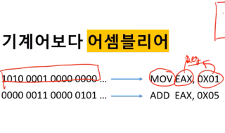
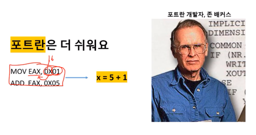
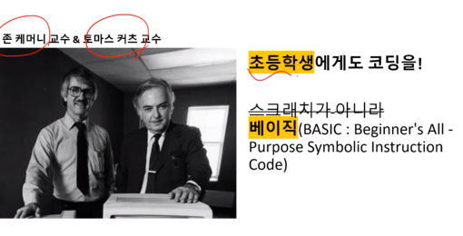
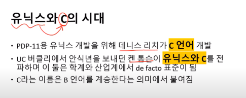
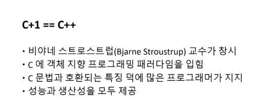
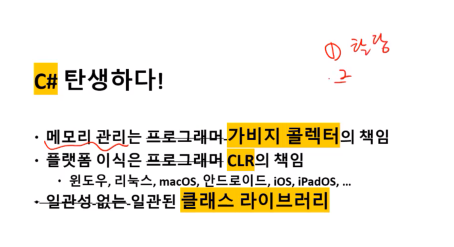
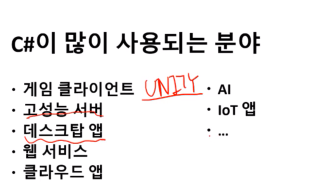
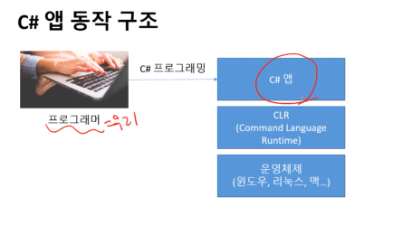

## 22.01.17_이것이C#이다.

## 프로그래밍

- 컴퓨터에서 동작하는 프로그램을 만드는 일

## 프로그래밍 언어

- 프로그래밍을 위한 인공언어
- 명령어 집합, 문법체계 보유

## 첫 프로그래밍 언어모습

- ENIAC 프로그래밍 도식
- 2차세계대전 시기에서 만들어진 것

- 각 유닛간의 배선을 연결하는게 프로그래밍

## 컴파일러

- 번역기임

  - 사람이 읽고 쓸 수 있는 언어로 작성한 코드

    > 번역

  - 컴퓨터가 편하게 읽을 수 있는 이진코드 기계어

- 기계어 보다 어셈블리어

- x는 6이라는것을 바로 알 수 있는거 저것이 포트란임

- 프로그래밍 언어의 형태로 바뀜ㄴㅁ

- 요새는 시각적인 스크래치를 사용

- 어셈블리어 -> c언어  -> Unix

- C언어에 한가지 더 올린다는 뜻
  - 메모리 관리가 쉽지 않음
  - 플랫폼 이식도 쉽지 않음
  - 일관성 없는 라이브러리
    -  할당 하고 Data W/R하고 해제를 해야하는데 결국은 1개때문에 out of memory 문제가 생김

- CLR?
- dotnet 라이브러리가 잘되어있음

