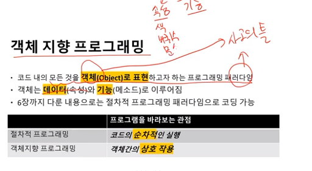
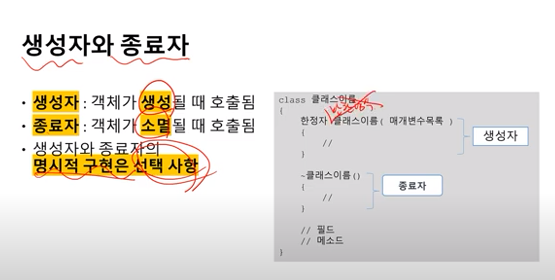
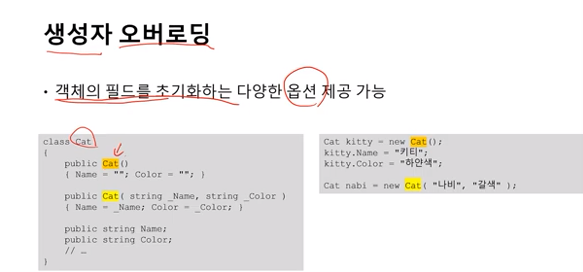
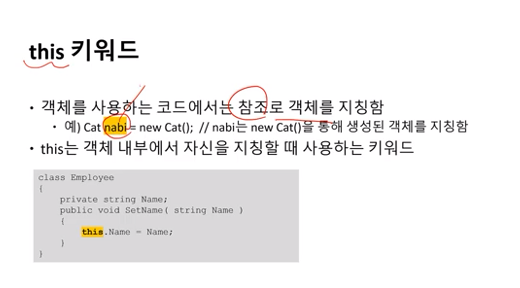
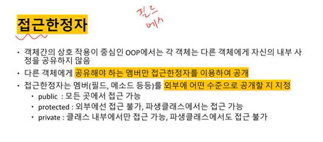
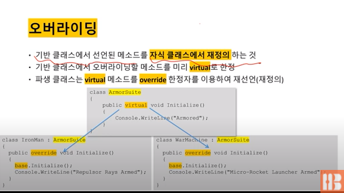
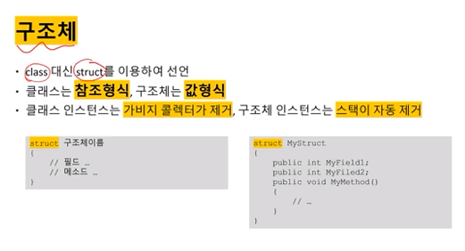
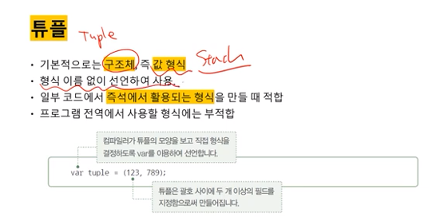

## 22.01.17_[7장]객체지향프로그래밍과클래스

## 클래스

- 클래스는 형식이라 하나만 존재(데이터 타입) 설계도
- 객체는 여러개 만들수 있음(변수) 실체

- 필드 라고 부름 멤버변수라고도 함

​	

- 생성자 자원 초기화 파일이나 커넥션 관련된것
- 종료자 자원정리 가비지 컬렉션이함
  -  불가피한 경우에만 쓰자

- 복합데이터 형식은 힙에 위치
- nabi는 스택에 있음 그걸로 참조
  - 참조가 없으면 this로 쓸 수 있음

- 코드를 물려받는것 
- 부모클래스(기반 클래스)
- 자식 클래스(파생클래스)
- :을 통해 상속됨
- 

- virtual로 한정함
  - 앞으로 파생 클래스 있을꺼라고 선언함 
  - 그럼 파생 클래스에서 재정의 할때 override를 써야함
  - base는 부모클래스를 참조하는것 this와 비슷함

- 구조체는 값형식임
  - 차이는 갑형식과 참조형식 차이

- 형식이름을 부여하지 않고 사용
  - 즉석에서 사용할 때 사용함
- var 키워드는 형식 추론을 위해 씀
  - 컴파일을 어떻게 해야겠다 알아서 해줌

