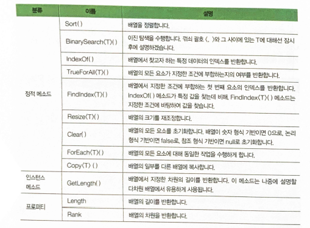
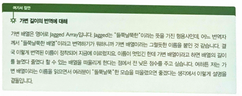
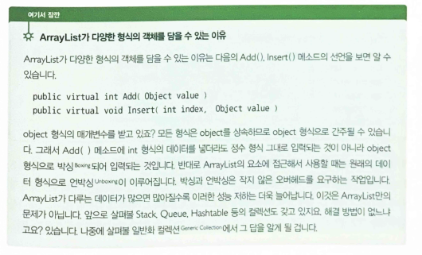
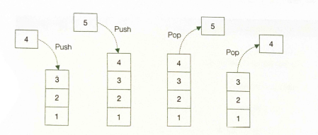

## 22.02.05_Csharp배열

## 목차

> 1.배열 System.Index형식과 ^연산자
>
> 2.System.Array
>
> 3.배열 분할하기
>
> 4.이차원배열
>
> 5.가변배열
>
> 6.컬렉션 맛보기
>
> > 6.1ArrayList
> > 6.2 Queue
> > 6.3 Stack
> > 6.4 Hashtable
>
>  7.컬렉션을 초기화하는 방법
>
>  8.인덱서
>
>  9.foreach가 가능한 객체

## 1.배열 System.Index형식과 ^연산자

- Csharp8.0 부터 생김
- ^연산자는 컬렉션의 마지막부터 역순으로 인덱스를 지정하는 기능
- ^1은 컬렉션의 마지막부터 역순으로 인덱스를 지정하는 기능

```csharp
System.Index last = ^1;
score[last] = 34; //score[score.Length-1] = 34;와 동일
score[^1] = 34; //이렇게 해도됨
```

## 2.System.Array



```csharp
using System;

namespace MoreOnArray
{
    class MainApp
    {
        private static bool CheckPassed(int score)
        {
            return score >= 60;
		}
        
        private static void Print(int value)
        {
            Console.Write($"{value}");
        }
        
        static void Main(string[] args)
        {
            int[] scores = new int[]{80,74,81,90,34};
            
            foreach (int score int scores)
                Console.Write($"{score}");
            Console.WriteLine();
            
            Array.Sort(scores);
            Array.ForEach<int>(scores, new Action<int>(Print));
            Console.WriteLine();
            
            Console.WriteLine($"Number of dimensions : {scores.Rank}");
            
            Console.WriteLine($"Binary Search : 81 is at " + $"{Array.BinarySearch<int>(scores,81)}");
            
            Console.WriteLine($"Linear Search : 90 is at " + $"{Array.IndexOf(scores,90)}");
            
            Console.WriteLine($"Everyone passed ? : " + $"{Array.TrueForAll<int>(scores, CheckPassed)}");// TrueForAll 메소드는 배열과 함께 조건을 검사하는 메소드를 매개변수로 받음
            
            int index = Array.FindIndex<int>(scores, (socores) => score < 60);
            
         	scores[index] = 61;
            Console.WriteLine($"Everyone passed ? : " + $"{Array.TrueForAll<int>(scores, CheckPassed)}");
            
            Console.WriteLine("Old length of scores : " + $"{scores.GetLength(0)}");
            
            Array.Resize<int>(ref scores, 10);
            Console.WriteLine($"New length of scores : {socres.Length}");
            
            Array.ForEach<int>(scores, new Action<int>(Print));
            Console.WriteLine();
            
            Array.Clear(scores, 3, 7);
            Array.Foreach<int>(scores, new Action<int>(Print));
            Console.WriteLine();
            
            int[] sliced = new int[3];
            Array.Copy(scores, 0, sliced, 0, 3);
            Array.ForEach<int>(sliced, new Action<int>(Print));
            Console.WriteLine();
		}
    }
}
```

## 3.배열 분할하기

- System.Range와 ..연산자

  ```csharp
  Systme.Range r1 = 0..3;//0은 시작인덱스, 3은 마지막 인덱스
  int[] sliced = scores[r1];
  
  int[] slcied2 = scores[0..3]
  ```

## 4.이차원배열

```csharp
데이터형식[,] 배열이름 = new 데이터형식[2차원길이, 1차원길이];

int[,] arr = new int[2,3] {{1,2,3}, {4,5,6}};
int[,] arr2 = new int[,] {{1,2,3}, {4,5,6}};
int[,] arr3 = new {{1,2,3}, {4,5,6}};
```

## 5.가변배열

- 2차원 배열이나 3차원 배열 같은 다차원 배열을 `배열을 요소로 갖는 배열`



```csharp
데이터형식[][] 배열이름 = new 데이터형식[가변 배열의 용량][];

int[][] jagged = new int[3][];
jagged[0] = new int[5]{1,2,3,4,5};
jagged[1] = new int[]{10,20,30};
jagged[2] = new int[]{100,200};
```

## 6.컬렉션 맛보기

- 같은 성격을 띈 데이터의 모음을 담는 자료구조

  ```csharp
  public abstract class Array : ICloneable,IList, ICollection, IEnumerable
  ```

### 6.1ArrayList

- 배열과 닮은 컬렉션
- 배열과 달리 용량을 미리 지정할 필요 없음
- **중요메소드**
  - Add()
  - RemoveAt()
  - Insert()




### 6.2 Queue


```csharp
Queue que = new Queue();
que.Enqueue(1);//넣을때
que.Enqueue(2);

que.Dequeue();//뺄때
```

### 6.3 Stack



```csharp
Stack stack = new Stack();
stack.Push(1);//넣을때

stack.Pop();//뺄때
```

### 6.4 Hashtable

- 키와 값의 쌍으로 이루어진 데이터 다룰때
  - 사전이 가장 좋은 예
  - 탐색 속도가 빠르고 사용하기도 편함

```csharp
Hashtable ht = new Hashtable();
ht["book"] =  "책";
ht["cook"] = "요리";
```

## 7.컬렉션을 초기화하는 방법

```csharp
int[] arr = {123, 456, 789};

ArrayList list = new ArrayList(arr); // 123, 456, 789
Stack stack = new Stack(arr); // 789, 456, 123
Queue queue = nwe Queue(arr); // 123, 456 ,789
```

- ArrayList의 경우 배열의 도움없이 직접 컬렉션 초기자를 이용하여 초기화 할 수 있음

  ```csharp
  ArrayList list2 = new ArrayList() {11, 22, 33};
  ```

- Hashtable 초기화

  - 딕셔너리 초기차를 이용

    ```csharp
    Hashtable ht = new Hashtable()
    {
        ["하나"] = 1,
        ["둘"] = 2
    };
    
    Hashtable ht1 = new Hashtable()
    {
        {"하나",1},
        {"둘",2ㄴ}
    }
    ```

## 8.인덱서

- 인덱스를 이용해서 객체 내의데이터에 접근하게 해주는 프로퍼티

```csharp
class 클래스 이름
{
    한정자 인덱서형식 this[형식 index]
    {
        get
        {
        	//index를 이용하여 내부 데이터 반환    
        }
       	set
        {
            //index를 이용하여 내부 데이터 저장
        }
	}
}
```

- MyList는 내부에 정수 형식 배열을 갖고 있고, 인덱서를 통해 이 배열에 접근
- 인덱서를 통해 데이터를 저장하고자 하는 시도가 이루어질 때 
  - 지정한 인덱스보다 배열의 크기가 작다면 인덱스에 맞춰 배열의 크기를 재조정

```csharp
class MyList
{
    private int[] array;
    
    public MyList()
    {
        array = new int[3];
	}
    
    public int this[int index]
    {
        get
        {
            return array[index];
		}
        set
        {
            if(index >= array.Length)
            {
                Array.Resize<int>(ref array, index+1);
                Console.WriteLine("Array Resized : {array.Length}");
			}
            arr[index] = value;
		}
	}
    
    public int Length
    {
        get {return array.Length;}
	}
}
```

## 9.foreach가 가능한 객체

- foreach 문은 아무 형식의 객체에서나 사용할 수 있는 것이 아님
- 배열이나 리스트 같은 컬렉션에서만 사용할 수 있음
- foreach구문은 IEnumerable을 상속하는 형식만 지원


- GetEnumerator()는 IEnumerator 인터페이스를 상속하는 클래스의 객체를 반환해야 함
- yield 문을 이용하면 IEnumerator를 상속하는 클래스를 따로 구현하지 않아도 컴파일러가 자동으로 해당 인터페이스를 구현한 클래스를 생성해줌

```csharp
using System;
using System.Collections;

namespace Yield
{
    class MyEnmerator
    {
        int[] number = {1,2,3,4};
        public IEnumerator GetEmnumerator()
        {
            yield return numbers[0];
            yield return numbers[1];
            yield return numbers[2];
            yield return numbers[3];
            yield break; //GetEnumerator()메소드를 종료시킴
            yield return numbers[4];
	}
 	class MainApp
 	{
 		static void Main(string[] args)
 		{
 			var obj = new MyEnumerator();
 			foreach (int i in obj)
 			Console.WriteLine(i);
        }
	}
}
    // 결과 1,2,3만 나옴
```

- GetEnumerator() 메소드는 IEnumerator 형식의 객체
  - 다시말해 IEnumerator 인터페이스를 상속하는 클래스이 객체를 반환하면됨


- IEnumberator를 상속하는 클래스 구현
  - MyList는IEnumerable과 IEnumerator 모두를 상속함
  -  MoveNext(), Reset() 메소드와 Current 프로퍼티를 구현하면 IEnumerator의 요구사항을 충족
  - MyList는 IEnumerator가 됨
    - 따라서 IEnumerable이 요구하는 GetEnumerator()메소드를 구현할 때는 자기 자신(this)를 반환하기만 하면됨

```csharp
using System;
using System.Collections;

namespace Enumerable
{
    class MyList : IEnumerable, IEnumerator
    {
        pirvate int[] array;
        int position = -1;
        
        public MyList()
        {
            array = new int[3];
		}
        
        public int this[int index]
        {
            get
            {
                return array[index];
			}
            set
            {
                if(index >= array.Length)
                {
                    Array.Resize<int>(ref array, index + 1);
                    Console.WriteLine($"Array Resized : {array.Length}");
				}
                
                array[index] = value;
			}
		}
        
        //IEnumerator 멤버
        // IEnumerator로 부터 상속받은 Current프로퍼티는 현재 위치의 요소를 반환
        public object Current 
        {
            get
            {
                return array[position];
            }
		}
        
        public bool MoveNext()// 다음 위치의 요소로 이동
        {
            Reset();
            return false;
		}
        
        position++;
        return (position < array.Length);
	
    	public void Reset() //요소의 위치를 첫요소의 앞으로 옮김
    	{
    	    position = -1;
    	}
    	
    	//IEnumerable 멤버
    	public IEnumerator GetEnumerator()
    	{
    	    return this;
		}
    }
    
    class MainApp
    {
    	static void Main(string[] args)
        {
            MyList list = new MyList();
            for(int i = 0 ; i < 5 ; i++)
            {
                list[i] = i;
            }
            
            foreach (int e in list)
                Console.WriteLine(e);
		}
    }
}
```


