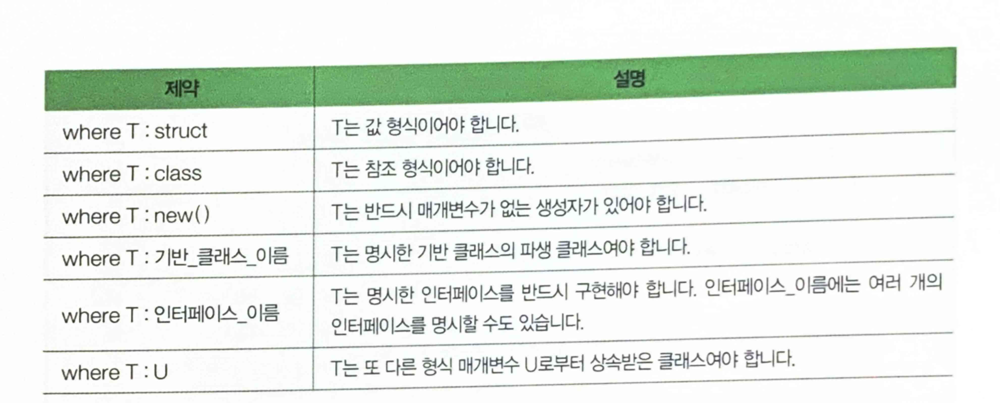
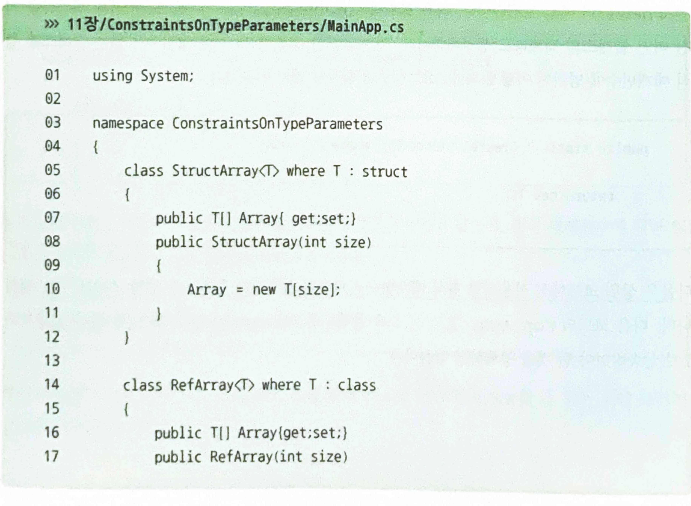
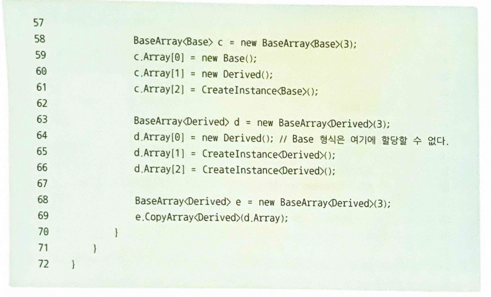
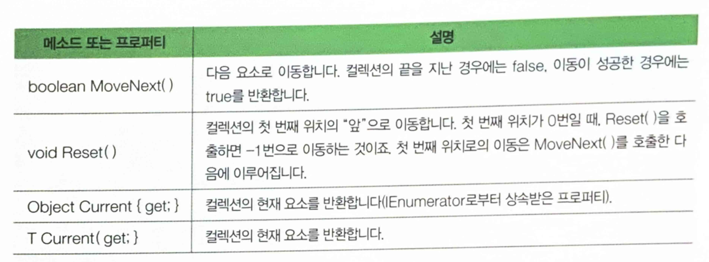

## 22.02.05_Csharp일반화프로그래밍

## 목차

> 1.일반화 메소드
>
> 2.일반화 클래스
>
> 3.형식 매개변수 제약시키기
>
> 4.일반화 컬렉션
>
> > 4.1 List<T>
> >
> > 4.2 Queue<T>
> >
> > 4.3 Stack<T>
> >
> > 4.4 Dictionary<TKey, TValue>
>
>  5.foreach를 사용할 수 있는 일반화 클래스

- 특수한 개념으로부터 공통된 개념을 찾아 묶는 것을 일반화
  - 일반화 하는 대상은 `데이터 형식`

## 1.일반화 메소드

- 이름처럼 데이터 형식을 일반화한 메소드

```Csharp
한정자 반환_형식 메소드이름<형식_매개변수> (매개변수_목록)
{
    //
}
```

```csharp
void CopyArray<T> (T[] source, T[] target)
{
    for(int i=0; i<source.Length; i++)
        target[i] = source[i];
}

//사용 
int[] source = {1,2,3,4,5};
int[] target = new int[source.Length];
CopyArray<int>(source, target);

string[] source1 = {"1","2","3","4"};
string[] target1 = new string(source2.Length);
CopyArray<string>(source1, target1);
```

## 2.일반화 클래스

- 데이터 형식을 일반화한 클래스

  ```csharp
  class 클래스이름 <형식_매개변수>
  {
      //
  }
  
  //적용
  class Array_Generic<T>
  {
      private T[] array;
      //..
      public T GetElement(int index) {return array[index];}
  }
  
  //사용
  Array_Generic<int> intArr = new Array_Generic<int>();
  Array_Generic<double> dbArr = new Array_Generic<double>();
  ```

## 3.형식 매개변수 제약시키기

- 모든 형식에 대응할 수 있는 형식 매개변수가 필요한 때도 있지만

  - 종종 특정 조건을 갖춘 형식에만 대응하는 형식 매개변수가 필요할 때도 있음

- **MyClass로 부터 상속받는형식이어야 할 것이라는 제약 적용**

  ```csharp
  class MyList<T> where T : MyClass
  {
      //...
  }
  ```

- 일반화 메소드의 경우

  ```csharp
  void CopyArray<T>(T[] source, T[] target) where T : struct
  {
      //...
  }
  ```

- 사용 법

  ```csharp
  where 형식 매개변수 : 제약조건
  ```



- **제약조건 new(), U**

  ```csharp
  public static T CreateInstance<T>() where T : new()
  {
      return new T();
  }
  ```

  - 다음은 상위 코드에 사용되던 형식 매개변수 U로부터 상속받는 형식으로 제약 조건을 주는 예

    - CopyArray<T>() 소속 클래스인 BaseArray<U>의 형식 매게변수 U로부터 T가 상속받아야 할것을 강제하고 있음	

      ```csharp
      class BaseArray<U> where U : Base
      {
          public U[] Array {get; set;}
          public BaseArray(int size)
          {
              Array = new U[size];
      	}
          
          public void CopyArray<T>(T[] source) where T : U
          {
              Source.CopyTo(Array, 0);
      	}
      }
      ```

      




## 4.일반화 컬렉션

### 4.1 List<T>

```csharp
List<int> list = new List<int>();
```

### 4.2 Queue<T>

```csharp
Queue<int> queue = new Queue<int>();
```

### 4.3 Stack<T>

```csharp
Stack<int> stack = new Stack<int>();
```

### 4.4 Dictionary<TKey, TValue>

```csharp
Dictionary<string, string> dic = new Dictionary<string, string>();
```

## 5.foreach를 사용할 수 있는 일반화 클래스


- IEnumerator<T>의 메소드와 프로퍼티

  

