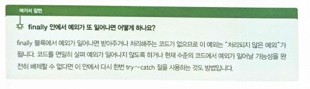

## 22.02.06_Csharp예외처리하기

## 목차

> 1.try~catch로 예외 받기
>
> 2.System.Exception 클래스
>
> 3.예외 던지기
>
> 4.try~catch와 finally
>
> 5.사용자 정의 예외 클래스 만들기
>
> 6.예외 필터하기
>
> 7.예외처리 다시 생각해보기

- 예외가 프로그램의 오류나 다운으로 이어지지 않도록 적절하게 처리하는 것을 예외 처리 라고 함

## 1.try~catch로 예외 받기

```csharp
try
{
    //실행하고자 하는 코드
}
catch(예외_객체_1)
{
    //예외가 발생했을 때의 처리
}
catch(예외_객체_2)
{
    //예외가 발생했을 때의 처리
}

//사용
try
{
    for(int i=0; i<5 ;i++)
    {
        Console.WriteLine(arr[i]);
    }
}
catch (indexOutOfRangeException e)
{
    Console.WriteLine($"예외가 발생했습니다 : {e.Message}")''
}
```

## 2.System.Exception 클래스

- 이것은 모든 예외의 조상임
  - 모든 예외 클래스는 반드시 위 클래스로 부터 상속받아야 함

```csharp
try
{
}
catch(Exception e)
{
    //
}
```

- 모든것이 이 클래스를 상속하니까 저렇게 하면 다 받을 수 있다고 생각할 수 있음
- 하지만 예외 상황에 따라 섬세한 예외 처리가 필요한 코드에서는 Exception 클래스만으로 대응이 어려우므로 
  - 귀찮다고 저렇게 하면 안됨

## 3.예외 던지기

```csharp
try
{
    //
    throw new Exception("예외를 던짐");// throw문을 통해 던져진 예외 객체는 catch문을 통해 받음
}
catch(Exception e)
{
    Console.WriteLine(e.Message);
}
```

- C#7.0 부터는 식으로도 사용가능

  ``` csharp
  int? a = null;
  int b = a ?? throw new ArgumnetNullException();
  ```

## 4.try~catch와 finally

- try 블록의 자원 해제 같은 중요한 코들르 미쳐 실행하지 못하는 경우 이는 곧 버그를 만듦

  - 예를 들면 아래 코드와 같이 try블록 끝에 데이터베이스 커넥션을 닫는게 있는데 갑자기 예외때문에 
  - 실행하지 못한다면 사용할 수 있는 커넥션이 점점 줄어 DB연결 할 수없는상태가 될 수 있음

  ```csharp
  try
  {
      dbconn.Open();
      //
      dbconn.Close();//이것 때문에 버그생길수 있음
  }
  catch(XXXException e)
  {
      //
  }
  catch(YYYException e)
  {
      //
  }
  ```

  - 저게 제대로 실행이 안될때 생기는 버그이기 때문에 catch에 한개씩 다넣어주면 된다 생각하지만

  - dry법칙에 어긋남

    ```csharp
    //마지막 단에 finally추가
    finally
    {
        db.conn.Close();
    }
    ```

    - 이렇게 하면됨



## 5.사용자 정의 예외 클래스 만들기

- 왠만한 예외의 경우 지원을 하지만 그런게 아닌경우 만들어야함

```csharp
using System;

namespace MyException
{
    class InvalidArgumentException : Exception
    {
        public InvalidArgumentException()
        {
		}
        
        public InvalidArgumentException(stirng message) : base(message)
        {
		}
        
        public object Argument
        {
            get; set;
		}
        
        public string Range
        {
            get; set;
		}
    }
}
```

- 위와 같이 만들어 사용할 수 있음

## 6.예외 필터하기

- c#6.0부터 catch절이 받아들일 예외 객체에 제약 사항을 명시해서 해당 조건을 만족하는 
  - 예외 객체에 대해서만 예외 처리 코드를 실행할 수 있도록 하는 예외 필터가 도입
  - 사용은 catch() 절 뒤에 when 키워드를 이용해서 제약 조건을 기술하면 됨

```c#
class FilterableException : Exception
{
	public int Error No {get:set;}
}
try
{
	int num = GetNumber();
	if (num < 0 | num > 10)
	throw new FilterableException() { ErrorNo = num };
	else
	Console.WriteLine($"Output : {num}");
}
catch (FilterableException e) when (e.ErrorNo <0)
{
	Console.WriteLine("Negative input is not allowed.");
}
```

## 7.예외처리 다시 생각해보기

- 예외처리를 지원하지 않는 다면?
- 메소드 내부에서 문제가 생기면 어떻게 호출자에게 그 문제를 알릴까?
  - 에러코드를 반환하는 방법?
  - 어떻게든 비슷하게 할 수는 있겠지만 try~catch문을 이용한 예외 처리는
  -  실제 일을 하는 코드와 문제를 처리하는 코드를 분리해 코드를 간결하게함
- 즉, 어디에 에러가 났는지 알려주기때문에 디버깅시 유용함

