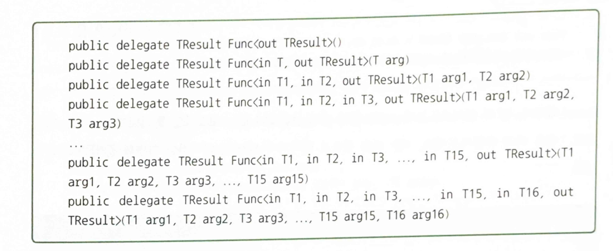
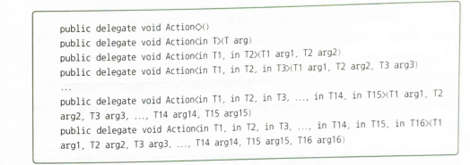
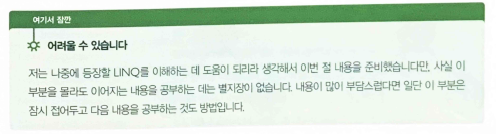
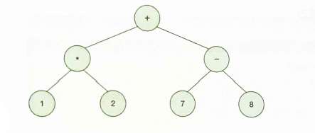
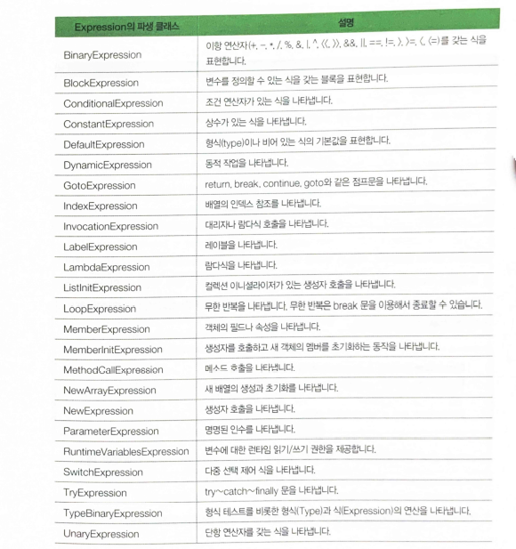
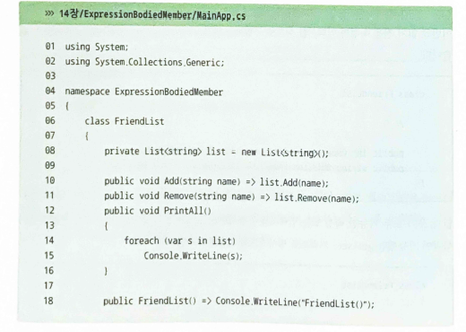
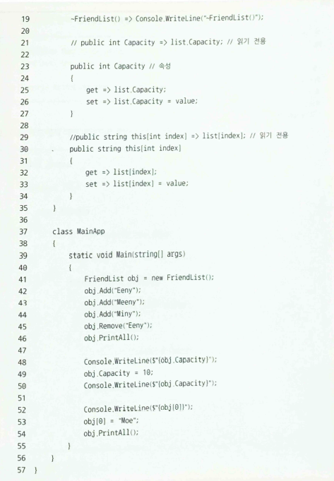

## 22.02.07_Csharp람다식

## 목차

> 1.람다식
>
> 2.문 형식의 람다식
>
> 3.Func와 Action으로 더 간편하게 무명 함수 만들기
>
> > 3.1 Func 대리자
> >
> > 3.2 Action 대리자
>
>  4.식트리
>
>  5.식으로 이루어지는 멤버

- 익명 메소드를 만드는 또 하나의 방법


## 1.람다식

- 기본적인 람다식 선언 형식

   ```csharp
   매개변수_목록 => 식
       
   //사용
   delegate int Calculate(int a, int b);
   //
   ...
   static void Main(string[] args)
   {
       Calculate calc = (int a, int b) => a + b;
   }
   ```

  - => 는 입력 연산자임
  - c#컴파일러는 이 코드를층 더 간결하게 만들 수 있도록 `형식 유추`라는 기능을 제공
    - 그렇게 하면 매개변수의 형식을 제거할 수 있음
  - before
    - `Calculate calc = (int a, int b) => a + b;`
  - after 
    - `Calculate calc = (a, b) => a + b;`

## 2.문 형식의 람다식

- 람다식은 말 그대로 식 형식을 하고 있음

  ```csharp
  (매개변수_목록) => {
   					문장1;
     					문장2;
      				문장3;
  			     }
  ```

  - 식 형식의 람다식으로는 반환 형식이 없는 무명함수를 만들 수 없지만,
  - 문 형식의 람다식을 이용하면 가능

## 3.Func와 Action으로 더 간편하게 무명 함수 만들기

- 대부분 하나의 익명 메소드나 무명 함수를 만들기 위해 매번 별개의 대리자를 선언해야했음
  - 이것도 번거롭다면 번거로운 것
  - MS는 .Net에 Func와 Action 대리자를 미리 선언해뒀음
- `Func 대리자`는 결과를 반환하는 메소드를 참조
- `Action 대리자`는 결과를 반환하지 않은 매소드를 참조

### 3.1 Func 대리자



- 사용법

  ```csharp
  //Func 대리자 사용 예제
  Func<int> func1 = () => 10; //입력 매개변수는 없으며, 무조건 10을 반환
  
  //매개변수가 하나 있는 버전 Func<T1, TResult>의 사용 예
  Func<int, int> func2 = (x) => x * 2;
  Console.WriteLine(func2(3));//6출력
  
  //매개변수가 두개 있는 버전 Func<T1, T2,TResult>의 사용 예
  Func<int, int, int> func3 - (x,y) => x + y;
  Console.WriteLine(func3(2,3));
  ```

### 3.2 Action 대리자

- Func와 같지만 차이는 반환 형식이 없음



- 사용 예

  ```csharp
  //일반 사용
  Action act1 = () => Console.WriteLine("Action()");
  act1();
  
  //Action<T>의 사용 예
  int result = 0;
  Action<int> act2 = (x) => result = x*x;
  
  act2(3);
  Console.WriteLine($"result : {result}");//9출력
  
  //Action<T1, T2> 대리자의 사용 예
  Action(double, double) act3 = (x,y) =>
  		{
      		double pi = x / y;
      		Console.WriteLine($"Action<T1, T2>({x}, {y} : {pi}");
  		};
  
  act3(22.0, 7.0)
  ```

## 4.식트리



- 트리는 다음과 같이 노드로 구성되며, 각 노드는 서로 부모 - 자식 관계로 연결됨


-  A를 트리의 뿌리가 되는 루트 노트라고 함
  - 그리고 루트로부터 뻗어 나온 노드 중 가장 끝에 있는 D, E, F, G같은 노드를 잎 노드 또는 단말 노드라고 함
- A의 자식 노드 B, C
- B의 자식 노드 D, E
- 식 트리는 이진트리 두개만 자식 노드를 가짐
  - 식을 트리로 표현한 자료구조임



- `1 * 2 + (7 - 8)`를 식 트리로 표현한 것
  -  연산자는 부모노드가 됨
  - 피연산자는 자식 노드가 됨
- 식 트리 자료구조는 컴파일러나 인터프리터를 제작하는 데도 응용됨
  - 식트리를 다루는 클래스 System.Linq.Expressions 네임스페이스 안에 준비되어 있음
- **Expression 클래스와 아이들(파생클래스)**



- Expression 클래스는 식 트리를 구성하는 노드를 표현함
  - 그래서 Expression을 상속받는 이 표의 클래스들이 식 트리의 각 노드를 표현할 수 있게 됨
  - 하지만, Expression 클래스는 식 트리를 구성하는 노드를 표현하는 것 이외에도,
    - 앞의 표에 열거된 클래스들의 객체를 생성하는 역할도 담당
  - Expression 클래스 자신은 abstract로 선언되어 자신의 인스턴스를 만들 수 없지만,
    - 파생클래스의 인스턴스를 생성하는 정적 팩토리 메소드를 제공함


```csharp
Expression const1 = Expression.Constant(1); //상수 1
Expression param1 = Expression.Parameter(typeof(int), "x"); //매개변수x

Expression exp = Expression.Add(const1, param1); // 1 + x;

Expression<Func<int, int>> lamba1 =
    Expression<Func<int, int>>.Lamba<Func<int, int>>(
			exp, new ParameterExpression(){
            (ParameterExpression.param1)});
Func<int, int> complieExp = lamba1.Compile();//실행 가능한 코드로 컴파일

Console.WriteLine(compliedExp(3));// x = 3 이면 4 출력
```

- 각 노드가 어떤 타입인지 신경 쓰지 않고 거침없이 Expression 형식의 참조를 선언해서 사용할 수 있음
- 필요한 경우에는 각 세부 형식으로 형식 변환을 하면 됨
  - 이것이 팩토리 패턴의 매력임

- **1 * 2  + ( x - y)** 트리 만들고 컴파일 후 실행 예제

  ```csharp
  using System;
  using System.Linq.Expressions;
  
  namespace UsingExpressionTree
  {
      class MainApp
      {
          static void Main(string[] args)
          {
              // 1 * 2 + ( x - y )
              Expression const1 = Expression.Constant(1);
              Expression const2 = Expression.Constant(2);
              
              Expression leftExp = Expression.Multiply(const1, const2);
              Expression param1 = Expression.Parameter(typeof(int));
              Expression param2 = Expression.Parameter(typeof(int));
              
              Expression rightExp = Expression.Subtract(param1, param2);
              
              Expression exp = Expression.Add(leftExp, rightExp);
              
              Expression<Func<int, int, int>> expression = Expression<Func<int, int, int>>.Lamba<Func<int, int, int>>(exp, new ParameterExpression(){
  (parameterExpression)param1,
  (parameterExpression)param2});
              
              Func<int, int, int> func = expression.Compile();
              
              Console.WriteLine($"1*2+(x-y) = {func(7,8)}");
              
              
  		}
  	}
  }
  ```

  - **람다식 이용하여 더 쉽게 구현하기**

    ```csharp
    using System;
    using System.Linq.Expressions;
    
    namespace ExpressionTreeViaLambda
    {
        class MainApp
        {
            static void Main(string[] args)
            {
                Expression<Func<int, int, int>> expression = (a,b) => 1 * 2 + (a - b);
                Func<int, int, int> func = expression.Compile();
                
                Console.WriteLine($"1*2+(x-y) = {func(7,8)}");
    		}
    	}
    }
    ```

    - 식 트리 코드는 데이터로써 보관할 수 있음
      - 이것은 파일에 저장 할 수도 있고 네트워크를 통해 다른 프로세스에 전달할 수도 있음
      - 심지어 코드를 담고 있는 식 트리 데이터를 데이터베이스 서버에 보내서 실행시킬 수도 있음
      - 데이터베이스 처리를 위한 식 트리는 LINQ에서 사용됨

    ## 5.식으로 이루어지는 멤버

    - 메소드를 비롯하여 속성(인덱서), 생성자, 종료자 의 공통된 특징
      - 클래스의 멤버로서 본문이 중괄호{}로 만들어져 있음
      - 이러한 멤버의 본문을 식만으로 구현할 수 있는데,
        - 이렇게 식으로 구현된 멤버를 영어로 
        - Expression-Bodied Member라고 함
          - 우리말로 `식 본문 멤버`라고함

    ```csharp
    멤버 => 식;
    
    class FriendList
    {
        private List<string> list = new List<string>();
        //여기에 나머지 멤버 구현
        
        public void Add(string name) => list.Add(name);
        public void Remove(string name) => list.Remove(name);
        
        // 생성자와 종료도 식으로 구현  
        public FriendList() => Console.WriteLine("FriendList()");//생성자
        -FriendList() => Console.WriteLine("-FriendList()");//종료자
        
        //읽기 전용 속성과 인덱서를 식으로 구현, get키워드 조차 생략 가능
        public int Capacity => list.Capacity;//읽기 전용 속성
        public string this[int index] => list[index];//읽기 전용 인덱서
        
        //읽기/쓰기 모두 가능한 속성 또는 인덱서
        public int Capacity
        {
            get => list.Capacity;
            set => list.Capacity = value;
    	}
        
        public string this[int index] 
        {
            get => list[index];
            set => list[index] = value;
    	}
    }
    ```

    

    



