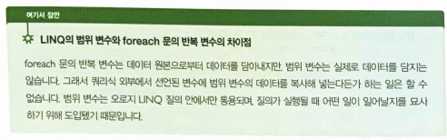
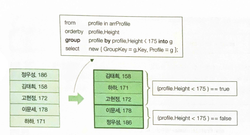

## 22.02.08_LINQ

## 1.데이터

- LINQ는 Language INtegrated Query의 약어로, C#언어로 통합된 데이터 질의 기능

- 데이터 질의 기능임
  - 질의란 원래 뭔가에 대해 물어본다는 뜻
  - 즉, 데이터 질의라고 하면 데이터에 대해 물어본다는 말이 됨
- From : 어떤 데이터 집합에서 찾을 것인가?
- Where : 어떤 값의 데이터를 찾을 것인가?
- Select : 어떤 항목을 추출할 것인가?

```csharp
class Profile
{
    public string Name{get; set;}
    public int Height {get; set;}
}

Profile[] arrProfile = {
    						new Profile(){Name="홍길동", Height=186};
    						new Profile(){Name="정약용", Height=176}
					   }; 
```

- Height 가 177미만 인것을 구하려면 어떻게 해야했나?

  - **Before**

    ```csharp
    List<Profile> profiles = new List<Profile>();
    foreach (Profile profile in arrProfile)
    {
        if(profile.Height < 177)
        {
            profiles.Add(profile);
    	}
    }
    
    //오름차순 정렬
    profile.Sort(
    	(profile1, profile2)=>
        {
            return profile1.Height - profile2.Height;
        });
    
    foreach (var profile in profiles)
    	Console.WriteLine($"{profile.Name}, {profile.Height}");
    ```

    - 위 의 코드가 잘못된 것은 없지만 LINQ를 모르는 프로그래머의 코드? 라는 소리를 한다고함
      - 책에서 너무 극단적인 내용인듯

  - **After**

    ```csharp
    var profiles = from profile in arrProfile
        		   where profile.Height < 177
        		   orderby profile.Height
        		   select profile;
    
    foreach (var profile in profiles)
    	Console.WriteLine($"{profile.Name}, {profile.Height}");
    ```

    - 위와 같이 LINQ를 사용하면 좀더 코드의 양을 줄일 수 있음

## 2.LINQ의 기본 : from, where, orderby, select

### 2.1 from

- LINQ쿼리식은 반드시 from으로 시작
  - 이때 원본은 IEnumerable<T> 인터페이스를 상속하는 형식이어야함



### 2.2 where

- 필터 역할을 하는 연산자
- 원본으로부터 뽑아낸 범위 변수가 가져야 하는 조건을 where 연산자에 인수로 입력하면  됨

### 2.3 orderby

- 정렬을 수행하는 연산자
  - 오름차순인 경우 orderby만쓰거나
    - ascending를 뒤에 붙이면됨
      - `orderby profile.Height ascending`
  - 내림차순인 경우
    - desending을 붙이면됨

## 2.4 select

- 최종 결과를 추출하는 쿼리식의 마침표 같은 존재

- var가 어떤 식으로 치환이 될까?
  - LINQ 질의 결과는 IEnumerable<T>로 반환되는데
    - 이때, 매개변수 Tsms select문에 의해 결정됨

- **select문의 무명형식**

  ```csharp
  var profiles from profile in arrProfile
               where profile.Height < 177
      		 orderby profile.Height 
      		 select new {Name = profile.Name, InchHeight = profile.Height * 0.393};
  ```

  - ` select new {Name = profile.Name, InchHeight = profile.Height * 0.393}`
    - 이것이 무명형식임

## 3.여러개의 데이터 원본에 질의하기

```c#
class Profile
{
    public string Name{get; set;}
    public int[] Score {get; set;}
}

Profile[] arrProfile = {
    						new Profile(){Name="홍길동", Score = new int[]{99,80,70,24}};
    						new Profile(){Name="정약용", Score = new int[]{99,80,70,24}}
					   }; 
var classes = from c in arrClass
    			from s in < c.Score
    		  where s < 60
    		  select new {c.Name, Lowest = s};
```

- s는 점수가 저장되어 있고 그걸로 조건을 주고 c에 이름을 쓰려고 받아온 예제

## 4.group by로 데이터 분류하기

```csharp
group A by B into C
```

- A에는 from 절에서 뽑아낸 범위 변수를

- B에는 분류 기준을 

- C에는 그룹 변수를 위치

- **분류기준 175미만인가 또는 175이상인가**

  ```csharp
  Profile[] arrProfile =
  {
  new Profile(){Name = "정우성", Height = 186},
  new Profile(){Name = "김태희", Height = 158},
  new Profile(){Name = "고현정", Height = 172},
  new Profile(){Name = "이문세", Height = 178},
  new Profile(){Name = "하하", Height = 171}
  };
  
  var listProfile = from profile in arrProfile
        				group profile by profile.Height < 175 into g
      				select new {GroupKey = g.Key, profiles = g}
  ```

  - 이렇게 하면  g에는 175미만인 객체의 컬렉션
  - 175이상인 객의 컬렉션이 입력됨



- 이렇게 된다고 함

  - 뽑아내는 방법

    ```csharp
    foreach (var Group in listProfile)
    {
        Console.WriteLine($"- 175cm 미만? : {Group.GroupKey}");
        
        foreach(var profile in Group.Profiles)
        {
            Console.Write($">>> {prfile.Name}, {profile.Height}")
    	}
    }
    ```

    - 그룹바이를 쓰는 경우 true와 flase로 조건이 나뉘는 듯 함


