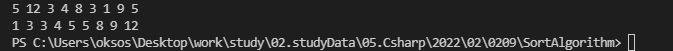

## 22.02.09_머지소트알고리즘구현및테스트코드작성

## 목차

> 1.머지소트란?
>
> > 1.1 분할 정복 방법
> >
> >  1.2 과정 설명
>
>  2.소스코드
>
> > 2.1 Program.cs
> >
> > 2.2 Merge.cs
> >
> > 2.3 PrintNumber.cs
> >
> > 2.4 출력확인
>
> 3.테스트코드

## 1.머지소트란?

- 단순하지 않은 정렬 시리즈 중 제일 단순한 정렬
- 분할정복 알고리즘
- 모든 숫자를 다 나눈 다음에 병합하는 방식으로 정렬을 진행
- 존 폰 노이만이 제안한 방법
  - 일반적인 방법으로 구현했을 때 이정렬은 안정 정렬에 속함
  - 분할 정복 알고리즘의 하나

### 1.1 분할 정복 방법

-  문제를 작은 2개의 문제로 분리하고 각각을 해결한 다음, 결과를 모아 원래의 문제를 해결하는 전략
- 분할 정복 방법은 대게 재귀를 이용하여 구현

### 1.2 과정 설명

- 리스트의 길이가 0또는 1이면 이미 정렬된 것으로 봄
- 그렇지 않은 경우
  - 정렬되지 않은 리스트를 절반으로 잘라 비슷한 크기의 두 부분 리스트로 나눔ㄴ
- 각 부분 리스트를 재귀적으로 합병 정렬을 이용해 정렬
- 두 부분 리스스틀 다시 하나의 정렬된 리스트로 합병

## 2.소스코드

### 2.1 Program.cs

```csharp
namespace SortAlgorithm;

class Program
{
    public static void Main(string[] arg)
    {
       int[] arr = {5,12,3,4,8,3,1,9,5};
       PrintNumber print = new PrintNumber();
       Merge merge = new Merge();
       print.Run(arr);
       merge.Sort(arr);
       print.Run(arr);
    }
}
```

### 2.2 Merge.cs

```csharp
namespace SortAlgorithm;

class Merge
{
    public void Sort(int[] arr)
    {
        Divide(arr,0,arr.Length-1);
    }

    private void Divide(int[] arr, int left, int right)
    {
        if(left<right)
        {
        var mid = (left+right)/2;
        Divide(arr, left, mid);
        Divide(arr, mid+1,right);
        ReMerge(arr,left,mid,right);
        }
    }
    private void ReMerge(int[]arr, int left, int mid, int right)
    {
        int index1 = left;
        int index2 = mid+1;
        int currentIndex = left;
        int[] copyArr =new int[30];
        while((index1<=mid)&&(index2<=right))
        {
            if(arr[index1]<=arr[index2])
            {
            copyArr[currentIndex++]=arr[index1++];
            }
            else if(arr[index1]>arr[index2])
            {
            copyArr[currentIndex++]=arr[index2++];
            }
        }
            if(mid<index1)//왼쪽이 먼저 끝난경우 남은 오른쪽 숫자 넣기
            {
                for(int i=index2; i<=right;i++)
                {
                    copyArr[currentIndex++]=arr[i];
                }
            }
            else if(right<index2)//오른쪽이 먼저 끝난 경우 남은 왼쪽 숫자 넣기
            {
                for(int i=index1; i<=mid;i++)
                {
                    copyArr[currentIndex++]=arr[i];
                }
            }

            for(int i=left;i<=right;i++)
            {//정렬된 배열 카피
                arr[i]= copyArr[i];
            }
    }
}
```

### 2.3 PrintNumber.cs

```cs
namespace SortAlgorithm;

class PrintNumber
{
    public void Run(int[] arr)
    {
        for(int i=0;i<arr.Length;i++)
            Console.Write(arr[i]+" ");
        Console.WriteLine();
    }
}
```

### 2.4 출력확인



## 3.테스트코드

```csharp
        [Fact]
        public void MergeSortTest()
        {
            int[] arr = { 5, 12, 3, 4, 8, 3, 1, 9, 5 };
            Merge merge = new Merge();
            merge.Sort(arr);
        }
```

