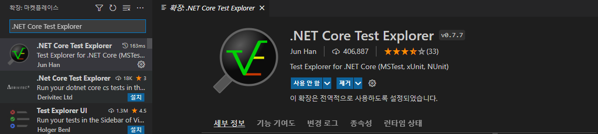
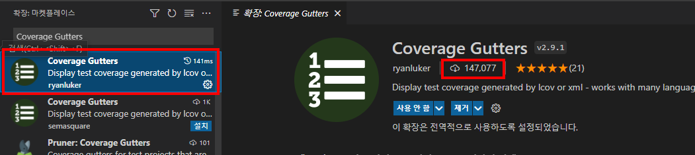
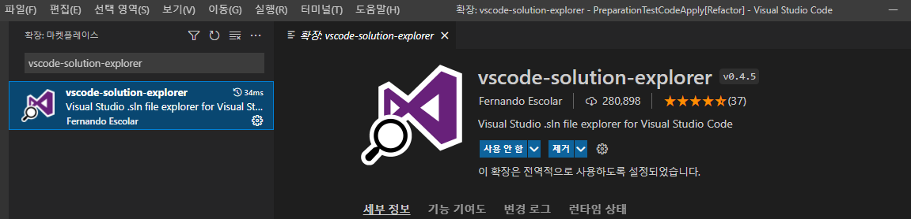
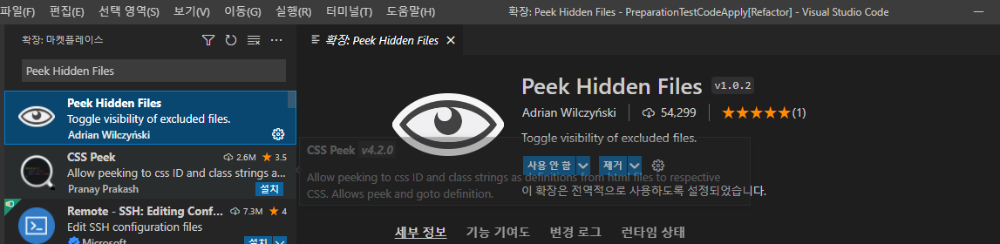
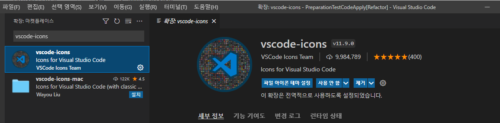
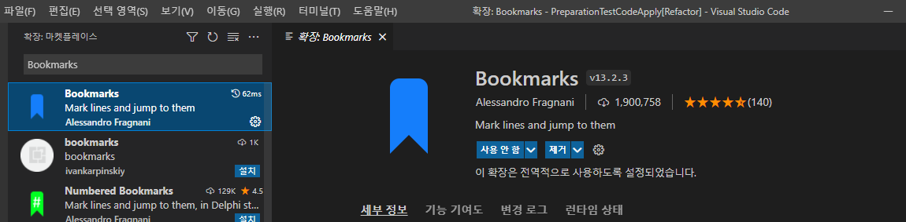
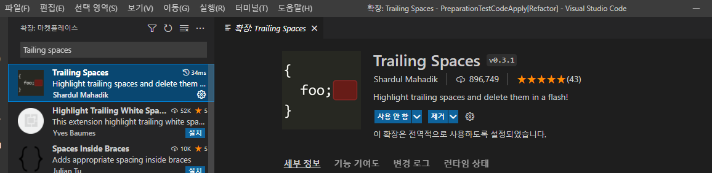

## 22.02.12_TestCode준비및작성

## 01.VsCode에서 테스트하기 위한 Tools 설치

### 01.1 Tools설치

- **.NET TEST 확장 도구**

  - .NET Core Test Explorer

    

  - Coverage Gutters

    

    - 다운로드 횟수가 높은걸로 해야함

- **.NET 솔루션 탐색기 확장 도구**

  - vscode-solution-explorer

    

- **폴더 확장 도구**

  - Peek Hidden Files

    

  - vscode-icons

    

- **편집 확장 도구**

  - Bookmarks

    

  - Tailing spaces

    

**01.2**
