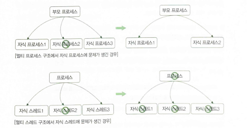
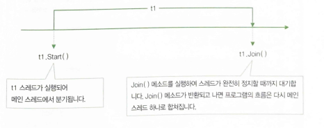
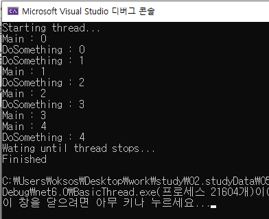
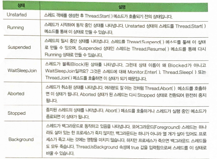
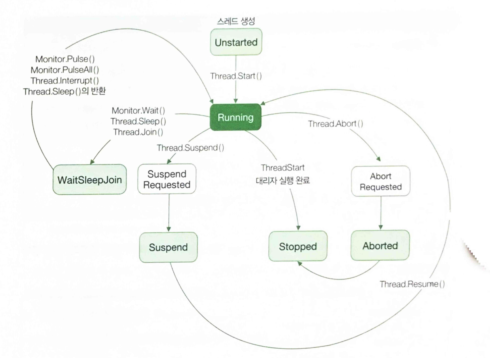

## 22.02.17_스레드와태스크

## 1.프로세스와 스레드

- 오늘날 OS는 여러 프로세스를 동시에 실행할 수 있는 능력 있음
- 덕분에 여러가지 음악도 듣고, 코딩도 할 수 있음
- OS만 동시에 여러 작업을 할 수 있는 것 아님
- 프로세스도 한번에 여러 작업을 할 수 있음
- **프로세스란?**
  - 실행 파일이 실행되어 메모리에 적재된 인스턴스임
  - 가령 word.exe가 실행파일이라면, 이 실행 파일에 담겨 있는 데이터와 코드가 
    - 메모리에 적재되어 동작하는 것이 프로세스
- 프로세스는 반드시 하나 이상의 스레드로 구성되는데,
  - 스레드는 운영체제가 CPU시간을 할당하는 기본단위임
- 프로세스가 밧줄이라면, 스레드는 밧줄을 이루는 실이라고 할 수 있음


### 1.1 멀티 스레드를 이용할 때 장단점

- **장점**

  - 사용자 대화형 프로그램에서(콜솔프로그램과 GUI프로그램 모두) 멀티 스레드를 이용하면 
    - 응답성을 높일 수 있다는 점을 꼽을 수 있음
    - 예를들어 단일 스레드를 사용하는 프로그램을 만들었고, 파일 복사만 30분 걸린다면?
      - 강제로 프로세스를 종료하지 않는 이상 취소도 안됨
      - 이때, 프로그램에 사용자와의 대화를 위한 스레드를 하나 더 추가한다면 파일 복사도 하고 사용자로부터 명령을 입력받을 수 있음
  - 멀티 프로세스 방식에 비해 멀티 스레드 방식이 자원 공유가 쉽다는 것
    - 멀티프로세스는 GUI가 없는 웹 서버 같은 서버용 앱에서 많이 취하는 구조
    - 프로세스끼리 데이터를 교환하려면 소켓이나 공유 메모리 같은 IPC(Inter Process Communication)을 이용해야 함
    - 반면, 멀티 스레드 방식에서는 그저 스레드끼리 코드 내의 변수를 같이 사용하는것만으로도 데이터 교환을 할 수 있음

  

  

  - 멀티 프로세스 방식에 비해 멀티 스레드 방식이 좋은 점이 또하나는 경제성
    - 프로세스를 띄우기 위해 메모리와 자원을 할당하는 작업은(CPU사용시간 등의) 비용이 비쌈
      - 스레드를 띄울 때는 이미 프로세스에 할당된 메모리와 자원을 그대로 사용하므로 메모리와 자원을 할당하는 비용을 지불하지 않아도 됨
  - `응답성을 높일 수 있음` `자원공유가 쉽다` `경제적이다`

- **단점**

  - 멀티 스레드 구조의 SW는 구현하기가 매우 까다로움

  - 테스트 역시 쉽지 않은데다 멀티 스레드 기반의 SW 디버깅은 개발자가 분노를 하게됨

  - 멀티 프로세스 기반의 SW는 여러 개의 자식 프로세스 중 하나에 문제가 생기면 

    - 그 자식 프로세스 하나가 죽는 것 이상으로는 영향이 확산되지 않지만,
    - 멀티스레드 기반의 SW에서는 자식 스레드 중 하나에 문제가 생기면 전체 프로세스에 영향을 줌

    

    - 그리고 장점으로 말했던 성능이 아이러니하게도 스레드를 너무 많이 사용하면 오히려 성능이 더 저하됨

  - `구현이 복잡` `SW안정성을 약화시킬수 있음` `과용하면 성능이 저하될 수 있음`

### 1.2 스레드 시작하기

- .NET은 스레드를 제어하는 클래스로 System.Threading.Thread 를 제공
- 클래스를 사용하는 방법
  - Thread의 인스턴스를 생성, 이때 생성자의 인수로 스레드가 실행할 메소드를 넘김
  - Thread.Start() 메소드를 호출하여 스레드를 시작
  - Thread.Join() 메소드를 호출하여 스레드가 끝날 때까지 기다림

```csharp
static void DoSomething()
{
    for(int i = 0 ; i < 5 ;i++)
    {
        Console.WriteLine($"DoSomething : {i}");
    }
}

static void Main(string[] args)
{
    Thread t1 = new Thread(new ThreadStart(DoSomething));
    t1.Start();
    t1.Join();
}
```

- 이 코드에서 실제 스레드가 메모리에 적재되는 시점은
  - t1.Start() 메소드를 호출했을 때임
    - Thread클래스의 인스턴스는 준비만 함
  - t1.Start()메소드가 호출되고 나면, CLR은 스레드를 실제로 생성 하여 DoSomething()메소드를 호출
  - t1.Join()메소드는 블록되어 있다가 DoSomething() 메소드의 실행이 끝나면, 
    - 다시말해 t1스레드의 실행이 끝나면 반환되어 다음코드를 실행할 수 있게 함
- 아래그림에서처럼 스레드를 하나 실행하면 밧줄에서 실이 한 갈래 빠져 나왔다가 Join() 메소드가 반환되는 시점에서 이 실(스레드)이 다시 밧줄(프로세스)로 `합류`한다고 생각하면됨



### 1.3 실습

```csharp
using System;
using System.Threading;

namespace BasicThread;

class MainApp
{
    static void DoSomething()
    {
        for(int i = 0;i<5;i++)
        {
            Console.WriteLine($"DoSomething : {i}");
            Thread.Sleep(10); 
        }
    }

    static void Main(string[] args)
    {
        Thread t1 = new Thread(new ThreadStart(DoSomething));

        Console.WriteLine("Starting thread...");
        t1.Start();

        for (int i = 0; i < 5; i++)
        {
            Console.WriteLine($"Main : {i}");
            Thread.Sleep(10);
        }

        Console.WriteLine("Wating until thread stops...");
        t1.Join();

        Console.WriteLine("Finished");
    }
}
```



## 2.스레드 임의로 종료시키기

```csharp
static void DoSomething()
{
    try
    {
        for(int i=0;i<1000;i++)
        {
            Console.WriteLine($"DoSomething : {i}");
        }
    }
    catch(ThreadAbortedException)
    {
        //...
    }
    finally
    {
        //...
    }
}

static void Main(string[] args)
{
    Thread t1 = new Thread(new ThreadStart())
    t1.Start();
    t1.Abort();
    t1.Join();
}
```

- Abort()메소드를 사용할 때는 고려해야할 사항이 있음
  - Abort()메소드가 호출과 동시에 스레드를 즉시 종료하지 않는다는 점
- Thread객체에  Abort()메소드를 호출하면  CLR은 해당 스레드가 실행중이던 코드에 ThreadAbortException을 던짐
  - 이때, 예외를 catch하는 코드가 있으면 이 예외를 처리한 다음, finally 블록까지 실행한 후에야 해당 스레드는 완전히 종료됨
- 그래서 Abort()메소드를 호출할 때는 이 처리 시간을 반드시 염두에둬야 하는 것임


- **사용하지 않아야 하는 이유**
  - Abort()메소드를 호출당해 갑자기 죽어버리면 그자원에 접근하고자 하는 다른 스레드들은 그대로 꼼짝도 못하는 신세가 됨
    - 그래서 Abort()를 goto문 만큼 신중하게 사용함
  - ThreadStart 대리자가 (무한)반복문을 포함하는 코드를 참조하고 있다면 Abort()메소드를 호출하는 대신 그 반복문을 매회 반복할 때 마다 계속 수행할 것인지 확인하는 변수를 다른 스레드들과 공유하고, 그 변수의 값을 외부 스레드에서 변경토록하는게 낫다

### 2.1실습

```csharp
using System;
using System.Threading;

namespace AbortinfThread;

class SideTask
{
    int count;

    public SideTask(int count)
    {
        this.count = count;
    }

    public void KeepAlive()
    {
        try
        {
            while(count>0)
            {
                Console.WriteLine($"{count--} left");
                Thread.Sleep(10);
            }
            Console.WriteLine("Count : 0");
        }
        catch (ThreadAbortException e)
        {
            Console.WriteLine(e);
            Thread.ResetAbort();
        }
        finally
        {
            Console.WriteLine("Clearing resource...");
        }
    }
}

class MainApp
{
    static void Main(string[] args)
    {
        SideTask task = new SideTask(100);
        Thread t1 = new Thread(new ThreadStart(task.KeepAlive));
        t1.IsBackground = false;

        Console.WriteLine("Starting thread...");
        t1.Start();

        Thread.Sleep(100);

        Console.WriteLine("Aborting thread");
        t1.Abort();

        Console.WriteLine("Wating until thread stops...");
        t1.Join();

        Console.WriteLine("Finished");ㅁ
}
```

### 2.2 스레드의 일생과 상태 변화



- 스레드의 상태변화에는 규칙이 있음
  - 예를 들어 Aborted상태의 스레드는 절대 Running상태로 천이되지 못하고,
  - Running상태의 스레드는 Unstarted상태로 바뀔 수 없음



- 그림에 Background로 천이하는 과정이 표현되어 있지 않은데
  - 그 이유는 Background상태는 그저 스레드가 어떻게 동작하고 있는지에 관한 정보를 나타낼뿐
- 이들 ThreadState열거형의 멤버에 대해 또 한 가지 알아야할 사실
  - 바로 ThreadState가 Flags 애트리뷰트를 갖고 있다는 점
  - Flags는 자신이 수식하는 열거형을 비트 필드 
    - 즉, 플래그 집합으로 처리할 수 있음을 나타냄


- **애트리뷰트를 사용하지 않는 평범한 열거형은 열거 요소에 대응하는 값들만 표현**

  ```csharp
  enum MyEnum{
      Apple = 1 << 0, // 1(0001)
      Orange = 1 << 1, // 2(0010)
      Kiwi = 1 << 2, // 4(0100)
      Mango = 1 << 3 // 8(1000)
  };
  
  Console.WriteLine((MyEnum)1); //Apple
  Console.WriteLine((MyEnum)2); //Orange
  Console.WriteLine((MyEnum)4); //Kiwi
  Console.WriteLine((MyEnum)8); //Mango
  Console.WriteLine((MyEnum)1 | 4); //5
  Console.WriteLine((MyEnum)1 | 8); //9
  ```

  - **Flag 애트리뷰트를 갖는 열거형은 요소들의 집합으로 구성되는 값들도 표현 가능**

``` csharp
[Flags]
enum MyEnum{
    Apple = 1 << 0, // 1(0001)
    Orange = 1 << 1, // 2(0010)
    Kiwi = 1 << 2, // 4(0100)
    Mango = 1 << 3 // 8(1000)
};

Console.WriteLine((MyEnum)1); //Apple
Console.WriteLine((MyEnum)2); //Orange
Console.WriteLine((MyEnum)4); //Kiwi
Console.WriteLine((MyEnum)8); //Mango
Console.WriteLine((MyEnum)1 | 4); //Apple, Kiwi
Console.WriteLine((MyEnum)1 | 8); //Apple, Mango
```

- 스레드는 동시에 두 가지 이상의 상태일 수 있음
  - 가령 Suspende상태이면서 WaitsleepJoin상태일 수도 있고,
  - Background상태이면서 Stopped상태일 수도 있음
    - 그래서 두 가지 이상의 상태를 동시에 표현하고자 ThreadState에 Flag 애트리뷰트가 있는 것

### 2.3 실습2

```csharp
using System;
using System.Threading;

namespace UsingThreadState;
class MainApp
{
    private static void PrintThreadState(ThreadState state)
    {
        Console.WriteLine($"{state,-16} : {(int)state}");
    }

    static void Main(string[] args)
    {
        PrintThreadState(ThreadState.Running);
        PrintThreadState(ThreadState.StopRequested);
        PrintThreadState(ThreadState.SuspendRequested);
        PrintThreadState(ThreadState.Background);
        PrintThreadState(ThreadState.Unstarted);
        PrintThreadState(ThreadState.Stopped);
        PrintThreadState(ThreadState.WaitSleepJoin);
        PrintThreadState(ThreadState.Suspended);
        PrintThreadState(ThreadState.AbortRequested);
        PrintThreadState(ThreadState.Aborted);
        PrintThreadState(ThreadState.Aborted | ThreadState.Stopped);
    }

}
```


- 0,1,2,3,... 이런식으로 증가하는것이 아니고

- 0,1,2,4,8.... 2의 제곱으로 증가하는 값을 갖고 있음

  - 이렇게 해놓으면 비트 연산을 통해 ThreadState가 어떤 상태에 있는지 쉽게 알아 낼 수 있음

- 한편,  Thread객체의 ThreadState필드를 통해 상태를 확인할 때는 반드시 비트 연산을 이용해야함

- **Thread 객체의 TreadState필드의 값 확인**

  ```csharp
  if(t1.ThreadState & ThreadState.Aborted == ThreadState.Aborted)
      Console.WriteLine("스레드가 정지했습니다.");
  else if(t1.ThreadState & ThreadState.Stopped == ThreadState.Stopped)
      Console.WriteLine("스레드가 취소되었습니다.");
  ```

### 2.4 인터럽트 : 스레드를 임의로 종료하는 다른 방법

- Thread.Interrupt()메소드는 스레드가 한참 동작 중인 상태(Running 상태)를 피해서

  - WaitJoinSleep 상태에 들어갔을 때
  - ThreadInterruptedException 예외를 던져 스레드를 중지시킴

- 둘다 비슷하지만, Thread.Interrupt()메소드가 좀더 신사적이라고 함ㄴ

- Thread.Interrupt()메소드는 

  - 스레드가 이미 WaitSleepJoin상태에 있을 때는 즉시 중단시키고,

  - 다른 상태일 때는 스레드를 지켜보고 있다가 WaitSleepJoin상태가 되면 그제서야 스레드를 중단

- 이런 특징으로 프로그래머는 최소한 코드가  `절대로 중단 되면 안 되는` 작업을 하고 있을 때는 중단되지 않는다는 보장을 받을 수 있음

  

#### 2.4.1 실습

```csharp
static void DoSomething()
{
    try
    {
        for(int i=0;i<10000;i++)
        {
            Console.Write("DoSomething : {i}");
        }
    }
    catch(ThreadInterruptedException e)
    {
        //...
    }
    finally
    {
        //...
    }
}

static void Main(string[] args)
{
    Thread t1 = new Thread(new ThreadStart(DoSomething));
    
    t1.Start();
    
    t1.Interrupt();
    
    t1.Join();
}
```

- ThreadStart 대리자가 참조하는 SideTask.KeepAlive()메소드의 시작 부분에서 SpinWait()메소드를 호출함으로써 Interrupt() 메소드가 호출될 때 스레드의 상태가 한동안 Running 상태를 갖도록 하게한 차이가 있음

```csharp
using System;
using System.Security.Permissions;
using System.Threading;

namespace InterruptingThread;

class SideTask
{
    int count;
    
    public SideTask(int count)
    {
        this.count = count;
    }

    public void KeepAlive()
    {
        try
        {
            Console.WriteLine("Running thread isn't gonna be interrupted");
            Thread.SpinWait(1000000000);
            
            while(count>0)
            {
                Console.WriteLine($"{count--} left");

                Console.WriteLine("Entering into WaitJoinSleep State...");
                Thread.Sleep(10);
            }
            Console.WriteLine(10);
        }
        catch (ThreadInterruptedException e)
        {
            Console.WriteLine(e);
        }
        finally
        {
            Console.WriteLine("Clearing resource...");
        }
    }

    class MainApp
    {
        static void Main(string[] args)
        {
            SideTask task = new SideTask(100);
            Thread t1 = new Thread(new ThreadStart(task.KeepAlive));
            t1.IsBackground = false;

            Console.WriteLine("Starting thread...");
            t1.Start();

            Thread.Sleep(100);

            Console.WriteLine("Interrupting thread...");
            t1.Interrupt();

            Console.WriteLine("Wating until thread stops...");
            t1.Join();

            Console.WriteLine("Finished");
        }

    }
}
```

- SpinWait() 메소드는 원래 별로 쓸일이 없음
  - 이 메소드는 Sleep()과 유사하게 스레드를 대기하게 하지만 Sleep()과는 달리 스레드가 Running 상태를 유지하게됨
- 여기에서는interrupt()메소드가 호출되는 스레드는 제일 처음의 Thread.Sleep(10)에 의해 WaitSleepJoin상태로 들어가고, 이때 인터럽트가 발생