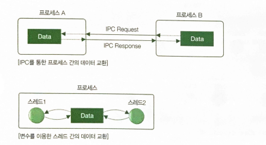
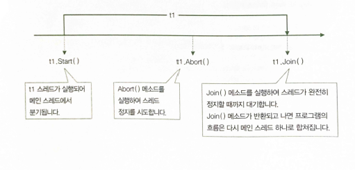
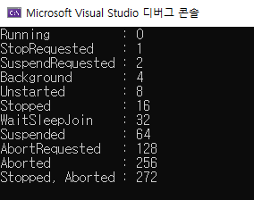
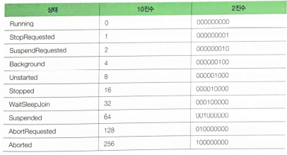
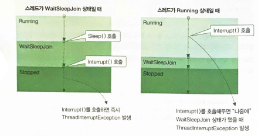
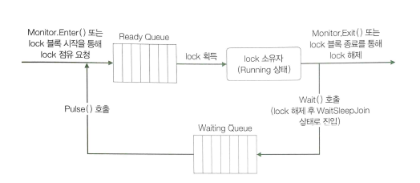
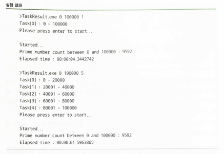
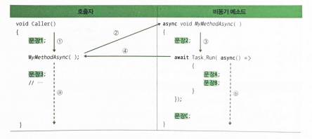
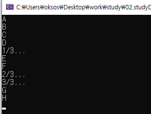
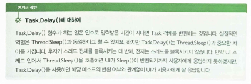

## 22.02.17_스레드와태스크

## 1.프로세스와 스레드

- 오늘날 OS는 여러 프로세스를 동시에 실행할 수 있는 능력 있음
- 덕분에 여러가지 음악도 듣고, 코딩도 할 수 있음
- OS만 동시에 여러 작업을 할 수 있는 것 아님
- 프로세스도 한번에 여러 작업을 할 수 있음
- **프로세스란?**
  - 실행 파일이 실행되어 메모리에 적재된 인스턴스임
  - 가령 word.exe가 실행파일이라면, 이 실행 파일에 담겨 있는 데이터와 코드가 
    - 메모리에 적재되어 동작하는 것이 프로세스
- 프로세스는 반드시 하나 이상의 스레드로 구성되는데,
  - 스레드는 운영체제가 CPU시간을 할당하는 기본단위임
- 프로세스가 밧줄이라면, 스레드는 밧줄을 이루는 실이라고 할 수 있음


### 1.1 멀티 스레드를 이용할 때 장단점

- **장점**

  - 사용자 대화형 프로그램에서(콜솔프로그램과 GUI프로그램 모두) 멀티 스레드를 이용하면 
    - 응답성을 높일 수 있다는 점을 꼽을 수 있음
    - 예를들어 단일 스레드를 사용하는 프로그램을 만들었고, 파일 복사만 30분 걸린다면?
      - 강제로 프로세스를 종료하지 않는 이상 취소도 안됨
      - 이때, 프로그램에 사용자와의 대화를 위한 스레드를 하나 더 추가한다면 파일 복사도 하고 사용자로부터 명령을 입력받을 수 있음
  - 멀티 프로세스 방식에 비해 멀티 스레드 방식이 자원 공유가 쉽다는 것
    - 멀티프로세스는 GUI가 없는 웹 서버 같은 서버용 앱에서 많이 취하는 구조
    - 프로세스끼리 데이터를 교환하려면 소켓이나 공유 메모리 같은 IPC(Inter Process Communication)을 이용해야 함
    - 반면, 멀티 스레드 방식에서는 그저 스레드끼리 코드 내의 변수를 같이 사용하는것만으로도 데이터 교환을 할 수 있음

  

  

  - 멀티 프로세스 방식에 비해 멀티 스레드 방식이 좋은 점이 또하나는 경제성
    - 프로세스를 띄우기 위해 메모리와 자원을 할당하는 작업은(CPU사용시간 등의) 비용이 비쌈
      - 스레드를 띄울 때는 이미 프로세스에 할당된 메모리와 자원을 그대로 사용하므로 메모리와 자원을 할당하는 비용을 지불하지 않아도 됨
  - `응답성을 높일 수 있음` `자원공유가 쉽다` `경제적이다`

- **단점**

  - 멀티 스레드 구조의 SW는 구현하기가 매우 까다로움

  - 테스트 역시 쉽지 않은데다 멀티 스레드 기반의 SW 디버깅은 개발자가 분노를 하게됨

  - 멀티 프로세스 기반의 SW는 여러 개의 자식 프로세스 중 하나에 문제가 생기면 

    - 그 자식 프로세스 하나가 죽는 것 이상으로는 영향이 확산되지 않지만,
    - 멀티스레드 기반의 SW에서는 자식 스레드 중 하나에 문제가 생기면 전체 프로세스에 영향을 줌

    

    - 그리고 장점으로 말했던 성능이 아이러니하게도 스레드를 너무 많이 사용하면 오히려 성능이 더 저하됨

  - `구현이 복잡` `SW안정성을 약화시킬수 있음` `과용하면 성능이 저하될 수 있음`

### 1.2 스레드 시작하기

- .NET은 스레드를 제어하는 클래스로 System.Threading.Thread 를 제공
- 클래스를 사용하는 방법
  - Thread의 인스턴스를 생성, 이때 생성자의 인수로 스레드가 실행할 메소드를 넘김
  - Thread.Start() 메소드를 호출하여 스레드를 시작
  - Thread.Join() 메소드를 호출하여 스레드가 끝날 때까지 기다림

```csharp
static void DoSomething()
{
    for(int i = 0 ; i < 5 ;i++)
    {
        Console.WriteLine($"DoSomething : {i}");
    }
}

static void Main(string[] args)
{
    Thread t1 = new Thread(new ThreadStart(DoSomething));
    t1.Start();
    t1.Join();
}
```

- 이 코드에서 실제 스레드가 메모리에 적재되는 시점은
  - t1.Start() 메소드를 호출했을 때임
    - Thread클래스의 인스턴스는 준비만 함
  - t1.Start()메소드가 호출되고 나면, CLR은 스레드를 실제로 생성 하여 DoSomething()메소드를 호출
  - t1.Join()메소드는 블록되어 있다가 DoSomething() 메소드의 실행이 끝나면, 
    - 다시말해 t1스레드의 실행이 끝나면 반환되어 다음코드를 실행할 수 있게 함
- 아래그림에서처럼 스레드를 하나 실행하면 밧줄에서 실이 한 갈래 빠져 나왔다가 Join() 메소드가 반환되는 시점에서 이 실(스레드)이 다시 밧줄(프로세스)로 `합류`한다고 생각하면됨


### 1.3 실습

```csharp
using System;
using System.Threading;

namespace BasicThread;

class MainApp
{
    static void DoSomething()
    {
        for(int i = 0;i<5;i++)
        {
            Console.WriteLine($"DoSomething : {i}");
            Thread.Sleep(10); 
        }
    }

    static void Main(string[] args)
    {
        Thread t1 = new Thread(new ThreadStart(DoSomething));

        Console.WriteLine("Starting thread...");
        t1.Start();

        for (int i = 0; i < 5; i++)
        {
            Console.WriteLine($"Main : {i}");
            Thread.Sleep(10);
        }

        Console.WriteLine("Wating until thread stops...");
        t1.Join();

        Console.WriteLine("Finished");
    }
}
```


## 2.스레드 임의로 종료시키기

```csharp
static void DoSomething()
{
    try
    {
        for(int i=0;i<1000;i++)
        {
            Console.WriteLine($"DoSomething : {i}");
        }
    }
    catch(ThreadAbortedException)
    {
        //...
    }
    finally
    {
        //...
    }
}

static void Main(string[] args)
{
    Thread t1 = new Thread(new ThreadStart())
    t1.Start();
    t1.Abort();
    t1.Join();
}
```

- Abort()메소드를 사용할 때는 고려해야할 사항이 있음
  - Abort()메소드가 호출과 동시에 스레드를 즉시 종료하지 않는다는 점
- Thread객체에  Abort()메소드를 호출하면  CLR은 해당 스레드가 실행중이던 코드에 ThreadAbortException을 던짐
  - 이때, 예외를 catch하는 코드가 있으면 이 예외를 처리한 다음, finally 블록까지 실행한 후에야 해당 스레드는 완전히 종료됨
- 그래서 Abort()메소드를 호출할 때는 이 처리 시간을 반드시 염두에둬야 하는 것임



- **사용하지 않아야 하는 이유**
  - Abort()메소드를 호출당해 갑자기 죽어버리면 그자원에 접근하고자 하는 다른 스레드들은 그대로 꼼짝도 못하는 신세가 됨
    - 그래서 Abort()를 goto문 만큼 신중하게 사용함
  - ThreadStart 대리자가 (무한)반복문을 포함하는 코드를 참조하고 있다면 Abort()메소드를 호출하는 대신 그 반복문을 매회 반복할 때 마다 계속 수행할 것인지 확인하는 변수를 다른 스레드들과 공유하고, 그 변수의 값을 외부 스레드에서 변경토록하는게 낫다

### 2.1실습

```csharp
using System;
using System.Threading;

namespace AbortinfThread;

class SideTask
{
    int count;

    public SideTask(int count)
    {
        this.count = count;
    }

    public void KeepAlive()
    {
        try
        {
            while(count>0)
            {
                Console.WriteLine($"{count--} left");
                Thread.Sleep(10);
            }
            Console.WriteLine("Count : 0");
        }
        catch (ThreadAbortException e)
        {
            Console.WriteLine(e);
            Thread.ResetAbort();
        }
        finally
        {
            Console.WriteLine("Clearing resource...");
        }
    }
}

class MainApp
{
    static void Main(string[] args)
    {
        SideTask task = new SideTask(100);
        Thread t1 = new Thread(new ThreadStart(task.KeepAlive));
        t1.IsBackground = false;

        Console.WriteLine("Starting thread...");
        t1.Start();

        Thread.Sleep(100);

        Console.WriteLine("Aborting thread");
        t1.Abort();

        Console.WriteLine("Wating until thread stops...");
        t1.Join();

        Console.WriteLine("Finished");ㅁ
}
```

### 2.2 스레드의 일생과 상태 변화


- 스레드의 상태변화에는 규칙이 있음
  - 예를 들어 Aborted상태의 스레드는 절대 Running상태로 천이되지 못하고,
  - Running상태의 스레드는 Unstarted상태로 바뀔 수 없음


- 그림에 Background로 천이하는 과정이 표현되어 있지 않은데
  - 그 이유는 Background상태는 그저 스레드가 어떻게 동작하고 있는지에 관한 정보를 나타낼뿐
- 이들 ThreadState열거형의 멤버에 대해 또 한 가지 알아야할 사실
  - 바로 ThreadState가 Flags 애트리뷰트를 갖고 있다는 점
  - Flags는 자신이 수식하는 열거형을 비트 필드 
    - 즉, 플래그 집합으로 처리할 수 있음을 나타냄


- **애트리뷰트를 사용하지 않는 평범한 열거형은 열거 요소에 대응하는 값들만 표현**

  ```csharp
  enum MyEnum{
      Apple = 1 << 0, // 1(0001)
      Orange = 1 << 1, // 2(0010)
      Kiwi = 1 << 2, // 4(0100)
      Mango = 1 << 3 // 8(1000)
  };
  
  Console.WriteLine((MyEnum)1); //Apple
  Console.WriteLine((MyEnum)2); //Orange
  Console.WriteLine((MyEnum)4); //Kiwi
  Console.WriteLine((MyEnum)8); //Mango
  Console.WriteLine((MyEnum)1 | 4); //5
  Console.WriteLine((MyEnum)1 | 8); //9
  ```

  - **Flag 애트리뷰트를 갖는 열거형은 요소들의 집합으로 구성되는 값들도 표현 가능**

``` csharp
[Flags]
enum MyEnum{
    Apple = 1 << 0, // 1(0001)
    Orange = 1 << 1, // 2(0010)
    Kiwi = 1 << 2, // 4(0100)
    Mango = 1 << 3 // 8(1000)
};

Console.WriteLine((MyEnum)1); //Apple
Console.WriteLine((MyEnum)2); //Orange
Console.WriteLine((MyEnum)4); //Kiwi
Console.WriteLine((MyEnum)8); //Mango
Console.WriteLine((MyEnum)1 | 4); //Apple, Kiwi
Console.WriteLine((MyEnum)1 | 8); //Apple, Mango
```

- 스레드는 동시에 두 가지 이상의 상태일 수 있음
  - 가령 Suspende상태이면서 WaitsleepJoin상태일 수도 있고,
  - Background상태이면서 Stopped상태일 수도 있음
    - 그래서 두 가지 이상의 상태를 동시에 표현하고자 ThreadState에 Flag 애트리뷰트가 있는 것

### 2.3 실습2

```csharp
using System;
using System.Threading;

namespace UsingThreadState;
class MainApp
{
    private static void PrintThreadState(ThreadState state)
    {
        Console.WriteLine($"{state,-16} : {(int)state}");
    }

    static void Main(string[] args)
    {
        PrintThreadState(ThreadState.Running);
        PrintThreadState(ThreadState.StopRequested);
        PrintThreadState(ThreadState.SuspendRequested);
        PrintThreadState(ThreadState.Background);
        PrintThreadState(ThreadState.Unstarted);
        PrintThreadState(ThreadState.Stopped);
        PrintThreadState(ThreadState.WaitSleepJoin);
        PrintThreadState(ThreadState.Suspended);
        PrintThreadState(ThreadState.AbortRequested);
        PrintThreadState(ThreadState.Aborted);
        PrintThreadState(ThreadState.Aborted | ThreadState.Stopped);
    }

}
```





- 0,1,2,3,... 이런식으로 증가하는것이 아니고

- 0,1,2,4,8.... 2의 제곱으로 증가하는 값을 갖고 있음

  - 이렇게 해놓으면 비트 연산을 통해 ThreadState가 어떤 상태에 있는지 쉽게 알아 낼 수 있음

- 한편,  Thread객체의 ThreadState필드를 통해 상태를 확인할 때는 반드시 비트 연산을 이용해야함

- **Thread 객체의 TreadState필드의 값 확인**

  ```csharp
  if(t1.ThreadState & ThreadState.Aborted == ThreadState.Aborted)
      Console.WriteLine("스레드가 정지했습니다.");
  else if(t1.ThreadState & ThreadState.Stopped == ThreadState.Stopped)
      Console.WriteLine("스레드가 취소되었습니다.");
  ```

### 2.4 인터럽트 : 스레드를 임의로 종료하는 다른 방법

- Thread.Interrupt()메소드는 스레드가 한참 동작 중인 상태(Running 상태)를 피해서

  - WaitJoinSleep 상태에 들어갔을 때
  - ThreadInterruptedException 예외를 던져 스레드를 중지시킴

- 둘다 비슷하지만, Thread.Interrupt()메소드가 좀더 신사적이라고 함ㄴ

- Thread.Interrupt()메소드는 

  - 스레드가 이미 WaitSleepJoin상태에 있을 때는 즉시 중단시키고,

  - 다른 상태일 때는 스레드를 지켜보고 있다가 WaitSleepJoin상태가 되면 그제서야 스레드를 중단

- 이런 특징으로 프로그래머는 최소한 코드가  `절대로 중단 되면 안 되는` 작업을 하고 있을 때는 중단되지 않는다는 보장을 받을 수 있음

  

#### 2.4.1 실습

```csharp
static void DoSomething()
{
    try
    {
        for(int i=0;i<10000;i++)
        {
            Console.Write("DoSomething : {i}");
        }
    }
    catch(ThreadInterruptedException e)
    {
        //...
    }
    finally
    {
        //...
    }
}

static void Main(string[] args)
{
    Thread t1 = new Thread(new ThreadStart(DoSomething));
    
    t1.Start();
    
    t1.Interrupt();
    
    t1.Join();
}
```

- ThreadStart 대리자가 참조하는 SideTask.KeepAlive()메소드의 시작 부분에서 SpinWait()메소드를 호출함으로써 Interrupt() 메소드가 호출될 때 스레드의 상태가 한동안 Running 상태를 갖도록 하게한 차이가 있음

```csharp
using System;
using System.Security.Permissions;
using System.Threading;

namespace InterruptingThread;

class SideTask
{
    int count;
    
    public SideTask(int count)
    {
        this.count = count;
    }

    public void KeepAlive()
    {
        try
        {
            Console.WriteLine("Running thread isn't gonna be interrupted");
            Thread.SpinWait(1000000000);
            
            while(count>0)
            {
                Console.WriteLine($"{count--} left");

                Console.WriteLine("Entering into WaitJoinSleep State...");
                Thread.Sleep(10);
            }
            Console.WriteLine(10);
        }
        catch (ThreadInterruptedException e)
        {
            Console.WriteLine(e);
        }
        finally
        {
            Console.WriteLine("Clearing resource...");
        }
    }

    class MainApp
    {
        static void Main(string[] args)
        {
            SideTask task = new SideTask(100);
            Thread t1 = new Thread(new ThreadStart(task.KeepAlive));
            t1.IsBackground = false;

            Console.WriteLine("Starting thread...");
            t1.Start();

            Thread.Sleep(100);

            Console.WriteLine("Interrupting thread...");
            t1.Interrupt();

            Console.WriteLine("Wating until thread stops...");
            t1.Join();

            Console.WriteLine("Finished");
        }

    }
}
```

- SpinWait() 메소드는 원래 별로 쓸일이 없음
  - 이 메소드는 Sleep()과 유사하게 스레드를 대기하게 하지만 Sleep()과는 달리 스레드가 Running 상태를 유지하게됨
- 여기에서는interrupt()메소드가 호출되는 스레드는 제일 처음의 Thread.Sleep(10)에 의해 WaitSleepJoin상태로 들어가고, 이때 인터럽트가 발생

### 2.5 스레드 간의 동기화

- 스레드들이 순서를 갖춰 자원을 사용하게 하는 것을 일컬어 `동기화`라고 함
  - 이것을 제대로 사용하는 것이야말로 멀티 스레드 프로그래밍을 완벽하게 하는 길
- 스레드 동기화에서 가장 중요한 사명은 "자원을 한 번에 하나의 스레드가 사용하도록 보장" 하는 것
  - lock키워드와 Monitor클래스가 있음

#### 2.5.1 lock키워드로 동기화하기

- 크리티컬 섹션
  - 한 번에 한 스레드만 사용할 수 있는 코드 영역
  - C#에서는 lock키워드로 감싸주기만 해도 평범한 코드를 크리티컬 섹션으로 바꿀 수 있음

```charp
calss Counter
{
	public int count = 0;
	public void Increase()
	{
		count = count + 1;
	}
	
	//..
	CounterClass  obj = new CounterClass();
	Thread t1 = new Thread(new ThreadStart(obj.Increase));
	Thread t2 = new Thread(new ThreadStart(obj.Increase));
	Thread t3 = new Thread(new ThreadStart(obj.Increase));
	
	t1.Start();
	t2.Start();
	t3.Start();
	
	t1.Join();
	t2.Join();
	t3.Join();
	
	Console.WriteLin(obj.count);
}
```


- 답을 3이 나올것 같다고 생각하지만 그렇지 는 않음
- t1이 사용중에 t2가 치고 들어올 수 있기때문에


- 1이나올수도 있고 2가 나올수도 있고 함
- 그렇기 위해서 count = count +1 코드를 한 스레드가 실행하고 있을 때 다른 스레드 실행 못하게 해야함
  - 그 장치가 크리티컬 섹션임

```csharp
calss Counter
{
	public int count = 0;
	public void Increase()
	{
        lock (thisLock)
        {
		count = count + 1;
        }
	}
	
	//..
	MyClass  obj = new CounterClass();
	Thread t1 = new Thread(new ThreadStart(obj.Increase));
	Thread t2 = new Thread(new ThreadStart(obj.Increase));
	Thread t3 = new Thread(new ThreadStart(obj.Increase));
	
	t1.Start();
	t2.Start();
	t3.Start();
	
	t1.Join();
	t2.Join();
	t3.Join();
	
	Console.WriteLin(obj.count);
}
```

- 성능 문제를 야기하기 때문에 스레드의 동기화를 설계할 때는 크리티컬 섹션을 반드시 필요한 곳에만 사용하돌고 하는것이 중요함
  - 한편, lock 키워드의 매개변수로 사용하는 객체는 참조형이면 어느 것이든 쓸 수 있지만,
    - public 키워드 등을 통해 외부 코드에서도 접근할 수 있는 다음 세 가지는 절대 사용하지 않기를 권함
  - **this**: 다양한 이야기지만 클래스의 인스턴스는 클래스 내부뿐만 아니라 외부에서도 자주 사용됨
    - 자주가 아니고 거의 항상 그렇다 lock(this)는 나쁜 버릇임
  - **Type** 형식: typeof 연산자난 object클래스로부터 물려받은 GetType()메소드는 Type형식의 인스턴스를 반환
    - 즉, 코드의 어느 곳에서나 특정 형식에 대한 Type객체를 얻을 수 있음
    - lock(typeof(SomeClass))나 lock(obj.GetType())은 피해야함
  - **string** 형식 : 절대 string 객체로 lock하지 않아야함. "abc"는 어떤 코드에서든 얻어낼 수 있는 string객체임
    - lock("abc") 같은 코드는 하지 않아야함

##### 2.5.1.1 실습

```csharp
using System;
using System.Threading;

namespace Synchronize;

class Counter
{
    const int LOOP_COUNT = 1000;

    readonly object thisLock;

    private int count;
    public int Count
    {
        get { return count; }
    }

    public Counter()
    {
        thisLock = new object();
        count = 0;
    }

    public void Increase()
    {
        int loopCount = LOOP_COUNT;

        while (loopCount-- > 0)
        {
            lock (thisLock)
            {
                count++;
            }
            Thread.Sleep(1);
        }
    }

    public void Decrease()
    {
        int loopCoun = LOOP_COUNT;
        while(loopCoun-- > 0)
        {
            lock(thisLock)
            {
                count--; 
            }
            Thread.Sleep(1);
        }
    }
}

class MainApp
{ 
    static void Main(string[] args)
    {
        Counter counter = new Counter();

        Thread incThread = new Thread(
            new ThreadStart(counter.Increase));
        Thread decThread = new Thread(
            new ThreadStart(counter.Decrease));

        incThread.Start();
        decThread.Start(); 

        incThread.Join();
        decThread.Join();

        Console.WriteLine(counter.Count);
    }
}

```


#### 2.5.2 Monitor 클래스로 동기화하기

- 이 클래스는 스레드 동기화에 사용하는 몇 가지 정적 메소드를 제공
  - Monitor.Enter(), Monitor.Exit() 메소드는 크리티컬 섹션을 만듦
  - Monitor.Exit()는 크리티컬 섹션을 제거함


- 사실 lock키워드는 Monitor클래스의 Enter()와 Exit() 메소드를 바탕으로 구현되어 있음
  - 그래서 Monitor.Enter()와 Monitor.Exit()로 동기화를 할 것 같으면 차라리 간편하게 lock 키워드를 사용하는 편이 낫다.
  - 코드 읽기도 좋고 잘못 사용한 Monior.Exit() 메소드 때문에(예를 들어 Monitor.Exit()를 finally블록 안에서 호출을 깜박한다거나 하는 경우) 프로그램에 버그가 생길 가능성도 없으니까

```csharp
using System;
using System.Threading;

namespace UsingMonitor;

class Counter
{
    const int LOOP_COUNT = 1000;

    readonly object thisLock;

    private int count;
    public int Count { get { return count; } }

    public Counter()
    {
        thisLock = new object();
        count = 0;
    }

    public void Increase()
    {
        int loopCount = LOOP_COUNT;
        while(loopCount-- > 0)
        {
            Monitor.Enter(thisLock);
            try
            {
                count++;
            }
            finally
            {
                Monitor.Exit(thisLock);
            }
            Thread.Sleep(1);
        }
    }

    public void Decrease()
    {
        int loopCount = LOOP_COUNT;
        while(loopCount-- > 0)
        {
            Monitor.Enter(thisLock);
            try
            {
                count--;
            }
            finally 
            {
                Monitor.Exit(thisLock); 
            }
            Thread.Sleep(1);
        }
    }
}

class MainApp
{
    static void Main(string[] args)
    {
        Counter counter = new Counter();

        Thread incThread = new Thread(
            new ThreadStart(counter.Increase));
        Thread decThread = new Thread(
            new ThreadStart(counter.Decrease));

        incThread.Start();
        decThread.Start();

        incThread.Join();
        decThread.Join();

        Console.WriteLine(counter.Count);
    }
}
```


#### 2.5.3 Monitor.Wait()와 Monitor.Pulse()로 하는 저수준 동기화

- lock대신 Monitor를 써야하는 이유는? 
  - Enter(), Wait()메소드가 아닌 Wait()와 Pulse()메소드 때문임
- Wait()메소드는 스레드를 WaitSleepJoin상태로 만듦
  - WaitSleepJoin상태에 들어간 스레드는 동기화를 위해 갖고 있던 lock를 내려놓은 뒤 
  - Waiting Queue라고 하는 큐에 입력이되고, 다른 스레드가 락을 얻어 작업을 수행
- 작업을 수행하던 스레드가 일을 마친 뒤 Pulse()메소드를 호출하면 CLR은 Waiting Queue에서 첫 번째 위치에 있는 스레드를 꺼낸 뒤 Ready Queue에 입력시킴
  - Ready Queue에 입력된 스레드는 입력된 차례에 따라 락을 얻어 Running상태에 들어감
    - 이말은 즉, 다시 작업을 수행한다는 것



- 한편, Thread.Sleep()메소드도 스레드를 WaitSleepJoin 상태로 만들기는 하지만 Monitor.Pluse()메소드에 의해 깨어날 수는 없고 Waiting Queue에도 들어가지 않음

- 다시 Running상태로 돌아오려면 매개변수에 입력된 시간이 경과되거나 인터럽트 예외 (Interrupt() 메소드 호출에 의해)를 받아야 깨어남

- **사용 방법**

  - 클래스 안에 다음과 같은 동기화 객체 필드를 선언

    ```csharp
    readonly object thisLock = new object();
    ```

  - 아울러 스레드를 WaitSleepJoin 상태로 바꿔 블록시킬 조건 (즉, Wait()를 호출할 조건)을 결정할 필드를 선언

    ```csharp	
    bool lockedCount = false;
    ```

  - 스레드를 블록시키고 싶은 곳에 다음과 같이 lock 블록 안에서 Monitor.Wait()를 호출

    ```csharp
    lock (thisLock)
    {
        while(count>0 || lockedCount == true)
            Monitor.Wait(thisLock);
        
        //..
    }
    ```

  - 저 위의 조건에 맞으면 스레드는 블록됨

    - 블록을 해제 하기 위해서 lockedCount의 값을 true로 
      - 이렇게 하면 다른 스레드가 이 코드에 접근할 때 블로킹 코드에 걸려 같은 코드를 실행할 수 없게됨
    - 작업을 마치면 lockedCount의 값을 다시 false로 바꾼 뒤 Monitor.Pulse()를 호출
      - 그럼 Waiting Queue에 대기하고 있던 다른 스레드가 깨어나서 false로 바뀐 lockedCount를 보고 작업을 수행할 것임

    ```csharp
    lock(thisLock)
    {
        while(count>0 || lockedCount == true)
            Monitor.Wait(thisLock);
        
        lockedCount = true;
        count++;
        lockedCount = false;
        
        Monitor.Pulse(thisLock);
    }
    ```

##### 2.5.3.1 실습

```csharp
using System;
using System.Threading;

namespace UsingMonitor;

class Counter
{
    const int LOOP_COUNT = 1000;

    readonly object thisLock;
    bool lockedCount = false;

    private int count;
    public int Count { get { return count; } }

    public Counter()
    {
        thisLock = new object();
        count = 0;
    }

    public void Increase()
    {
        int loopCount = LOOP_COUNT;
        while(loopCount-- > 0)
        {
            lock(thisLock)
            {
                while(count>0 || lockedCount == true)
                	Monitor.Wait(thisLock);
                
                lockedCount = true;
                count++;
                lockedCount = false;
                
                Monitor.Pulse(thisLock);
			}
        }
    }

    public void Decrease()
    {
        int loopCount = LOOP_COUNT;
        while(loopCount-- > 0)
        {
            lock(thisLock)
            {
                while(count>0 || lockedCount == true)
                	Monitor.Wait(thisLock);
                
                lockedCount = true;
                count++;
                lockedCount = false;
                
                Monitor.Pulse(thisLock);
			}
        }
    }
}

class MainApp
{
    static void Main(string[] args)
    {
        Counter counter = new Counter();

        Thread incThread = new Thread(
            new ThreadStart(counter.Increase));
        Thread decThread = new Thread(
            new ThreadStart(counter.Decrease));

        incThread.Start();
        decThread.Start();

        incThread.Join();
        decThread.Join();

        Console.WriteLine(counter.Count);
    }
}
```

### 2.6 코드의 비동기 실행 결과를 주는 Task<TResult>클래스

- 위 클래스는 비동기 실행 결과를 손쉽게 얻어줌

  - 예를 들어 15개의 비동기 작업을 한 후 그 결과를 취합해야한다고 할때

    - 결과를 취합하지 않아도 된다면야 Task가 아닌 Thread클래스만으로도 얼마든지 가능

    - 결과를 취합해야 한다면 굉장히 복잡

```csharp
var my Task = Task<List<int>>.Run{() =>
	(
    	Thread.Sleep(1000);
    
    	List<int> list = new List<int>();
    	list.Add(3);
    	list.Add(4);
    	list.Ad(5);
    
   		return list;
	)
                                 };

var myList = new List<int>();
myList.Add(0);
myList.Add(1);
myList.Add(2);

myTask.Wait();
myList.AddRange(myTask.Result.ToArray());
```

- 위의 myList요소는 0,1,2,3,4,5가 됨
- 사실 이 코드에서 myTask.Result 프로퍼티가 비동기 작업이 끝나야 반환하므로
  - myTask.Wait()는 호출하지 않아도 되지만, 행여 Task클래스를 사용할 때 Wait()를 호출하지 않는 "나쁜 습관"을 만들 수도 있음
- 아래의 소스는 소수 판정시간 * n 만큼의 시간이 소요되는데, 하지만 m개의 CPU가 있는 시스템에서 m개 만큼의 Task가 n개의 수를 m으로 나눈 만큰 소수를 찾아 작업시간이 줄어듦

```csharp
using System;
using System.Collections.Generic;
using System.Threading.Tasks;

namespace TaskResult;

class MainApp
{
    static bool IsPrime(long number)
    {
        if (number < 2)
            return false;

        if (number % 2 == 0 && number != 2)
            return false;

        for(long i = 2; i< number; i++)
        {
            if (number % i == 0)
                return false;
        }

        return true;
    }

    static void Main(string[] args)
    {
        long from = Convert.ToInt64(args[0]);
        long to = Convert.ToInt64(args[1]);
        int taskCount = Convert.ToInt32(args[2]);

        Func<object, List<long>> FindPrimeFunc =
            (objRange) =>
            {
                long[] range = (long[])objRange;
                List<long> found = new List<long>();

                for (long i = range[0]; i<range[1];i++)
                {
                    if(IsPrime(i))
                        found.Add(i);
                }

                return found;
            };

        Task<List<long>>[] tasks = new Task<List<long>>[taskCount];
        long currentFrom = from;
        long currentTo = to / tasks.Length;
        for(int i = 0; i < tasks.Length; i++)
        {
            Console.WriteLine($"Task[{i}] : {currentFrom} - {currentTo}");

            tasks[i] = new Task<List<long>>(FindPrimeFunc, new long[] { currentFrom, currentTo });
            currentFrom = currentTo + 1;

            if (i == tasks.Length - 2)
                currentTo = to;
            else
                currentTo = currentTo + (to / tasks.Length);
        }

        Console.WriteLine("Please press enter to start...");
        Console.ReadLine();
        Console.WriteLine("Started...");

        DateTime startTime = DateTime.Now;

        foreach (Task<List<long>> task in tasks)
            task.Start();

        List<long> total = new List<long>();

        foreach (Task<List<long>> task in tasks)
        {
            task.Wait();
            total.AddRange(task.Result.ToArray());
        }
        DateTime endTime = DateTime.Now;

        TimeSpan elaspsed = endTime - startTime;

        Console.WriteLine("Prime number count between {from} and {to} : {total.Count}");
        Console.WriteLine("Elaspsed time : {elapsed}");
    }
}
```



### 2.6.1 손쉬운 병렬 처리를 가능케 하는 Parallel클래스

- **Parallel클래스를 이용하는 방법**

  ```chsarp
  void SomeMethod(int i)
  {
  	Console.WriteLine(i);
  }
  //...
  Parallel.For(0,100,SomeMethod);
  ```

###  2.6.2 async 한전자와 await연산자로 만드는 비동기 코드

- async 한정자는 메소드, 이벤트 처리기, 태스크, 람다식 등을 수식함으로써 C#컴파일러가 이들을 호출하는 코드를 만날 때 호출 결과를 기다리지 않고 바로 다음 코드로 이동하도록 실행코드를 생성
- async는 한정적이므로 메소드 또는 이벤트 처리기를 선언할 때 다음과 같이 다른 한정자들과 함께 사용하면됨

```csharp
public static async Task MyMethodAsync()
{
    //...
}
```

- 위와 같이 하면 비동기 코드가 만들어짐
  - 단, async로 한정하는 메소드는 반환 형식이 Task나 Task<TResult>또는 void여야 한다는 제약이 있음
- 실행하고 잊어버릴(Shoot and Forget) 작업을 담고 있는 메소드라면 반환 형식을 void로 선언
- 작업이  완료될 때 까지 기다리는 메소드라면 Task, Task<TResult>로 선언하면 됨
- C#컴파일러는 Task 또는 Task<TResult>형식의 메소드를 async 한정자가 수식하는 경우,
  - await 연산자가 해당 메소드 내부의 어디에 위치 하는지 찾음
    - 그리고 awit 연산자를 찾으면 그곳에서 호출자에게 제어를 돌려주도록 실행파일을 만듦
      - 만약 await연산자를 못찾으면 호출자에게 제어를 돌려주지 않으므로 그 메소드/태스크는 동기적으로 실행하게 됨
- **async로 한정한 Task 또는 Task<TResult>를 반환하는 메소드/ 태스크/ 람다식은 await 연산자를 만나는 곳에서 호출자에게 제어를 돌려주며, await 연산자가 없는 경우 동기로 실행**



- 동작은 Caller()의 실행이 시작되면,
  - 1의 흐름을 따라 문장1이 실행되고,
  - 이어서 2를 따라 MyMethodAsync()메소드의 실행으로 제어가 이동함
  - MyMethodAsync()에서는 3을 따라 문장2가 실행되면 async람다문을 피연산로 하는 await 연산자를 만남
  - CLR은 4를 따라 제어를 호출자인 Caller()에게로 이동시키고, 앞의 그림에서 점선으로 표시된 a와 b의 흐름을 동시에 실행





## 2.6.3 .NET이 제공하는 비동기 API 맛보기

- MS는 C#언어가 비동기 프로그래밍 패러다임을 지원하도록 만드는 한편 .NET도 기존 API에 더불어 비동기 버전 API를 새롭게 제공하도록 업그레이드함


- System.IO.Stream클래스가 제공하는 읽기/쓰기 메소드의 동기 버전과 비동기 버전을 보여줌
  - 동기 버전 메소드인 Read() 메소드와 Write() 메소드느 이미 이전 장에서 다룬 적이 있기 때문에 낯이 익을 겁니다.


- CopySync()메소드는 일단 호출하고 나면 실행이 종료될 때까지 사용자 인터페이스가 사용자에 거의 응답을 하지 못하는 것

- CopyAsync()는 메소드가 실행되는 중간에도 여전히 사용자가 사용자 인터페이스에 접근하는 데 아무런 문제가 없게 함

- **CopyAsync()** 메소드를 이용해서 파일 복사를 수행하는 예제 프로그램

  ```csharp
  using System;
  using System.IO;
  using System.Threading.Tasks;
  
  namespace AsyncFuncIO;
  class MainApp
  {
      //파일 복사 후 복사한 파일 용량 변환
      static async Task<long> CopyAsync(string FromPath, string ToPath)
      {
          using (
               var fromStream = new FileStream(FromPath, FileMode.Open))
          {
              long totalCopied = 0;
  
              using (
                  var toStream = new FileStream(ToPath, FileMode.Create))
              {
                  byte[] buffer = new byte[1024];
                  int nRead = 0;
                  while ((nRead =
                      await fromStream.ReadAsync(buffer, 0, buffer.Length ))!=0)
                  {
                      await toStream.WriteAsync(buffer, 0, nRead);
                      totalCopied += nRead;
                  }
              }
  
              return totalCopied;
          }
      }
  
      static async void DoCopy(string FromPath, string ToPath)
      {
          long totalCopied = await CopyAsync(FromPath, ToPath);
          Console.WriteLine($"Copied Total {totalCopied} Bytes");
      }
  
      static void Main(string[] args)
      {
          if(args.Length < 2)
          {
              Console.WriteLine("Usage : AsyncFileIO<Source> <Destination>");
              return;
          }
  
          DoCopy(args[0], args[1]);
  
          Console.ReadLine();
      }
  }
  ```

  
