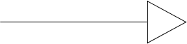
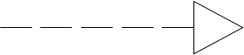
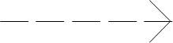
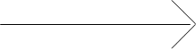
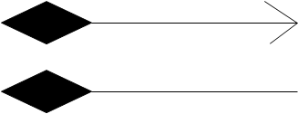

## 22.03.03_UML이란

## 목차

> 01.UML이란?
>
> 02.사용이유
>
> 03.클래스간의 관계
>
> 04.종류들

## 01.UML이란?

- Unified Modeling Language
  - 프로그램 설계를 표현하기 위해 사용하는 주로 그림으로 된 표기법을 의미
  - 객체지향 언어와 밀접한 관련이 있기에 객체지향 모델링 언어라고 함
  - 소프트웨어 시스템, 업무 모델링, 시스템의 산출물을 규정하고 시각화하며 문서화하는 언어
  - 프로그래밍 언오는 아님
  - 모델링 언어일뿐 방법론은 아님

## 02.사용이유

- 소프트웨어 시스템을 구축하기 전에 모델을 설계하는 것은 건물을 지을때 청사진을 그리는 것과 마찬가지로 필수적인 일임
  - 좋은 모델은 아키텍처를 건전하게 하고 프로젝트 팀의 의사소통을 원할히 하는데에 있어서 필수적임
  - 한번에 이해하기 힘든 복잡한 시스템이 늘어나면서 시각적 모델링은 필수가 되고 있음

## 03. 클래스간의 관계

| 관계                             | UML표기                                                      |
| -------------------------------- | ------------------------------------------------------------ |
| Generalization (일반화)          |  |
| Realization (실체화)             |  |
| Dependency (의존)                |  |
| Association (연관)               |  |
| Directed Association (직접 연관) |  |
| Aggregation (집합, 집합연관)     |  |
| Composition(합성, 복합 연관)     |  |

## 04.종류들

- 클래스다이어그램
  - 클래스 명세와 클래스 간의 관계를 표현
- 복합 구조 다이어그램
  - 전체-부분 구조를 가진 클래스를 실행할 때의 구조를 표현
- 컴포넌트 다이어그램
  - 파일과 데이터베이스, 프로세스와 스레드 등의 소프트웨어 구조를 표현
- 디플로이먼트 다이어그램
  - 하드웨어와 네트워크 등 시스템의 물리 구조를 표현
- 객체 다이어그램
  - 인스턴스 간의 연관 관계를 표현
- 패키지 다이어그램
  - 패키지  간의 연관 관계를 표현
- 액티비티 다이어그램
  - 일련의 처리에 있어 제어의 흐름을 표현
- 시퀀스 다이어그램
  - 인스턴스 간의 상호 작용을 시계열로 표현
- 커뮤니케이션 다이어그램
  - 인스턴스 간의 상호 작용을 구조 중심으로 표현
- 인터액션 오버뷰 다이어그램
  - 조건에 따라 다르게 동작을 하는 시퀀스 다이어그램을 액티비티 다이어그램 안에 포함하여 표현
- 타이밍 다이어그램
  - 인스턴스 간의 상태 전이와 상호 작용을 시간 제약으로 표현
- 유스케이스 다이어그램
  - 시스템이 제공하는 기능과 이용자의 관계를 표현
- 스테이트 머신 다이어그램
  - 인스턴스의 상태 변화를 표현

