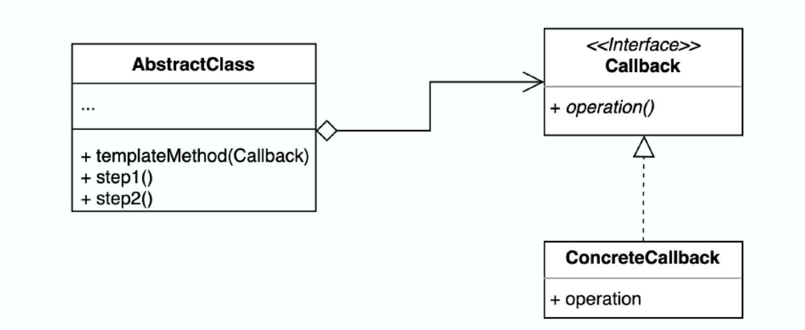
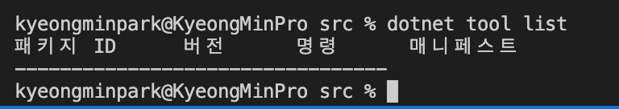
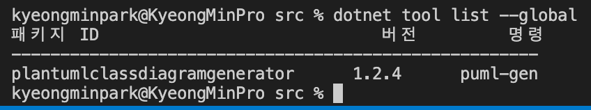
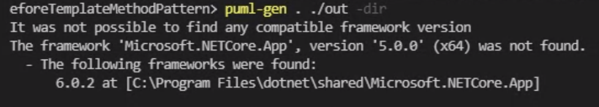
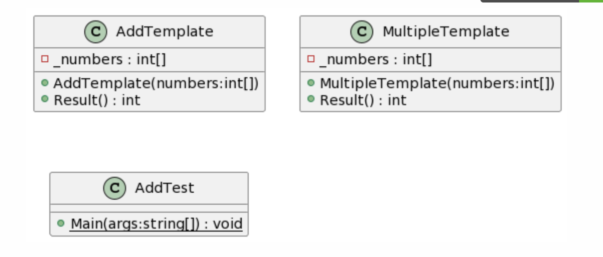
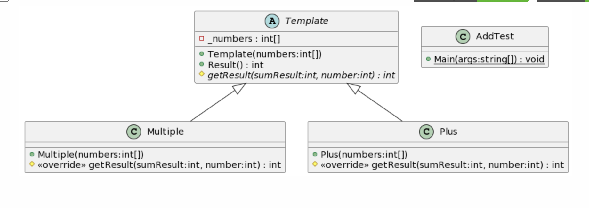
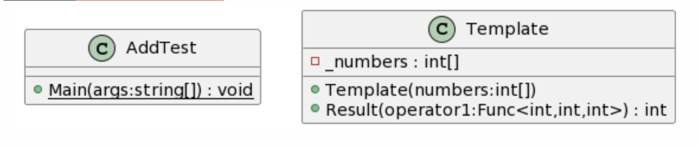
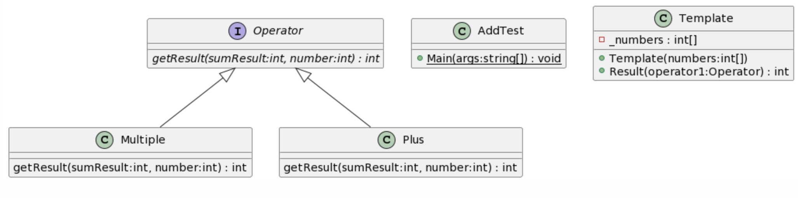

## 22.03.05_템플릿메소드

## 목차

> 01.템플릿메소드패턴 소개
>
> 02.템플릿메소드패턴 적용하기
>
> > 02.1 템플릿과 유사하지만 다른 템플릿 콜백 패턴
> >
> > > 02.1.1 콜백역할하는 Operator
>
> 03.UML로 확인하기
>
> > 03.1 패턴 적용전 UML
> >
> > 03.2 상속을 적용한 UML
> >
> > 03.3 델리게이트적용1
> >
> > 03.4 델리게이트적용2
>
> 04.템플릿메소드패턴 장단점
>
> > 04.1 장점
> >
> > 04.2 단점

## 01.템플릿메소드패턴 소개

- 알고리즘의 구조라고 하는 그 구조를 읽어 오고 처리하는 것을 템플릿으로 제공
  - 그 중에서 구체적인 방법을 제공하고 처리하는 방법을 서브클래스가 구체적으로 구현 할 수 있게 하는 패턴
- 알고리즘 구조를 서브 클래스가 확장할 수 있도록 템플릿으로 제공하는 방법
  - 추상클래스는 템플릿을 제공하고 하위 클래스는 구체적인 알고리즘을 제공


## 02.템플릿메소드패턴 적용하기

- 비슷한 코드인데 3-4줄 정도가 다를때 적용하기 좋은 패턴

- 템플릿메소드패턴 적용전

  ```csharp
  namespace AddTest;
  
  public class Add
  {
      private int[] _numbers;
      public Add(int[] numbers)
      {
          _numbers = numbers;
      }
      public int Result()
      {
          int sumResult =0;
          for(int i=0 ; i<_numbers.Length;i++){
              sumResult+=_numbers[i];//이곳을 바꿀것
          }
          return sumResult;
      }
  }
  ```

- 템플릿화 하기

  ```csharp
  namespace AddTest;
  
  public abstract class AddTemplate
  {
      private int[] _numbers;
      public AddTemplate(int[] numbers)
      {
          _numbers = numbers;
      }
      public int Result()
      {
          int sumResult =0;
          for(int i=0 ; i<_numbers.Length;i++){
              sumResult=getResult(sumResult,_numbers[i]);
          }
          return sumResult;
      }
     protected abstract int getResult(int sumResult, int number);
  }
  ```

-  Plus.cs

  ```csharp
  namespace AddTest;
  
  public class Plus : Template
  {
      public Plus(int[] numbers) : base(numbers)
      {
  
      }
  
      protected override int getResult(int sumResult, int number)
      {
          return sumResult += number;
      }
  }
  ```

- Program.cs

  ```csharp
  namespace AddTest;
  
  public class AddTest
  {
      public static void Main(string[] args)
      {
          int[] number ={1,2,3,4,5};
          Template addNumber = new Plus(number);
          int addResult = addNumber.Result();
          Console.WriteLine(addResult);
      }
  }
  ```

- 만약에 곱셈을 추가하는 경우에는 어떻게 될까?

  - Multiple.cs

    ```csharp
    namespace AddTest;
    
    public class Multiple : Template
    {
        public Multiple(int[] numbers) : base(numbers)
        {
    
        }
    
        protected override int getResult(int sumResult, int number)
        {
            if (sumResult == 0) sumResult = 1;
            return sumResult *= number;
        }
    }
    ```

- Program.cs

  ```csharp
  namespace AddTest;
  
  public class AddTest
  {
      public static void Main(string[] args)
      {
          int[] number = { 1, 2, 3, 4, 5 };
          Template addNumber = new Plus(number);
          int addResult = addNumber.Result();
          Console.WriteLine(addResult);
  
          Template multipleNumber = new Multiple(number);
          int multipleResult = multipleNumber.Result();
          Console.WriteLine(multipleResult);
      }
  }
  ```

### 02.1 템플릿과 유사하지만 다른 템플릿 콜백 패턴



- 콜백으로 상속 대신 위임을 사용하는 템플릿 패턴
  - 상속대신 익명 내부 클래스 또는 람다 표현식을 활용할 수 있음
- operation을 콜백에 담음
  - 전략패턴과 비슷하다고 할 수 있지만 여러개의 메소드를 가지고 있을 수 있는 차이
- 콜백은 하나의 메소드만 담고 있어야함
  - 그래서 여러개의 메소드가 필요하면 그 만큼의 인터페이스가 있어야함
  - 여기서 상속을 사용안해도 된다는 점이 좋음
    - ConcreateCallback을 구현체로 만드는 방법과
    - 익명내부 클래스(java), 람다를 사용할 수 있음

#### 02.1.1 콜백역할하는 Operator

```csharp
public interface Operator
{
   int getResult(int sumResult, int number);
}
```

- 자바의 경우

  - 템플릿 부분

  ```csharp
  namespace AddTest;
  
  public class Template2
  {
      private int[] _numbers;
      public Template2(int[] numbers)
      {
          _numbers = numbers;
      }
      public int Result(Operator operator1)
      {
          int sumResult =0;
          for(int i=0 ; i<_numbers.Length;i++){
              sumResult=operator1.getResult(sumResult,_numbers[i]);
          }
          return sumResult;
      }
  }
  ```

  - 이렇게 해주면 상속이 필요없어져 plus와 multiple이 필요 없음

  ```java
  class Main {
  	public static void main (String[] args) throws java.lang.Exception {
  		int[] numbers = {1,2,3,4};
          Template2 template1 = new Template2(numbers);
          int result1 = template1.Result(new Operator() {
  
              @Override
              public int getResult(int result, int number) {
                  if(result ==0) result =1;
                  return result*=number;
              }
          });
          Template2 template2 = new Template2(numbers);
         int result2 = template2.Result((result,number)->result+=number);
  
         System.out.println(result1);
         System.out.println(result2);
  	}
  }
  ```

  - 익명내부 클래스(java), 람다를 사용

- Csharp의 경우

  - 템플릿

  ```csharp
  namespace AddTest;
  
  public class Template2
  {
      private int[] _numbers;
      public Template2(int[] numbers)
      {
          _numbers = numbers;
      }
      public int Result(Func<int,int,int> operator1)
      {
          int sumResult =0;
          for(int i=0 ; i<_numbers.Length;i++){
              sumResult=operator1(sumResult,_numbers[i]);
          }
          return sumResult;
      }
  }
  ```

  ```csharp
  namespace AddTest;
  
  public class AddTest
  {
      public static void Main(string[] args)
      {
  
          int[] number = { 1, 2, 3, 4, 5 };
        
          Template2 addNumber2 = new Template2(number);
          Func<int, int,int> operator1 = (sumResult, number) => sumResult+=number;
          int result2 = addNumber2.Result(operator1);
        
          Console.WriteLine(result2);
      }
  }
  ```

  - 위와 같이 해도됨

  - 클래스도 줄어들고 위임을 함으로써 언제든지 원하는 형태로 바꿔서 쓸 수 있음

  - 다른곳에서 쓰게 되면 이것을 클래스로 만들어서 해도됨

    - 자바의 경우

      ```java
      public class Plus implement Operator{
        @Override
        public int getResult(int result, int number){
          return result += nuber;
        }
      }
      
      //Main.java
      Template2 template2 = new Template2(numbers);
      int result2 = template2.Result(new Plus());
      ```

      - 이렇게 해도됨

    - csharp

      ```csharp
      namespace AddTest;
      
      public class Plus3 : Operator
      {
          int Operator.getResult(int sumResult, int number)
          {
              return sumResult+=number;
          }
      }
      //Program.cs
      Template3 addNumber3 = new Template3(number);
      int result3 = addNumber3.Result(new Plus3());
      Console.WriteLine(result3);
      ```

## 03.UML로 확인하기



- dotnet tool list 
  - 현재 설치된 것 없음

- https://github.com/pierre3/PlantUmlClassDiagramGenerator 사이트 참고
  - `dotnet tool install --global PlantUmlClassDiagramGenerator`



- 설치 확인	

- 파일 생성하기

  `puml-gen . ./out -dir` 

  - 각 파일 하나씩 생성

  `puml-gen . ./out -dir -allInOne`



- 중요한것은 SDK 5.0이 설치되어있어야함

### 03.1 패턴 적용전 UML



### 03.2 상속을 적용한 UML



### 03.3 델리게이트적용1 UML



### 03.4 델리게이트적용2 UML



## 04.템플릿메소드패턴 장단점

### 04.1 장점

- 템플릿 코드를 재사용하고 중복 코드를 줄일 수 있음
- 템플릿 코드를 변경하지 않고 상속을 받아서 구체적인 알고리즘만 변경할 수 있음
  - Open Close Principle, Single Responsibility Principle을 만족

### 04.2 단점

- 리스코프 치환 원칙을 위반할 수도 있음
  - `리스코프 치환 원칙`은 상속 구조에서 상위클래스 타입으로 사용하는 코드에서 그 코드를 
    - 그 상위 타입말고 상위타입을 상속 받는 그 어떠한 임의의 클래스로 바꾸더라도 
    - 코드가 의도한대로 동작해야한다는 것
    - 그 부모가 가진 의도를 그대로 해야하는 것
      - 여기서 final을 이용해서 오버라이드 못하게 한다면 어느정도 리스코프 치환 원칙을 막을수는 있지만
      - 추상 메소드 자체를 변경하면 사실 위배할 수 있는 가능성이 생김
- 알고리즘 구조가 복잡 할 수록 템플릿을 유지하기 어려워짐


