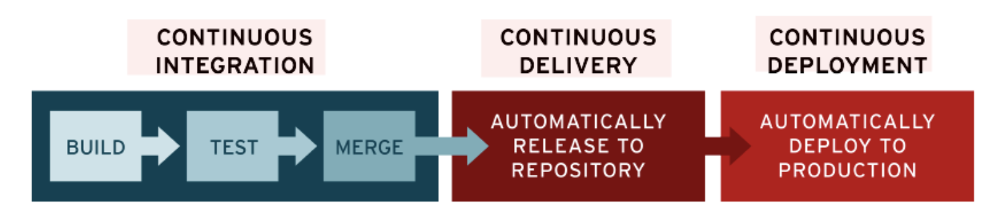

## 22.03.02_CI/CD

## 1.CI/CD

- CI/CD는 앱 개발 단계를 자동화 하여 앱을 보다 짧은 주기로 고객에게 제공하는 방법
- CI/CD의 기본 개념은 지속적인 통합
  - 지속적인 서비스 제공
  - 지속적인 배포
- CI/CD는 새로운 코드 통합으로 인해 개발 및 운영팀에 발생하는 문제
  - 인테그레이션 헬 을 해결하기 위한 솔루션
- 특히, CI/CD는 앱의 통합 및 테스트 단계에서 부터 제공 및 배포에 이르는 앱의 라이프사이클 전체에 걸쳐 지속적인 자동화와 지속적인 모니터링을 제공함
  - 이러한 구축 사례를 일반적으로 CI/CD 파이프라인 이라 부르며 개발 및 운영팀의 애자일 방식 협력을 통해 지원됨

## 2.CI와CD의 차이점은 무엇일까?

- CI/ CD는 약어로, 몇 가지의 다른 의미를 가지고 있음
  - CI/CD의 CI는 개발자를 위한 자동화 프로세스인 지속적인 통합을 의미
  - CI를 성공적으로 구현할 경우 앱에 대한 새로운 코드 변경 사항이 정기적으로 빌드 및 테스트 되어
    - 공유 리포지토리에 통합되므로 여러명의 개발자가 동시에 앱 개발과 관련된 코드 작업을 할 경우 서로 충돌할 수 있는 문제를 해결할 수 있음
- CI/ CD의 CD는 지속적인 서비스 제공(Continuous Delivery) 및 또는 지속적인 배포(Continuous Deployment)를 의미하며 이 두 용어느 상호 교환적으로 사용됨
  - 두 가지 의미 모두 파이프라인의 추가 단계에 대한 자동화를 뜻하지만
    - 때로는 얼마나 많은 자동화가 이루어지고 있는지를 설명하기 위해 별도로 사용되기도 함
- 지속적인 제공이란
  - 개발자들이 앱에 적용한 변경 사항이 버그 테스트를 거쳐 리포지토리에 자동으로 업로드 되는 것을 뜻함
  - 운영팀은 이 리포지토리에서 앱을 실시간 프로덕션 환경으로 배포할 수 있음
    - 이는 개발팀과 비지니스팀 간의 가시성과 커뮤니케이션 부족 문제를 해결해 줌
  - 지속적인 제공은 최소한의 노력으로 새로운 코드를 배포하는 것을 목표로 함

- 지속적인 배포란
  - 개발자의 변경 사항을 리포지토리에서 고객이 사용 가능한 프로덕션 환경까지 자동으로 릴리스하는 것을 의미
  - 이는 앱 제공 속도를 저해하는 수동 프로세스로 인한 운영팀의 프로세스 과부하 문제를 해결함
    - 지속적인 배포는 파이프라인의 다음 단계를 자동화함으로써 지속적인 제공이 가진 장점을 활용

