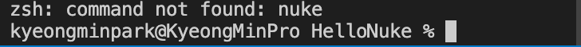
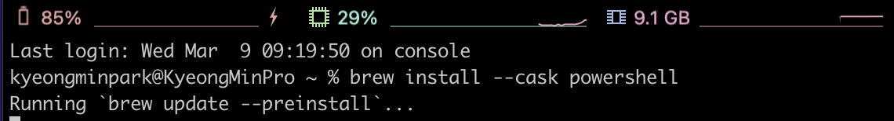
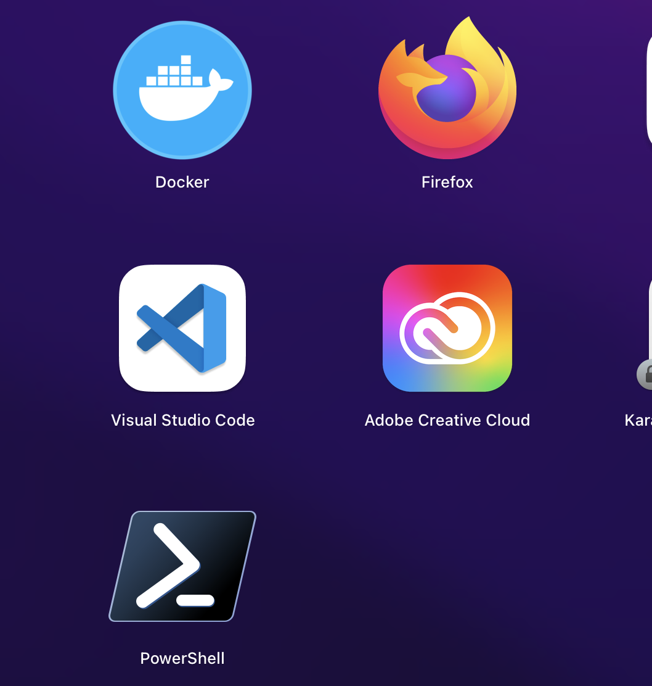
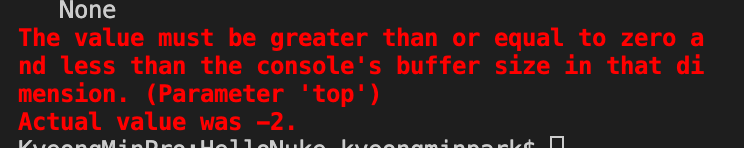
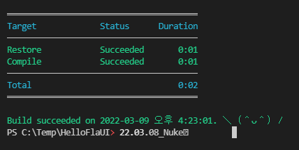
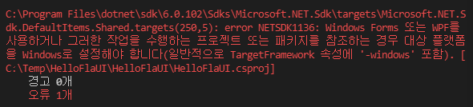
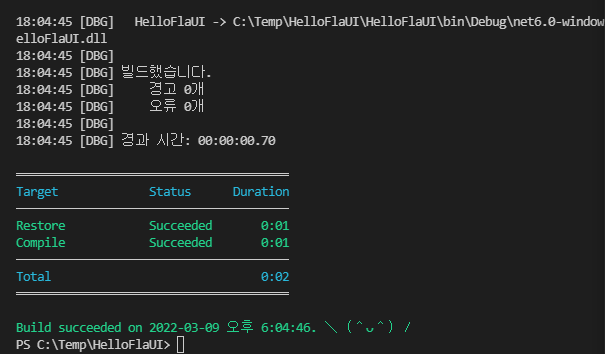
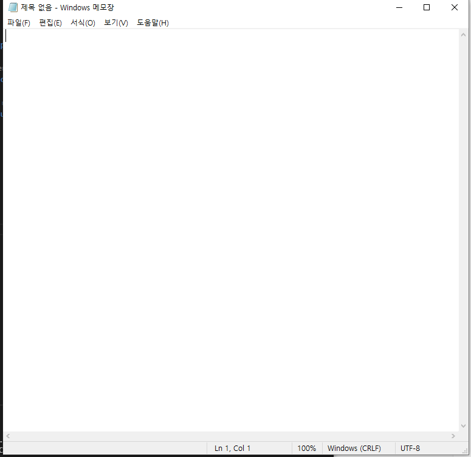
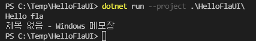
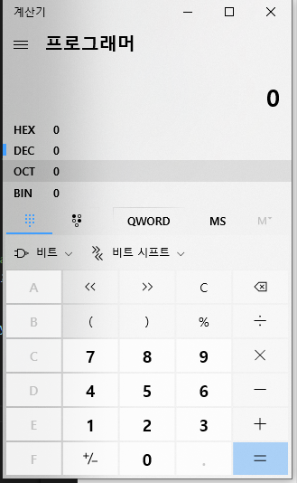

## 22.03.09_Nuke적용메뉴얼

## 목차

> 00.초기환경구성
>
> 01.Nuke를 위한 Toot설치
>
> 02.Nuke Setup
>
> 03.확장설치
>
> 04.Build
>
> > 04.1 컴파일해보기
>
> 05.flaUI사용
>
> > 05.1 소스1
> >
> > 05.2 소스2

## 00.초기환경구성


- 위와 같이 폴더 구성을 만들어 주자

## 01.Nuke를 위한 Tool설치

```csharp
dotnet tool install Nuke.GlobalTool -g
```

- Tool먼저 설치를 한다.


- 설치를 하고 나서 우선 Nuke를 setup해준다.

## 02.Nuke Setup

```csharp
nuke :setup
```



- 맥의 경우 저렇게 안되는 경우 있음 그럼 터미널을 다른것으로 바꿔주자


- 필자의 경우 bash로 진행`

- `nuke :setup`입력해보자

  - 아마 그래도 에러때문에 안됨

- 

- powershell을 설치해보자

  - `brew install --cask powershell`
  - 브루를 이용해서 위를 설치함

- 

  - 파워셀이 설치된것이 보인다 저것을 실행해서 해보자

  

  - 맥은 안되는데 ... 이유를 지금은 모르겠으니 윈도우로 해보자
    - 윈도우도 똑같은 상황이 나오게 되는데 이유인 즉, 프로젝트를 선택해야하는데 제대로 선택이 안되는 상황이였음
    - 너무 많음 프로젝트가 있어서 선택이 안되서 제일 상단으로 프로젝트를 빼서 진행함
    - 이게 문제점을 알고 보니 그런경우 --root를 붙이면 됨
  
  
  
  - 위와 같이 선택하는 것을 제대로 잘 선택해주면됨
  

## 03.확장설치


- nuke support 검색후 설치

## 04.Build




- .\build.cmd

- 간혹 에러가 난다면 이부분이다.

  

  - Before

    ```csharp
    <Project Sdk="Microsoft.NET.Sdk">
    
      <PropertyGroup>
        <OutputType>Exe</OutputType>
        <TargetFramework>net6.0</TargetFramework>
        <ImplicitUsings>enable</ImplicitUsings>
        <Nullable>enable</Nullable>
      </PropertyGroup>
    
      <ItemGroup>
        <PackageReference Include="FlaUI.Core" Version="3.2.0" />
        <PackageReference Include="FlaUI.UIA3" Version="3.2.0" />
      </ItemGroup>
    
    </Project>
    
    ```

  - After

    ```csharp
    <Project Sdk="Microsoft.NET.Sdk">
    
      <PropertyGroup>
        <OutputType>Exe</OutputType>
        <TargetFramework>net6.0-windows</TargetFramework>
        <ImplicitUsings>enable</ImplicitUsings>
        <Nullable>enable</Nullable>
      </PropertyGroup>
    
      <ItemGroup>
        <PackageReference Include="FlaUI.Core" Version="3.2.0" />
        <PackageReference Include="FlaUI.UIA3" Version="3.2.0" />
      </ItemGroup>
    
    </Project>
    
    ```

### 04.1 컴파일해보기

```csharp
using System;
using System.Linq;
using Nuke.Common;
using Nuke.Common.CI;
using Nuke.Common.Execution;
using Nuke.Common.Git;
using Nuke.Common.IO;
using Nuke.Common.ProjectModel;
using Nuke.Common.Tooling;
using Nuke.Common.Tools.DotNet;
using Nuke.Common.Tools.GitVersion;
using Nuke.Common.Utilities.Collections;
using static Nuke.Common.EnvironmentInfo;
using static Nuke.Common.IO.FileSystemTasks;
using static Nuke.Common.IO.PathConstruction;
using static Nuke.Common.Tools.DotNet.DotNetTasks;
using Serilog;

[CheckBuildProjectConfigurations]
[ShutdownDotNetAfterServerBuild]
class Build : NukeBuild
{
    /// Support plugins are available for:
    ///   - JetBrains ReSharper        https://nuke.build/resharper
    ///   - JetBrains Rider            https://nuke.build/rider
    ///   - Microsoft VisualStudio     https://nuke.build/visualstudio
    ///   - Microsoft VSCode           https://nuke.build/vscode

    //public static int Main () => Execute<Build>(x => x.Compile);
    public static int Main () => Execute<Build>(x => x.Test);

    [Parameter("Configuration to build - Default is 'Debug' (local) or 'Release' (server)")]
    readonly Configuration Configuration = IsLocalBuild ? Configuration.Debug : Configuration.Release;

    [Solution] readonly Solution Solution;
    [GitRepository] readonly GitRepository GitRepository;
    [GitVersion] readonly GitVersion GitVersion;

    AbsolutePath SourceDirectory => RootDirectory / "source";
    AbsolutePath TestsDirectory => RootDirectory / "tests";
    AbsolutePath OutputDirectory => RootDirectory / "output";

    Target Clean => _ => _
        .Before(Restore)
        .Executes(() =>
        {
            SourceDirectory.GlobDirectories("**/bin", "**/obj").ForEach(DeleteDirectory);
            TestsDirectory.GlobDirectories("**/bin", "**/obj").ForEach(DeleteDirectory);
            EnsureCleanDirectory(OutputDirectory);
        });

    Target Restore => _ => _
        .Executes(() =>
        {
            //dotnet restore NukeHello.sln
            DotNetRestore(s => s
                .SetProjectFile(Solution));
        });

    Target Compile => _ => _
        .DependsOn(Restore)
        .Executes(() =>
        {
            //dotnet build NukeHello.sln --configuration Debug --no-restore
            DotNetBuild(s => s
                .SetProjectFile(Solution)
                .SetConfiguration(Configuration)
                .SetAssemblyVersion(GitVersion.AssemblySemVer)
                .SetFileVersion(GitVersion.AssemblySemFileVer)
                .SetInformationalVersion(GitVersion.InformationalVersion)
                .EnableNoRestore());
        });
    Target Test => _ => _
    .DependsOn(Compile)
    .Executes(()=>
    {
        Log.Information("Hi Information Test");
        Log.Debug("Hi Debug Test");

//dotnet test NukeHello.sln --configuration Debug --no restore

//dotnet test NukeHello.sln --configuration Debug --no build
        DotNetTest( s=>s
        .SetProjectFile(Solution)
        .SetConfiguration(Configuration)
        .EnableNoBuild()
        .SetProcessArgumentConfigurator(args =>
        args.Add("--logger \"console;verbosity=detailed\"")));
    });
}
//p: Cov coll... 
//p: E .. Output
//p E Output Format
```


## 05.flaUI사용
```
 dotnet add .\HelloflaUI\ package FlaUI.UIA3

 dotnet add .\HelloflaUI\ package FlaUI.Core
```

- 위 패키지는 설치해야한다.

### 05.1 소스1

```csharp
using System;
using FlaUI.UIA3;

namespace HelloflaUI;

public class Program
{
    public static void Main(string[] args)
    {
        Console.WriteLine("Hello fla");
        var app = FlaUI.Core.Application.Launch("notepad.exe");
        using (var automation = new UIA3Automation())
        {
            var window = app.GetMainWindow(automation);
            Console.WriteLine(window.Title);
        }
    }
}
```





- 메모장을 켜고 제목을 출력해준다.

### 05.2 소스2

 ```csharp
 using System;
 using FlaUI.Core.AutomationElements;
 using FlaUI.UIA3;
 
 namespace HelloflaUI;
 
 public class Program
 {
     public static void Main(string[] args)
     {
         // Console.WriteLine("Hello fla");
         // var app = FlaUI.Core.Application.Launch("notepad.exe");
         // using var automation = new UIA3Automation();
         // var window = app.GetMainWindow(automation);
         //  Console.WriteLine(window.Title);
 
 
         // Note: Works only pre-Windows 8 with the legacy calculator
         var app = FlaUI.Core.Application.Launch("calc.exe");
         using var automation = new UIA3Automation();
         var window = app.GetMainWindow(automation);
         var button1 = window.FindFirstDescendant(cf => cf.ByText("1"))?.AsButton();
         button1?.Invoke();
 
 
     }
 }
 ```



- 위와 같이 계산기가 켜지고 1이 입력이 되어야하는데 예전 계산기가 아니라서 동작은 하지 않음