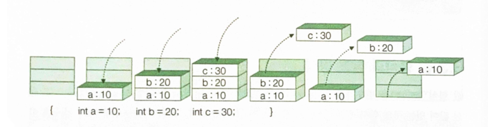
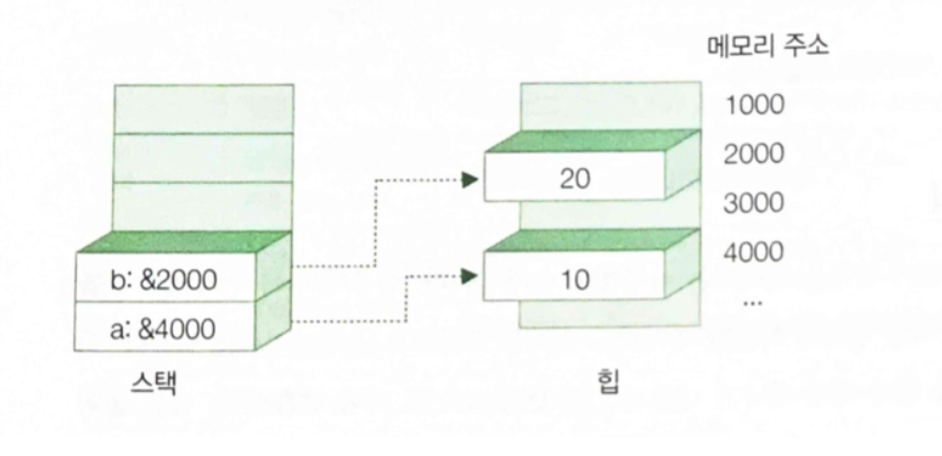

## 22.03.01_Value_Vs_Reference

## 목차

> 01.데이터형식
>
> 02.값형식과 스택
>
> 03.참조형식과 힙

## 01.데이터형식

- 기본 데이터형식과 복합데이터형식이 있음

- 기본데이터 형식은 
  - 상수, 열거형
- 복합데이터 형식은
  - 구조체와 클래스, 배열 등이 있음

## 02.값형식과 스택

- 값 형식은 변수가 값을 담는 데이터 형식

  - 스택 형식은 자신이 담고 있던 데이터가 쓰레기 되지 않게 수거함

  ```csharp
  {
    int a = 100;
    int b = 200;
    int c = 300;
  }
  ```

  



- 단. 코드 블록과 상관 없이 데이터를 유지하고 싶을때
  - 스택의 구조가 발목을 잡음

## 03.참조형식과 힙

- 참조형식은 변수가 값 대신 값이 있는 곳의 위치를 담는 데이터 형식

  - 힙은 저장된 데이터를 스스로 제거하는 메커니즘이 없음

    - 그대신 청소부를 따로 고용해서씀
      - 그것이 CLR의 가비지 컬렉터

  - 힙 역역은 데이터를 저장하고 스택영역에 데이터가 저장된 힙 메모리 주소를 저장

    - 그래서 참조 형식이라고함
      - 즉, 데이터를 직접 저장하는 대신 
        - 실제 데이터가 저장된 메모리의 주소를 참조한다고 해서 참조형식

  - 참조 형식은 변수가 값 대신 값이 있는 곳의 위치를 담는 데이터 형식

    ```csharp
    {
      object a = 10;
      object b = 20;
    }
    ```

    