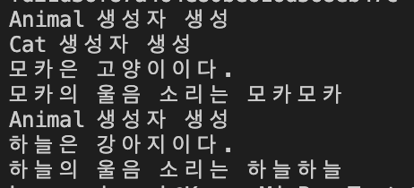

## 22.03.01_상속이란?

## 목차

> 01.상속이란?
>
> 02.상속관련용어들
>
> 03.상속의 장점
>
> 04.상속 구현해보기

## 01.상속이란?

- 클래스를 정의할 때 기존 클래스가 가지고 있는
  - 필드들, 메소드들을 물려받는것을 말함
  - 상속받은 클래스 즉, 자식 클래스는 이미 구현된 것들을 기존클래스로 부터 물려받고 이를 재사용
    - 소프트웨어 재사용이라는 개념은 여기서 적용된다고 하는데 사실 재사용이라는 자체가 난해하고 상속으로 재사용이라는 말이 맞는지는 모르겠음
  - 자식 클래스는 그 외에 자신만의 필드들과 메소들이 추가됨
    - 이는 상속으로 부터 클래스의 특성이 확장됨

## 02.상속관련용어들

- 부모클래스, 기반클래스, 상위클래스
- 자식클래스, 파생클래스, 하위클래스
  - 이렇게 부모클래스라고하면 자식클래스라고 하고 
  - 기반클래스라고 하면 파생클래스
  - 상위클래스라고 하위클래스라고 보통 묶어서 말한다.

## 03. 상속의 장점

- 소프트 웨어를 개발할 때 
  - 새로 만들기도 하지만 기존의 것으로 부터 확장하는 방식으로 개발하기도 함
- 만약 이미 존재하는 클래스의 특징을 갖는 다른 클래스를 만들려면, 상속하는것이 좋음
  - 특히 메소들의 경우 이미 검증을 받은 것들은 이를 수정하지 않는다는 전제 조건 하에 
    - 또 받을 필요가 없음 이를통해 개발시간과 검증 시간을 줄이는데 도움이 됨

## 04. 상속 구현해보기

```csharp
using System;

namespace Test
{
    public class Animal
    {
        public string Name;
        public Animal ()
        {
            Console.WriteLine($"Animal 생성자 생성");
        }
        public void Sound()
        {
            this.Name = Name;
            Console.WriteLine($"{this.Name}의 울음 소리는 {this.Name}{this.Name}");
        }
    }

    public class Cat : Animal
    {
        public Cat (string Name)
        {
            base.Name = Name;
            Console.WriteLine($"Cat 생성자 생성");
        }
        public void Sound()
        {
            Console.WriteLine($"{base.Name}은 고양이이다.");
            Console.WriteLine($"{base.Name }의 울음 소리는 {base.Name }{base.Name}");
        }
    }

    public class Dog : Animal
    {
        public Dog (string Name)
        {
            base.Name = Name;
        }
        public void Sound()
        {
            Console.WriteLine($"{base.Name }은 강아지이다.");
            Console.WriteLine($"{base.Name }의 울음 소리는 {base.Name }{base.Name }");
        }
    }

    public class Own
    {
        public static void Main(string[] args)
        {
            Cat cat = new Cat("모카");
            cat.Sound();

            Dog dog = new Dog("하늘");
            dog.Sound();
        }
    }
}

```





- 생성되는 순서는 위와 같이 부모클래스 먼저 생성되고, 자식 클래스 생성되고 실행이됨
- 소멸하는 순서는 그와 반대인 자식클래스 먼저 사라지고 부모클래스가 사라진다.
  - 아주 간단한 예제 였지만 Name을 가져와서 썼고 메소드를 재 정의하여 구현 할 수 있는것을 볼 수 있었음

