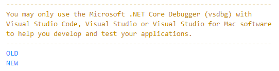
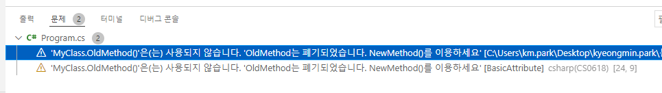
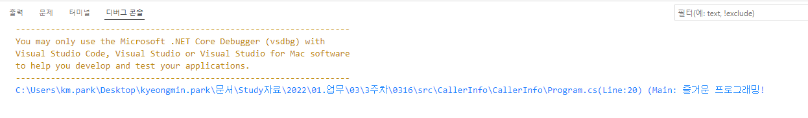
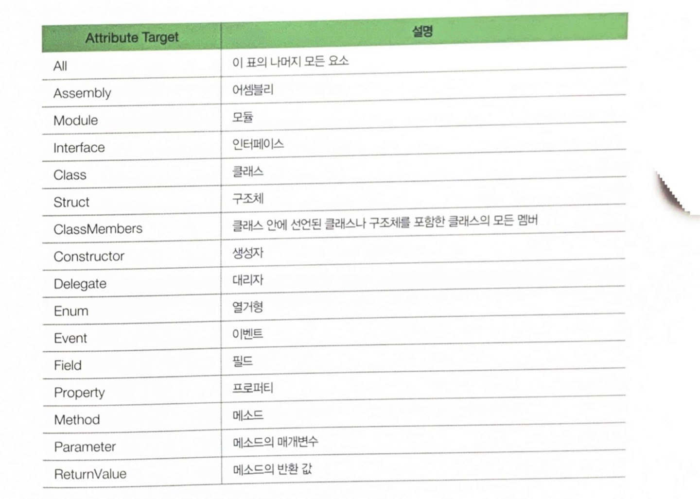
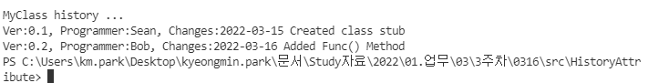

## 22.03.15_Csharp애트리뷰트

## 목차

> 01.애트리뷰트
>
> > 01.1 애트리뷰트 사용하기
> >
> > 01.2 호출자 정보 애트리뷰트
> >
> > 01.3 내가 만드는 애트리뷰트
> >
> > > 01.3.1 System.AttributeUsage쓰기
> > >
> > > 01.3.2 실제 구현해보기

## 01.애트리뷰트

- 애트리뷰트는 코드에 대한 부가 정보를 기록하고 읽을 수 있는 기능
  - 주석은 사람이 읽고 쓰는 정보(설명)
  - 애트리뷰트는 사람이 작성하고 컴퓨터가 읽음
- 애트리뷰트를 이용해서 클래스나 구조체, 메소드, 프로퍼티 등에 데이터 기록하면
  - Csharp 컴파일러나 Csharp으로 작성된 프로그램이 이 정보를 읽고 사용함

**메타데이터**

- 메타데이터란 데이터의 데이터를 말함
  - Csharp코드도 데이터이지만 이 코드에 대한 정보, 즉 데이터 데이터가 있을 수 있음
    - 이를 메타데이터라고 함
- 애트리뷰트나 리플렉션을 통해 얻는 정보들도 Csharp코드의 메타데이터라고 할 수 있음

### 01.1 애트리뷰트 사용하기

```csharp
[애트리뷰트_이름(애트리뷰트_매개변수)]
public void MyMethod()
{
    //...
}
```

- OldMethod()사용시 경고 메세지 보내기

  ```csharp
  using System;
  
  namespace BasicAttribute;
  
  class MyClass
  {
      [Obsolete("OldMethod는 폐기되었습니다. NewMethod()를 이용하세요")]
      public void OldMethod()
      {
          Console.WriteLine("OLD");
      }
  
      public void NewMethod()0
      {
          Console.WriteLine("NEW");
      }
  }
  
  class MainApp
  {
      static void Main(string[] args)
      {
          MyClass myClass = new MyClass();
          myClass.OldMethod();
          myClass.NewMethod();
      }
  }
  ```

  

  - 결과



- 이렇게 확인이 가능하게 된다.

### 01.2 호출자 정보 애트리뷰트

| 애트리뷰트                | 설명                                                         |
| ------------------------- | ------------------------------------------------------------ |
| CallerMemberNameAttribute | 현재 메소드를 호출한 메소드 또는 프로퍼티의 이름을 나타냄    |
| CallerFilePathAttribute   | 현재 메소드가 호출된 소스 파일 경로를 나타냅니다. 이때 경로는 소스 코드를 컴파일 할 떄의 전체 경로를 나타냄 |
| CallerLineNumberAttribute | 현재 메소드가 호출된 소스 파일 냉의 행(Line)번호를 나타냄    |

- 호출자 정보 애트리뷰트 사용

  ```csharp
  using System;
  using System.Runtime.CompilerServices;
  
  namespace CallerInfo;
  public static class Trace
  {
      public static void WriteLine(string message,
      [CallerFilePath] string file = "",
      [CallerLineNumber] int line =0,
      [CallerMemberName] string member ="")
      {
          Console.WriteLine($"{file}(Line:{line}) ({member}: {message}");
      }
  }
  
  class MainApp
  {
      static void Main(string[] args)
      {
          Trace.WriteLine("즐거운 프로그래밍!");
      }
  }
  ```

  

- 위의 애트리뷰트 3개를 선택적 인수로 사용
  - 이렇게 하면 Trace.WriteLine()메소드를 호출할 때 호출자 정보 애트리뷰트로 수식한 매개변수는 프로그래머가 별도로 입력하지 않아도됨

### 01.3 내가 만드는 애트리뷰트

- 애트리뷰트들은 애트리뷰트 자체보다 용도를 중심으로 공부하는 것이 좋음

  - 애트리뷰트는 부가 정보이지 핵심 내용이 아니고 사용 방법도 그 수만큼 다양하기 때문

- 애트리뷰트도 역시 하나의 클래스

  - 애트리뷰트는 System.Attribute클래스로부터 상속을 받아 만듦

    ```csharp
    class History : System.Attribute
    {
        //
    }
    
    [History]
    class MyClass
    {
        //...
    }
    ```

    - 이렇게 사용할 수 있음

- 실제로 동작하게 하기

  - History가 클래스의 변경 이력을 나타내도록 하기

  - History클래스에 자신이 설명할 클래스의 작성자, 버전, 변경 내용등을 나타낼 수 있도록 필드 및 프로퍼티 추가

    ```csharp
    class History : System.Attribute
    {
        private string programmer;
        
        public double Version
        {
            get;
            set;
    	}
        
        public string Changes
        {
            get;
            set;
    	}
        
        public History(string programmer)
        {
            this.programmer = programmer;
            Version = 1.0;
            Changes = "Firsht release";
    	}
        
        public string Programmer
        {
            get { return programmer;}
    	}
    }
    
    [History("Sean", Version =0.1, Change = "2021-03-16 Created class stub")]
    class MyClass
    {
        public void Func()
        {
            Console.WriteLine("Func()");
    	}
    }
    ```

    - 이와 같이 MyClass를 History애트리뷰트로 설명해놓으면
      - 리플렉션을 이용해서 손쉽게 Release노트를 만들 수 있음
      - 단 문제는 에트리뷰트를 한번 밖에 못쓰는 것
      - 애트리뷰트를 중복해서 쓰기 위해서는 System.AttributeUsage라는 애트리뷰트의 도움을 받아야함
        - 애트리뷰트의 애트리뷰트이다.
        - 애트리뷰트가 어떤 대상을 설명할지, 이 애트리뷰트를 중복해서 사용할 수 있는지의 여부 등을 설명ㄴ

#### 01.3.1 System.AttributeUsage쓰기

```csharp
[System.AttributeUsage(System.AttributeTargets.Class, AllowMultiple=true)]
class History : System.Attribute
{
    //...
}
```



- 첫 번째 매개변수는 지금 선언하고 있는 애트리뷰트의 설명 대상이 무엇인지
  - 이것을 Attribut Target이라고 함
    - 논리합 연산자를 이용해서 결합할 수도 있음
    - 클래스와 메소드를 대상으로 한다면
      - AttributeTargets.Class | AttributeTargets, Method(|은 논리합 연산자임)를  System.AttributeUsage의 애트리뷰트 매개변수에 넘기면 됨

#### 01.3.2 실제 구현해보기

```csharp
using System;

namespace HistoryAttribute;

[System.AttributeUsage(System.AttributeTargets.Class, AllowMultiple = true)]
class History : System.Attribute
{
    private string programmer;
    public double version;
    public string changes;

    public History(string programmer)
    {
        this.programmer = programmer;
        version = 1.0;
        changes = "First release";
    }

    public string GetProgrammer()
    {
        return programmer;
    }

}

[History("Sean", version = 0.1, changes = "2022-03-15 Created class stub")]
[History("Bob", version = 0.2, changes = "2022-03-16 Added Func() Method")]

class MyClass
{
    public void Func()
    {
        Console.WriteLine("Func()");
    }
}
class MainApp
{
    static void Main(string[] args)
    {
        Type type = typeof(MyClass);
        Attribute[] attributes = Attribute.GetCustomAttributes(type);

        Console.WriteLine("MyClass history ...");

        foreach(Attribute a in attributes)
        {
            History h = a as History;
            if(h!=null)
            {
                Console.WriteLine("Ver:{0}, Programmer:{1}, Changes:{2}",h.version,h.GetProgrammer(),h.changes);
            }
        }
    }
}
```



- 위와 같은 결과가 나오면 성공
