## 22.03.21_파일다루기

22.03.21_파일다루기


## 목차

## 01.파일정보와 디렉터리 정보 다루기

- 파일은 컴퓨터 저장 매체에 기록되는 데이터의 묶음

- 디렉터리는 파일이 위치하는 주소로 파일을 담는다는 의미에서 폴더

  - .NET에는 System.IO아래와 같은 클래스들을 제공

    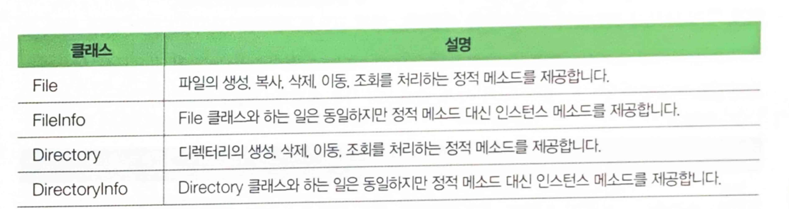

    - File클래스와 FileInfo클래스는 거의 같은 기능을 제공

      - File 차이는 정적메소드를 통해 제공
        - 하나의 파일에 대해 한두 가지 정도의 작업을 할때 사용
      - FileInfo 인스턴스 메소드를 통해 제공
        - 하나의 파일에 여러 작업을 수행할 때

    - Directory 역시 비슷하게 함

      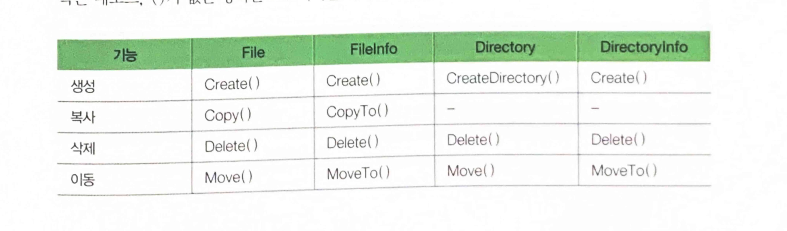

      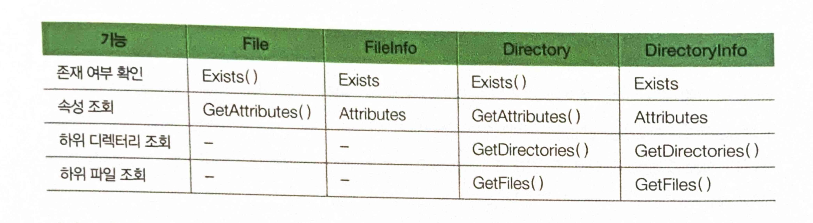


### 01.1 사용법

- File, FileInfo

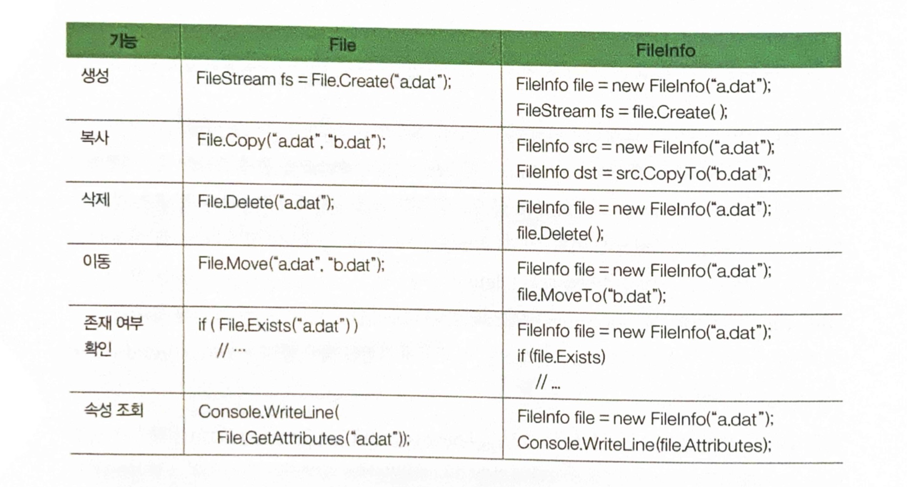

- Directory, DirectoryInfo

  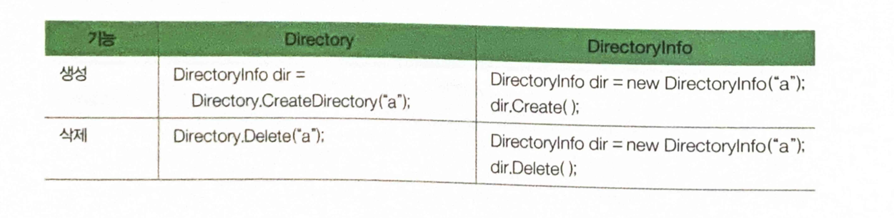

  

### 01.2 예제 프로그램: 디렉토리/파일 정보 조회하기

- 인수를 입력하지 않으면 현재 디렉터리
- 인수를 입력한 경우 입력한 디렉터리 경로에 대해 하위 디렉터리 목록과 파일 목록을 차례대로 출력
  - 하위 디렉터리 목록을 출력할 때는 이름과 속성을 
  - 파일 목록을 출력할 때는 파일의 이름과 크기, 속성을 출력

```csharp
607p
```

### 01.3 예제 프로그램: 디렉토리/파일 생성 하기

- 인수로 입력받은 경로에 새 디렉터리나 파일 만듦
  - 만약 이미 파일이나 디렉토리 존재시 
    - 해당 파일이나 디렉터리의 최종 수정 시간만 갱신

```csharp
609p
```

## 02.파일을 읽고 쓰기 위해 알아야 할 것들

- 즉, 파일의 입력과 출력에 대한 것
  - 용어
    - **스트림**
      - 영어로 시내, 강 또는 도로의 차선을 의미
      - 파일을 다룰 때 말하는 스트림은 "데이터가 흐르는 통로"를 뜻함
        - 메모리에서 하드디스크로 데이터를 옮길 때에는 먼저 이 스트림을 만들어 둘 사이 연결 후
          - 메모리에 있는 데이터를 바이트 단위로 하드디스크로 옮겨 넣음
          - 그반대도 같음

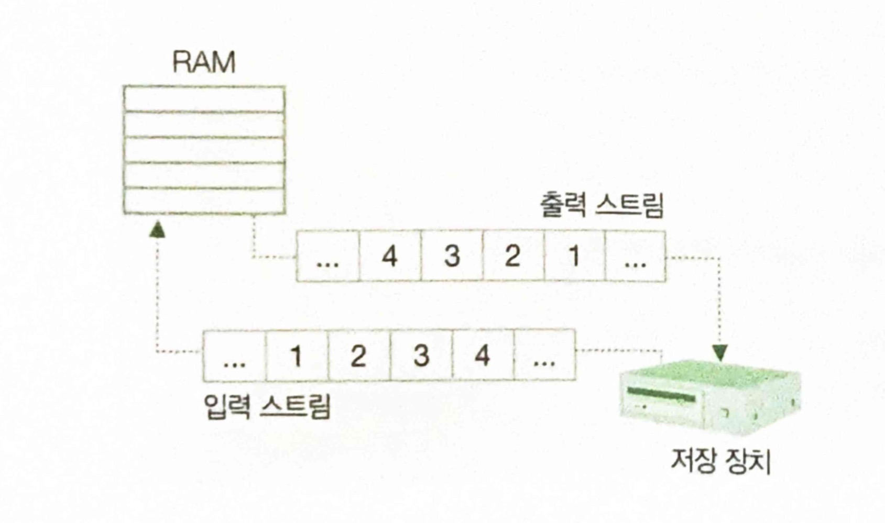

- 스트림은 데이터의 흐름이기 때문에 스트림을 이용하여 파일을 다룰 때는 
  - 처음부터 끝까지 순서대로 읽고 쓰는 것이 보통임 | 이를 순차 접근 방식이라고 함
- 이런 스트림 구조는 네트워크나 데이터 백업 장치의 데이터 입출력 구조와도 통하기 때문에 
  - 스트림을 이용하면 파일이 아닌 네트워크를 향해 데이터를 흘려보낼 수 있고, 테이프 백업 장치를 통해 데이터를 기록하거나 읽을 수도 있음
- 하드디스크는 데이터의 흐름이 단방향성을 가진 것들과 달리
  - 헤드를 움직여 디스크의 어떤 위치에 기록된 데이터를 찾음
    - 768byte번째 위치한 데이터를 읽고 싶다면, 하드디스크는 앞의 767byte를 읽지 않아도
      - 곧장 원하는 위치로 이동 할 수 있음
  - 이처럼 임의의 주소에 있는 데이터에 접근하는 것을 가리켜 `임의 접근 방식`이라고 함

### 02.1 System.IO.Stream 클래스

- Stream클래스는 그 자체로 입력 스트림, 출력 스트림의 역할을 모두 할 수 있고
  - 파일을 읽고 쓰는 방식 역시 순차 접근 방식과 임의 접근 방식 모두 지원
    - 단, 추상 클래스이기 때문에 이 클래스의 인스턴스 직접 만들어 사용 못함
      - 이 클래스로 부터 파생된 클래스를 이용해야함
- Stream클래스가 이렇게 만들어진 이유는 스트림이 다루는 다양한 매체나 장치들에 대한 파일 입출력을 스트림 모델 하나로 다룰 수 있도록 하기 위함
  - 가령 Stream의 파생 클래스인 FileStream은 저장 장치와 데이터를 주고 받도록 구현되어 있지만,
    - 역시 Stream을 상속하는 NetworkStream은 네트워크를 통해 데이터를 주고 받도록 구현되어 있음

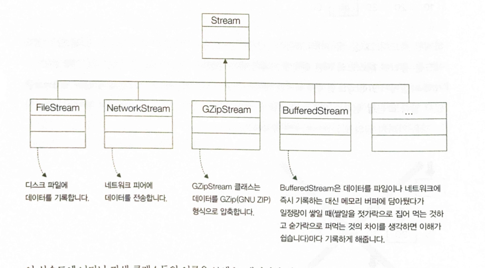

- 위의 상속도에 나타난 파생 클래스의 이름을 보면
  - 데이터가 기록되는 위치뿐 아니라 기록하는 방식이나 형식에 따라서도 다양한 클래스들이 파생됨

### 02.1.1 파일 스트림 인스턴스 생성과 사용

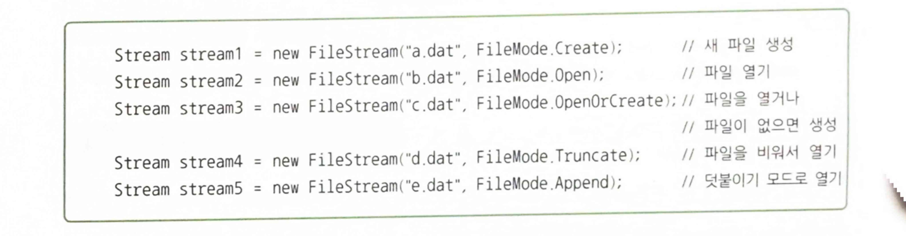

#### 파일 쓰기

```csharp
public override void Write(
	byte[] array, //쓸 데이터가 담겨 있는 byte 배열
  int offset, 	// byte 배열 내의 시작 오프셋
  int count     // 기록할 데이터의 총 길이(단위는 바이트)
);

public override void WriteByte(byte value);
```

- 위를 보면 byte와 byte배열 형식으로 되어 있다.
  - byte배열로 변환해주는 BitConverter클래스가 있음
    - 이 클래스는 임의 형식의 데이터를 byte의 배열로 변환해주기도 하지만,
    - byte의 배열에 담겨 있는 데이터를 다시 임의 형식으로 변환해줄 수도 있음


- long형식의 데이터를 파일에 기록하는 예

## 파일 읽기

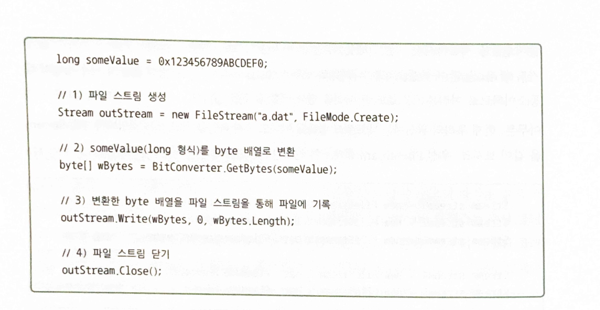

- 사용법

  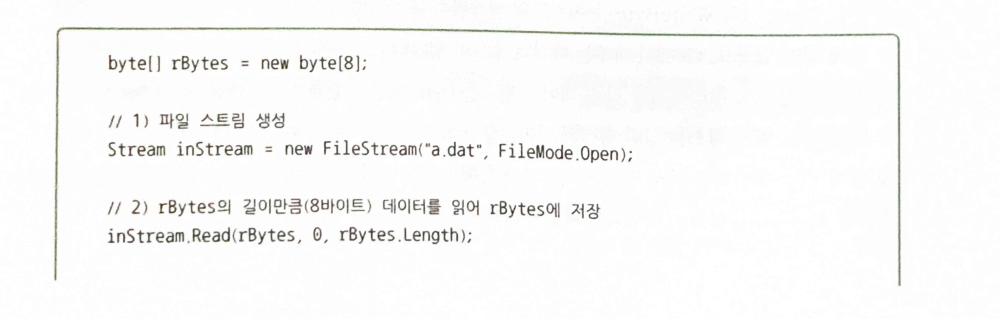

  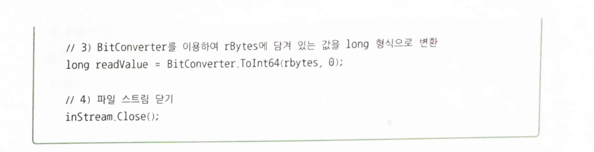

```csharp
617p
```

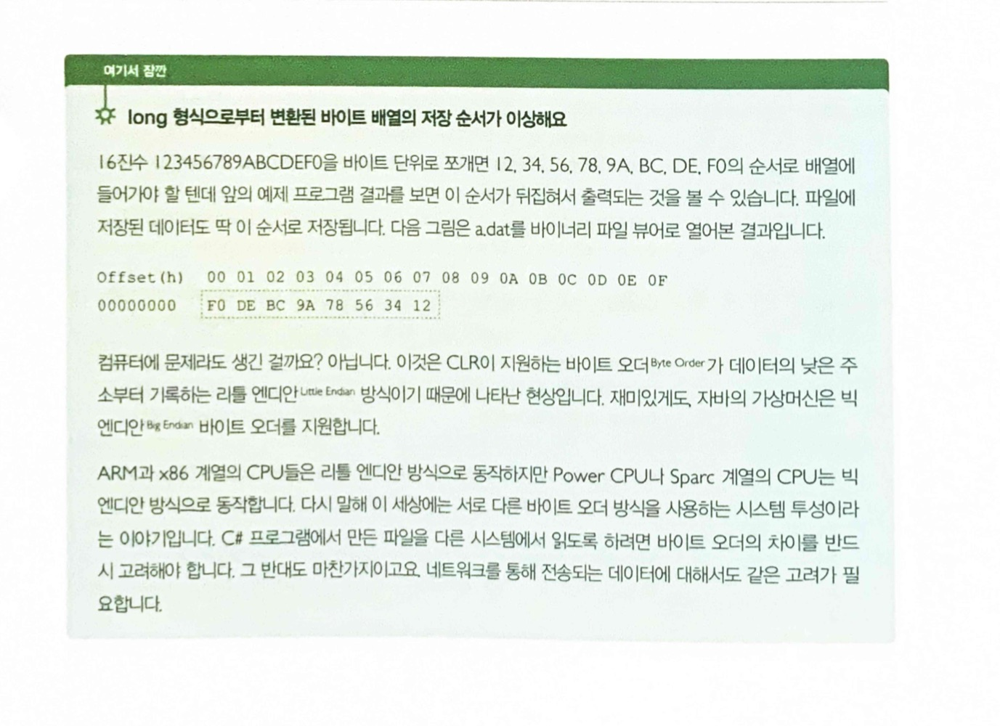