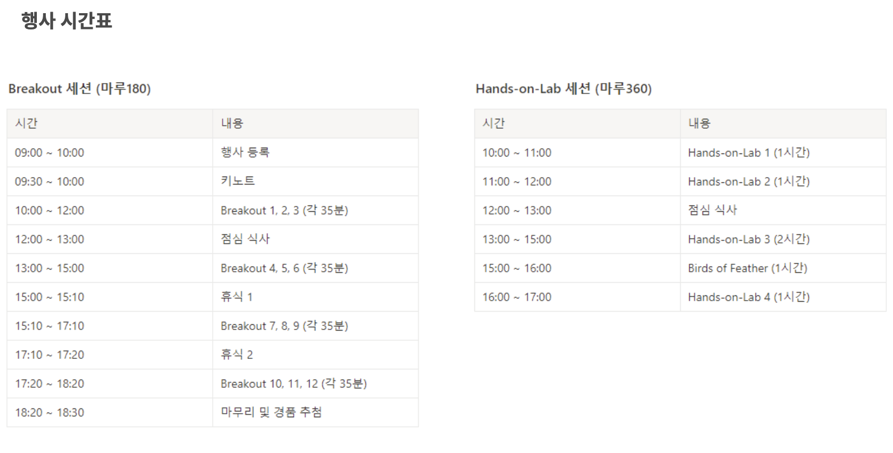
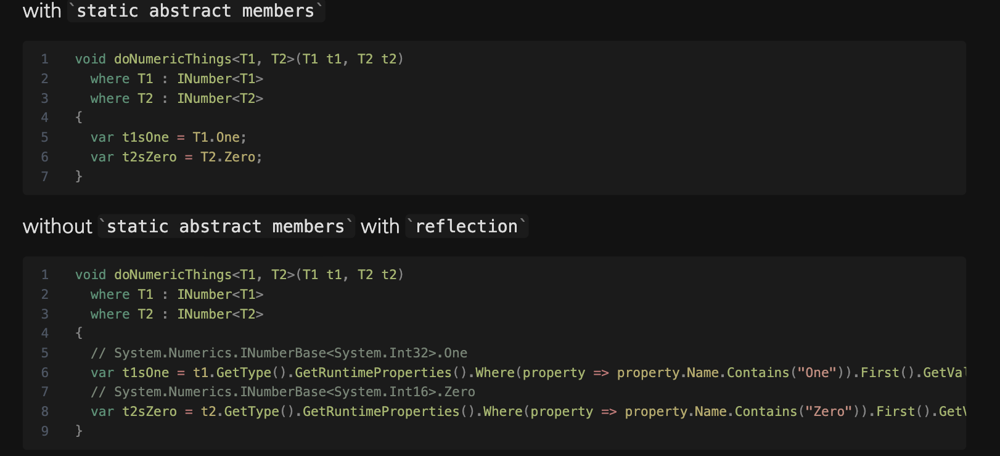

## 2023-01-19-.Net-conf-2023-x-seoul

##  일정



## 키노트

- 기대치들

  - 디지털 트랜스 포메이션의 닷넷 개발자

  - 아이디어 현실화

  - 기능구현

  - 비즈니스 이해 

  - 재사용성 -> 유지보수

  - 구조적 및 패턴등에 대한 것 등등

  - 버그없는 코드 

---

- 평생공부와 업데이트 필요 
  - 즐기지 않으면 힘들수도 있는것등에 대한 고민이 있었음
- 디지털 트랜스 포메이션?
  - 물리적인 것아닌 디지털에 대한 것을 가진 기업만 살아남고
  - 그것에대한 자산 역량등을 디지털로 접목화
- 정형화된 업무에 대해서를 프로그램화를 했던것은 편했음
- 이 이후로 모든 것을 디지털화 시작하기 시작함
- 가면갈수록 더 많은 프로그램이 필요함
  - 만들어진 프로그램보다 만들어진 프로그램이 많아지고 있음
- 완벽한 코드란 무엇인가?
  - 각각의 생각이 다르지만, **현실에서 사용되는 코드가 완벽한 코드**
    - 사용되지 않고, 필요없는 것이 아닌 사용되는 것을 의미함

### 현재상황

- 비용절감
  - 기업마다의 관점은 다양하고 다르지만
  - 시간적인것도 중요함
- 빠른 비즈니스 변화
  - 앱이 얼마나쓰일수 있는지에 대한것을 생각하는 자체가 무의미해지는 것이 많음
  - 특수한 경우도 4년주기 밖에 안되는데 그런것들이 변동가능성이 가면갈 수록 커짐
- 기대수준 
  - 기대수준에 대한 것이 높음
  - 카카오 사례, 중단이 안된다면 되고, 앱으로 쉽게 만들어진다고 생각함
  - 이런 기대수준을 맞춰야하는데 어렵다
- 인공지능, 매타버스
  - 예전보다 다양한 기술의 출현과 비즈니스에 대한 것이 많아짐

### ChatGPT

- Open api, ...
- 나의 경쟁력, 특정 언어를 잘하는것이 잘하는것일까?
- 소트알고리즘을 아는것이 잘하는 것일까?
  - 두개다 아니라고 생각함
- 그렇다고 하더라도 생산성과 요구사항이 더 많아질것이라 생각

## 개발자의 새로운 역할

### Age of Resilience(회복력의 시대)의 시대

- 더 많이 생산, 더 빨리 하는것이 중요한것이 아니고 기존의 것을 가지고 적응하고 살아라고 함
  - 대응능력이 더 중요하다고 생각한다.

---

- 효율성 VS 적응성
  - 구조나 이런것이 하는것이 중요한 것이 아닌 사용이나 있으면 쓰고 적응하는것이 중요하다고 생각한다.
- 개발언어의 선택
  - 중요하긴 하다. 하지만 모든 특정 lang등 이것저것하는 능력이 필수가 될 수 있음
- 프레임워크의 중요성
- 클라우드 기반 개발
  - 당연한 이야기
- Low-Code / No-Code가 주는 의미
  - 개발자가 필요없어진다는 것은 잘못된 것!!
  - 더 많은 앱이 필요하기 때문에 전문가가 간단한것에 대한것은 전부 구현하거나 할 필요없이 현장에 있는 사람이 만들어서 사용하라는 것

# .NET

- 모든 것을 위한 개발 플랫폼
  - 적응의 시대에 맞쳐서 진화하고 있다고 생각함
- visual studio대신 왜 code를 쓰는가?
  - ...

### .NET 생태계의 진화

- 점점 숫자들이 많아지고, 관심이 많아짐

### .NET의 방향

- 지속적인 기여와 발전
  - 매년 지속적으로 업데이트 될 것이고,
  - 새롭게 대응되는 부분은 빠르게 업데이트 될것임
- 시대의흐름을 반영하는쪽으로 발전할 것이라고 생각함

- 11월에 나올 8도 기대해도 좋음

### 개발자 역할

- 궁극적인 디지털 트랜스.. 실현자
- 더 전문적인 개발업무에 집중
- 문제의 발견과 해결
  - 문제를 해결보다 이슈를 제기하는 사람의 개발자가 더 조직에 도움이 된다고 생각함

# "고성능" 튜닝으로 Blazor 애플리케이션 개발을 시작해 봅시다! -Motoki Nakae

## Blazor

- Motoki Nakae
- infragistics
  - 프레임워크로는 훌륭하고, 대게 일본에서 점유율 46퍼이상
- 수요자체가 2022년부터 증가하고 있음
  - 성능이 가장 중요함
- 오늘의 주제
  - 프레임 워크 언급
  - 성능에 대한 걱정
  - 성능 튜니에 대한것
  - 복합적인 함수적 UI 컴포넌트 중요
- Blazor 선택한 이유
  - C#개발자
  - single page application 
  - 문서자체가 매일 증가
  - 라이브러리 자체가 vendors 되고 있고 현재 프로젝트 자체가 많이 사용중임

## Web application performance

- 3가지 포인트에대해서 말하겠음

  - 1.LOAD time Performance
    - 빠른것, 유저와의 interaction 할 수있는 것등
    - 랜더자체의 시간자체가 빠름

  - blazor server
  - blazor webAssembly
    - 로딩 속도 자체가 web assembly -80% 최대 최소 -7%
    - 줄어든 효과가 있었다
    - 함수 -44%
    - wasm-tools
      - -7% 정도
    - 글로벌 타임존 에 대한것은 -37%정도 줄어듦

  - 2.Run time Performance

    - 유저와 상호작용하는 것에대한것
    - 성능 병목현상에 대한것이 없다고 생각이들정도로 좋음

    -  chrome dev tools
      - memory 릿에 대한것이 적음

    - 가이드 라인
      - 총노드가 1500 정도 최대 깊이 32노드정도
        - No parent node ..

  - 3.Soft Performance

    - Navigate to. The feature .. want to use
    - 에러자체도 제대로 알려주는등의 좋은 점이 많음

## Tips of web application performance

- 접근해야하는것인 페이지 리크에 대한것

## component virtualization

- UI 랜더링에대한것
- list, card, table에 대한것 같은 거대하고 많은 반복되는 내용에 대해서
  - 두칸이 있을때 한칸을 올리면 그것에 대한 위에있는 것이 다시 아래를 채우는 형식으로 사용하고 있음

```cs
<virtualize Items="@items" Conotext="item">
 <tr>
  <td>
  </td>
  </tr>
  


```

- 10k items의 경우 aw snap 페이지를 보게됨
  - 반복문 사용이 아닌 components 이용해서 변경하는 방식
  - 많은 데이터에 대해서도 충돌없이 제대로 표현이 가능함

## you need more complex functional UI?

### to keep both functionality and performance is. difficult

- Sort, 그룹, 체인지레이어 들에 대해서 

## japan에서 하는것

- 적응을 위한 지원
- 트레이닝 비디오 제공
- 해결적인것 UI 요구사항에 대한 제어
- consultatio sevice 제공

## Takeaway

-  주저하지 말고시작해라
- 성은에 대한것 3가지 처리등
- 복합적인 Ui, 전문적인 것같은 Infragistics 에 대한것이면 좋다고 생각

---

```markdown
for문을 사용하는것이 대표적으로 사용될것 인데 
그것이 아닌 component를 대입시키는 식으로 구현이되어 있는 것 같음
그것을 해야 사실사 10k등의 데이터를 한페이지에 대해서 랜더링을 할때 
오류가 생기지 않는데 
그것을 해결할 방안에 대해서 찾아봐야함
```

# ASP.NET Core 애플리케이션 모니터링 - 박정훈 님

- App insights 주요 기능 (1주제)
- Custom 데이터 저장 및 조회
- open-telemetry (2주제)

- 매트릭으로 모니터링 하는것은 많음
  - 쿠버네티스의 경우 그라파나 등 많이있음
  - 개발자입장에서 어느 곳에서 지연이 되는지
- 레디스 캐시, 데이터 베이스 호출을 하는데 평균 응답시간이 늦는 경우 어디서 늦는지 확인하는 툴이라고 생각하면됨

## App insights

- Azure 서버로 던지는 api 같은 툴

- 이아스, 쿠버네티드등 환경에 상관없이 볼 수 있음

- siege -t10M -c 3 http://2-.24...dldl

  - 간단한 부하를 주는 툴

  - `siege`

- 제공하는것 

  - 라이브 매트릭스

    - 실시간 데이터 제공

    http 오류는 400 에서 500정도 보는데 400은 클라이언트 부분이라 크게는 없지만 그것에 대한것 request failure임

- ApplicationInsights.AspNetCore 를 사용함

  - 기본적인것은 제공이 되지만
  - 필요한것은 코딩이 필요함

- 데이터베이스에 연결하듯이

  - 키를 이용해서 연결해서 데이터를 쏘는 식으로 되어 있음

- Performance

  - 핵심이라고 생각함
  - 이쪽으로 오면 보고 싶은 데이터를 볼 수 있음
  - 지연되는 부분을 확인이 가능하고
    - 호출이 오래된 것이 있으면 그것을 클릭해서보면 저장하는 프로시저에 대해서 무엇을 사용했는지 알수 있음
  - 트러블 슈팅에 대한것은 주지 않지만, 어디쪽에서 지연이 발생되는지에 대한 구간을 말해준다.

- 앱상 에저만 연결하면 자동으로 매트릭 보여줌

  - 코딩 없이 제공해주는 목록이 있음
    - http/https	
    - wcf
    - sql
    - Rd cache
      - 이것이 보고 싶다면? 개발 및 코딩을 통해서 확인할 수 있음
      - Interface는 시작과 끝으로 구성 
        - 이것을 상속해서 TelemtryClient를 사용하고
          - stopwatch를이용해서 시간등
          - End부분에 넣고싶은 데이터를 구현하는 클래스를넣으면됨
      - 분산환경, 클라우드같은것은 어디서 지연이 생긴지 알면 좋다고 생각함
    - 코딩하면 뭐든 가능함
      - 키, 벨류 임의로 지정하고 그것에 대한 키값을 넣는 경우 사용

## Open Telemetry

- 현재 닷넷도 지원함
- 앱에서 데이터 내보내겠다면 설정하는 부분과
  - 뒷단에서 데이터 모으고 보여주는 것이 있음
- 다양한 것을 지원함

### signoz

- 쿠버네티즈하면서 리눅스부분을 지원했는데
- 거부감이 많았지만 안해본것 해봐서 재밌었다고 함
  - collect라는 엔드포인트 제공
    - 앱을 배포하면 여기로 데이터를 쏘고, Signoz에서 데이터를 모아서 데이터를 보여주는 솔루션이라고 생각하면 됨
- 라이브러리
  - OpenTelemerty. 관련 것을 추가 하면됨
- 코딩
  - traceEndpoint
    - 앱이 데이터 쏴야하는데 아이피랑 포트번호를 지정하는 것
  - 추가적으로 원하는 데이터 부분에 대해서 추가 하면됨
  - 기본적인것은 제공함

- 분산환경에서 사용해봤으면 좋겠다는 것으로 마무리

# Serilog를 통해 애플리케이션 데이터를 수집하고 분석하기 - 이수호 님

- serilog
  - 로그를 구조적으로 수집할 수 있는
  - 스트럭쳐 로그
    - 메세지에 대한 것을 구조적으로 어디서 나오고 하는등에 대해서 하는것을 말함
    - 이를 하게 도와주는 라이브러리임
  - datdog
    - 이걸로하면 되는데 왜? 하냐
    - 유료인 단점과 비쌈
    - 구조화되지 않는 로그를 넣는 경우 성능이 떨어지긴함
- 효용성에 대한 것
  - 왜쓰냐? 왜 필요로 하는지?
  - 결국 해결하기 위해서 유료등과 비싼것을 쓰게 되는데 

```
add serilog
add serilog.sinks.console
```

- 간단한 사용법

  - 구조화

    ```cs
    log.Information($"Retrieved {Count} records");
    ```

    - 위와 같이 구조화를 한다고함

  - 구조체를 넣는 경우도 알아서 분해해서 해줌

    ```cs
    var sesorInput = new {Lat= 12, Long= 134};
    Log.Information("Processing @{SensorInput}");
    ```

    - 이렇게 쓸 수 있는 것이 장점이라고함

```cs
"Serilog":{
  "MinimumLevel":{
    "Default":"Imformation"
  },
  "WriteTo":[
    {
    "Name": "Console",
  }
  ]
}
```

- app settings.json을 이용해서 사용 할 수 있음 설명

### Serilog Sink

- 미들웨어 
  - 실제적으로 보여주고 찍어주기 위해서 필요함
  - 이메일등 여러가지에 대해서 보낼 수 있음
  - 없다면 만들어서 해도됨
    - 미들웨어 추가시 데이터가 다 전송된다라고 생각하면 됨

### S3에 데이터 크롤링 해서 아테날에서 쿼리해볼 수 있는것 실습

- 다른것을 사용해도 됨
- Sink는 다양한 sink 제공

"Write to"부분에 다시 작성

```cs
"Name":"AmazonS3"
  "Args"//이부분에서 필요한 내용을 더 작성하면 됨
```

### Glue

- 빨간 기둥 더미
- 하둡같은 곳에 무언가를 넣을 수 있게해주는 것
  - 하이브 같은 역할을 하는등 복합적으로 하는일 많음
- Create database에서 만들면 알아서 다해줌

### crawlers

- 어디서 데이터 가져올지, 뭔지에 대해서 작성해줘야함
  - 새로운 데이터만 가져오게 할지
  - 전부다 데이터를 가져오게 할지 선택할 수 있고
  - 새로운 데이터만 가져오게 하는 경우 좀 성능이 빠름

- crontab과 같은 설정을 할 수 있음

### Athena

- 쿼리할 때쓰는 툴
- 쿼리 에디터에 들어가면 쓸수 있음
- 주피터모니터 붙여서도 사용할 수 있음 (비주얼 라이즈하려면)
  - 속도가 빠르지 않음
  - 캐싱을 하기 때문에 점점 빨라지긴함

## visualize 툴

- 어렵지는 않음

```markdown
cs를 사용하시는 분이면 사용했으면 좋겠음
suho@planetariumhq.com
iam@suho.io
```

# 윈도우 기반 서버를 클라우드 친화적으로 바꾸는 법 (feat. 윈도우 컨테이너) - 남정현 님

- 리눅스 컨테이너 아님

## 컨테이너 왜?

- 윈도우 개발자 관점에서
- 휴먼에러로 발생
  - 차이점만으로 배포해서 휴먼에러를 많이 줄일 수 있음
- 컨테이너 사용시 절반은 자동화 할 수 있음
- 서버에 SW가 다르는 경우 말도 안되지만 컨테이너를 사용하면 좀 달라짐
  - 같은 스펙을 가지고 사용 할 수 있음

## 기존방식의 문제

- 어플리케이션 모놀리식으로 연결되어 있고 해서 확장성에 문제가 있음
- 이를 컨테이너 사용시 네트워크 분리해서 디커플링도 가능해짐

## 컨테이너 쓰면 좋은점

- 원하든 안하든 형상관리등 이점이 많음

## 윈도우 컨테이너 개발시

- 윈도우 메시지 루프에 의존하지 않음
  - wndProc
- 그래픽 같은 것에 의존하지 않음
- 키보드 마우스등 입력에 대한것
- 입출력등 에 대한것
- 프로그램크기 3-4기가 정도가 적정

## 어떤 애플리케이션을 주로 컨테이너로 만드는 가

- CI/CD
- gui에 구속받지 않는 것이면 사용가능 하다.

## 무료 윈도우 컨테이너 개발 환경 만들기

- 윈도우 컨테이너는 까다로운 것이 많음
- 윈도우 11이후로 서버의 경우 윈도우 서버 2022 (2019도 가능함)
- 컨테이너 레지스트리
  - 이것을 어떻게 구축하는지가 중요
  - ms azure를 예를 들지만 윈도우에서는 추천할만 함
  - 프라이빗으로 해도됨 

## 도커 데스크톱 쓰면 되지 않나?

- 제약 조건이 생기긴함

## 사용법

- 도커 스테이블 설치
- 윈도우 11
  - 관리자 권한
  - 컨테이너 기능 활성화
  - 다시 재시작 필요
  - docker 엔진 확인 후 파일을 압축하고 풀기

- 환경 변수 수정를 해야함
  - 시스템 수준 환경 변수 설정( 환경변수 지정하기)
- Dockerd -> 서버역할
- 도커 자동실행으로 변경
- 도커서비스 실행하면 정상 동작함
- docker-users에 현재 사용자를 추가
- 컨테이너 에코시스템
  - stdout/in 이것이 안됨

## 컨테이너 레지스트리

- Azure로사용함
- 무료또는 한달에 6000-7000에 사용가능

## 더 나은 시스템

- github에서도 쓸 수 있음

# .NET Framework 기반 SaaS 솔루션 .NET 6 전환기

## 도너스 소개

- 크레비스

- 브릭투웍스

## .NET6

MVC + Razor 전환

- 400개되는 것에 대해서 변환 성공

## 일일이 수작업 진행

- 그랬더니 수많은 에러 발생

# 나만의 To-do 앱 빌드하기 (feat. Blazor & CosmosDB)

## Cosmos DB

- 마이그레이션도 가능
- BlazorTodoApp
  - dianakang/BlazorTodoApp

## CRUD

- 테스트 부분

#  MAUI Community Toolkit을 활용한 효과적인 MAUI 앱 개발 - 조중현님

- 타이젠과 닷넷
  - Tizen 7.0

## .net 마우이

- 멀티 플랫폼
- visual studio사용
- 핫리로드를 통해서 빌드의 편의성 제공
  - 수정시 저장만 해도 바로 확인 가능
- podcasts
  - 이런 라이브러리도 있음
- 닷넷 데브에서 확인 할 수 있음

## Toolkits소개

- Maui, Mvvm, Markup

### Mvvm 

- Mvvm아키텍처를 적용하기 위해서 사용
  - RelayCommand
  - ObservableProperty
  - NotifyPropertyChangeFor
  - NotifiyCanExecuteChangedFor
- 기계적인 검증필요없이 좀더 사용이 편하게 사용가능함
  - mvvm을 하지 않았다면 좀 혼란이 있을 수 있음

### Maui.Markup

- Fluent C# UI Extension Methods

  - Easier 
    - Layouts
    - Converters
    - Binding

  - xaml대신 좀더 편하게 작성할 수 있는 장점이 있음

### github insights

- cs만으로 UI를 구성한 프로젝트 참고자료

### MAUI

- communityToolkit.MAUI
  - Monthly standup 참고할 수 있음

- 각종 애니매이션등 레이아웃을 구성할 수 있는 패키지

- Behavior

  - 스낵바, toast, 각 테스트 크기등을 할 수 있고
    - 모든 플랫폼에 다 적용하면 어려움이 있을수 있지만 쉽게 만들수 있음

  - 각각의 애니메이션 효과를 제공 (페이드, scale, 등등)

  - 이벤트 커멘드로 처리하고 싶은 경우 사용할 수 있는것
    - 아이콘 컬러 적용

  - 입력시 사용자가 형식 신경안써도 가능하게 적용하는 것
    - ex 01012341234 -> 010-1234-1234

  - 패스워드 조건에 대하여 멀티로 벨리데이션도 제공
  - 각종 사용할 수 있는 converter 제공

### Contribute

- 제안을 하게되는 경우 그것에 대한 기능을 검증한 후 릴리즈 되는 식으로 되어있음
  - samsung/Tizen.NET
    - 필요한 내용이 있다면 질문 

# .NET 6와 Azure 액티브 디렉터리로 웹 애플리케이션 사용자 관리하기 - mats Lundell-Nygjelten

## 소개

- Mats Lundell-Nygjelten
- ...

## SSO

- Single sign on
  - 하나의 계정을 이용
  - 다른 마이크로 서비스등을 사용 할 수 있음
- OAuth 2.0 
  - Open ID Connect
    - Access Token
    - ID Token

## AAD

- Azure
  - Active Directory
    - (AAD)
  - Multitenancy
    - 같은 템플릿을 가지고 여러개 다른 비슷한것을 만드는 것을 의미 하는듯
- single tenant web app
- Identity and Access Management Tool
  - Own 계정
  - 로그인 가능
    - 자신 데이터 관리
    - 어세스가능한 룰 정도
  - 디비 관련해서도 제한된 기능 제공등

## 관련 예시

- 대표적으로 Uber(22.10월) 1위
  - 4위가 Door Dash Data Bre..
- Detection 관련한 내용에 대한 웹 제공
  - Our dead fish counter
  - 얼마나 많은 물고기가 죽는지에 대해서 그래프릍 통해서 간단히 표현함

## users

- 어떤 타입의 유저들이 있는지?
  - B2B, B2C...가 있음
  - 매니징 가능한 것도 제공받길 원함
  - 비즈니스관련 어떤 사업을 어떻게 하는지 아키텍처를 통해 표현
  - AAD
    - 시스템에 빠르게 그것들을 추가하는 방법이 필요함

## First - authentication

## Second - authentication

- Tenant (Company)
- Roles

## Authorization

- Which Azure functionality

  - claims

  - User Flows

  - custom pollcies

- Claims-based identity

  - Roles, tid
    - 두개 부분에 대해서 참고

- assign and manage roles

  -  앱에 관련된 규칙등

    - Application roles
      - Global admin
      - administrator
      - site manager
      - standard user
        - 이렇게 규칙이 구성되어 있음
    - security groups

    - RoleManager

- jwt를 이용하여 기존에 잇는 이메일 들 tid등 관련 데이터 사용하여 전송하는식으로 구성함

## using the information from the claim

- global admin에 대한 것설정과
- 각 정책에 대한 설명
  - 백엔드 쪽에서 동작 설명진행

## Look more into how to set this up

- multitenant-identity 부분 참고
  - creating an ecosystem of app
    - 3개의 다른 tenant를 가지고 있지만 같은 구성을 가지고 있긴함
  - mats@fishwell.no
  - www.linkedin.com/in/matslundellnygjelten/

# C# 11 static abstract members 이해와 대비 - 김주호 님

## 조사 시작 이유

- 정적 추상 멤버를 하는 기능이 .NET7이 나오게됨
- F#에서 지원하는 내용등 있었음

## F#7

- 기능을 사용하지 말라, 사용시 경고를 띄운다등이 있었음

## 느낀점

- 6에서 버전업한것 없는데 왜 ?
- static abstract members가 무엇인가?

## static abstract members?

- Generic Math Support를 위해 추가됨

```cs
interface IAnimal
{
  static abstract string Favorite { get; }
  static virtual int SizeAtAge(int age) => age;
}

class Dog : IAnimal
{
  public static string Favorite { get => "Bones"; }
  public static int SizeAtAge(int age) => age * 2;
}
class Cat : IAnimal
{
  public static string Favorite { get => "Fish"; }
}
class Tiger : Cat, IAnimal
{
  new public static string Favorite { get => "Human"; }
  public static int SizeAtAge(int age) => age * 4;
}
```

```cs
void describeAnimal<T>(T animal) where T : IAnimal
{
  Console.WriteLine($"{animal.GetType().Name}'s favorite is {T.Favorite}");
  Console.WriteLine($"{animal.GetType().Name}'s size at age 5: {T.SizeAtAge(5)}");
}

describeAnimal(new Dog());
// Dog's favorite is Bones
// Dog': size at age 5: 10

describeAnimal(new Cat());
// Cat's favorite is Fish
// Cat's size at age 5: 5

describeAnimal(new Tiger());
// Tiger's favorite is Human
// Tiger's size at age 5: 20
```

- 정적 프로퍼티 매소드를 호출 할 수 있게됨

## Generic Math?

- 넘어온 것이 제네릭으로 왔는데 수학적 연산을 구현하도록 제약한것

## 왜? static abstract members 필요하나?

- 연산자 오버로딩은 public static 한정자 가져야 했어서
- 즉, Generic Math 기능이 원하는 것
  - 연산자를 통한 수학적 표현
  - 피연산자는 현재 스코프의 인터페이스등 타입도 다양할 수 있는데 이를 위한 인터페이스 연산자를 선언하고 싶었구나라고 생각함

## 그것이 없다면?

- reflection을 이용해서 하게됬다

  

## 가져올 변화

- 코드량 줄이고 
- 사용자는 해당 인터페이스르 지원하는 타입들을 더 많이 사용할 수 있음

## Java : Static Method in interface

- java 8 부터 사용됨

## Scala: method, implicit, trait

- 인스턴스 메소드가 연산자로서 동작

## F#

- 컴파일시간에 실제 타입이 정해지는 타입 파라미터, 제네릭은 런타임 시점에 결정
- 타입을 암시적으로 변화하는 것을 하기 때문에 c#이랑 좀 다르다

## double | net6.0 vs net7.0

- 7.0이되면서 더 많아지게됨

## 최대 추상화 충동을 유발

- 더 많은 추상화로 재사용 증가를 하지만
- 실제로 재사용되는 양이 적고, 시간낭비 일 수 있음
- 다른 학습과 복잡성을 높일 수 있음

## 마이크로 인터페이스의 확산과 후속 요구

- 추상화에 대해서 구현을 하기 위해 리소스 소모하게됨
- 세분화 됨으로써 더 공부하고 이해하는 시간이 더 증가 할 수 있음

## 끊나지 않는 적합한 일반화 지점 찾기

- 추상화 정도에서 적합한 지점 찾기가 어려워짐
- 이런것으로 다른 목표가 무시될 수 있음

## 타입 제약이 아닌 타입으로 사용하면 안됨

- 제네릭한 것을 빼면되는 것이 아니고 모든 정적인것을 타입으로 뺴야 작동한다고함

## 고차함수가 더 간단하고 일반적일 수 있음

- 구현체들이 많지 않다면 그냥 고차함수를 써라라는 내용임
- 정적 멤버 인터페이스를 구현한 곳에서의 일반화이고 밖에서는 사용할 수 없음
- 그럴바에 익명이나 타입으로 넘겨서 고차함수로 하는것이 더 낫다

## 닫힌 연산에만 사용

- 정적 메소드가 가지는 한계
- 계산에 영향을 주는 정보는 파라미터 안에만 존재
  - 암시적 컨텍스트
  - 전역상태 쉽게 사용 안됨
- 바꿔가면서 인스턴스화 될수 없음
- 구현내용에 반박의 여지 없는
- 변경이 존재하면 사용하면 좋지 않고 권장하지 않음

## F# RFC지침

- 고유제약 이해
- 충동에 지지말고
- 섞어서 듣지 말고,
- 논쟁과 변경의 여지가 없는 형식에만 사용

## 들었던 생각

- 작성, 쓰기도 쉽지는 않음
- 협업 문제에 대해서 
  - 이것에 대해서 이해시킬수 있는지 여부
- Java 등과 비교했을때 비슷하지 않음
- 리플렉션 자체가 효율적이고 이런것이 아니라고 생각이들어서 
  - 이제는 AOT 컴파일이 강조됨이 보임
- 타입에 대한 논쟁
  - 코드로 도를 닦는 논쟁이 많아지지 않을지...

## 의문

- 제네릭을 사용하지만 정적인 구현에 대한 의문이 있음

[강의 ppt](https://naramdash.github.io/slides-for-static-abstract-members/28)

# 닷넷을 디버깅해 보자!

- 

