## 22.02.21_GrafanaAndPostgres-Connect

## 목차

> 01.Grafana
>
> 02.PostGres
>
> 03.접속확인
>
> > 03.1연결이 안되는 경우
> >
> > > 03.1.1 세가지 방법
>
>  04.대시보드작성하기
>
> > 04.1 나라별 변수로 지정

## 01.Grafana

```yaml
version: '3.1'

services:
  grafana:
    image: grafana/grafana:8.2.6-ubuntu
    container_name: grafana
    restart: always
    ports:
      - 3000:3000
```

## 02.PostGres

```yaml
version: '3.1'

services:
  postgres:
    image: postgres:13.6
    restart: always
    environment:
      POSTGRES_USER: postgres     # define credentials
      POSTGRES_PASSWORD: postgres # define credentials
      POSTGRES_DB: postgres       # define database
    ports:
      - 5432:5432                 # Postgres port
    volumes:
      -  ./DockerVolume/postgres/data:/var/lib/postgresql/data:rw
      - ./sql/InitDb.sql:/docker-entrypoint-initdb.d/InitDb.sql
```

## 03.접속확인

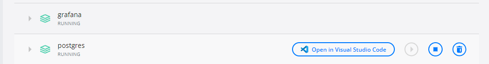

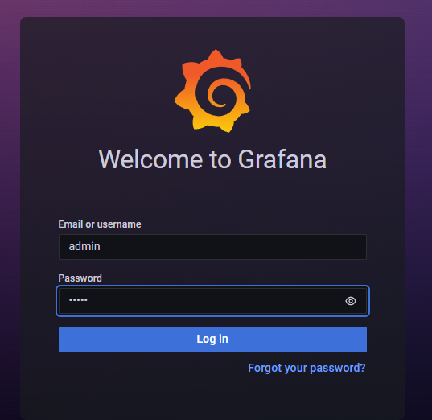

- 아이디/비번
  - admin/admin

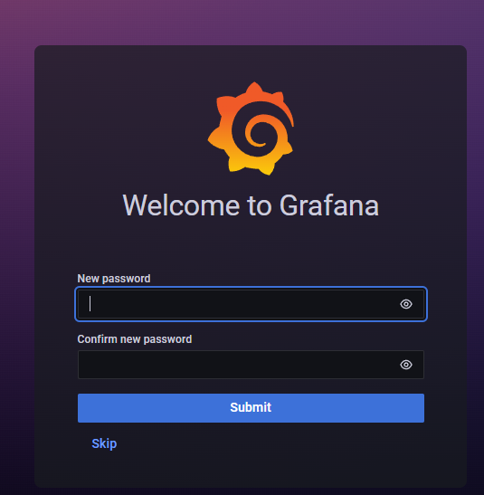

- 한번더 창이 나오는데 비번 재설정 가능
- 그냥 스킵해도됨

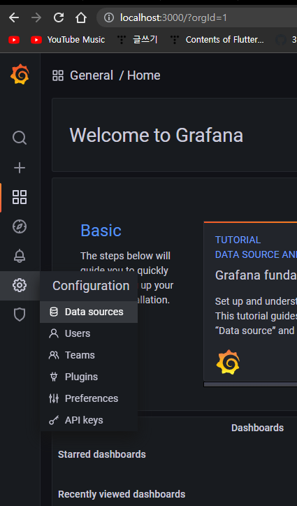

- 톱니바퀴 모양 클릭 후 -> Data sources클릭

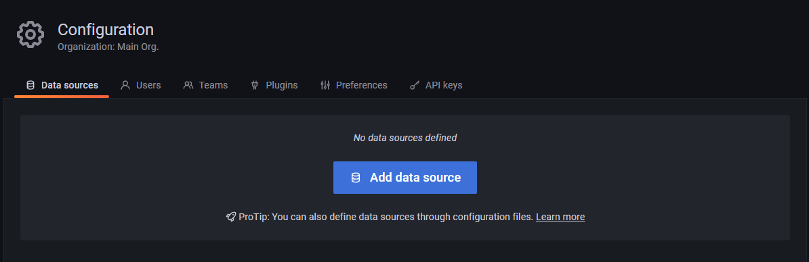

- Add Data Sources 클릭

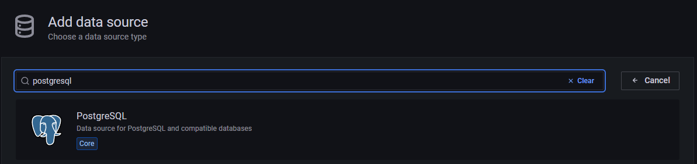

- PostgreSql 입력 후 클릭

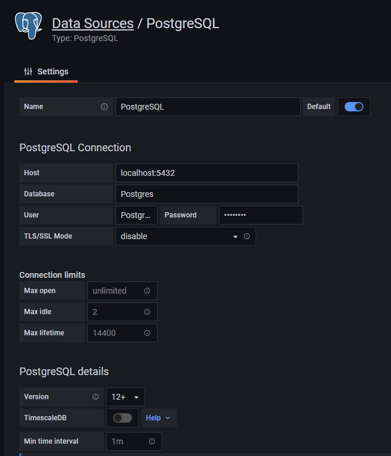

- 원래 이게 안되는 경우가 있음
- 그런경우에는
  - localhost:5432 대신
    - 현재pc의ip:5432하면되는데
- 이것 또한 안되는 경우가 있음

### 03.1연결이 안되는 경우

- 이때 연결이 안되면 컨테이너의 ip를 입력하면됨 예를 들어 아래와 같이

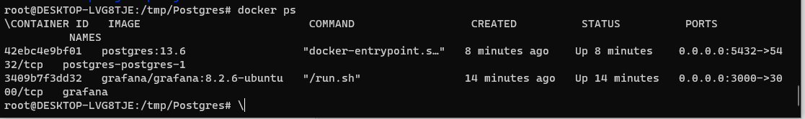

- docker ps하면 저렇게 컨테이너 이름이 나오는데
- `docker inspect 컨테이너이름/컨테이너id`

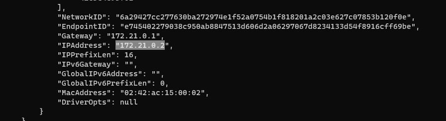

- 아이피가 나오는데
- 172.21.0.2:5432 해주면됨

- **각 그라파나나 포스트그라의 버전에 따라 어떤 오류가 나올지 모르니 세가지 방법중에 진행하면됨**

### 03.1.1 세가지 방법

- localhost:5432
- PC의IP:5432
- 컨테이너의IP:5432

## 04.대시보드작성하기

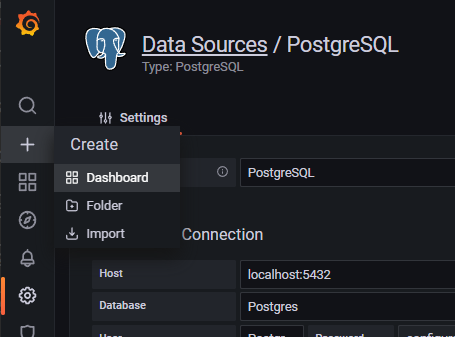

- +아이콘에서 Dashboard클릭

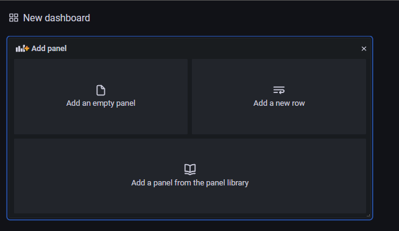

- Add an empty panel 클릭

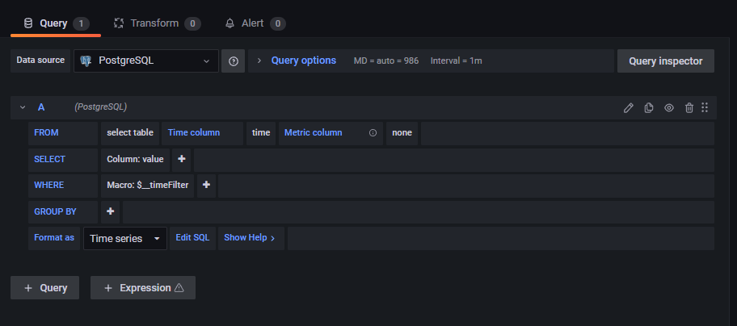

- 하단에 Edit SQL클릭

  - Before

    ```sql
    SELECT
      $__time(time_column),
      value1
    FROM
      metric_table
    WHERE
      $__timeFilter(time_column)
    ```

  - After

    ```sql
    SELECT
      year AS "time",
      production
    FROM
      t_oil
    WHERE
      country='USA'
    ```

    

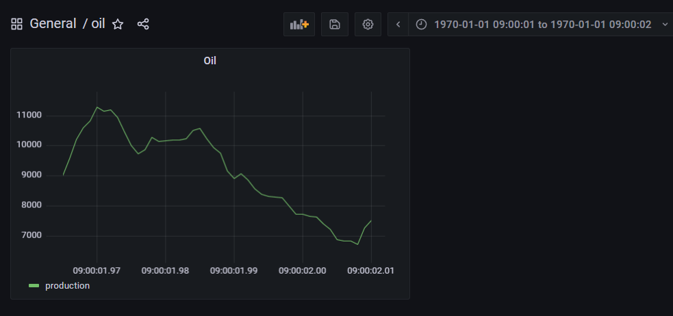

- 이렇게 표현이됨
- 문제는 그냥 localhost로 하는 경우와 172.21.0.2로 하면 데이터가 안나옴
  - 그냥 pc의 서버ip로 해야함

## 04.1 나라별 변수로 지정

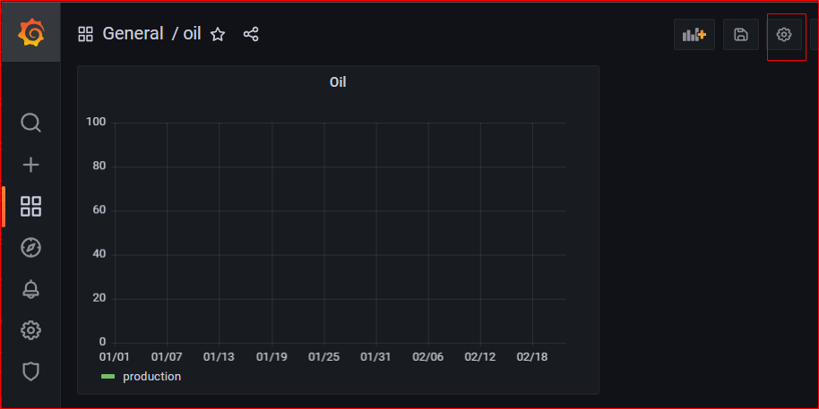

-  톱니바퀴 클릭

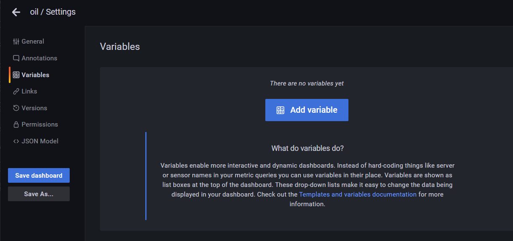

- Variables클릭 후 Add variable

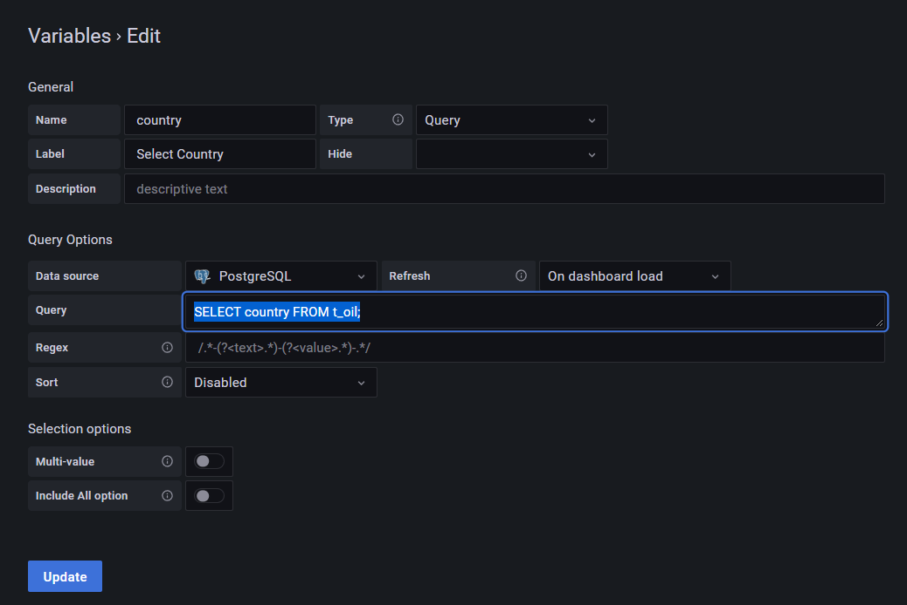

- 위와 같이 입력 후 Update클릭

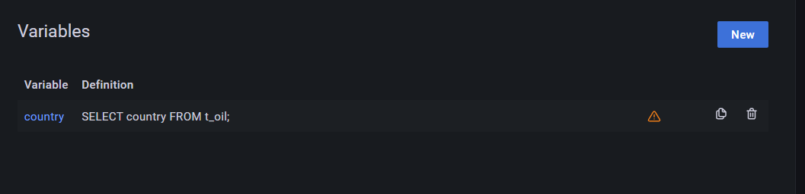

- 위와 같이 변수가 생김

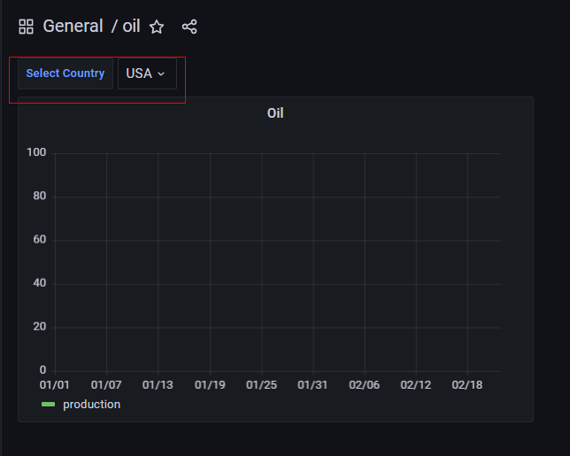

- 이렇게 창이 생김

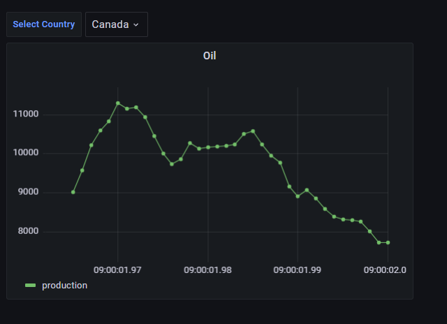

- 현재는 값을 바꿔도 변하지 않음

  - 쿼리문을 아래와 같이 하면됨

    ```sql
    SELECT
      year AS "time",
      production
    FROM
      t_oil
    WHERE
      country='$country'
    ```

    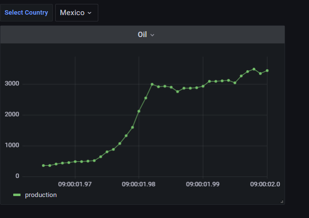

- 이렇게 하면 설정이 완료된것이다.