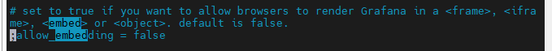
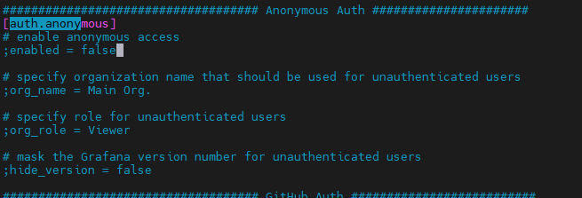

## 22.03.15_일기같은그라파나테이블구성

## 01.운동테이블

```sql
CREATE TABLE exercise(
  year date,
  name varchar,
  minute numeric,
  distance numeric,
  calories numeric,
  count_m numeric,
  weight numeric,
  floor numeric,
  primary key(year,name)
);
```

- date
  - 운동한날짜
- name 
  - 운동이름
- minute
  - 운동한 시간 분단위
- distance
  - 런닝또는 걷는것 거리
- calories
  - 칼로리 나오는 운동에 대해서 칼로리
- count_m
  - 근력운동에 대한 카운트

```sql
      insert into exercise (year, name, minute, distance, calories, count_m,weight,floor)values
      ('2022-03-15','기울기 런닝머신', 30.27, 2.560, 507,0,0,0),
      ('2022-03-15','런닝머신',20.11,2.610,111.60,0,0,0),
      ('2022-03-16','기울기 런닝머신', 35.06, 3.029, 602,0,0,0),
      ('2022-03-16','런닝머신',21.27,2.480,108.0,0,0,0),
      ('2022-03-17','기울기 런닝머신', 35.10, 3.143, 624,0,0,0),
      ('2022-03-17','런닝머신',25.17,3.000,130.00,0,0,0),
      ('2022-03-18','기울기 런닝머신', 34.01, 3.005, 596,0,0,0),
      ('2022-03-18','런닝머신',26.42,3.000,132.10,0,0,0),
      ('2022-03-20','기울기 런닝머신', 34.49,2.971,591,0,0,0),
      ('2022-03-20','런닝머신',25.21,3.000,130.04,0,0,0),
      ('2022-03-21','기울기 런닝머신', 33.23,3.004,607,0,0,0),
      ('2022-03-21','런닝머신',25.17,3.000,130.04,0,0,0),
      ('2022-03-23','기울기 런닝머신', 34.36,3.004,568,0,0,0),
      ('2022-03-23','런닝머신',24.90,3.001,130.07,0,0,0),
      ('2022-03-24','기울기 런닝머신', 36.32,3.014,692,0,0,0),
      ('2022-03-24','런닝머신',23.90,3.000,125.00,0,0,0),
      ('2022-03-25','기울기 런닝머신', 36.24,3.006,599,0,0,0),
      ('2022-03-25','런닝머신',24.11,3.000,129.00,0,0,0),
      ('2022-03-28','기울기 런닝머신',30.41,3.013,592,0,0,0),
      ('2022-03-28','런닝머신',31.46,4.010,171.00,0,0,0),
      ('2022-03-29','기울기 런닝머신',41.23,4.073,780,0,0,0),
      ('2022-03-29','런닝머신',26.17,3.000,131.50,0,0,0),
      ('2022-03-30','기울기 런닝머신',37.09,3.569,651,0,0,0),
      ('2022-03-30','런닝머신',25.05,3.120,133.00,0,0,0),
      ('2022-03-31','기울기 런닝머신',33.34,3.113,592,0,0,0),
      ('2022-03-31','런닝머신',25.28,2.96,129.00,0,0,0),
      ('2022-04-04','기울기 런닝머신',36.11,3.211,598,0,0,0),
      ('2022-04-04','런닝머신',26.44,3.00,131.00,0,0,0),
      ('2022-04-15','기울기 런닝머신',42.51,3.475,681,0,0,0),
      ('2022-04-15','런닝머신',27.29,3.00,132.00,0,0,0),
      ('2022-04-17','기울기 런닝머신',38.48,3.131,685,0,0,0),
      ('2022-04-17','런닝머신',30.56,3.31,147.00,0,0,0), 
      ('2022-04-18','기울기 런닝머신',60.00,4.986,1094,0,0,0),
      ('2022-04-20','기울기 런닝머신',41.58,3.466,668,0,0,0),
      ('2022-04-20','런닝머신',29.17,3.00,134.80,0,0,0), 
      ('2022-04-21','서핑',55,0,0,0,0,0),
      ('2022-09-19','런닝머신',31.21,3.01,143,0,0,0),
      ('2022-09-19','Seated Leg Press',0,0,0,36,105,0),
      ('2022-09-19','Seated Row',0,0,0,36,40,0),
      ('2022-09-19','Pectoral Fly',0,0,0,36,40,0),
      ('2022-09-19','Climb Mill',40,0,400,0,0,120),
      ('2022-09-21','런닝머신',20.06,1.98,93,0,0,0),
      ('2022-09-21','Leg Press',0,0,0,36,120,0),
      ('2022-09-21','Seated Row',0,0,0,36,40,0),
      ('2022-09-21','Back Extension',0,0,0,45,0,0),
      ('2022-09-21','Lat Pulldown',0,0,0,36,30,0),
      ('2022-09-21','Hip Adduction',0,0,0,45,45,0),
      ('2022-09-21','Hip Abduction',0,0,0,45,45,0),
      ('2022-09-21','Climb Mill',40,0,426,0,0,138),
      ('2022-09-23','런닝머신',31.47,2.75,134,0,0,0),
      ('2022-09-23','Seated Row',0,0,0,36,40,0),
      ('2022-09-23','Shoulder Press',0,0,0,45,30,0),
      ('2022-09-23','Climb Mill',30.03,0,315,0,0,102),
      ('2022-09-25','런닝머신',30.15,2.80,156,0,0,0),
      ('2022-09-25','Climb Mill',30.11,0,309,0,0,100),
      ('2022-09-25','Lat Pulldown',0,0,0,36,40,0),
      ('2022-09-25','Shoulder Press',0,0,0,45,35,0),
      ('2022-09-25','Hip Adduction',0,0,0,45,45,0),
      ('2022-09-25','Hip Abduction',0,0,0,45,52.5,0),
      ('2022-09-25','Leg Press',0,0,0,36,120,0),
      ('2022-09-26','런닝머신',32.09,3.21,151,0,0,0),
      ('2022-09-26','Climb Mill',36.42,0,384,0,0,124),
      ('2022-10-04','런닝머신',102.40,10.01,475,0,0,0),
      ('2022-10-06','런닝머신',30.44,3.09,145,0,0,0),
      ('2022-10-06','Climb Mill',30.06,0,312,0,0,101),
      ('2022-10-06','Leg Press',0,0,0,45,120,0),     
      ('2022-10-06','Chest Press',0,0,0,45,35,0),     
      ('2022-10-06','Hip Adduction',0,0,0,45,45,0),
      ('2022-10-06','Hip Abduction',0,0,0,45,45,0),      
      ('2022-10-07','런닝머신',83.02,7.61,394,0,0,0),      
      ('2022-10-11','런닝머신',81.19,7.35,448,0,0,0),      
      ('2022-10-13','런닝머신',87.08,10.00,455,0,0,0),
      ('2022-10-14','런닝머신',60.05,6.40,297,0,0,0),
      ('2022-10-22','런닝머신',70.38,6.95,329,0,0,0),
      ('2022-10-24','런닝머신',60.35,7.46,335,0,0,0);
```

## 02.홈운동테이블

```sql
CREATE TABLE home_exercise(
 year date,
 name text,
 minute numeric,
 count_m numeric,
 primary key(year,name)
);
```

- date
  - 운동한날짜
- name 
  - 운동이름
- minute
  - 근력운동 외 시간이있는 운동
- count_m
  - 근력 운동한 카운트


```sql
INSERT INTO home_exercise (year,name,minute,count_m)values
('2022-04-03','Yoga',38.52,0),
('2022-04-03','Crunch',0,100),
('2022-04-03','Bridge',0,50),
('2022-04-03','Push Up',0,50),
('2022-04-03','Squat',0,50),
('2022-04-05','Yoga',20.00,0),
('2022-04-05','Crunch',0,100),
('2022-04-05','Bridge',0,100),
('2022-04-05','Push Up',0,50),
('2022-04-05','Squat',0,100),
('2022-04-11','Yoga',31.46,0),
('2022-04-11','Crunch',0,100),
('2022-04-11','Bridge',0,100),
('2022-04-11','Push Up',0,50),
('2022-04-11','Squat',0,100),
('2022-04-17','Bridge',0,50),
('2022-04-17','Push Up',0,50),
('2022-04-17','Squat',0,50),
('2022-04-17','Abs Bycycle',0,50),
('2022-04-21','Crunch',0,100),
('2022-04-21','Bridge',0,50),
('2022-04-21','Leg Raise',0,50),
('2022-04-21','Abs Bycycle',0,50),
('2022-04-25','Yoga',25.00,0),
('2022-04-25','Crunch',0,100),
('2022-04-25','Bridge',0,50),
('2022-04-25','Leg Raise',0,50),
('2022-04-25','Abs Bycycle',0,50),
('2022-04-28','Yoga',25.00,0),
('2022-04-28','Crunch',0,100),
('2022-04-28','Bridge',0,100),
('2022-04-28','Abs Bycycle',0,50),
('2022-05-09','Yoga',25.00,0),
('2022-05-09','Crunch',0,100),
('2022-05-10','Yoga',29.00,0),
('2022-05-11','Yoga',35.00,0),
('2022-05-11','Crunch',0,100),
('2022-05-21','Crunch',0,100),
('2022-05-21','Leg Raise',0,100),
('2022-05-21','Push Up',0,50),
('2022-05-21','Sit Up',0,100),
('2022-05-21','Squat',0,100),
('2022-06-10','Yoga',25.00,0),
('2022-06-13','Yoga',25.00,0),
('2022-06-14','Yoga',40.00,0),
('2022-06-16','Yoga',20.00,0),
('2022-06-22','Yoga',20.00,0),
('2022-06-22','Home Training',15.00,0),
('2022-06-23','Yoga',20.00,0),
('2022-06-24','Yoga',20.00,0),
('2022-06-26','Leg Raise',0,100),
('2022-06-26','Crunch',0,100),
('2022-06-26','Bridge UpDown',0,100),
('2022-06-26','Abs Bycycle',0,100),
('2022-06-27','Leg Raise',0,100),
('2022-06-27','Crunch',0,120),
('2022-06-27','Bridge UpDown',0,100),
('2022-06-27','Abs Bycycle',0,100),
('2022-06-27','Squat',0,100),
('2022-07-04','Abs Bycycle',0,100),
('2022-07-04','Crunch',0,100),
('2022-07-04','Side Leg Raise(R)',0,30),
('2022-07-04','Side Leg Raise(L)',0,30),
('2022-07-04','Leg Raise',0,30),
('2022-07-05','Leg Raise',0,150),
('2022-07-05','Bridge UpDown',0,150),
('2022-07-05','Bridge Stay',150,0),
('2022-07-06','Leg Raise',0,300),
('2022-07-06','Bridge Stay',300,0),
('2022-07-07','Leg Raise',0,300),
('2022-07-07','Bridge Stay',300,0),
('2022-07-07','Bridge UpDown',0,300),
('2022-07-10','Shoulder Press',0,90),
('2022-07-10','Leg Raise',0,100),
('2022-07-10','Bridge Stay',100,0),
('2022-07-10','Bridge UpDown',0,100),
('2022-07-11','Leg Raise',0,100),
('2022-07-11','Bridge Stay',100,0),
('2022-07-11','Bridge UpDown',0,100),
('2022-07-11','Crunch',0,100),
('2022-07-12','Squat',0,100)
,('2022-07-15','Squat',0,100)
,('2022-07-17','Crunch',40,0)
,('2022-07-17','Toe Touch',40,0)
,('2022-07-17','Leg Extention',40,0)
,('2022-07-17','Single Leg Raise',40,0)
,('2022-07-17','Flutter Kicks',30,0)
,('2022-07-17','Scissor Kicks',30,0)
,('2022-07-17','Windmill',40,0)
,('2022-07-17','Abs Bycycle',40,0)
,('2022-07-17','Russian Twist',40,0)
,('2022-07-17','Elbow plank',30,0)
,('2022-07-17','Plank twist',30,0)
,('2022-07-18','Crunch',80,0)
,('2022-07-18','Toe Touch',80,0)
,('2022-07-18','Leg Extention',80,0)
,('2022-07-18','Single Leg Raise',80,0)
,('2022-07-18','Flutter Kicks',60,0)
,('2022-07-18','Scissor Kicks',60,0)
,('2022-07-18','Windmill',80,0)
,('2022-07-18','Abs Bycycle',80,0)
,('2022-07-18','Russian Twist',80,0)
,('2022-07-18','Elbow plank',60,0)
,('2022-07-18','Plank twist',60,0)
,('2022-07-19','Crunch',80,0)
,('2022-07-19','Toe Touch',80,0)
,('2022-07-19','Leg Extention',80,0)
,('2022-07-19','Single Leg Raise',80,0)
,('2022-07-19','Flutter Kicks',60,0)
,('2022-07-19','Scissor Kicks',60,0)
,('2022-07-19','Windmill',80,0)
,('2022-07-19','Abs Bycycle',80,0)
,('2022-07-19','Russian Twist',80,0)
,('2022-07-19','Elbow plank',60,0)
,('2022-07-19','Plank twist',60,0)
,('2022-07-24','Toe Touch',40,0)
,('2022-07-24','Leg Extention',40,0)
,('2022-07-24','Single Leg Raise',40,0)
,('2022-07-24','Flutter Kicks',30,0)
,('2022-07-24','Windmill',40,0)
,('2022-07-24','Abs Bycycle',40,0)
,('2022-07-24','Russian Twist',40,0)
,('2022-07-24','Plank',30,0)
,('2022-07-24','Shoulder tap',30,0)
,('2022-07-24','High plank toe touch',30,0)
,('2022-07-24','knee up & Crunch',30,0)
,('2022-07-24','Bicycle crunch',30,0)
,('2022-07-24','Knee tuck crunch',30,0)
,('2022-07-24','Leg raise',30,0)
,('2022-07-24','Flutter kick',30,0)
,('2022-07-24','Single leg jackknife',30,0)
,('2022-07-24','Scissor kick',60,0)
,('2022-07-24','Knee crunch',30,0)
,('2022-07-24','Reverse crunch',30,0)
,('2022-07-24','Russian twist',30,0)
,('2022-07-24','Side Plank',30,0)
,('2022-07-24','Mountain climber',30,0)
,('2022-07-24','Plank up & down',30,0)
,('2022-07-24','Plank jack',30,0)
,('2022-07-24','Elbow plank',60,0)
,('2022-07-24','Plank twist',60,0)
,('2022-07-24','Spider plank',30,0)
,('2022-07-25','Crunch',80,0)
,('2022-07-25','Toe Touch',80,0)
,('2022-07-25','Leg Extention',80,0)
,('2022-07-25','Single Leg Raise',80,0)
,('2022-07-25','Flutter Kicks',60,0)
,('2022-07-25','Scissor Kicks',60,0)
,('2022-07-25','Windmill',80,0)
,('2022-07-25','Abs Bycycle',80,0)
,('2022-07-25','Russian Twist',80,0)
,('2022-07-25','Elbow plank',60,0)
,('2022-07-25','Plank twist',60,0)
,('2022-07-27','Crunch',80,0)
,('2022-07-27','Toe Touch',80,0)
,('2022-07-27','Leg Extention',80,0)
,('2022-07-27','Single Leg Raise',80,0)
,('2022-07-27','Flutter Kicks',60,0)
,('2022-07-27','Scissor Kicks',60,0)
,('2022-07-27','Windmill',80,0)
,('2022-07-27','Abs Bycycle',80,0)
,('2022-07-27','Russian Twist',80,0)
,('2022-07-27','Elbow plank',60,0)
,('2022-07-27','Plank twist',60,0)
,('2022-08-01','Plank twist',0,180)
,('2022-08-02','Plank twist',0,300)
,('2022-08-03','Crunch',40,0)
,('2022-08-03','Toe Touch',40,0)
,('2022-08-03','Leg Extention',40,0)
,('2022-08-03','Single Leg Raise',40,0)
,('2022-08-03','Flutter Kicks',30,0)
,('2022-08-03','Scissor Kicks',30,0)
,('2022-08-03','Windmill',30,0)
,('2022-08-03','Abs Bycycle',40,0)
,('2022-08-03','Russian Twist',40,0)
,('2022-08-03','Elbow plank',30,0)
,('2022-08-03','Plank twist',240,0)
,('2022-08-04','Squrt And Punch',90,0)
,('2022-08-04','Lunge Touch',90,0)
,('2022-08-04','Wide Squrt and Lunge',30,0)
,('2022-08-04','Back Lunge Twist-L',60,0)
,('2022-08-04','Back Lunge Twist-R',60,0)
,('2022-08-04','Standing Side Crunch',60,0)
,('2022-08-04','Twist Mountine mountain climber',60,0)
,('2022-08-04','Plank KneeUp',90,0)
,('2022-08-04','PushUp and Stand',90,0)
,('2022-08-04','Two Squrt and PushUp',90,0)
,('2022-08-04','Cross Lunge',60,0)
,('2022-08-04','Squrt And Twist',60,0)
,('2022-08-04','Mountain climber',60,0)
,('2022-08-08','Squrt And Punch',90,0)
,('2022-08-08','Lunge Touch',90,0)
,('2022-08-08','Wide Squrt and Lunge',30,0)
,('2022-08-08','Back Lunge Twist-L',60,0)
,('2022-08-08','Back Lunge Twist-R',60,0)
,('2022-08-08','Standing Side Crunch',60,0)
,('2022-08-08','Twist Mountine mountain climber',60,0)
,('2022-08-08','Plank KneeUp',90,0)
,('2022-08-08','PushUp and Stand',90,0)
,('2022-08-08','Two Squrt and PushUp',90,0)
,('2022-08-08','Cross Lunge',60,0)
,('2022-08-08','Squrt And Twist',60,0)
,('2022-08-08','Mountain climber',60,0)
,('2022-08-10','Squrt And Punch',90,0)
,('2022-08-10','Lunge Touch',90,0)
,('2022-08-10','Wide Squrt and Lunge',30,0)
,('2022-08-10','Back Lunge Twist-L',60,0)
,('2022-08-10','Back Lunge Twist-R',60,0)
,('2022-08-10','Standing Side Crunch',60,0)
,('2022-08-10','Twist Mountine mountain climber',60,0)
,('2022-08-10','Plank KneeUp',90,0)
,('2022-08-10','PushUp and Stand',90,0)
,('2022-08-10','Two Squrt and PushUp',90,0)
,('2022-08-10','Cross Lunge',60,0)
,('2022-08-10','Squrt And Twist',60,0)
,('2022-08-10','Mountain climber',60,0)
,('2022-08-12','Elbow plank',120,0)
,('2022-08-12','Plank twist',180,0)
,('2022-08-22','Crunch',40,0)
,('2022-08-22','Toe Touch',40,0)
,('2022-08-22','Leg Extention',40,0)
,('2022-08-22','Single Leg Raise',40,0)
,('2022-08-22','Flutter Kicks',30,0)
,('2022-08-22','Scissor Kicks',30,0)
,('2022-08-22','Windmill',30,0)
,('2022-08-22','Abs Bycycle',40,0)
,('2022-08-22','Russian Twist',40,0)
,('2022-08-22','Elbow plank',30,0)
,('2022-08-22','Plank twist',150,0)
('2022-08-23','Crunch',40,0)
,('2022-08-23','Toe Touch',40,0)
,('2022-08-23','Leg Extention',40,0)
,('2022-08-23','Single Leg Raise',40,0)
,('2022-08-23','Flutter Kicks',30,0)
,('2022-08-23','Scissor Kicks',30,0)
,('2022-08-23','Windmill',30,0)
,('2022-08-23','Abs Bycycle',40,0)
,('2022-08-23','Russian Twist',40,0)
,('2022-08-23','Elbow plank',30,0)
,('2022-08-23','Plank twist',30,0)
,('2022-08-25','Squrt And Punch',90,0)
,('2022-08-25','Lunge Touch',90,0)
,('2022-08-25','Wide Squrt and Lunge',30,0)
,('2022-08-25','Back Lunge Twist-L',60,0)
,('2022-08-25','Back Lunge Twist-R',60,0)
,('2022-08-25','Standing Side Crunch',60,0)
,('2022-08-25','Twist Mountine mountain climber',60,0)
,('2022-08-25','Plank KneeUp',90,0)
,('2022-08-25','PushUp and Stand',90,0)
,('2022-08-25','Two Squrt and PushUp',90,0)
,('2022-08-25','Cross Lunge',60,0)
,('2022-08-25','Squrt And Twist',60,0)
,('2022-08-25','Mountain climber',60,0)
,('2022-09-01','Squrt And Punch',90,0)
,('2022-09-01','Lunge Touch',90,0)
,('2022-09-01','Wide Squrt and Lunge',30,0)
,('2022-09-01','Back Lunge Twist-L',60,0)
,('2022-09-01','Back Lunge Twist-R',60,0)
,('2022-09-01','Standing Side Crunch',60,0)
,('2022-09-01','Twist Mountine mountain climber',60,0)
,('2022-09-01','Plank KneeUp',90,0)
,('2022-09-01','PushUp and Stand',90,0)
,('2022-09-01','Two Squrt and PushUp',90,0)
,('2022-09-01','Cross Lunge',60,0)
,('2022-09-01','Squrt And Twist',60,0)    
,('2022-09-01','Mountain climber',60,0)
,('2022-09-03','Yoga',20.00,0)
,('2022-09-16','Yoga',20.00,0)
,('2022-10-17', 'Yoga', 20.00,0)
,('2022-10-18', 'Yoga', 20.00,0);
```

- 11자 복근-1

```
('2022-08-11','Crunch',40,0)
,('2022-08-11','Toe Touch',40,0)
,('2022-08-11','Leg Extention',40,0)
,('2022-08-11','Single Leg Raise',40,0)
,('2022-08-11','Flutter Kicks',30,0)
,('2022-08-11','Scissor Kicks',30,0)
,('2022-08-11','Windmill',30,0)
,('2022-08-11','Abs Bycycle',40,0)
,('2022-08-11','Russian Twist',40,0)
,('2022-08-11','Elbow plank',30,0)
,('2022-08-11','Plank twist',30,0);
```

- 11자 복근-2

```
('2022-09-05','Leg raise',30,0)
,('2022-09-05','Windmill',30,0)
,('2022-09-05','Starfish Crunch',30,0)
,('2022-09-05','Elbow plank',30,0)
,('2022-09-05','Plank WalkDown',30,0)
,('2022-09-05','Plank twist',30,0)
,('2022-09-05','BirdDog',60,0);
```


- 체지방

```
,('2022-08-04','Squrt And Punch',90,0)
,('2022-08-04','Lunge Touch',90,0)
,('2022-08-04','Wide Squrt and Lunge',30,0)
,('2022-08-04','Back Lunge Twist-L',60,0)
,('2022-08-04','Back Lunge Twist-R',60,0)
,('2022-08-04','Standing Side Crunch',60,0)
,('2022-08-04','Twist Mountine mountain climber',60,0)
,('2022-08-04','Plank KneeUp',90,0)
,('2022-08-04','PushUp and Stand',90,0)
,('2022-08-04','Two Squrt and PushUp',90,0)
,('2022-08-04','Cross Lunge',60,0)
,('2022-08-04','Squrt And Twist',60,0)    
,('2022-08-04','Mountain climber',60,0);
```

- 하체 운동

```
('2022-08-11','Squrt And Calf-raise ',30,0)
,('2022-08-11','Sumo Squrt Calf-raise',30,0)
,('2022-08-11','Jump Squrt and Calf-raise',30,0)
,('2022-08-11','Pulse Lunge-L',60,0)
,('2022-08-11','Pulse Lunge-R',60,0)
,('2022-08-11','Pulse Squrt',30,0)
,('2022-08-11','Sumo Squrt',60,0)
,('2022-08-11','Jump Squrt In And Out',60,0)
,('2022-08-11','One Leg Bridge-L',60,0)
,('2022-08-11','One Leg Bridge-R',60,0)
,('2022-08-11','Cross Lunge',60,0)
,('2022-08-11','Sumo Pulse Squrt',30,0)
,('2022-08-11','Squrt And Legleft',30,0)
,('2022-08-11','Back Lunge',30,0)
,('2022-10-17', 'Yoga', 20.00,0);
```


## 그래프 배포를 위한 준비

- 그래프를 그냥 그리려고 하면 그려지지 않음 

- embed 문제

  

```sh
docker exec -it -u 0 grafana sh
```

- bin/bash로 해야하는데 안되서 sh로 함
  - 아마 우분투로 설치해서 그럴수도 있을듯
- vim,이나 vi, nano가 없음
  - apt-get update
  - apt-get install vim
    - 위와 같이 해야 설치가 됨
- vim /etc/grafana/grafana.ini		string first_a;
  - 위의 경로에서 수정해야함



- ;allow_embedding = true로 변경

## 우회 방법

- 누구든지 Grafana 화면을 볼 수 있도록 설정하여 로그인 없이 바로 대시보드 화면 표시

  ```
  [auth.anonymous]
  # enable anonymous access
  ;enabled = false
  ```

- `;enabled = false` 를 `enabled = true`로 변경




```
version: '3.1'

services:
  grafana1:
    image: grafana/grafana:main-ubuntu
    container_name: grafana
    restart: always
    ports:
      - 3000:3000
  grafana_lotto:
    image: grafana/grafana:main-ubuntu
    container_name: grafana_lotto
    restart: always
    ports:
      - 3001:3001
  postgres:
    image: postgres:alpine3.15
    container_name: postgres
    restart: always
    environment:
      POSTGRES_USER: postgres     # define credentials
      POSTGRES_PASSWORD: rud123 # define credentials
      POSTGRES_DB: postgres       # define database
    ports:
      - 5432:5432                 # Postgres port
    volumes:
      - /srv/dev-disk-by-uuid-7e3b293b-4892-4fe1-acaa-48266784dda8/docker/postgres/sql:/docker-entrypoint-initdb.d

```

 ##  Crontab 부분

 ```sh
 
30 22 * * 6 date >> /srv/dev-disk-by-uuid-7e3b293b-4892-4fe1-acaa-48266784dda8/Nas1/goWeb/lotto.log 2>&1
30 22 * * 6 /srv/dev-disk-by-uuid-7e3b293b-4892-4fe1-acaa-48266784dda8/Nas1/goWeb/goLottoCollect/web
00 13 * * * date >> /srv/dev-disk-by-uuid-7e3b293b-4892-4fe1-acaa-48266784dda8/Nas1/goWeb/temp/temp.log 2>&1
01 13 * * * vcgencmd measure_temp  >> /srv/dev-disk-by-uuid-7e3b293b-4892-4fe1-acaa-48266784dda8/Nas1/goWeb/temp/temp.log 2>&1

 ```

 ```
 xxxxxxxxxx  30 22 * * 6 date >> /srv/dev-disk-by-uuid-7e3b293b-4892-4fe1-acaa-48266784dda8/Nas1/goWeb/lotto.log 2>&130 22 * * 6 /srv/dev-disk-by-uuid-7e3b293b-4892-4fe1-acaa-48266784dda8/Nas1/goWeb/goLottoCollect/web >> /srv/dev-disk-by-uuid-7e3b293b-489>00 13 * * * date >> /srv/dev-disk-by-uuid-7e3b293b-4892-4fe1-acaa-48266784dda8/Nas1/goWeb/temp/temp.log 2>&101 13 * * * vcgencmd measure_temp  >> /srv/dev-disk-by-uuid-7e3b293b-4892-4fe1-acaa-48266784dda8/Nas1/goWeb/temp/temp.log 2>&1sh
 ```
