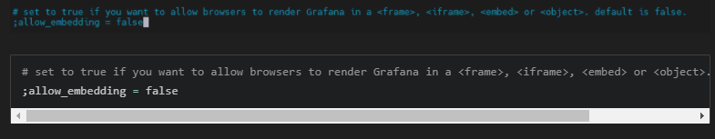

## 22.03.15_일기같은그라파나테이블구성

## 01.운동테이블

```sql
CREATE TABLE exercise(
	year date,
  name varchar,
  minute numeric,
  distance numeric,
  calories numeric
)
```

- date
  - 운동한날짜
- name 
  - 운동이름
- minute
  - 운동한 시간 분단위
- distance
  - 런닝또는 걷는것 거리
- calories
  - 칼로리 나오는 운동에 대해서 칼로리

```sql
      
      insert into exercise (year, name, minute, distance, calories)values
      ('2022-03-15','기울기 런닝머신', 30.27, 2.560, 507),
      ('2022-03-15','런닝머신',20.11,2.610,111.60),
      ('2022-03-16','기울기 런닝머신', 35.06, 3.029, 602),
      ('2022-03-16','런닝머신',21.27,2.480,108.0),
      ('2022-03-17','기울기 런닝머신', 35.10, 3.143, 624),
      ('2022-03-17','런닝머신',25.17,3.000,130.00),
      ('2022-03-18','기울기 런닝머신', 34.01, 3.005, 596),
      ('2022-03-18','런닝머신',26.42,3.000,132.10),
      ('2022-03-20','기울기 런닝머신', 34.49,2.971,591),
      ('2022-03-20','런닝머신',25.21,3.000,130.04),
      ('2022-03-21','기울기 런닝머신', 33.23,3.004,607),
      ('2022-03-21','런닝머신',25.17,3.000,130.04),
      ('2022-03-23','기울기 런닝머신', 34.36,3.004,568),
      ('2022-03-23','런닝머신',24.90,3.001,130.07),
      ('2022-03-24','기울기 런닝머신', 36.32,3.014,692),
      ('2022-03-24','런닝머신',23.90,3.000,125.00),
      ('2022-03-25','기울기 런닝머신', 36.24,3.006,599),
      ('2022-03-25','런닝머신',24.11,3.000,129.00);
```

## 그래프 배포를 위한 준비

- 그래프를 그냥 그리려고 하면 그려지지 않음 

- embed 문제

  

```sh
docker exec -it -u 0 grafana sh
```

- bin/bash로 해야하는데 안되서 sh로 함
  - 아마 우분투로 설치해서 그럴수도 있을듯
- vim,이나 vi, nano가 없음
  - apt-get update
  - apt-get install vim
    - 위와 같이 해야 설치가 됨
- vim /etc/grafana/grafana.ini
  - 위의 경로에서 수정해야함


- ;allow_embedding = true로 변경

## 우회 방법

- 누구든지 Grafana 화면을 볼 수 있도록 설정하여 로그인 없이 바로 대시보드 화면 표시

  ```
  [auth.anonymous]
  # enable anonymous access
  ;enabled = false
  ```

- `;enabled = false` 를 `enabled = true`로 변경


