## 22.03.20_라즈베리파이_나스설정해보기

## 1.이미지만들기

```dockerfile
docker run --name OpenMediaVault -itd -v ./path/to/data:/data:rw -P ikogan/openmediavault:dev
```

- 이미지 생성을 위한 도커파일

```sh
docker build --platform linux/x86_64 --tag km/openmediavault .
```

- --platform linux/x86_64 이를 붙여준 이유는 아래와 같이 에러가 발생했기 때문

  - 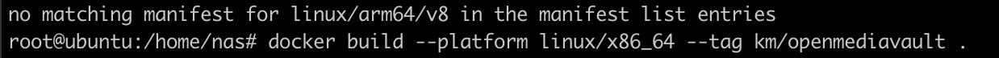
    - 위를 붙여주면 해결된다.

- ```
  docker run --name OpenMediaVault --platform linux/x86_64 -itd -h openmediavault.example.test -v /path/to/data:/data:Z -P ikogan/openmediavault
  ```

```
version: '3.1'

services:
  nas:
    image: ikogan/openmediavault:dev
    restart: always
    ports:
      - 5000:8080                 
    volumes:
      - ./path/to/data:/data:Z
      - ./sql/InitDb.sql:/docker-entrypoint-initdb.d/InitDb.sql
```

- 위와 같이 해보려고 했는데 인식안되는 점도 있었고, 무엇보다 우분투 환경에서 안된다고 했다
  - 데비안 환경만 지원하다고 하여 라즈베리os를 밀고 다시 시작했음

## 2.직접설치하기

```sh
sudo wget -O - https://raw.githubusercontent.com/OpenMediaVault-Plugin-Developers/installScript/master/install | sudo bash
```

- 위와 같이 명령어를 입력해주면 omv가 설치가 되는데
  - 데비안이여야 설치될것이다 아니면 라즈베리언이어야 가능하다.
    - 위는 주의하자


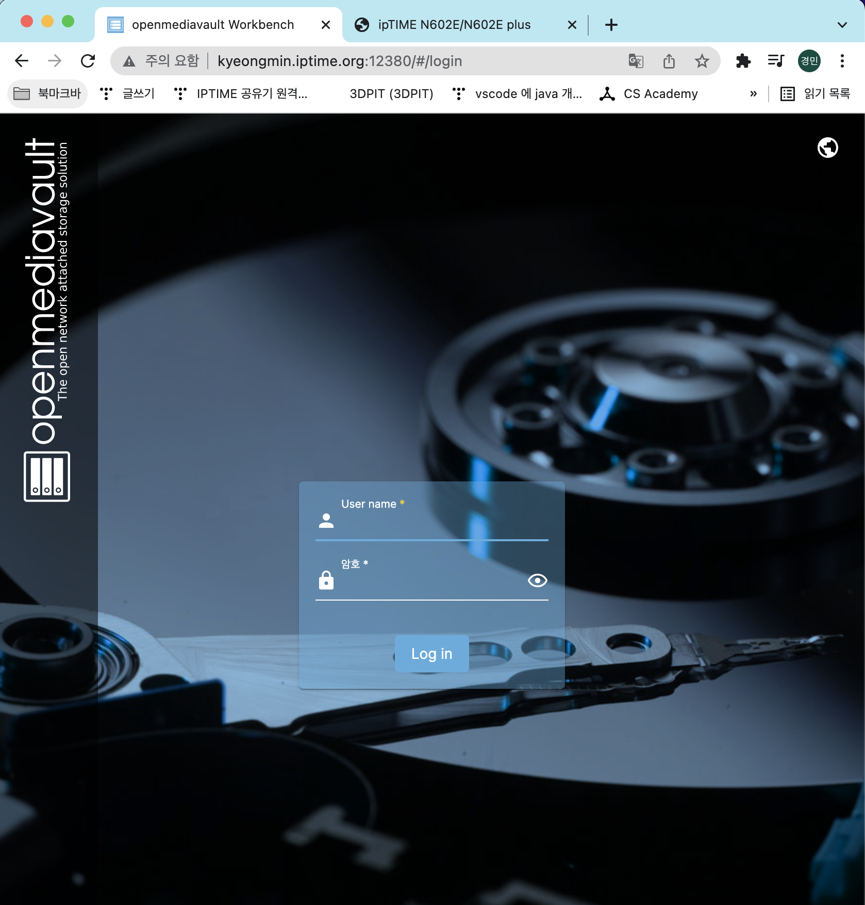

- 설정한 도메인으로 들어가면 위와 같이 들어갈수 있음 
  - 초기 ID :	admin
  - 초기 PW : openmediavault

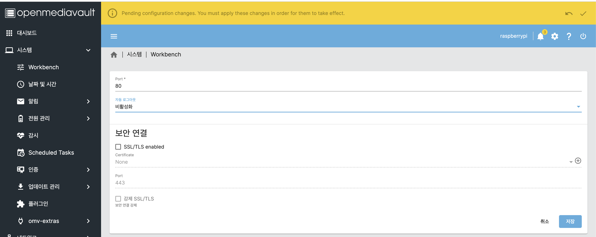

- 시스템에 workbench에 자동 로그아웃을 비활성화 해주면됨

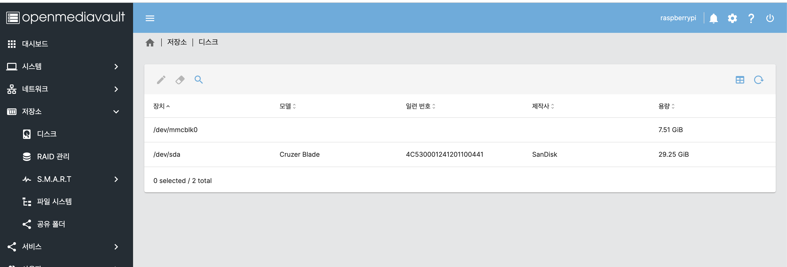

- 우선 테스트를 위해 usb이지만 무튼 원하는 것을 포맷해서 저렇게 저장소에 디스크 가면 인식이 되는것을 볼 수 있음

## 3.NAS기능 쓰기

### 3.1 저장공간 공유폴더 추가


- 제대로 인식하면 저렇다 정말 2A이상 뽑아내야해서 이게 좋은 전원쓰길 바란다.


- 저장소에 -> 공유폴더 클릭


- 생성 눌러서 저렇게 잡히면 정상임


- 여기까지 했다면 우선 공유 폴더 완성 성공

### 3.2 FTP설정


- 서비스 탭 클릭 후 FTP클릭


- 우선 FTP 설정에서 활성화됨 클릭 후 저장

- 공유 탭에서 추가 클릭


- 저렇게 원하는 저장소 클릭 후 저장


- 저렇게 되면 연결된 것

### 3.3 접속하는 방법 

- 탐색기에서 접근하는 방법 (비추천) | 내부 같은 네트워크망 접속

  

- 외부에서 접속

  

- 간혹 한글이름이 된것이 안된다고 함

### 3.4 FTP전용 앱 설치

- Winscp 검색
- 안드로이드도 ftp 클라이언트 설치 후 이용하면됨
- 각 os에 맞는것 찾아서 하길 추천

**중요**

- `sudo chmod -R 777 /var/www/html `

- 파일 자체가 안만들어지거나 안넘어가면 권한 설정해줘야함

## 4. 도커설치


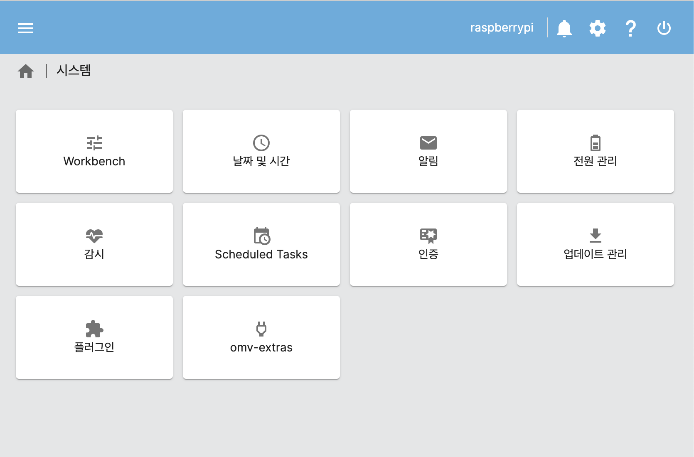

- 시스템에 omv-extras클릭

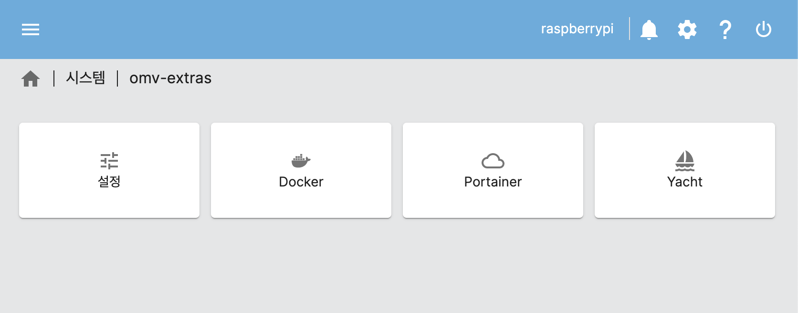

- 도커 클릭

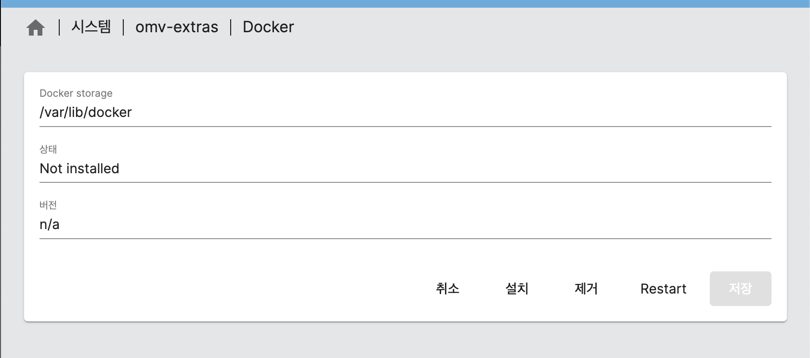

- 설치를 클릭해준다.
- 그리고 기다리면 설치가됨

## 5. 포테이너

- 도커를 편하게 볼수 있는 gui 
  - 도커 for windows에서 생성된 컨테이너를 볼 수 있는것과 비슷

- 포테이너는 도커를 WebGUI 형태로 관리할 수 있게 만들어주는 소프트웨어
  - 기존에는 길고 복잡한 명령어로 도커를 관리해야 했지만, 포테이너를 설치하면 쉽고 간단하게 도커 관리가 가능함

### 5.1 설치 

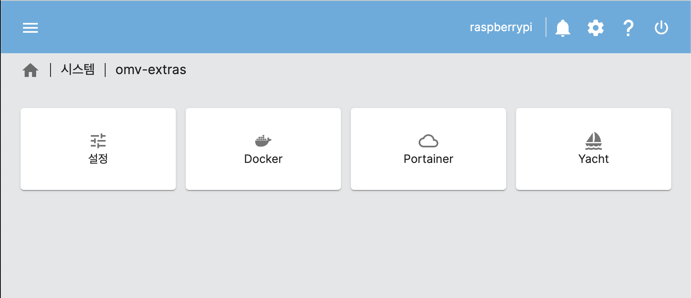

 

- 포테이너 클릭

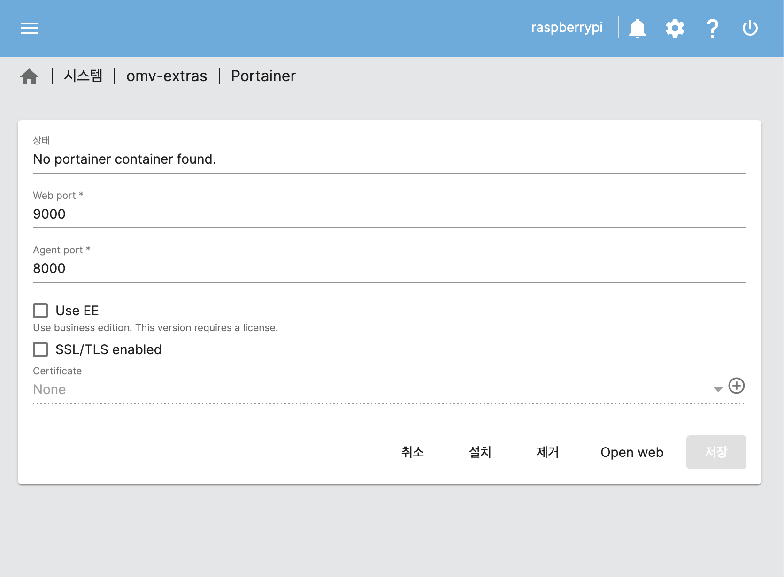

- 설치가 완료되면 저 포트를 입력해서 들어가면 됨

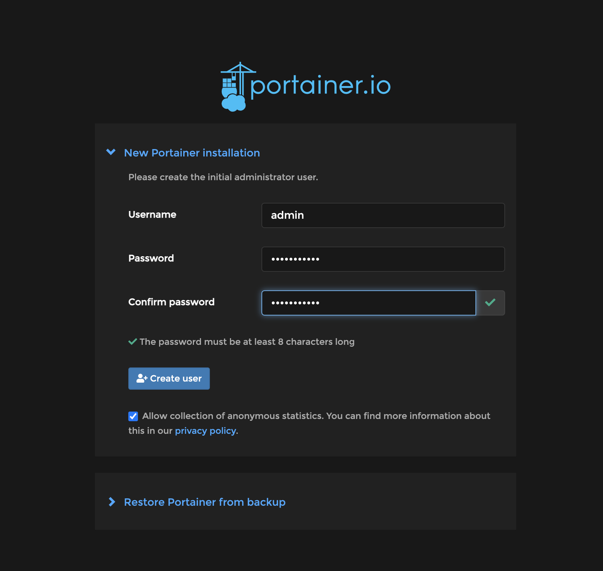

- 저렇게 나오는데 저기서 create user 생성

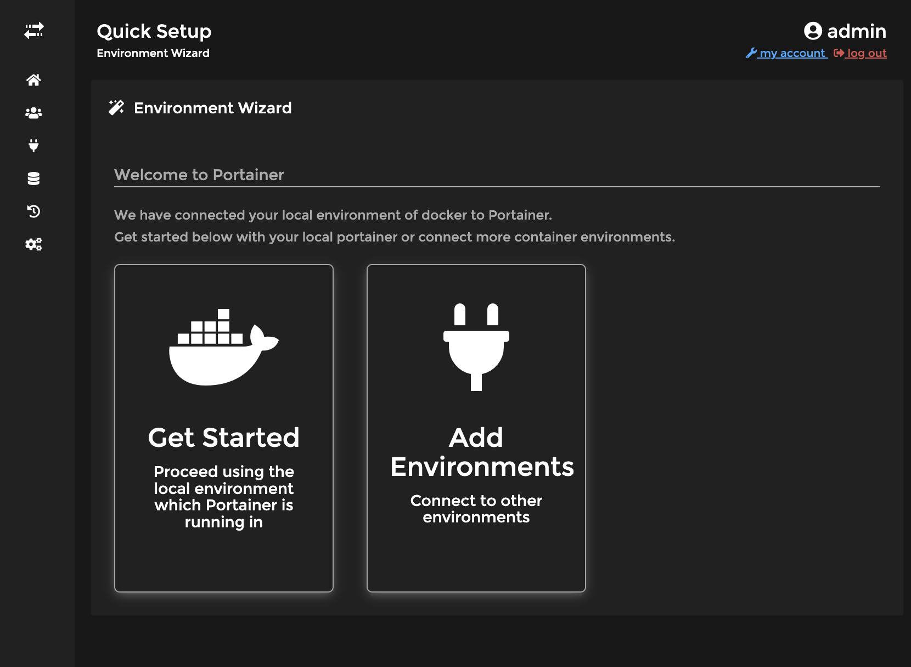

- 들어가면 위와 같이 화면이 나옴

## 볼트 설정

- boot/config.txt 파일을 수정해야함 그래야 안정적인 공급이 가능해짐

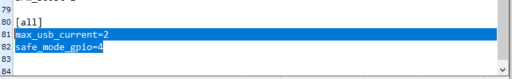

- 제일 하단에 두개 추가

  ```sh
  max_usb_current=2
  safe_mode_gpio=4
  ```

### NTFS 지원프로그램 설치

```sh
sudo apt-get install ntfs-3g
```

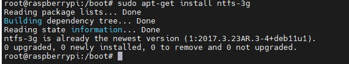

 
