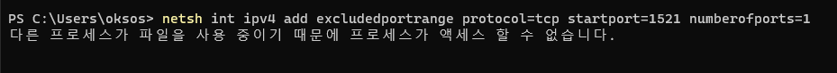

## 2021.12.18_Docker_portsNotAvailable


- 현재 도커를 실행하면 저렇게 포트를 사용할 수 없다고 나옴

- exclude를 해야한다고하는데...

## 명령어 날리기

```shell
netsh int ipv4 add excludedportrange protocol=tcp startport=1521 numberofports=1
```

