## 2021.12.22_DockerMssql_EFcore연결

## 목차

1. 도커 컴포즈 파일 
2. 도커로 mssql올리기
3. DBeaver로 mssql 컨테이너 접속확인
4. sql server management 2019로 접속확인
5. 실제 efcore 동작을 위한 Visual studio로 디비 연결확인 하기

## 1. 도커 컴포즈 파일

```dockerfile
version: '3.0'
services:
    mssql:
        image: mcr.microsoft.com/mssql/server:latest 
        environment:
          ACCEPT_EULA: Y
          SA_PASSWORD: msSql@passw0rd
          MSSQL_PID: Express
        ports:
          - 1443:1433
        volumes:
          - data:/var/opt/mssql
volumes:
  data:
```

## 2. 도커로 mssql올리기

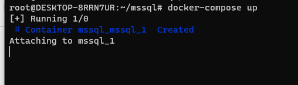

```dockerfile
docker-compose up 
```

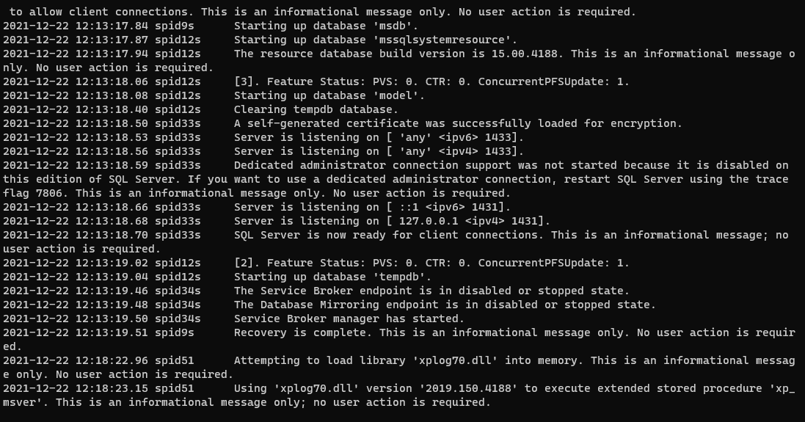

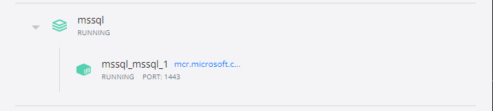

- docker for windows를 보면 저렇게 컨테이너가 실행된 것이 보임
- `docker ps` 
  - 위 명령어로도 실행 중인 컨테이너 확인 가능

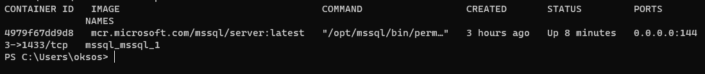

## 3. DBeaver로 mssql 컨테이너 접속확인

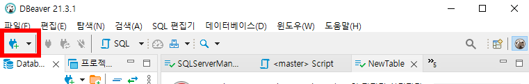

- 플러그 모양 클릭

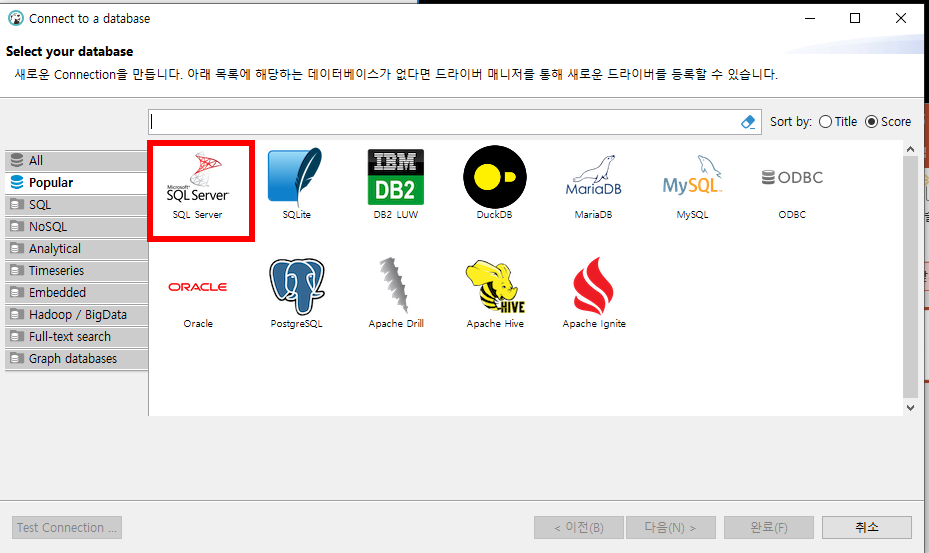

- SQL Server 클릭 (이것이 mssql임)

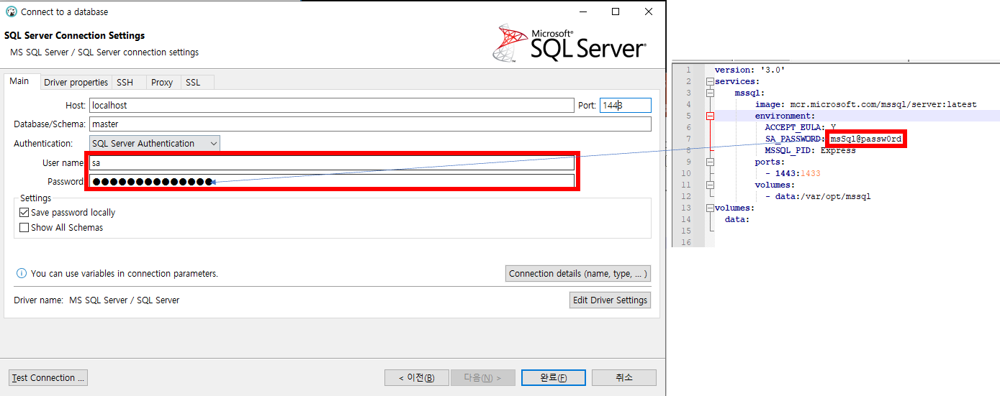

- ID는 sa
- Password는 우리가 docker-compose.yml에 넣은 비밀번호
  - msSql@passw0rd
    - 이거 포인트는 쉬운 비번으로 하면 도커 컨터이너가 갑자기 꺼짐
    - 안전한 비번을 사용해야 컨테이너가 안꺼진다고함 8자이상 특문, 영문 대소, 숫자 포함하면 좋음

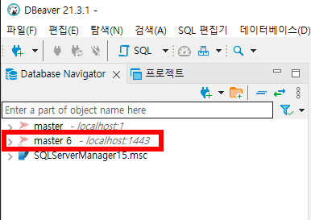

- master 6인데 이전에 다른것이 같은 이름이 있어서 master6 인것
  - 아무것도 없는 상태에서는 이름이 master임


- 근데 이렇게 실행 시키려고 하면 에러가 발생함

### 도커 컨테이너 로그 확인

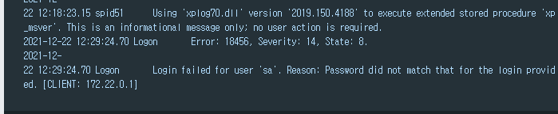

- 이유가 비번이 틀렸다고하는데 ....
  - 지금 설정이 좀 이상하다고 느끼는것이 MsSql@Passw0rd 이비번을 입력하면 제대로 동작함

  - 여러번 도커를 올렸다면 주의 해야함

  - 도커 컴포즈 파일 보면 볼륨 설정해놨는데 거기에 이전 비번 자체가 있어서 다시올려도 그대로 같으 볼륨을 쓰기때문에 그러것

    - 그래서 볼륨을 삭제하거나 다른 볼륨이름으로 변경하면됨

    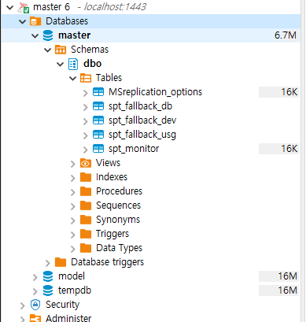

    - 위와 같이 접속이 가능해짐

## 4. sql server management 2019로 접속확인

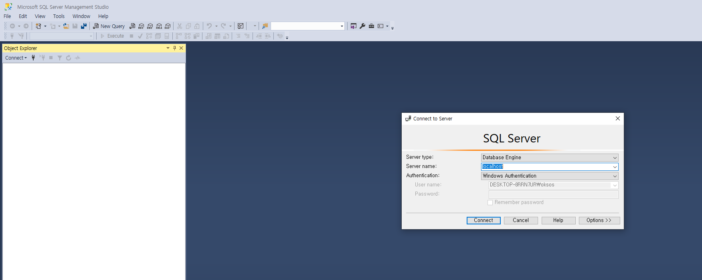

- 실행을 하면 저렇게 뜨는데 확대해서 보면 아래와 같음

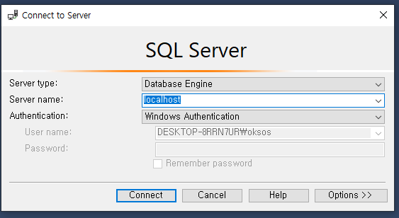

- 위와 같고
- Authentication 의 화살표를 클릭해서 아래로 바꿔줌

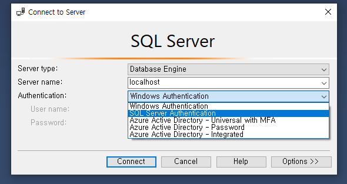

- SQL Server Authentication


- 원래 기본은 
  - Server name: localhost
  - Login: sa
  - Password: msSql@passw0rd
    - 이렇게 해서 Connect를 클릭해보자.

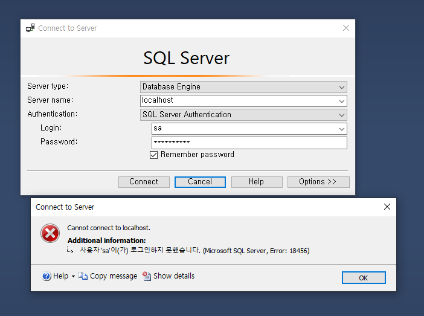

- 위에 처럼 로그인이 안되는데

- Show details 클릭해보면

  

  - State : 1 이뜨는데 저게 제대로 이름이 아니라서 그런것 그러니까 localhost인데 무슨 포트인지 명확하지 않아서 생기는것 같음
  - 그래서 아래와 같이 Server name을 변경
    - localhost,1443

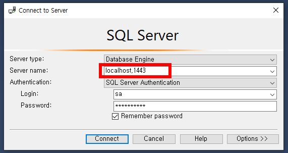

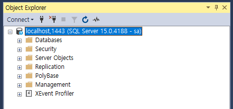

- 그러면 제대로 동작을 하게된다.
  - 그럼 이게 제대로 그 해당 컨테이너가 맞는지 확인하기 위해 Dbeaver에서 테이블 생성하고 같은 테이블이 생성이 되어있는지 확인해보자.

#### Dbeaver에서 테이블 생성

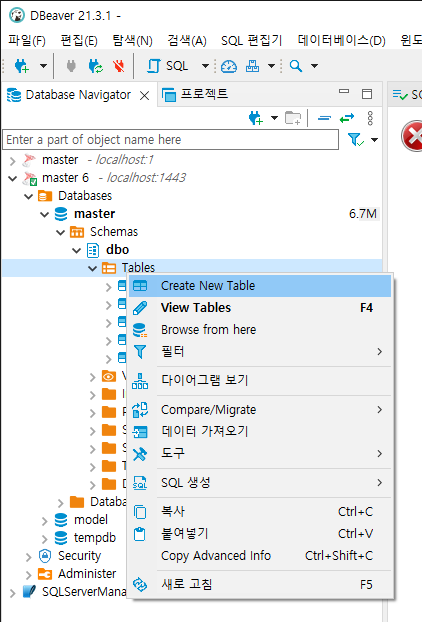

- 물론 명령어로 해도 되지만 지금은 테스트하기 위해서 간단히 하자

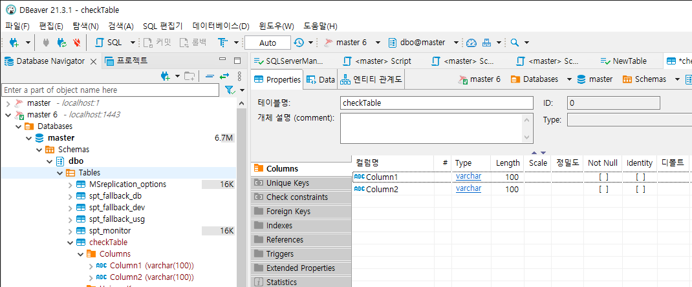

- 간단히 checkTable로 만들고 컬럼 두개만 넣자

#### sqlServer2019에서 확인하기

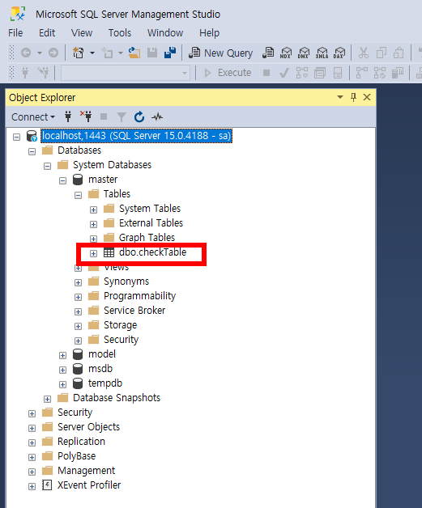

- 제대로 같은걸로 확인이 되었고 다음으로 넘어가보자

## 5. 실제 efcore 동작을 위한 Visual studio로 디비 연결확인 하기

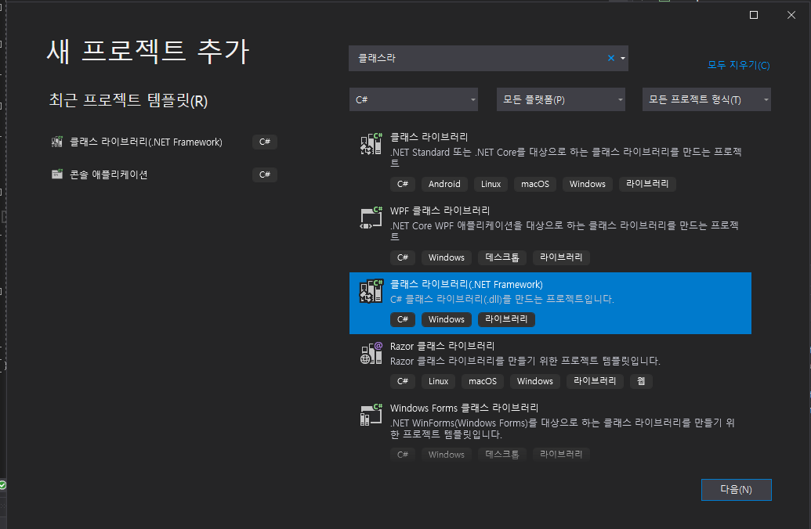

- 클래스 라이브러리 프로젝트 추가

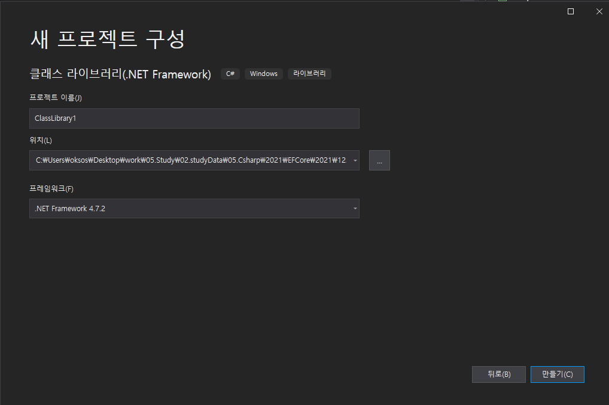

- 우선 만들기 진행

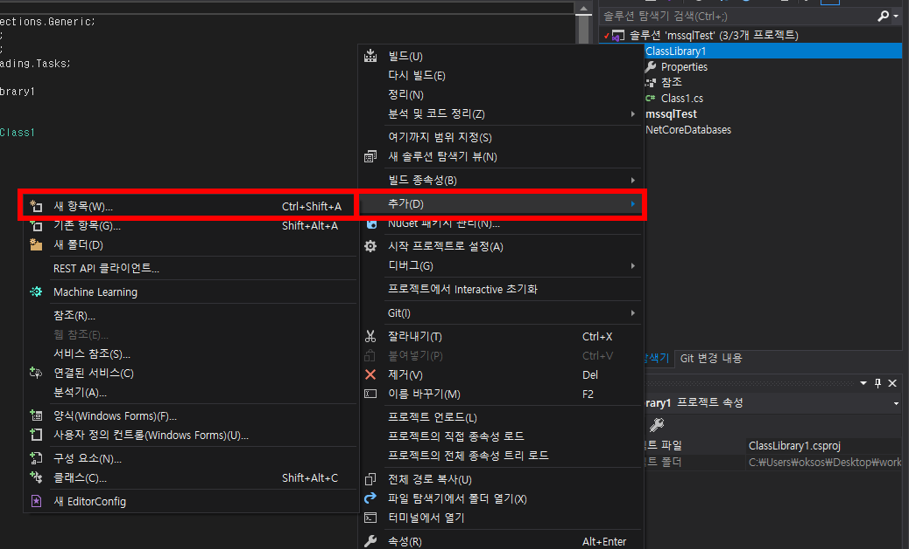

- 새항목  클릭

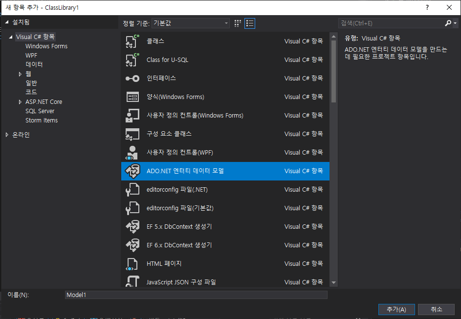

-  ADD.NET 엔티티 데이터 모델 클릭 후 추가

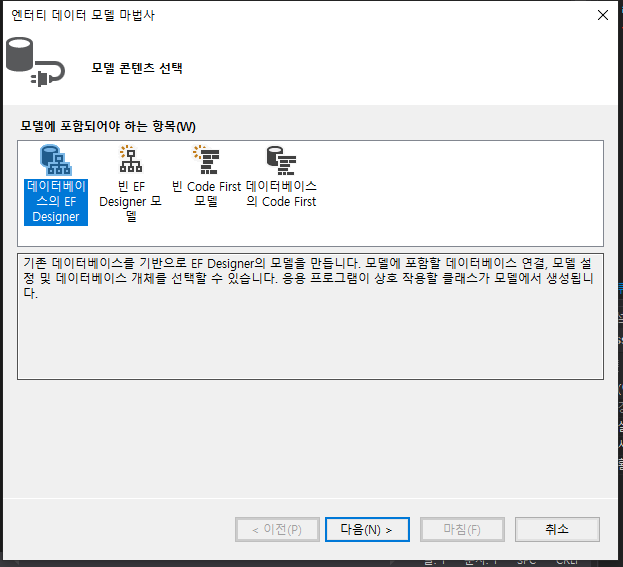

- 데이터베이스의 EF Designer 클릭 후 다음

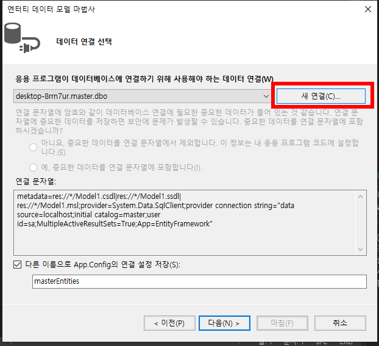

- 새 연결 클릭

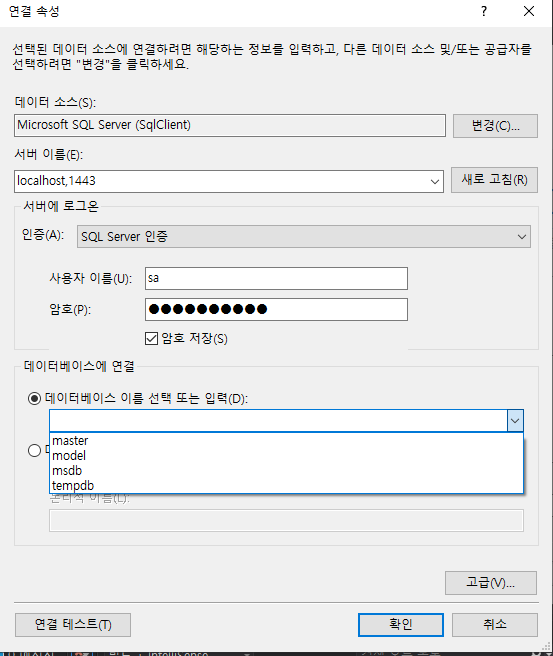

- 서버이름 : localhost,1443

- 사용자이름: sa

- 암호: msSql@passw0rd

  - 데이터베이스 이름 선택 또는 입력 부분의 화살표 누르면 
    - 제대로 연결이 된경우 저렇게 나옴 
    - master클릭 후 확인 클릭

  


- 위와 같은 상태에서 다음

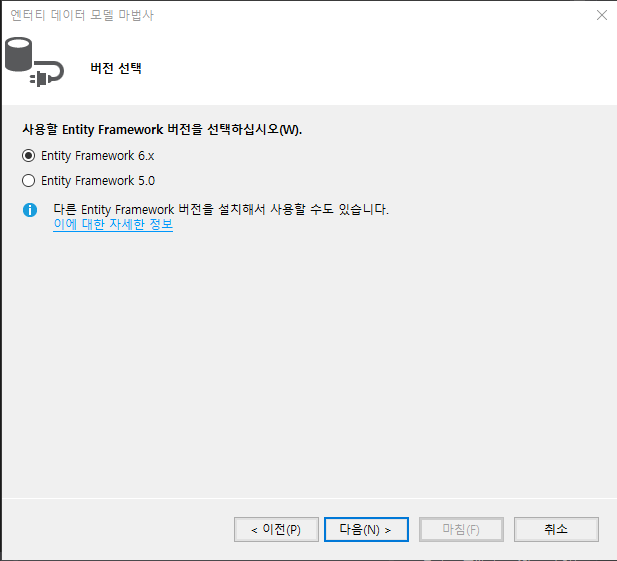

- 저대로 해서 다음

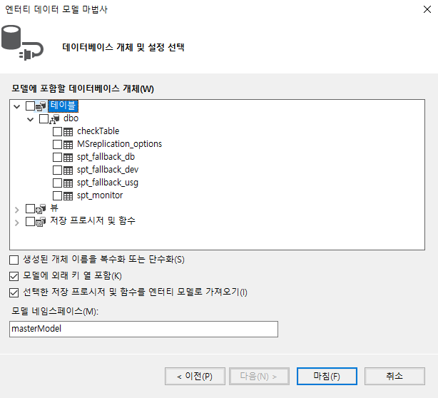

- 켜서 테이블쪽 보면 checkTable이 있는데 필요한 테이블만 클릭해서 아래와 같이해서 마침하면됨

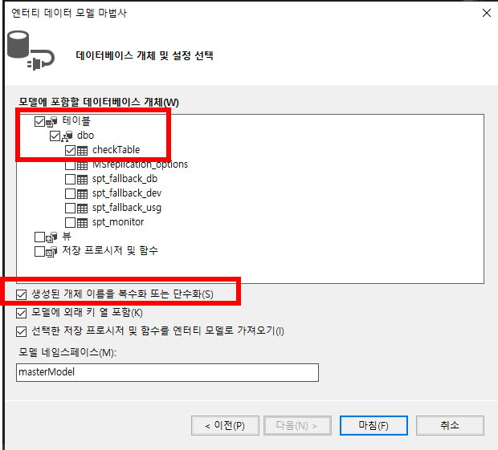

- 마침하면 좀 시간이 걸림

  - 조금 시간이 지나면

    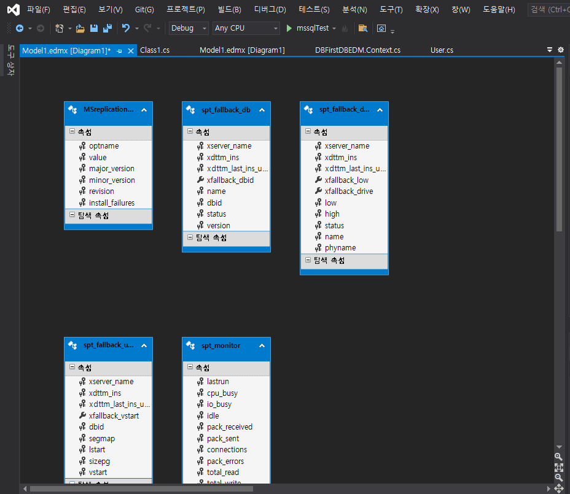

- 저렇게 다이어그램이 나오게됨

- 위와 같이 하면 EFCore ORM을 사용하기위한 준비가 완료된것