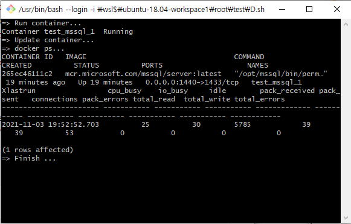
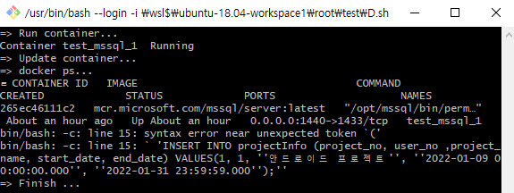
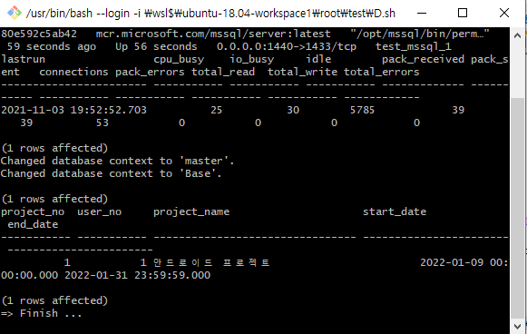
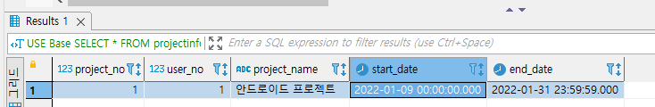
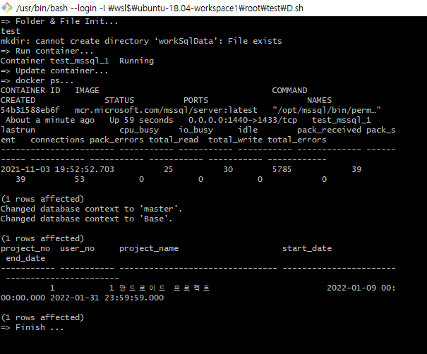

## 22.01.09_shell스크립트자동화

## 목차

> **1.Entrypoint, Command 사용**
>
> > 1.1 Dockerfile로 이미지 만들어 사용
> >
> > 1.2 DockerCompose에서 사용
>
> **2.Shell스크립트로 자동화 하기**
>
> > 2.1 도커컴포즈 파일 존재한 상태에서 쉘 스크립트 적용
> >
> > > 2.2.1 shell 스크립트 작성하기
> > >
> > > > 쿼리문 직접 작성하기
> > > >
> > > > sql파일 읽어오기
>
> **3.완전 자동으로 실행 시키기**

## 1.Entrypoint, Command 사용

#### 1.1 Dockerfile로 이미지 만들어 사용

- ENTRYPOINT & CMD

  - ENRTYPOINT

  ```dockerfile
  FROM mcr.microsoft.com/mssql/server:latest
  ENTRYPOINT ["/bin/bash", "/environment/entrypoint.sh"]
  ```

  - CMD

  ```dockerfile
  FROM mcr.microsoft.com/mssql/server:latest
  CMD ["/bin/bash", "/environment/entrypoint.sh"]
  ```

  - `docker build --tag mssql:1.0`
    - 이미지 생성 후 dockercompose로 실행

- dockercompose.yml

  ```yaml
      version: '3.7'
      services:
          mssql2:
              image: mssql:1.0
              user: root
              restart: always
              environment:
                ACCEPT_EULA: Y
                SA_PASSWORD: p@ssw0rd
                MSSQL_PID: Express
                MSSQL_COLLATION: Korean_Wansung_CI_AS
              ports:
                - 1435:1433
              volumes:
                - ./workSqlData:/var/opt/mssql
                - ./environment:/environment
      volumes:
          workSqlData:
  ```

  

  - 문제는 ENTRYPOINT나 CMD사용시 컨테이너가 명령을 실행하고 죽음

#### 1.2 DockerCompose에서 사용

```yaml
version: '3.7'
services:
    mssql2:
        image: mcr.microsoft.com/mssql/server:latest 
        user: root
        restart: always
        environment:
          ACCEPT_EULA: Y
          SA_PASSWORD: p@ssw0rd
          MSSQL_PID: Express
          MSSQL_COLLATION: Korean_Wansung_CI_AS
        ports:
          - 1435:1433
        volumes:
          - ./workSqlData:/var/opt/mssql
          - ./environment:/environment
        entrypoint: /bin/bash /environment/entrypoint.sh
volumes:
    workSqlData:

```

```yaml
version: '3.7'
services:
    mssql2:
        image: mcr.microsoft.com/mssql/server:latest 
        user: root
        restart: always
        environment:
          ACCEPT_EULA: Y
          SA_PASSWORD: p@ssw0rd
          MSSQL_PID: Express
          MSSQL_COLLATION: Korean_Wansung_CI_AS
        ports:
          - 1435:1433
        volumes:
          - ./workSqlData:/var/opt/mssql
          - ./environment:/environment
        command: /bin/bash /environment/entrypoint.sh
volumes:
    workSqlData:

```

- 사실상 생각해보면 저렇게 하면 실행 될때마다 명령을 실행하기 때문에 따로 shell 스크립트를 적용해야할 듯

## 2. shell스크립트로 자동화 하기

### 2.2 도커컴포즈 파일 존재한 상태에서 쉘 스크립트 적용

- docker-compose.yml

  ```yml
      version: '3.7'
      services:
          mssql:
              image: mcr.microsoft.com/mssql/server:latest 
              user: root
              restart: always
              environment:
                ACCEPT_EULA: Y
                SA_PASSWORD: p@ssw0rd
                MSSQL_PID: Express
                MSSQL_COLLATION: Korean_Wansung_CI_AS
              ports:
                - 1440:1433
              volumes:
                - ./workSqlData:/var/opt/mssql
                - ./SQL.sql:/SQL.sql
      volumes:
          workSqlData:
  ```

#### 2.2.1 shell 스크립트 작성하기

##### 쿼리문 직접 작성하기 

```yaml
#!/bin/sh
echo "=> Run container..."
docker-compose up -d
echo "=> Update container..."
sleep 5s
echo "=> docker ps..."
sleep 5s
winpty docker ps --last 1 
sleep 5s
winpty docker exec -it test_mssql_1 bin/bash -c "cd /opt/mssql-tools/bin && ./sqlcmd -S localhost -U sa -P 'm!rero@1021' -Q 'SELECT * FROM spt_monitor;
echo "=> Finish ..."
sleep 20s
```



- 단일 쿼리문의 경우 제대로 동작

- 에러

  

  - cerrent

    ```sql
    INSERT INTO projectInfo (project_no, user_no ,project_name, start_date, end_date) VALUES(1, 1, 안드로이드 프로젝트', '2022-01-09 00:00:00.000', '2022-01-31 23:59:59.000');
    ```

    - 사실상 쉘 자체가 () 에 대해서 "" 쌍따옴표로 묶어야 제대로 인식이 되는 것 같다 근데 우선 어떻게 해서든 되더라도 너무 비효율적임     
##### sql파일 읽어오기

    - SQL.sql파일
    
      ```sql
      SELECT * FROM spt_monitor;
      USE MASTER
      IF NOT EXISTS(
      	SELECT name
      	FROM sys.databases
      	WHERE name = 'Base'
      )  
      CREATE DATABASE Base
      GO
      USE Base
      CREATE TABLE projectInfo(
      	project_no int IDENTITY(1,1) NOT NULL,
      	user_no int NOT NULL,
      	project_name varchar(32) COLLATE Korean_Wansung_CI_AS NOT NULL,
      	start_date datetime NOT NULL,
      	end_date datetime NOT NULL,
      );
      SET IDENTITY_INSERT projectInfo ON;
      INSERT INTO projectInfo (project_no, user_no ,project_name, start_date, end_date) VALUES(1, 1, '안드로이드 프로젝트', '2022-01-09 00:00:00.000', '2022-01-31 23:59:59.000');
      SET IDENTITY_INSERT projectInfo OFF;
      ```
    
    - 쉘스크립트 실행
    
      ```shell
      #!/bin/sh
      echo "=> Run container..."
      docker-compose up -d
      echo "=> Update container..."
      sleep 5s
      echo "=> docker ps..."
      sleep 5s
      winpty docker ps --last 1 
      sleep 5s
      winpty docker exec -it test_mssql_1 bin/bash -c "cd /opt/mssql-tools/bin && ./sqlcmd -S localhost -U sa -P 'p@ssw0rd' -i /SQL.sql"
      echo "=> Finish ..."
      sleep 20s
      ```
    
      
    
    - 실제 데이터 확인해보기
    
      


## 3. 완전 자동으로 실행 시키기 

```shell
#!/bin/sh
echo "=> Folder & File Init..."
dirname=${PWD##*/}
echo $dirname
mkdir workSqlData
touch docker-compose.yml
echo "
    version: '3.7'
    services:
        mssql:
            image: mcr.microsoft.com/mssql/server:latest 
            user: root
            restart: always
            environment:
              ACCEPT_EULA: Y
              SA_PASSWORD: p@ssw0rd
              MSSQL_PID: Express
              MSSQL_COLLATION: Korean_Wansung_CI_AS
            ports:
              - 1440:1433
            volumes:
              - ./workSqlData:/var/opt/mssql
              - ./SQL.sql:/SQL.sql
    volumes:
        workSqlData:
" > docker-compose.yml
echo "=> Run container..."
docker-compose up -d
echo "=> Update container..."
sleep 5s
echo "=> docker ps..."v
sleep 5s
winpty docker ps --last 1 
sleep 5s
winpty docker exec -it $dirname'_mssql_1' bin/bash -c "cd /opt/mssql-tools/bin && ./sqlcmd -S localhost -U sa -P 'p@ssw0rd' -i /SQL.sql"
echo "=> Finish ..."
sleep 20s
```

- 위와 같이 하면 따로 준비할것은 SQL.sql파일빼고는 알아서 도커 파일 생성후 데이터를 만들어줌

