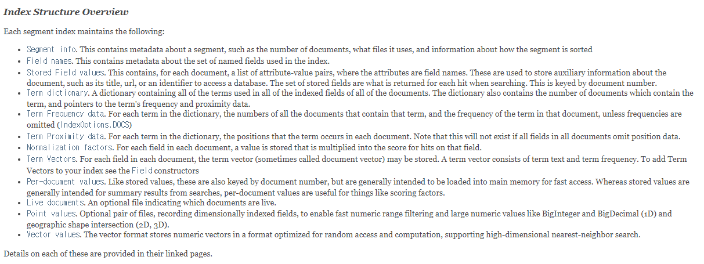
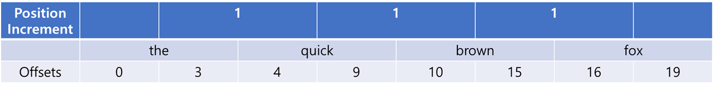

## 22.01.31_Lucene이란?

## 1.루신에서 중요한 4가지

- 검색에서 빼 놓을 수 없는 자료구조 index pi
- 색인과 관련된 index writer
- 검색 관련된 index searcher
- 형태소 분석과 관련된 analyzer

## 2.루신에 대한 것

- 루신에 대한 자료
  - https://lucene.apache.org/
  - https://github.com/apache/lucene
    - 오픈 소스 기반의 검색 라이브러리
    - 검색엔진이 갖춰야 하는 기본 기능인 **색인**, **검색**, **형태소 분석**을 제공

### 2.1 루신 기반의 대표적인 검색 엔진

-  elasticsearch
- Solr
  - lucene
- 기본 개념
  - 인덱스 
  - 문서
  - 필드
  - 용어

### 2.2 역 색인 파일(inverted index structure)

- 인덱스를 색인어 기반의 검색을 생성하기 위해 색인어에 대한 통계를 저장하는 구조
  - 즉, 용어에 대해서 문서를 나열하는 구조가 역인덱스라고 하는 인덱스 계열

### 2.3 analyze를 이용한 분석

```json
GET: http://localhost:9200/_analyze

{
	"analyzer": "arirang_analyzer"
    "text": "안녕하세요 한번 분석을 search를 해보세요."
}
```

- 형태소 분석된 결과를 확인 할 수 있음

### 2.4 indexWriter

- 색인시 알아야 하는 정보
  - Index File Formats IndexWriter
- IndexFileFormats은 Segment File 이라고함
  - Sement File은 여러 Index File유형 중 하나
- 색인 파일에는 문서의 Field, Field Data, Term, Frequencies, Position, Deleted Documents 등과 같은 정보가 저장되고 색인과 검색 시 활용

[index Structure Overview사이트](https://lucene.apache.org/core/9_0_0/core/org/apache/lucene/codecs/lucene90/package-summary.html#Overview)



## 3.색인

- 구조
  - indexWriter -> DocumentWriter -> SegmentMerger
  - 상위클래스로 들어가면 
    - Directory -> IndexWriter -> Analyer -> Documents -> Fields

- indexWriter가 Index FIle  들을 생성하는 과정
  - 수정이 불가능한 Immutable Type
  - 여러개로 생성된 Segments 파일들을 Merge라는 작업을 통해 하나의 색인 파일로 만드는 과정이 필요
  - 하나의 Index는 하나의 IndexWriter로 구성

- 색인의 구성
  - indexWriter -> Create Segment File -> Document Writing  -> commit이렇게 커밋이 된것 들을  
    - SegmentMerger로 합쳐서 -> Merge Completed -> Delete Old Segment File 

## 4.검색

- index writer색인 후 , index Search로 검색하는 과정
- indexSearch는 indexReader를 이용해서 검색을 수행
  - 즉, 하나의 index에는 Segment 별로 N 개의 LeafReader 가 존재
- 과정
  - directory -> indexWriter -> indexReader -> indexSearcher -> Query&CollectorManager -> Sort -> Reduce -> Merge

## 5. 형태소 분석

- 입력받은 문자열에서 검색 가능한 정보 구조로 분석 및 분해하는 과정

- analyzer ----------구성 요소---------- Tokenizer
- charFiler -----------|        |---------- TokenFilter

- Analyzer 는 형태소 분석을 위한 최상위 클래스
  - 하나의  Tokenizer와 다수의 Filter로 구성됨

- 분석 과정
  - input Text -> Character Filter -> Filtered Text -> Tokenizer -> Tokens -> Tokens FIlter -> Filtered Tokens -> output Tokens
    - 위 과정은 Token filter는 정의 된 순서에 맞춰 적용되어 순서가 중요
    - 한글 처리를 위한 Analyer는 CJK와 Nori Analyzer가 있음

### 5.1 입력 문자열에 대한 분석 과정



- position 정보는 0부터 시작 해서 1씩 증가하는구조
- offsets는 Token의 Start와 End에 대한 정보를 가지고 있음
  - End Offsets가 1이 더 큰 이유는 Token 추출시 루씬 내부에서 substring()을 사용해서 길이보다 1이 더 크게 설정됨
  - 추출된, Token, Position, Offset 정보를 포함해서 Term이라고 하고, 이를 이용해서 강조와 동의어에 활용