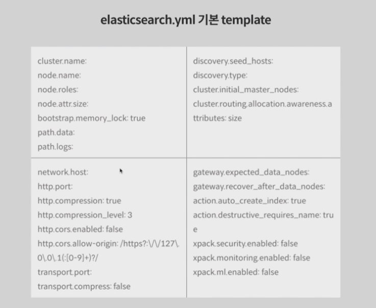

## 22.02.01_ElasticSearch1

## 목차

> 1.Elasticsearch
>
> 2.DBMS VS ElasticSearch
>
> 3.다운로드 및 실행, 종료
>
> 4.도커로 올리기
>
> 5.elastic 구성하기
>
> > 5.1싱글노드
>
> 6.필수적인 설정
>
> 7.docker-compose

## 1.Elasticsearch

- 루신이라는 검색 라이브러리를 기반으로 만들어진 검색 엔진
- 오픈소스
- Elastic Stack: Elasticsearch를 중심으로 한 다양한 stack  
  - Logstash, Kibana, Beats

-  elk는 기본 엔진이지만  Time series 데이터에 대한 활용도 가능
- Key:  value 형태의  Document를 저장하고  NoSQL과 같은 엔진으로도 활용이 가능
- Data Warehouse, Data Lake, Data Dam등을 구축할 때,
  - 실시간 조회 및 분석을 요구하는  Speed layer 솔루션으로 현장에서 많이 활용
- RESTful API과 다양한 Client library 제공
- 자체 질의문: Query DSL,  KQL(Kibana Query Language)
- 루신 사용경험이 있다면 누구나 쉽게 사용 가능

## 2.DBMS VS ElasticSearch

| DBMS                   | Elasticsearch                |
| ---------------------- | ---------------------------- |
| DBMS HA 구성(MMM, M/S) | Cluster                      |
| DBMS instance          | Node                         |
| Table                  | Index                        |
| Partition              | shard/ Routing               |
| Row                    | Document                     |
| Column                 | Field                        |
| Row of Columnar data.  | Serialized JSON Document.    |
| Join                   | Nested or Parent/Child       |
| SQL(DML)               | QueryDSL                     |
| index                  | analyzed                     |
| Primary Key            | _id                          |
| Configuration          | elasticsearch.yml & settings |
| Schema                 | Mappings                     |

## 3. 다운로드 및 실행, 종료

```shell
weget https://artifacts.elastic.co/downloads/elasticsearch/elasticsearch-7.13.3-darwin-x86_64.tar.gz

tar -xvzf elasticsearch-7.13.3-darwin-x86_64.tar.gz

cd elasticsearch-7.13.3

bin/elasticsearch

bin/elasticsearch -d -p pid

pkill -F pid
```

- 자바 환경 설정이 되어있어야함
  - ES_JAVA_HOME 에 path를 해줘야 에러가 안생김

 ## 4. 도커로 올리기

- 이미지 가져오기

```shell
docker pull docker.elastic.co/elasticsearch/elasticsearch:7.15.0

docker images
```

- 실행하기

```shell
docker run -d -p 9200:9200 -p 9300:9300 -e "discovery.type=single-node" docker.elastic.co/elasticsearch/elasticsearch:7.15.0
```

## 5. elastic 구성하기

- 구성은 
  - single Node
  - Cluster
- 방법은 tar ball을 이용해서 구성하는 방법
- docker를 이용해서 구성하는 방법

### 5.1 싱글노드

- "discovery.type=single-node"

- config/elasticsearch.yml

  ```yaml
  cluster.name: kmp
  node.name: single-node
  discovery.type: single-node
  ```

  - 위와 같이 해주고 다시 실행해주면됨

  ```shell
  #확인
  http://localhost:9200/_cat/nodes?format=json&pretty
  ```

## 6. 필수적인 설정



## 7.docker-compose

```dockerfile
version '3.7'
services:
  kmp-es:
    image: docker.elastic.co/elasticsearch/elasticsearch:7.15.0
    container_name: es-singlenode
    environment:
      - node.name=single
      - cluster.name=standalone
      - discovery.type=single-node
    ports:
      - 9200:9200
      - 9300:9300
    networks:
      - es-bridge
networks:
  es-breidge:
    driver: bridge
```

- `docker-compose -f docker-compose-single-node.yml up`
- `docker-compose -f docker-compose-single-node.yml down`