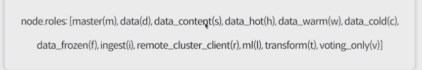
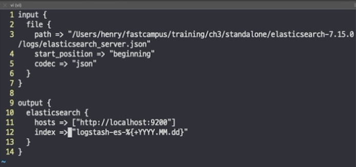

## 22.02.07_ELK클러스터구성


## 1.클러스터

- 아무설정하지 않았는데 클러스팅되는것은
  - 같은 네트워크에 있는 클러스터 네임이 같은 것을 알아서 찾아서 구성함

## 2.노드의 Role

- node.master: true
- node.data : true
  - 또는
- node.roles["master", "data"]
- 마스터 노드로만
  - node.roles["master"]
- 마스터 노드랑 데이터 노드로 설정
  - node.roles["master", "data"]

## 3.Cluster Node 구성 -변경

- data -d
- ingest -i
- master -m
- remote_cluster_client -r 
  - 우리가 흔히 ccs라는 cross cluster search라고각각의 클러스터각의 데이터를 조회하는 용도로 쓰는 것
- "-" coordinating node only 
  - 데이터만 받는 용도만



## 4.도커이용한 클러스터 설정

- 요새는 각각의 yml을 이용해서 사용함
  - 고스펙의 장비에서 여러 인스턴스를 구성할 때는 한번에 하지만 
  - 개별로 하는것이 일반적이고 좋다

### 4.1 docker-compose

- 설정은 동일하고 노드 이름만 다름
- discovery.seed.hosts설정과 cluster.initial_master설정이 필요
  - 클러스터 구성시 필요한 것

## 5.키바나

- 저장된 데이터를 조회하고 분석할 수 있도록 기능을 제공해주는 도구
- 초기는 Dashboard, visulization 제공 용도
- 현재는elk stack운영하고 모니터링 용도까지 확대

## 6.로그스태시

### 기본구성

- Data Source ->[Logstash Pipline] (input -> filters -> outputs)-> elasticsearch

  - 에이전트로 쓰기에는 무거움

  - 실행이 오래걸림




- 위와 같이 설정을 진행하고
  - 다양한 정보는 로그스태시 공식 문서보고 참고하면됨


### 조회

- bin/logstash -f config/logstash-eslog.conf
  - 색인 정보 확인
- http://localhost:9200/logstash*/_search?preetty=true
  - 키바나를 통해서 동일하게 조회 가능
  - Discover에서 조회를 하기 위해서는 먼저 index pattern을 등록한 후 조회하면 확인 할 수 있음


## 7.파일비트

- Beats라는 플랫폼을 사용하는 Stack들이 많이 있음
  - Beats는 Shipper Agent역할
- Official Beats와 Community Beats들이 다양하게 존재
- Logstash보다 리소스를 적게 사용하기 때문에 Agent로 많이 사용

### 구성

- input -> module -> processor -> output
  - Modle : 다양한 InputSource 데이터에 대한 수집, 시각화를 위한 형태로 만들어서 제공하기 위한 유틸성 패키지
- Processor : 입력받은 데이터 이벤트이 메시지를 전역으로 처리하기 위해 정의 하는 도구

## 파일 비트 VS 로그스태시

| Filebeat  | Logstash |
| --------- | -------- |
| input     | input    |
| module    | codec    |
| processor | filter   |
| output    | output   |

### 환경 설정 구성

```yaml
filebeat.inputs:
- type: log
  enabled :true
  paths:
    - /User/henry/fastcampus/training/ch3/standalone/elasticsearch-7.15.0/logs/*.json
json.keys_under_root: true
json.add_error_key: true
json.message_key: log

filebeat.config.modules:
  path: ${path.config}/modules.d/&*.yml
  reload.enabled: fasle

setup.ilm.enabled: false
setup.template.enabled: false
```

