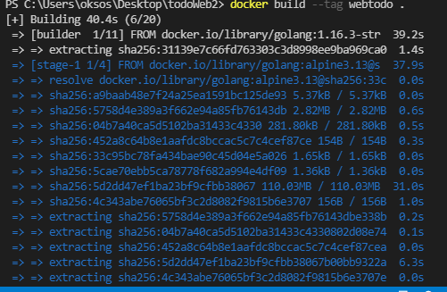

## 22.03.26_golang소스도커이미지화

## 목차

## 1.도커파일작성

```dockerfile
# vi Dockerfile
FROM golang:1.16.3-stretch AS builder
LABEL AUTHOR Kyengmin Park (oksos0817@naver.com)

RUN mkdir -p /build
WORKDIR /build

COPY go.mod .
COPY go.sum .
RUN go mod vendor
COPY . .
RUN CGO_ENABLED=0 GOOS=linux GOARCH=amd64 go build -o bin/tksinfo ./web1/main.go

RUN mkdir -p /dist
WORKDIR /dist
RUN cp /build/bin/tksinfo ./tksinfo

FROM golang:alpine3.13

RUN mkdir -p /app
WORKDIR /app

COPY --chown=0:0 --from=builder /dist /app/
EXPOSE 9111

ENTRYPOINT ["/app/tksinfo"]
CMD ["--port", "9111"]
```




- 도커파일을 생성하는 위치는 go.mod, go.sum있는 디렉토리에 생성하자


- 어떤 이유인지 모르지만 해당에 원하는 폴더가 없으면 에러가 나는데 폴더를 제대로 만들어놓으면 이미지가 저렇게 생성이 된다.
- 이제 이미지를 우선 tar파일로 내려보자.

## 2.이미지 tar파일로 만들기

