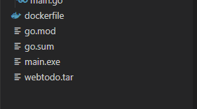
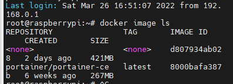
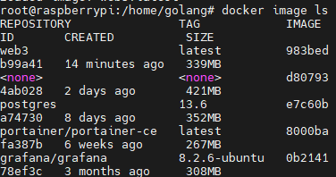
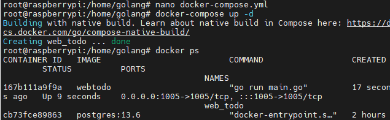

## 22.03.26_golang소스도커이미지화

## 목차

## 1.도커파일작성

```dockerfile
# vi Dockerfile
FROM golang:1.16.3-stretch AS builder
LABEL AUTHOR Kyengmin Park (oksos0817@naver.com)

RUN mkdir -p /build
WORKDIR /build

COPY go.mod .
COPY go.sum .
RUN go mod vendor
COPY . .
RUN CGO_ENABLED=0 GOOS=linux GOARCH=amd64 go build -o bin/tksinfo ./web1/main.go

RUN mkdir -p /dist
WORKDIR /dist
RUN cp /build/bin/tksinfo ./tksinfo

FROM golang:alpine3.13

RUN mkdir -p /app
WORKDIR /app

COPY --chown=0:0 --from=builder /dist /app/
EXPOSE 9111

ENTRYPOINT ["/app/tksinfo"]
CMD ["--port", "9111"]
```


- 도커파일을 생성하는 위치는 go.mod, go.sum있는 디렉토리에 생성하자


- 어떤 이유인지 모르지만 해당에 원하는 폴더가 없으면 에러가 나는데 폴더를 제대로 만들어놓으면 이미지가 저렇게 생성이 된다.
- 이제 이미지를 우선 tar파일로 내려보자.

## 2.이미지 tar파일로 만들기

```sh
docker save -o 원하는이름 이미지이름

docker save -o webtodo.tar webtodo:latest
```



- webtodo.tar 파일이 만들어진다.

## 3.dockerfile문제


- 실제 동작에 아래와 같은 문제 

```
FROM golang:alpine AS builder

ENV GO111MODULE=on \
    CGO_ENABLED=0 \
    GOOS=linux \
    GOARCH=amd64

WORKDIR /build

COPY ./public go.mod go.sum main.go ./

RUN go mod download

RUN go build -o main .

WORKDIR /dist

RUN cp /build/main .

FROM scratch

COPY --from=builder /dist/main .

ENTRYPOINT ["/main"]

```


- 문제는 저렇게 인식을 못한다는 점



```docker

FROM golang:alpine AS builder

ENV GO111MODULE=on \
    CGO_ENABLED=0 \
    GOOS=linux \
    GOARCH=amd64

WORKDIR /build

COPY . .

RUN go mod download
CMD [ "go","run","main.go" ]
# RUN go build -o main .

# WORKDIR /dist

# RUN cp /build/main .

# FROM scratch

# COPY --from=builder /dist/main .

# ENTRYPOINT ["/main"]
```

- 위와 같이 단순 실행으로 변경
- 위처럼 하면 로컬에서는 동작함

## 4.실제로 이미지내려서 컨테이너화 하기

```sh
docker load -i tar파일

docker load -i web.tar 
```

- 우선 원하는 곳에 올림
- 필자는 서버에 올리기 위해 서버가  있는곳에 파일 복사함
- 이미지 내려 받기 전


- 이미지 내려 받은 후

  

  

  - 저렇게 이미지의 레이어가 내려진다.

  

  - web3가 추가 됨이 보인다.

- 컨테이너화 하기

  ```sh
  docker run --platform=linux -d -p 1005:1005 --name web3 webtodo
  ```

## 5.dockercompse.yml

```dockerfile
version: '3.1'

services:
  web_todo:
    image: webtodo
    container_name: web_todo
    restart: always
    ports:
      - 1005:1005
```



- 저렇게 올라가면 성공 
- 링크로 들어가보자
- 

​	
