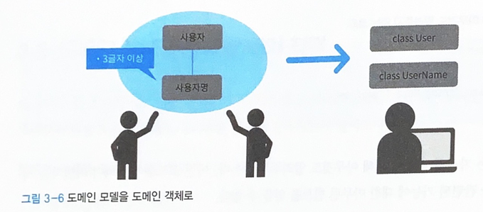
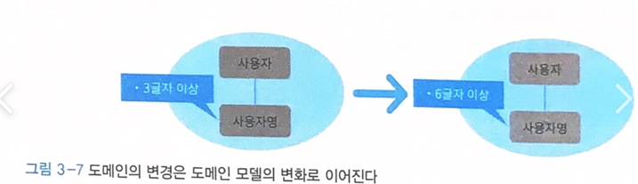

## 22.01.18_[03DDD]생애주기를갖는객체-엔티티

## 목차

## 1.엔티티

- 값 객체와 쌍벽을 이루는 주요 도메인 객체
- 데이터베이스 테이블 설계에 쓰이는 ER다이어그램도 엔티티가 등장
  - 엔티티-관계 다이어그램 또는 객체-관계 매핑(orm)에서도 퍼시스턴시 대상이 되는 데이터를 엔티티라고 부름
- 도메인 주도 개발에서는 조금 다른 의미이다
  - 도메인 모델을 구현한 도메인 객체를 의미
  - 값 객체도 도메인 모델을 구현한 도메인객체임
  - 엔티티와 값객체의 차이는 동일성을 통해 식별이 가능한지 아닌지에 있음

## 1.1 동일성

- 사람은 이름, 키, 체중, 취미등 다양한 속성을 갖음
- 이 속성은 고정된 값이 아니며 여러가지 요인에 의해 변화함
  - 나이는 해마다 생일이 돌아오면 변화는 속성인데 여기서 중요한 것은 생일을 맞은 사람은 생일전과 후가 서로 다른사람인가 라는 것임
    - 당연하게 나이가 먹는다고 달라지지 않는다.
- 즉, 어떤 사람이 그 사람이 되는 이유는 속성과는 무관하며 동일성을 지켜주는 무언가가 있다는 것을 보여줌

- 소프트웨어 시스템에서도 마찬가지로 
- 속성으로 구별되지 않는 객체
  - 시스템의 사용자가 그 전형적인 예임
- 시스템 사용자는 최초 사용자 등록 시에 자신의 개인정보를 사용자 정보를 등록
  - 사용자 정보는 대부분의 경우 임의로 수정할 수 있음
  - 사용자는 이름이 변경됐다 하더라도 사용자 정보가 수정된 것 뿐이지 사용자 자체가 수정된 것이 아님
    - 이렇듯 사용자는 속성이 아닌 동일성으로 식별
- SW시스템에는 수많은 엔티티가 존재함

## 2.엔티티의 성질

- 엔티티는 속성이 아닌 동일성으로 식별되는객체
  - 이와 반대로 동일성이 아닌 속성으로 식별되는 객체도 있음
- 예를 들어 성과 이름의 두가지 속성으로 구성되는 성명은 두 속성 중 어느 한쪽이 수정되면 전혀 다른 존재가 됨
- 반대로 속성이 모두 같으면 완전히 같은 것으로 취급
  - 말 그대로 성명은 속성을 통해 식별되는 객체
    - 성명은 값 객체다.
- 엔티티와 값 객체는 모두 도메인 모델을 구현한 도메인 객체라는 점에서 비슷
  - 성질에 차이가 있음
- 가변이다.
- 속성이 같아도 구분할 수 있음
- 동일성을 통해 구별됨
  - 엔티티의 성질 중에는 값 객체의 성질과 반대인 것도 있음

### 2.1 가변이다

- 값 객체는 불변성을 갖는 객체
- 엔티티는 가변성을 갖는 객체
  - 사람이 시간이 지남에 따라 나이나 키 등의 속성이 달라지듯이 엔티티의 속성도 변화할 수 있음

#### 2.1.1 사용자를 나타내는 클래스

```c#
class User
{
    private string name;
    
    public User(string name)
    {
        if(name == null) throw new ArgumentNullException(nameof(name));
        if(name.Length < 3) throw  new ArgumentException("사용자명은 3글자 이상이어야 함", nameof(name));
        
        this.name = name;
    }
}
```

- 사용자 명 변경 불가

```c#
class User
{
    private string name;
    
    public User(string name)
    {
        ChangeName(name);
    }
    public void ChangeName(string name){
        if(name == null) throw new ArgumentNullException(nameof(name));
        if(name.Length < 3) throw  new ArgumentException("사용자명은 3글자 이상이어야 함", nameof(name));
        
        this.name = name;
    }
}
```

- User 객체는 ChangeName 메서드를 이용해 이름에 해당하는 속성을 수정할 수 있음
- 값 객체는 불변성을 갖기 때문에 객체를 교환(대입)해 수정했지만,
- 엔티티는 수정을 위해 객체를 교환하지 않음
  - 엔티티의 속성을 수정하려면 객체의 행동을 수정하면 됨
- 모든 속성이 반드시 가변일 필요는 없음
  - 엔티티는 필요에 따라 속성을 가변으로 만들 수 있는 객체일 뿐
  - 가능한 한 객체는 불변으로 남겨두는 습관을 들이는 것이 좋음

#### [칼럼] 안전망 역할을 하는 유효성 검증

```c#
모델을 나타낸 객체의 값이 도메인 규칙에 부합하는지는 중요한 문제
따라서, 도메인 규칙을 위반하는 대상은 제거해야 함
    앞서 설명한 User 객체는 이를 실제로 구현해 유효하지 않은 값(null 이나 최소 길이에 미달하는 사용자명)을 인자로 받으면 예외를 발생시켜 프로그램을 종료
이 예외는 안전장치로 가능하기 위한 예외
    
따라서 예외가 발생하는 것을 전제로 해서는 안되고, 유효성 검사를 사전에 마쳐야함
사용자명 수정을 다시 예로 들면, 새로운 사용자명으로 유효하지 않은 값이 전달됐다면 클라이언트 쪽에서 미리 검증함
    이러한 검증을 통해 새로운 사용자에 유효하지 않은 값이 많다 라는 의도를 명확히 할 수 있음
```

- 클라이언트에서 사전에 유효성 검사하기

  ```c#
  if(string.IsNullOrEmpty(request.Name))
  {
      throw new ArgumentException("요청에 포함된 Name이 nuyll 이거나 빈 문자열임");
  }
  user.ChangeName(request.Name);
  ```

## 3.속성이 같아도 구분할 수 있음

- 값 객체는 속성이 같다면 같은것으로 취급
- 엔티티는 속성이 같아도 두 엔티티를 서로 다른 것으로 취급

### 3.1 값객체와 엔티티 비교

- 성명으로 나타내는 값 객체는 성과 이름의 2 속성으로 구성됨
- 값 객체는 등가성을 통해 비교되므로 성과 이름이 같다면 두 값 객체는 완전히 같은 것
  - 속성이 같다면 같은 것으로 취급
- 위 같은 성질은 사람에게는 맞지 않음
  - 왜냐면 이름과 성이 같은 사람은 모두 같은 사람이라는 말이 되기떄문
  -  사람은 속성만으로 구별하지 않음
  - 사람을 구별하는 것은 속성 외의 다른 무언가
    - 즉, 여기에서 사람이 바로 엔티티로 표현하는 대상
- 서로 다른 엔티티를 구별하는 데는 식별자가 쓰임
  - 등가성이 아닌 동일성을 통해 식별해야함

### 3.2 식별자 추가

```c#
class UserId
{
    private string value;
    
    public UserId(string value)
    {
        if(value == null) throw new ArgumentNullException(nameof(value));
        
        this.value = value;
    }
}

class User
{
	private readonly UserId id;
    private string name;
    
    public User(string name)
    {
        ChangeName(name);
    }
    
    public void ChangeName(string name)
    {
        if(id == null) throw new ArgumentNullException(nameof(id));
        if(name == null) throw new ArgumentNullException(nameof(name));
        
        this.id = id;
        this.name = name;
    }
}
```

- 이름이 완전히 같은 두 사용자가 있을 때 두 사용자가 같은 사람인지 아닌지를
  - 이 식별가를 통해 구별(User Id)

## 4. 동일성

- 사용자명을 변경한 경우라면?
  - 사용자명 변경 이전의 사용자와 이후의 사용자가 동일한 사용자로 판단돼야 할까? 아니면 다른 사용자로 판별 돼야할까?
- 아무리 사용자 명이 바뀌더라도 이전과 이후 사용자를 같은 사용자로 인식해야함
  - 객체 중에서도 속성이 달라지더라도 같은 대상으로 판단해야 하는 것들이 있음
    - 이들은 모두 동일성을 통해 식별되는 객체

### 4.1 동일성을 판단하는 식별자

```c#
class User
{
    private readonly UserId id; //식별자
   	private string name;
    
    public User(string name)
    {
        if(id == null) throw new ArgumentNullException(nameof(id));
        
        this.id = id;
        ChangeUserName(name);
	}
    
    public void ChangeUserName(string name)
    {
        if(name == null) throw new ArgumentNullException(nameof(name));
        if(name.Length < 3) throw new ArgumentException("사용자명은 3글자 이상이어야함",nameof(name));
        
        this.name = name;
    }
}
```

- 식별자는 동일성의 실체
  - 그래서 식별자는 가변으로 할 필요가 없음
  - 이렇게 정의한 식별자는 필드 상태로 저장하는 것만으로는 의미가 없음
    - 동일성을 비교하는 행위가 따로 정의돼야함

### 4.2 비교 행위 구현 예시

```c#
class User : IEquatable<User>
{
    private readonly UserId id;
    private string name;
    //생략
    
    public bool Equals(User other)
    {
        if(ReferenceEquals(null, other)) return false;
        if(ReferenceEquals(this, other)) return true;
        return Equals(id, other.id); // 실제 비교는 id값끼리 이뤄짐
    }
    public override bool Equals(object obj)
    {
        if(ReferenceEquals(null, obj)) return false;
        if(ReferenceEquals(this, obj)) return true;
        if(obj.getType() != this.GetType()) return false;
        return Equals((User)other.id);
    }
    
    //언어에 따라 GetHashCode의 구현이 필요 없는 경우도 있음
    public override int GetHashCode()
    {
		return (id != null ? id.GetHashCode() :0);
    }
}
```

- 값 객체는 모든 속성이 비교 대상이었지만,

- 엔티티 비교는 동일성을 나타내느 식별자(id)만을 대상으로 함

  - 이런 방법으로 엔티티는 속성의 차이와 상관없이 동일성을 비교할 수 있음

  ```c#
  void Check(User leftUser, USer rightUser)
  {
      if(leftUser.Equals(rightUser))
      {
          Console.WriteLine("동일한 사용자임");
      }
  }
  ```

## 5.엔티티의 판단 기준 - 생애주기와 연속성

- 생애주기의 존재 여부와 그 생애주기의 연속성 여부가 중요한 판단 기준이됨
- 사용자는 생애주기를 가지며 연속성을 갖는 개념
  - 엔티티로 판단하기에 문제가 없음
- 생애주기를 갖지 않거나 생애주기를 나타내는 것이 무의미한 개념이라면 우선 값 객체로서 다루는 것이 좋음
  - 생애주기: 생성되고 변경되고 삭제되고 하는 것들

### 5.1 값 객체도 되고 엔티티도 될 수 있는 모델

- 타이어로 예를 들면,
  - 차동차를 구성하는 한 부품인 경우 
    - 특성에는 세세한 차이가 있어도 서로 바꿔 쓸수 있으므로 값객체로 나타내기에 적합한 개념
  - 타이어를 만드는 공장인 경우
    - 타이어에는 생산 로트가 있고 그 로트를 통해 만들어진 시기등 개체를 식별하는 것이 중요한데 여기서는 엔티티로 나타내는 것이 더 적합

### 5.2 도메인 객체를 정의할 때의 장점

- 자기 서술적인 코드가 됨
- 도메인에 변경사항이 있을 시 코드에 반영하기 쉬움
  - 이 장점은 최초 개발 시점보다는 개발 완료 후 유지보수 시점에 빛을 발함

#### 5.2.1 자기서술적인 코드

- SW가 만족해야 할 사항을 파악하는 데 문서가 도움을 주지 못하는 경우 개발자는 코드에 의존할 수 밖에 없음

```c#
class User
{
    public string Name(get; set;)
}
```

- 이런 코드라면? 
  - 위 코드는 자신의 내용에 대해 아무것도 알려주지 않음
  - 현재 위 코드로는 사용자명에 관련된 기능에 아무런 힌트를 얻을 수 없음

```c#
class UserName
{
    private readonly string value;
    
    public UserName(string value)
    {
        if(value == null) throw new ArgumentNullException(nameof(value));
        if(name.Length < 3) throw ArgumentException("사용자명은 3글자 이상이어야함", nameof(name));
        
        this.value = value;
	}
    //생략
}
```

- 이런 코드를 본다면 어떨까?
  - 사용자명은 3글자 이상이고 하는 것을 파악할 수있음
  - 자신의 내용을 잘 전달하는 코드를 작성하면 개발자는 코드를 힌트 삼아 코드에 녹아있는 규칙을 확인 할 수 있음



- 도메인 모델과 관련된 규칙은 모두 도메인 객체로 옮겨지며 이들 규칙이 도메인 객체의 유효성을 보장
- 즉, 프로그래밍에 대한 지식이 없는 사람에게도 한 줄씩 코드의 내용을 설명하며 도메인 객체의 유효성응 이해시킬 수 있는 것

#### 5.2.2 도메인에 일어난 변경을 코드에 반영하기 쉬움

- 사용자명의 최소길이는 3글자 이상에서 최소 6글자로 바뀐상황이라 가정하자.



- 이런 규칙변화는 코드에도 반영되어야함
  - 이때, 사용자를 나타내는 User클래스의 코드가 단순한 데이터 구조체 형태라면 변화한 규칙을 코드에 반영하는 과정이 매우 어렵다.
    - 수정이 필요한 부분을 전부 찾아서 고쳐야하기 때문
- 만약, 이전에 제대로 구현된 규칙을 직접 보여주는 코드라면?
  - 도메인 규칙이 기술된 코드를 명확히 구별할 수 있으므로 수정도 그만큼 쉬움
  - 도메인 객체에 이와 관련된 행동이나 규칙을 코드로 작성해 두면 도메인 모델로 전달된 도메인 변화를 쉽게 객체까지 전달할 수 있음

## 6. 정리

- 다양한 행동이 기술된 객체는 그 소프트웨어가 어떤 도메인 지식에 관심이 있는지?
- 또는 그 지식을 어떻게 식별하는지 드러냄
  - 이들 객체는 나중에 참여하는 개발자들이 도메인을 이해하는데도 유용한 힌트가됨
- 도메인에 대한 날카카로운 통창은 구현 시에도 나타남
  - 특히 SW가 사람의 특성인 애매모호함을 받아들이기 어려울때 더욱더 그러함
- 엔티티를 구현할 때 애매함을 느꼈다면 도메인을 파악하는 방법을 바꿀때가 된것