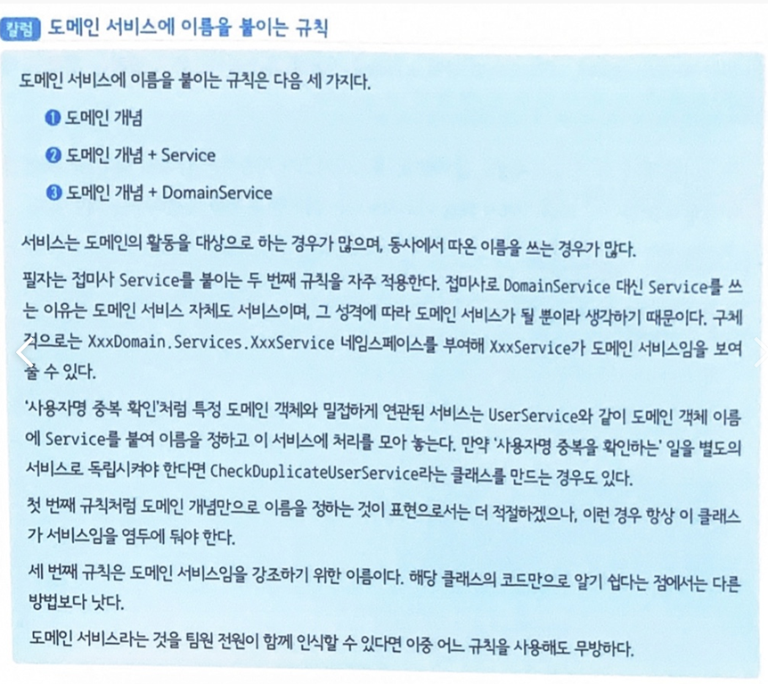

## 22.01.19_[04DDD]부자연스러움을해결하는도메인서비스

## 목차

> 1.서비스란?
>
> > 1.1 도메인 주도 설계에서 말하는 서비스
>
> 2.도메인 서비스란?
>
> > 2.1 값 객체나 엔티티에 정의하기 어색한 행동이란?
> >
> > > 2.1.1 사용자명의 중복 여부 확인하는 코드 User클래스에 추가
> > >
> > > 2.1.2 위의 2.1.1를 사용한 사용자명 중복 확인
> > >
> > > 2.1.3 사용자명 중복 확인에만 쓰이는 인스턴스를 사용하는 경우
> >
> > 2.2 부자연스러움을 해결해 주는 객체
> >
> > > 2.2.1 사용자 도메인 서비스를 이용해 사용자명 중복 확인
>
> 3.도메인 서비스를 남용한 결과
>
> > 3.1 도메인 서비스는 가능한 한 피할 것
> >
> > 3.2 엔티티/값 객체와 함께 유스케이스 수립하기
> >
> > > 3.2.1 사용자 엔티티 확인
> > >
> > > 3.2.2 사용자 생성 처리 구현
> > >
> > > 3.2.3 [컬럼] 도메인 서비스의 기준
>
> 4.물류 시스템의 도메인 서비스 예
>
> > 4.1 거점의 행동으로 정의 하기 
> >
> > 4.2 운송 도메인 서비스 정의하기
>
> 5.정리

- 도메인 개념을 녹이고 값 객체나 엔티티의 행동으로 구현하려면 어딘가 어색한 부분이 생기는 경우가 있음
  - 이 어색한 느낌은 특히 도메인에서 일어나는 활동을 코드로 옮겼을때 자주 나타남
  - 어색한 것을 해결하지 않고, 값 객체의 행동을 억지로 구현하면 객체의 책임이 왜곡될 수 있음
- 해결책은 어색한 느낌을 낳는 이 행동을 별도의 객체로 분리해 정의하는 것
  - 그것이 도메인 서비스이다.

## 1. 서비스란?

- 소프트웨어 개발에서 말하는 서비스는 클라이언트를 위해 무언가를 해주는 객체를 말함
  - 너무 광범위하기도 하고 도메인 주도 설계에만 초점을 맞춰도 서비스가 들어간 용어끼리 의미가 서로 다른 경우도 있어서 상당히 큰 혼란을 야기한다.

### 1.1 도메인 주도 설계에서 말하는 서비스

- 크게 두가지로 나뉜다.
- **첫 번째** 도메인을 위한 서비스
- **두 번째** 애플리케이션을 위한 서비스
  - 서비스의 의미가 혼란스러운 이유는 위 두 가지를 혼동하기 때문

## 2. 도메인 서비스란?

- 값 객체나 엔티티 같은 도메인 객체에는 객체의 행동을 정의 할 수 있음
  - 예를 들면 사용할 수 있는 문자열의 길이나 문자의 종류에 제한이 있다면 
    - 이러한 지식은 사용자명을 나타내는 값객체에 정의 될 것

-  그러나 시스템에는 값 객체나 엔티티로 구현하기 어색한 행동이 있음
  - 도메인 서비스는 이런 어색함을 해결해주는 객체

### 2.1 값 객체나 엔티티에 정의하기 어색한 행동이란?

- 현실에서는 동명이인이 충분히 있을 수 있음
  - 하지만, 시스템에서는 사용자명을 중복으로 사용할 수 없게 하는 경우는 많음
- 사용자명에 중복을 허용하지 않는 것은 도메인의 규칙이고,
  - 따라서 도메인 객체에 행동으로 정의돼야 함

#### 2.1.1 사용자명의 중복여부 확인하는 코드 User클래스에 추가

```c#
class User
{
    private readonly UserId id;
    private UserName name;
    
    public User(UserId id, UserName name){
        if(id == null) throw new ArgumentNullException(nameof(id));
        if(name == null) threow new ARgumentNullException(nameof(id));
        
        this.is = id; 
        this.name = name;
    }
    
    //사용자명 중복 여부 확인 코드 추가
    public bool Exists(User user)
    {
        //사용자명 중복을 확인하는 코드
        //생략
    }
}
```

- 여기서 중요한 것은 중복을 확인하는 수단이 User클래스의 행동으로 정의돼 있다는 것
- 객체의 정의만 보면 문제가 없으나, 위 코드는 자연스럽지는 않음

#### 2.1.2 위의 2.1.1를 사용한 사용자명 중복 확인

```c#
var userId = new UserId("id");
var userName = new UserName("smith");
var user = new User(userId, userName);

//새로만든 객체에 중복 여부를 묻는 상황이 됨
var duplicateCheckResult = user.Exists(user);
Consol.WriteLine(duplicateCheckResult); // true? false;
```

- 위 처럼 사용자명 중복을 확인하는 처리는 User 클래스에 정의돼 있어서
  - 결국 자기 자신에게 중복 여부를 묻는 상황이 됨
  - 중복 여부 확인을 새로 생성한 객체에 맡기면 개발자가 혼란을 일으키기 쉬움
    - 사용자명 중복을 확인하는 목적으로만 사용되는 전용 인스턴스를 만들어보면 더좋을것 같음

#### 2.1.3 사용자명 중복 확인에만 쓰이는 인스턴스를 사용하는 경우

```c#
var userId = new UserId("id");
var userName = new USerName("smith");
var user = new User(userId, userName);

// 새로 만든 객체의 중복 여부를 묻는 상황이 됨
var duplicateCheckResult = user.Exists(user);
Console.WriteLine(duplicateCheckResult);// true? false?

// 4-3
var checkId = new UserId("check");
var checkName = new UserName("checker");
var checkObject = new USer(checkId, checkName);
var userId = new UserId("id");
var userName = new UserName("smith");

// 사용자명 중복 확인용 객체에 중복 여부를 문의함
var duplicateCheckResult = checkObject.Exists(user);
Console.WriteLine(duplicateCheckResult);
```

- 위의 코드를 보게 되면 자기 자신에게 자신의 사용자명 중복 여부를 묻지 않아도 된다는 부자연스러움이 사라짐
- 단, 사용자명 중복 확인을 위해 만든 checkObject가 사용자를 나타내는 객체이면서 사용자가 아니라는 점에서 부자연스러움이 남음
  - 엔티티로 구현한 사용자 객체에 사용자명 중복 처리를 구현하는 것은 부자연스러운 코드의 전형적인 예
    - 이런 부자연을 해결해주는 것이 도메인 서비스

### 2.2 부자연스러움을 해결해주는 객체

- 도메인 서비스도 일반적인 객체와 다른 것이 없음
- 사용자에 대한 도메인 서비스는 아래와 같이 정의 한다.

```c#
class UserService
{
    public bool
    {
        // 사용자명 중복을 확인
        //생략
	}
}
```

- 도메인 서비스는 자신의 행동을 바꿀 수 있는 인스턴스만의 값을 갖지 않는다는 점에서 값 객체나 엔티티와 다르다.
- 현재는 중복을 확인하는 메서드가 UserService클래스 안에 정의 된것 만 알면됨

#### 2.2.1 사용자 도메인 서비스를 이용해 사용자명 중복 확인

```c#
var userService = new UserService();

var userId = new UserId("id");
var userName = new UserName("john");
var user = new User(userId, userName);

//도메인 서비스에 요청하기
var duplicateCheckResul = userService.Exists(user);
Console.WriteLine(duplicateCheckResult);
```

- 위와 같이 도메인 서비스를 이용하면 자기 자신에게 중복 여부를 확인하거나 중복 확인에만 사용되고 버려질 인스턴스를 만들 필요가 없어짐

## 3. 도메인 서비스를 남용한 결과

- 도메인 서비스는 엔티티나 값 객체에 정의하기 부자연스러운 처리를 위해 사용

-  이때, 중요한 것은 부자연스러운 처리에만 한정해야함

  - 그렇지 않는 다면 모든 처리가 도메인 서비스에 정의되는 결과를 낳음

- **도메인 서비스에 정의된 사용자명 수정 처리**

  ```c#
  class UserService
  {
      public void ChangeName(User user, Username name)
      {
      	if(user == null) throw new ArgumentNullException(nameof(user));
          if(name == null) throw new ArgumentNullException(nameof(name));
          
          user.Name = name;
      }
  }
  ```

  - 위 처럼하면 User클래스의 코드는 어떻게 될까?

- **위의 코드에서 사용될 User 클래스의 정의**

  ```c#
  class User
  {
      private readonly UserId id;
      
      public User(UserId id, UserName name){
  		this.id = id;
          Name = name;
      }
      
      public UserName Name{get; set;}
  }
  ```

  -  모든 처리를 도메인 서비스에 구현하면 엔티티에는 게터와 세터만 남음
  - 이렇게 되면 아무리 숙련된 사람이라도 사용자 객체의 처리 내용이나 적용되는 도메인 규칙을 발견하기 어려움
  - 도메인 객체가 원래 포함했어야 할 지식이나 처리 내용을 모두 도메인 서비스나 애플리케이션 서비스에 빼앗겨 자신이 제공할 수 있는 정보가 없는 도메인 객체를 생성함
    - 이것을 빈혈 도메인 모델이라고함

- **User 클래스에 정의된 사용자명 변경 처리**

  ```c#
  class User
  {
      private readonly UserId id;
      private UserName name;
      
      public User(UserId id, USerName)
      {
          this.id = id;
          this.name = name;
  	}
      
      public void ChangeUserName(UserName name)
      {
          if(name == null) throw new ArgumentNullException(nameof(name));
          this.name = name;
  	}
  }
  ```

### 3.1 도메인 서비스는 가능한 한 피할 것

- 어떤 행위를 값 객체나 엔티티에 구현할지 아니면 도메인 서비스에 구현할지 망설여진다면
  - 엔티티나 값 객체에 정의하는 것이 좋으며, 도메인 서비스에 행위를 구현하는 것은 가능한 피해야 함
- 이를 남용하면 데이터와 행위가 단절돼 로직이 흩어지지 쉬움
  - 소프트웨어의 변겨에 대한 유연성을 확보하려면 중복되는 코드를 제거하기 위한 노력을 한시도 포기해서는 안됨

### 3.2 엔티티/값 객체와 함께 유스케이스 수립하기

- 도메인 서비스는 값 객체나 엔티티와 함께 사용
- 도메인 서비스 사용법을살펴보기 위해 실제 유스케이스 세워보자
  - 이 유스케이스도 역시 사용자, 그 중에서도 사용자 생성 처리를 소재로 함
- 사용자 생성 처리의 명세는 단순
  - 클라이언트가 사용자명을 지정해 사용자 생성 처리를 호출
  - 중복이 없는 사용자명이라면 사용자를 생성해 저장
    - 여기서 사용할 데이터스토어는 일반적인 관계형 DB를 대상으로 함

#### 3.2.1 사용자 엔티티 확인

- 우선 사용자를 나타내는 User 클래스를  정의

```c#
Class User
{
    public User(UserName name)
    {
        if(name == null) throw new ArgumentNullException(nameof(name));
        
        Id = new UserId(Guid.NewGuid().ToString());
        Name = name;
    }
    
    public UserId Id (get;)
    public UserName Name {get;}
}
```

- 사용자는 id로 식별되는 엔티티
  - 그리고 사용자 생성 처리 중에는 User 클래스의 행동은 필요치 않으므로 정의하지 않음

- **UserId 클래스와 UserName 클래스의 정의**

  ```c#
  class UserId
  {
      public UserId(string value)
      {
          if(value == null) throw new ArgumentNullException(valueof(value));
          
          Value = value;
      }   
      public string Value {get;}
  }
  
  class UserName
  {
      public UserName(string value)
      {
          if(value = null) throw new ArgumentNullException(valueof(value));
          if(value.Length < 3) throw new ArgumentException("사용자명은 3글자 이상이어야 함", nameof(value));
          
          Value = value;
  	}
      
      public string Value {get;}
  }
  ```

  - UserId와 UserName은 모두 데이터를 래핑했을 뿐인 단순한 값 객체
    - 단, UserName은 세 글자 미만의 사용자명에 대해 예외를 발생 시켜 사용자명이 세 글자 이상이 되게 강제

#### 3.2.2 사용자 생성 처리 구현

```c#
class Program
{
    public void CreateUser(string userName){
		var user = new User(
        	new UserName(userName)
        );
        var userService = new UserService();
        if(userService.Exists(user))
        {
            throw new Exception($"{userName}은 이미 존재하는 사용자명임");
        }
        
        var connectionString = ConfigurationManager.ConnectionString["FooConnection"].ConnectionString;
        using (var Connection = new SqlConnection(connectionString))
        using (var command = connection.CreateCommand())
        {
            connection.Open();
            command.CommandText = "INSERT INTO users (id, name) VALUES(@id, @name)";
            command.Parameters.Add(new SqlParmeter("@id", user.Id.Value));
            command.Parameters.Add(new SqlParmeter("@name", user.Name.Value));
            command.ExecuteNonQuery();
		}
    }
}
```

- **도메인 서비스의 구현**

  ````c#
  class UserService
  {
      public bool Exists(User user)
      {
          Var connectionString = ConfigurationManager.ConnectionString["FooConnection"].ConnectionString;
          using (var connection = new SqlConnection(connectionString))
          using (var command = connection.CreateCommand())
          {
              connection.Open();
              command.CommandText = "SELECT * FROM users WHERE name = @name";
              command.Parameters.Add(new SqlParameter("@name", user.Name.Value));
              using (var reader = command.ExecuteReader())
              {
                  var exist = reader.Read();
                  return exist;
              }
  		}
  	}
  }
  ````

  - 사용자명이 중복되는지 확인하려면 데이터스토어의 중복 여부를 물어봐야함
  - 이때문에 UserService 클래스의 사용자명 중복 확인 처리는 처음부터 끝까지 데이터스토어를 다룸

- 위의 코드는 바른 코드지만 유연하지 않음
  -  NoSQL 데이터 베이스로 바꿀 필요가 있다면?
  - 사용자 생성 처리는 본질적으로 아무 변화가 없음에도 코드의 대부분을 수정해야 함
    - 특히 UserService클래스는 모든 코드를 NoSQL 데이터 베이스를 다루는 코드로 수정하지 않으면 안됨

#### 3.2.3 [컬럼] 도메인 서비스의 기준

- 도메인 서비스는 도메인 모델을 코드상에 나타냈다는 점에서는 값 객체, 에티티와 같음
- 사용자명의 중복을 확인하는 처리를 도메인 서비스로 구현했던것 같은 경우 도메인 서비스가 입출력을 포함하는 처리를 다뤄서는 안 된다는 의견에 부합
- 데이터스토어는 본래 도메인에는 없는 존재
  - 앱 구축을 위해 추가된 앱만의 관심사
    - 그러므로 도메인 개념이나 지식을 코드로 옮긴 대상인 도메인 객체가 데이터 스토어를 직접 다루는 것은 바람직하지 못함
  - 도메인 객체는 오로지 도메인 모델만을 나타내야함
- 개인적으로 어떤 처리를 도메인 서비스로 만들어야 할지를 판단할 때 
  - 그 처리가 도메인에 기초한 것인지를 중요하게봄
  - '사용자명 중복'이라는개념이 도메인에 기초한 것이라면 이를 구현하는 서비스도 도메인 서비스이어야함
- 반대로, 앱을 만들며 필요하게 된 것이라면 도메인 서비스가 아님
  - 그런 처리는 앱서비스로 정의해야함
- 물론 입출력이 가능한 도메인 서비스로 다루지 말아야 한다는 점에는 동의함
  - 이점을 고려한 상태에서 필요하다면 입출력이 포함된 처리를 도메인 서비스로 만들 수도 있다는 얘기

## 4. 물류 시스템의 도메인 서비스 예

- 데이터 스토어 같은 인프라스트럭처와 엮이지 않고 도메인 객체만 다루는 것도 있음
  - 오히려 그런 도메인 서비스가 진짜
- 물류시스템을 예로 들면 화물이 직접 배송지로 보내지는 것이 아니라 현재 거점에서 배송지에 가까운 거점을 거쳐 배송

```c#
거점 ---운송--> 거점 ---배송--> 배송지
```

### 4.1 거점의 행동으로 정의하기

- 거점은물류 도메인에서 중요한 개념으로 엔티티 형태로 정의

```c#
class PhysicalDistributionBase
{
    //생략
    
    public Baggage Ship(Baggage baggage)
    {
        //생략
	}
    
    public void Receive(Baggage baggage)
    {
        //생략
	}
}
```

- 거점은 출고(ship)와 입고(Receive)라는 행위를 갖음
  - 출고와 입고는 함께 다뤄져야 하는 활동
  - 프로그램에서는 출고와 입고가 빠짐 없이 함께 일어나도록 운송 처리를 갖춰야함
- 운송 처리를 준비하기 전에 운송 처리를 어디에 구현해야 할지 생각해 보면
  - 거점에서 거점으로 화물이 이동하는 운송은 거점에서 시작
  - 우선 거점에 운송 처리를 정의 해보면 아래와 같음

```c#
class PhysicalDistributionBase
{
    //생략
    
    public void Transport(PhtsicalDistributionBase to, Baggage baggage)
    {
        var shippedBaggage = Ship(baggage);
        to.Receive(shippedBaggage);
        
        // 운송 기록 같은 것도 필요할 것
    }
}
```

- 위처럼 Transport메서드를 이용하는 한 출고와 입고는 함께 이루어짐
- 그러나, 거점에서 거점으로 직접 화물이 이동하는 것은 어딘가 이상
- 실제라면 추가적으로 필요한것이 많음 이들 처리도 모두 거점 객체가 수행하면 어딘가 어색하면서 다루기도 까다로울 것

### 4.2 운송 도메인 서비스 정의하기

- 운송이라는 행위는 아무래도 특정 객체의 행위로 정의하기에는 들어맞지 않는 부분이 있음

- 이번에는 거점 대신 운송을 맡을 별도의 도메이 서비스로 정의

  ```c#
  class TransportService
  {
      pulbic void Transport(PhysicalDistributionBase from, PhysicalDistributionBase to, Baggage baggage)
      {
          var shippedBaggage = from.Ship(baggage);
          to.Receive(shippedBaggage);
          
          //운송 기록을 남김
          //생략
      }
  }
  ```

  - 이제 배송 기록을 남겨야할 필요가 생겨도 위화감 없이 처리 가능
  - 어떤 처리를 객체 안에 정의했을 때 잘 들어맞지 않는 느낌이 든다면 이 처리를 도메인 서비스로 옮기면 자연스럽게 나타낼 수 있음

  

## 5. 정리

- 도메인에는 도메인 객체에 구현하기에 자연스럽지 못한 행위가 있음
- 이런 행위는여러 개의 도메인 객체를 가로질러 이뤄지는 처리인 경우가 많음
  - 도메인 서비스는 이럴 때 활용하는 객체
- 그렇다고 너무 무리하게 도메인 서비스로 바꾸면 빈혈 도메인 모델이 생김
  - 즉, 행위가 빈약한 객체는 절자척 프로그래밍으로 빠지기 쉽기 떄문에 도메인 지식을 객체 행위로 나타낼 기회를 잃게 됨
