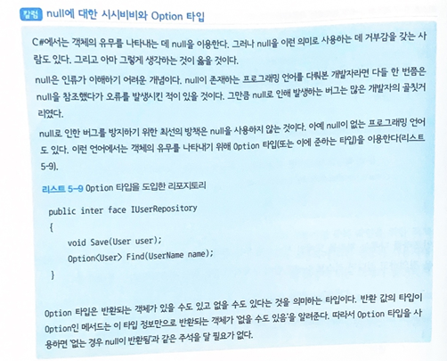

## 22.02.01_DDD05.데이터와관계된처리를분리하자-리포지토리

## 목차

> 0.리포지토리
>
> 1.리포지토리란 무엇인가?
>
> 2.리포지토리의 책임
>
> 3.리포지토리의 인터페이스
>
> 4.SQL을 이용하는 리포지토리 구현하기
>
> 5.테스트로 구현 검증하기
>
> > 5.1 테스트가 필요한 작업 확인하기
> >
> > 5.2 기도하는 자의 테스트 이론
> >
> > 5.3 기도는 이제 그만
>
> 6.테스트용 리포지토리 만들기
>
> 7.객체-관계 매핑이 적용된 리포지토리 구현하기
>
> 8.리포지토리에 정의되는 행동
>
> > 8.1 객체의 저장과 관계된 행위
> >
> > 8.2 저장된 객체의 복원과 관계된 행위9.정리

## 0.리포지토리

- 리포지토리는 퍼시스턴시를 담당
- SW 를 계속 성장시키려면 코드의 의도를 명확히 해야함
- 객체를 저장하고 복원하는 퍼시스턴시 처리도 물론 중요하지만,
  - 데이터 스토어를 다루는 코드는 프로그램의 의도를 가리기 쉬움
- 의도가 잘 드러나게 하려면 데이터스토어와 관련된 처리를 따로 떼어내야 함
- **리포지토리**는 이러한 처리를 추상적으로 다룰 수 있게 해주며 따라서 코드의 의도가 더 잘 드러나게 해줌
  -  그외에도 데이터 관련처리를 리포지토리에 맡기면 데이터 스토어를 쉽게 교체하는 효과도 기대할 수 있음
  - 이를 통해 테스트 실행이 쉬어지며, 나아가 프로그램의 변경도 쉬워짐
  - 이는 소프트웨어의 유연성에 기여하는 중요한 패턴임

## 1.리포지토리란 무엇인가?

- 리포지토리의 일반적인 의미는 보관창고  
  - 소프트웨어에서 말하는것도 데이터 보관창고를 의미
- 소프트웨어로 도메인 개념을 표현했다고 해서 그대로 앱이 되는것은 아님
  - 프로그램을 실행할 때, 메모리에 로드된 데이터는 프로그램을 종료하면 사라짐
- 특히, 엔티티는 생애주기를 갖는 객체이기 때문에 프로그램의 종료와 함께 객체가 사라져서는 안됨
  - 객체를 다시 이용하려면 데이터스토어에 객체 데이터를 저장 및 복원할 수 있어야함
  - 리포지토리는 데이터를 저장하고 복원하는 처리를 추상화하는 객체
- 객체 인스턴스를 저장할 때는 데이터스토어에 기록하는 처리를 직접 실행하는 대신 리포지토리에 객체의 저장을 맡기면 됨
  - 또 저장해 둔 데이터에서 다시 객체를 읽어 들일 때도 리포지토리에 객체의 복원을 맡김


- 위와 같은 방법으로 리포지토리를 거쳐 간접적으로 데이터를 저장 및 복원하는 방식을 취하면 SW의 유연성이 놀랄 만큼 향상


## 2. 리포지토리의 책임

- 도메인 객체를 저장하고 복원하는 퍼시스턴시임

  - 퍼시스턴시라고 하면 무조건 관계형 데이터베이스를 떠올리는 사람이 많지만,
  - 퍼시스턴시의 기반 기술은 데이터베이스 외에도 다양

- **까다로운 절차를 그대로 도메인 코드에 노출** - 4장에 나왔던 사용자 생성 처리 코드

  ```c#
  class Program
  {
      public void CreateUser(string userName)
      {
          var user = new USer(
  			new UserName(userName)        
          );
          
          var userService = new UserService();
          if(userService.Exists(user))
          {
              throw new Exception($"{userName}은 이미 존재하는 사용자명임");
          }
          
          var connectionString = ConfigurationManger.ConnectionString["FooConnection"].ConnectionString;
          using (var connection = new SqlConnection(connectionString))
          using (var command = connection.CreateCommand())
          {
              connection.Open();
              command.CommandText = "INSERT INTO users (id, name) VALUES(@id, @name)";
              command.Parameters.Add(new SqlParameter("@id, user.Id.Value"));
              command.Parameters.Add(new SqlParameter("@name, user.Name.Value"));
              command.ExecuteNonQuery();
          }
      }
  }
  ```

  - 위 코드는 코드의 앞부분은 사용자 생성 및 사용자명 중복 확인을 맡은 코드임을 쉽게 알 수 있음

    - 그러나 후반부는 일단 SqlConnection을 이용해 관계형 데이터 베이스에 접근함을 알 수있고,
      - 단, 그 내용이 User객체 인스턴스를 저장하는 내용이라는 것까지 파악하려면 코드를 자세히 읽지 않으면 안됨

  - **위에서 쓰인 UserService의구현 코드**

    ```c#
    class UserService
    {
        public bool Exists(User user)
        {
            var connectionString = ConfigurationManager.ConnectionString["FooConnection"].ConnectionString;
            using (var connection = new SqlConnection(connectionString))
            using (var command = connection.CreateCommand())
            {
            	connection.Open();
                command.CommandText = "SELECT * FROM users WHERE name = @name";
                command.Parameters.Add(new SqlParameter("@name, user.Name.Value"));
                using(var reader = command.ExecuteReader())
                {
                    var exist = reader.Read();
                    return exist;
                }
            }
    	}
    }
    ```

  - 위의 UserService의 Exists메서드는 처음부터 끝까지 관계형 데이터베이스를 다루는 코드로 돼 이음
  - 사용자명 중복을 어떻게 판단하는지 그 과정을 이해 할 수 있음
  - 사용자명 중복 금지 규칙은 이 처리 내용을 자세히 읽고 어떤 쿼리를 전송하는지 까지 봐야 알 수 있는 정보임
    - 사용자 생성 처리와 사용자명 중복 확인 처리 모두 바르게 동작하지만, 코드의 대부분이 데이터 스토어를 조작하는 코드로 가득 차 있어 코드의 의도를 이해하기가 어려움

- 데이터 스토어를 직접 다루는 퍼시스턴시 관련 처리를 추상적으로 뽑아내면 이 코드의 의도를 좀 더 잘 드러낼 수 있음

- **리포지토리를 이용하는 사용자 생성 처리**

  ```c#
  Class Program
  {
      private IUserRepository userRepository;
      
      public Program(IUserRepository userRepository)
      {
          this.userRepository = userRepository;
  	}
      
      public void CreateUser(string userName)
      {
          var user = new User(
          	new UserName(userName)
          );
          
          var userService = new UserService(userRepository);
          if(userService.Exists(user))
          {
              throw new Exception($"{userName}은 이미 존재하는 사용자명임");
          }
          
          userRepository.Save(user);
      }
  }
  ```

  - User 객체의 퍼시스턴시는 리포지토리 IUserRepository 객체가 맡아 수행
  - 데이터스토어가 관계형 DB든 NoSql DB든, 아니면 그냥 파일이라도 도메인 입장에서는 중요한 문제가 아님
    - 중요한 것은 인스턴스를 어떤 수단을 통해 저장하느냐 하는 것
  - 데이터 스토어에 대한 명령을 추상화함으로써 데이터 스토어를 직접 다루는 까다로운 코드에서 해방되고,
  - 사용자 생성과 관련된 순수한 로직만 남은 코드가 됨
    - 따라서 코드가 의도하는 바가 뚜렷해지고 굳이 주석을 통해 부연 설명할 필요도 사라짐

  - **리포지토리를 이용하는 도메인 서비스의 구현 코드**

    ```c#
    class UserService
    {
        private IUserRepository userRepository;
        
        public UserService(IUserRepository userRepository)
        {
            this.userRepository = userRepository;
        }
        
        public bool Exists(User user)
        {
        	var found = userRepository.Find(user.Name);
            
            return found != null;
        }
    }
    ```

    - DB를 다루는 코드로 절반 이상이 채워졌던 도메인 서비스 코드가 리포지토리를 거쳐 인스턴스를 복원해
      - User 객체의 중복 확인은 사용자명을 기준으로 한다 라는 의도를 더 명확히 드러냄
    - 지금까지 봤듯이 리포지토리는 객체의 현재 상태를 저장 및 복원하는 퍼시스터시를 담당하는 객체
    - 객체의 퍼시스턴시와 관련된 처리를 리포지토리에 맡기면 비즈니스 로직을 더욱 순수하게 유지할 수 있음

## 3.리포지토리의 인터페이스

- 리포지토리는 인터페이스로 정의됨

- **User 클래스의 리포지토리의 인터페이스**

  ```c#
  public interface IUserRepository
  {
      void Save(User user);
      User Find(UserName name);
  }
  ```

  - 사용자 생성 처리를 구현하려면 인스턴스를 저장하는 처리와 사용자명 중복 확인을 위한 객체 복원 처리가 필요
    - 따라서 IUserRepository도 인스턴스를 저장하기 위한 행동과 사용자명으로 인스턴스를 복원하는 행동을 제공
    - 복원을 시도할 때 대상이 되는 객체가 발견되지 않은 경우에는 null을 반환해 해당 객체가 발견되지 않음을 나타낸것 

- **리포지토리에 사용자명 중복 확인 메서드 추가하기**

  ```c#
  public interface IUserRepository
  {
      void Save(User user);
      User Find(UserName name);
      bool Exists(User user);
  }
  ```

  - 그러나 리포지토리의 책임은 객체의 퍼시스턴시까지임
  - 사용자명의 중복 확인은 도메인 규칙에 가까우므로 이를 리포지토리에 구현하는 것은 리포지토리의 책임에 벗어난다.
    - 만약 리포지토리에 Exists메서드가 정의된다면 리포지토리의 구현에 따라 동작 내용이 바뀔 가능성이 있음
    - 사용자명 중복확인은 도메인 서비스가 주체가 되는 것이 옳음

- **위의 소스는 사용자명 중복 확인의 주체가 도메인 서비스가 아니게됨**

  ```c#
  class UserService
  {
      private IUserRepository userRepository;
      //생략
      
      public bool Exists(User user)
      {
          //중복 확인이 사용자명 기준이라는 지식이 도메인 객체에서 누락됨
          return userRepository.Exists(user);
  	}
  }
  ```

  - 인프라를 다루는 처리를 도메인 서비스에 두는 것이 꺼려져 리포지토리에 사용자명 중복 확인 을 정의 하고 싶은 경우 아래와 같이 중복 확인 키를 전달하는 형태가 좋음

- **리포지토리에 사용자명 중복 확인을 정의한 경우**

  ```c#
  public interface IUserRepository
  {
      //생략
      
      public bool Exists(UserName name);
  }
  ```

  - 이 외에도 리포지토리에 정의할 만한 행동으로, User의 식별자인  UserId를 이용한 사용자 검색 메서드들을 생각해 볼 수 있음
    - 추가 해도 좋지만 항상 현시점에서 필요한 최소한 정의만 작성하면 됨




## 4. SQL을 이용하는 리포지토리 구현하기

- 인터페이스 준비 했으니, 리포지토리 구현할 차례

- 첫 번째로 구현하는 리포지토리는 이 관계형 데이터베이스를 다루는 리포지토리

  ```c#
  public class UserRepository : IUserRepository
  {
      private string connectionString = configurationManager.ConnectionString["DefaultConnection"].ConnectionString;
      
      public void Save(User user)
      {
          using(var connection = new SqlConnection(connectionString))
          using(var command = connection.CreateCommand())
          {
              connection.Open();
              command.CommandText = @"
              MERGE INTO users
              	USING (
              		SELECT @id AS id @name AS name
              	)AS DATA
              	ON userd.id = data.id
              	WHEN MATCHED THEN
              		UPDATE SET name = data.name
              	WHEN NOT MATCHED THEN
              		INSERT (id, name)
              		VALUE (data.id, data.name);
              ";
              command.Parameters.Add(new SqlParameter("@id", user.Id.Value));
              command.Parameters.Add(new SqlParameter("@namd", user.Name.Vlaue));
              command.ExcuteNonQuery();
          }
  	}
      //생략
  }
  ```

  - UserRepository클래스의 Save 메서드는 User클래스의 인스턴스를 관계형 데이터베이스에 저장하기 위해 UPSERT(기존의 데이터가 있다면 UPDATE, 없다면 INSERT)함

  - UPSERT처리를 구현하는 방법은 자신을 찾는 Select쿼리를 전달해 데이터가 존재하는지 여부를 따져 분기해도 좋고, 예제 코드에서 보듯이 DB 고유의 문법(MERGE)을 사용해도 됨

    - 비지니스 로직에서 특정한 기술에 의존하는 구현은 바람직하지 않지만 
    - 리포지토리의 구현 클래스라면 특정 기술에 의존하는 구현도 문제가 없음

  - **SQL을 이요하는 리포지토리 구현(Find 메서드)**

    ```c#
    public class UserRepository : IUserRepository
    {
        //생략
        
        public User Find(UserName userName)
        {
            using(var connection = new SqlConnection(connectionString))
            using(var command = connection.CreateCommand())
            {
                connection.Open();
                command.CommandText = "SELECT * FROM users WHERE name = @name";
                command.Parameters.Add(new SqlParameter("@name", userName.Value));
                using(var reader = command.ExecuteReader())
                {
                    if(reader.Read())
                    {
                        var id = reader["id"] as string;
                        var name = reader["name"] as string;
                        
                        return new User(
                        	new UserId(id),
                            new UserName(name)
                        );
                    }
                    else
                    {
                        return null;
                    }
                }
            }
    	}
    }
    ```

    - Find 메서드는 인자로 받은 데이터로 user테이블을 조회한 다음User객체의 인스턴스를 복원해 반환
      - 해당 데이터가 없다면 null 반환

- **Program 클래스에 리포지토리를 인자로 전달**

  ```C#
  var userRepository = new UserRepository();
  var program = new Program(userRepository);
  program.CreateUser("john");
  ```

  - Program 클래스는 IUserRepository를 다루지만, 실제 객체는 UserRepository
    - 따라서 IUserRepository의 Save 메서드가 호출되면 UserRepository의 Save메서드로 제어가 넘어가면서 UPSERT처리가 실행됨
  - UserDomainService도 마찬가지로 IUserRepository의 Find메서드를 호출하면 UserRepository의 Find메서드가 실행되며 관계형 데이터베이스에서 객체를 복원함


- 이렇게 인터페이스를 잘 활용하면 Program 클래스에서 퍼시스턴시와 관련된 구체적인 처리를 구현하지 않아도 객체 인스턴스를 데이터 스토어에 저장할 수 있음

## 5.테스트로 구현 검증하기

- SW개발시 테스트는 필수적
- 테스트는 동작을 확인하는 목적 외에 SW유연성을 향상시키기도 함
  - 테스트가 미리 갖춰져 있으면 코드를 변경한 후에 테스트를 실행해 보고 원래 있던 기능이 제대로 동작하는지를 확인 할 수 있음

### 5.1 테스트가 필요한 작업 확인하기

- 데이터 베이스를 설치하는 것은 한번이지만 테이블은 그렇지 않음
  - 로직마다 다른 테이블이 필요해서 로직이 늘어남에 따라 테이블도 추가해야함
    - 여러가지 기능이 있는 처리는 더 어려움

### 5.2 기도하는 자의 테스트 이론

- 테스트에 드는 수고가 점점 커지면 테스트를 성실히 하지 않게 됨
- 테스트를 거치지 않은 코드에 개발자가 할 수 있는 일은 그저 기도뿐이다.
- 기도한다고 프로그램의 오류가 고쳐지지 않음

### 5.3 기도는 이제 그만

- 테스트에 나서게 하는 방법
  - 첫 번째 공포에 의한  통제
  - 두 번째 효율적인 테스트를 만드는 것
    - 시스템을 개발하는 사람이라면 후자를 택해야함

- 효율적인 테스트를 만드는 방법 알아보자
  - 지금의 문제가 테스트를 위해 데이터베이스를 설치하고, 테이블을 만드는 등 준비 작업이 너무 복잡하다는 것
  - DB를 사용하지 않으면됨 
    - 즉, 데이터베이스가 없는 테스트용 리포지토리를 쓰는 것

## 6.테스트용 리포지토리 만들기

- 테스트만을 위한 특정한 인프라를 갖추는 것은 매우 번거로움

  - 이를 해결하기 위해 메모리를 데이터스토어 삼는 방법
    - 인스턴스를 저장하는 매체로 메모리를 이용하고 싶을 때 가장 쉬운 방법은 딕셔너리

- **딕셔너리를 기반으로 구현한 리포지토리**

  ``` c#
  class InMemoryUserRpository: IUserRepository
  {
      //테스트케이스에 따라 데이터를 확인해야 하는 경우도 있음
      //확인을 위해 위부에서 접근할 수 있게 public으로 함
      public Dictionary<UserId, User> Store {get; } = new Dictionary<UserId, User>();
      
      public User Find(UserName userName)
      {
          var target = store.Values.FirstOrDefault(user => userName.Equals(user.Name));
          
          if(target != null){
              //인스턴스를 직접 반환하지 않고 깊은 복사한 사본을 반환
              return Clone(target);
          }
          else 
          {
              return null;
  		}
      }
      
      public void Save(User user){
          //저장 시에도 깊은 복사를 수행
          Store[user.Id] = Clone(user);
      }
      
      //깊은 복사를 담당하는 메서드
      private User Clone(User user){
  		return new User(user.Id, user.Name);
      }
  }
  ```

  - 데이터는 평범한 딕셔너리에 저장
  - 인덱스는 객체의 식별자 역할을 하는 값 객체를 사용
  - 값 객체를 딕셔너리의 인덱스로 사용하면 Equals와 GetHashCode 메서드를 오버라이드 해야함
    - 이들 메서드를 오버라이드 할 수 없는 상황이라면 래핑된 실제 값을 인덱스로 써도 됨

- **반복문으로 구현한  Find 메서드**

  ```c#
  public User Find(UserName name)
  {
      foreach(var elem in Store.Values)
      {
          if(elem.Name.Equals(name))
          {
             return Clone(elem);
  		}
      }
      
      return null;
  }
  ```

  - 위는 검색 결과로 찾은 인스턴스를 그대로 반환하는 것이 아니라 깊은 복사를 통해 만든 새로운 객체를 반환
    - 이렇게 하는 이유는 복원된 인스턴스를 조작했을 때 리포지토리에 저장된 객체에 그 영향이 미치지 않게 하기 위함

- **객체에 대한 조작이 리포지토리의 객체에도 영향을 미치는 경우**

  ``` c#
  //객체를 복원할 때 깊은 복사를 하지 않으면
  var user = userRepository.Find(new UserName("John"));
  //복원된 객체에 대한 조작이 리포지토리에 저장된 객체에도 영향을 미침
  user.ChangeUserName(new UserName("john"));
  ```

- 위와 같은 이유로 Save 메서드에서도 인스턴스를 저장할 때 깊은 복사를 한단.

  - 그래서 리포지토리에 저장된 인스턴스가 영향을 받지 않게 함

- **리포지토리 내부의 객체가 저장 후에도 영향을 받는 경우**

  ```c#
  //여기서 인스턴스를 바로 리포지토리에 저장하면
  userRepository.Save(user);
  //인스턴스에 대한 조작이 리포지토리에 저장된 객체에도 영향을 미침
  user.ChangeUserName(new UserName("john"));
  ```

- **사용자 생성 처리 테스트**

  ```c#
  var userRepository = new InMemoryUserRepository();
  var program = new Program(userRepository);
  program.CreateUser("john");
  
  //리포지토리에서 데이터를 꺼내 확인함
  var head = userRepository.Store.Values.First();
  Assert.AreEqual("john", head.Name);
  ```

## 7.객체-관계 매핑이 적용된 리포지토리 구현하기

- 요새는 ORM(객체 - 관계 매핑)을 사용하는 스타일이 주류를 이룸

- **객체-관계 매핑 라이브러리 EntityFramwork를 이용해 구현한 리포지토리**

  ```c#
  public class EFUserRepository : IUserRepository
  {
      private readonly MyDbContext context;
      
      public EFUserRepository(MyDbContext context)
      {
          this.context = context;
  	}
      
      public User Find(UserName name)
      {
          var target = context.Users.FirstOrDefault(userData => userData.Name == name.Value);
          if(target == null)
          {
              return null;
  		}
          
          return ToModel(target);
  	}
      
      public void Save(User user)
      {
          var found = context.Users.Find(user.Id.Value);
          
          if(found == null)
          {
              var data = ToDataModel(user);
              context.Users.Add(data);
          }
          eles
          {
              var data = Transfer(user, found);
              context.Users.Update(data);
          }
          
          context.SaveChanges();
  	}
      
      private User ToModel(UserDataModel from)
      {
          return new User(
          	new UserId(from.Id),
              new UserName(from.Name)
          );
  	}
      
      private UserDataModel Transfer(User from, UserDataModel model)
      {
          model.Id = from.Id.Value;
          model.Name = from.Name.Value;
          
          return model;
  	}
      
      private UserDataModel ToDataModel(User from)
      {
          return new UserDataModel{
              Id = from.Id.Value,
              Name = from.Name.Value,
          };
      }
  }
  ```

  - 네임스페이스를 이용해 EF.UserRepository라는 이름의 클래스로 만들어도 무방

-  EntityFramwork에서 데이터 스토리지로 이용하는 객체(데이터 모델)를 엔티티라고 부름

  - UserDataModel은 EntityFramework의 엔티티임

- **EntityFramwork가 직접 사용하는 데이터 모델**

  ```c#
  [Table("Users")]
  public class userDataModel{
      [DatabaseGenerated(DatabaseGeneratedOption.None)]
      public string Id {get; set;}
      
      [Required]
      [MinLength(3)]
      public string Name {get; set;}
  }
  ```

- **네임스페이스를 이용해 User 클래스로 정의한 데이터 모델**

  ```c#
  namespace Infrastructure.DataModel.Users
  {
      [Table("Users")]
      public class User
      {
          [DatabaseGenerated(DatabaseGeneratedOption.None)]
          public string Id {get; set;}
          
          [Required]
          [MinLength(3)]
          public string name {get; set;}
  	}
  }
  ```

  - 중요한것은 도메인 객체가 도메인 지식을 나타내는 데 집중하게 하는 것
  - 특정한 기술에서만 사용될 케터와 세터를 도메인 객체에 추가하는 것은 바람직하지 못함

- EFUserRepository는 IUserRepository인터페이스를 구현하므로 Program클래스에 그대로 인자로 전달 할 수 있음

- **EntityFramwork를 이용해 구현한 리포지토리로 테스트하기**

  ```c#
  var userRepositroy = new EFUserRepository(MyContext);
  var program = new Program(userRepository);
  program.CreateUser("smith");
  
  //리포지토리에서 테이터를 꺼내 확인한다.
  var head = myContext.Users.First();
  Assert.AreEqual("smith", head.Name);
  ```

  - 리포지토리의 구현체만 바뀌었을뿐 Program클래스의 인스턴스가 생성된 뒤의 처리 내용은 인 메모리 리포지토리를 이용한 테스트 코드와 같음

## 8. 리포지토리에 정의되는 행동

- 리포지토리에 정의되는 행위는 객체의 저장 및 복언에 대한 것

### 8.1 객체의 저장과 관계된 행위

- **객체를 저장하는 행동**

  ```c#
  interface IUserRepository
  {
      void Save(User user);
      //생략
  }
  ```

- **수정할 항목만을 인자로 받는 수정 처리(나쁜 예)**

  ```c#
  interface IUserRepository
  {
      void UpdateName(UserId id, UserName name);
      //생략
  }
  ```

  - 위와 같이 정의 하면 리포지토리에 수많은 수정 메서드가 생김

- **불필요하게 많은 수정 메서드가 정의된 리포지토리(나쁜예)**

  ```c#
  interface IUserRepository
  {
      void UpdateName(UserId id, UserName name);
      void UpdateEmail(UserId id, Email mail);
      void UpdateAddress(UserId id, Address address);
      //생략
  }
  ```

  - 객체가 저장하고 잇는 데이터를 수정하려면 애초부터 객체 자신에게 맡기는 것이 옳음
  - 생애주기를 갖는 객체는 필요를 다하면 파기해야 함
    - 이를 지원하는 것도 리포지토리의 역활

- **객체를 파기하는 행위가 정의된 리포지토리**

  ```c#
  interface IUserRepository
  {
      void Delete(User user);
      //생략
  }
  ```

### 8.2 저장된 객체의 복원과 관계된 행위

저장된 객체를 복원하는 행위 중에 가장 자주 쓰이는 것은 식별자로 검색을 수행하는 메서드다

- **식별자를 키로 객체를 검색하는 메서드**

  ```c#
  interface IUserRepository
  {
      User Find(UserId id);
      //생략
  }
  ```

  - 원래 사용자 중복 여부를 확인하기 위해 식별자를 키로 삼을 수 있지만 모든 객체를 받아와야하는 경우도 있음

- **저장된 모든 객체를 복원하는 메서드**

  ```c#
  interface IUserRepository
  {
      List<User> FindAll();
      //생략
  }
  ```

- **검색에 적합한 메서드의 예**

  ```c#
  interface IUserRepository
  {
      User Find(UserName name);
      //오버로딩을 지원하지 않은 언어라면 이름을 바꿔가면서 베리에이션을 만듦
      //User FindByUserName(UserNaem name);
      //생략
  }
  ```

  - 위와 같은 메서드라면 검색의 키가 될 데이터를 인자로 전달받기 때문에 리포지토리의 구현체도 최적화된 검색을 수행할 수 있음

## 9.정리

- 로직이 특정한 인프라스트럭처 기술에 의존하면 SW가 경직되는 현상이 일어남
- 리포지토리를 이용하면 데이터 퍼시스턴시와 관련된 처리를 추상화 할 수 있음
  - 이정도의 변화만으로도 SW유연성 놀랄 만큼 향상
  - 예를 들면 개발 초기에 어떤 데이터스토어를 채용할지 결정하기 전이라도 인메모리 리포지토리 등을 이용해 먼저 구직 구현 작업을 할 수 있음
  - 그리고 언제든지 테스트도 실시 할 수 있음
- 도메인 규칙과 비교하면 어떤 데이터스토어를 사용할지는 사소한 문제임
- 리포지토리를 잘 활용해 코드의 의도를 명확히 하면 뒷날 개발자에게 큰 도움이 됨