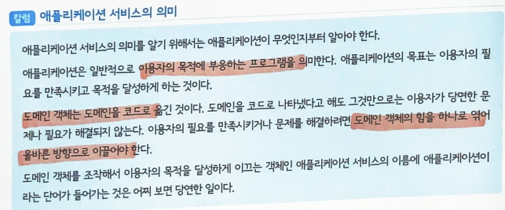
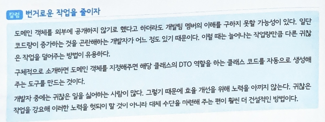

## 22.02.02_[06DDD]유스케이스를구현하기위한애플리케이션서비스

- 애플리케이션 서비스는 도메인 객체를 서로 협조하게 해서 유스케이스를 구현
- 값 객체나 엔티티 같은 도메인 객체는 도메인 모델을 코드로 표현한 객체
- 이용자의 문제를 해결해주는 SW가 되려면 이들 도메인 객체가 한 덩어리가 되어 문제를 해결할 수 있게 이끌어야함
- 앱 서비스는 도메인 객체가 수행하는 태스크를 관리하고 문제를 해결하게 이끄는 존재

## 1.애플리케이션 서비스란 무엇인가?

- 한마디로 표현하면 유스케이스를 구현하는 객체
- 사용자 등록해야하는 시스템에서 사용자 기능을 구현하기 위해
  - 사용자 등록하기 유스케이스
  - 사용자 정보 수정하기 유스케이스가 필요
- 사용자 기능에 대한 애플리케이션 서비스는 유스케이스를 따라서
  - 사용자 등록하기 행위와 사용자 정보 수정하기 행위를 정의
- 이들 행위는 도메인 객체를 실제로 조합해 실행되는 스크립트 같은 것



## 2. 유스케이스 수립


- 사용자 기능을 구현하기 위해 필요한 `사용자 등록하기` `정보 받아오기` `정보 수정하기` `탈퇴하기`
- CRUD처리에 해당함
  - 네가지 처리는 시스템을 개발하기 위한 기본으로, 앱 서비스를 만들어보는 튜토리얼 소재로 적합

### 2.1 도메인 객체 준비하기

- **사용자를 나타내는 엔티티**

  ```c#
  public class User
  {
      //인스턴스를 처음 생성할 때 사용함
      public User(UserName name)
      {
          if(name == null) throw new ArgumentNullException(nameof(name));
          
          Id = new UserId(Guid.NewGuid().ToString());
          Name = name;
  	}
      
      //인스턴스를 복원할 때 사용
      public User(UserId id, UserName name)
      {
          if(id == null) throw new ArgumentNullException(nameof(id));
          if(name == null) throw new ArgumnetNullException(nameof(name));
          
          Id = id;
          Name = name;
  	}
      
      public UserId Id {get;}
      public UserName Name {get; private set;}
      
      public void ChangeName(UserName name)
      {
          if(name == null) throw new ArgumentNullException(nameof(name));
          
          Name = name;
      }
  }
  ```

  - 사용자는 동일성을 식별하기 위한 속성 UserId를 가지며, 사용자 정보에 해당하는 속성은 사용자명뿐
  - 모든 속성이 값 객체로 정의되어 있으나, 지금은 특별한 행위가 없으므로 거의 원시 타입을 단순히 래핑한 상태나 마찬가지

- **User 클래스가 사용하는 값 객체 타입의 정의**

  ```c#
  public class UserId
  {
      public UserId(string value)
      {
          if(string.IsNullOrEmpty(value)) throw new ArgumentException("value가 null이거나 빈 문자열임");
          
          Value = value;
      }
      
      public string Value{get;}
  }
  
  public class UserName
  {
      public UserName(string value)
      {
          if(value == null) throw new ArgumentNullException(nameof(value));
          if(value.Length < 3) throw new ArgumentNullException("사용자명은 3글자 이상이어야함", nameof(value));
          if(value.Length > 20) throw new ArgumentNullException("사용자명은 20글자 이하이어야함",nameof(value));
          
          Value = value;
      }
      
  	public string Value{get;}    
  }
  ```

- **사용자 도메인 서비스**

  ```c#
  public class UserSevice
  {
      private readonly IUserRepository userRepository;
      
      public UserService(IUserRepository userRepository)
      {
          this.userRepository = userRepository;
      }
      
      public bool Exists(User user)
      {
          var duplicatedUser = userRepository.Find(user.Name);
          
          return duplicatedUser != null;
  	}
  }
  ```

- 사용자 객체의 퍼시스턴시를 구현하기 위해 리포지 토리를 구현

- **사용자 리포지토리**

  ```c#
  public interface IUserRepository
  {
      User Find(UserId id);
      User Find(UserName name);
     	void Save(User user);
      void Delete(User user);
  }
  ```

  - 사용자 도메인 서비스에 사용되는 메서드 이외에 CRUD 처리를 수행하는 퍼시스턴시 및 객체 파기 메서드가 정의됨
    - 그리고 리포지토리를 구현한 클래스는 아직 만들지 않아도됨

### 2.2 사용자 등록 처리 구현하기

- **사용자 등록 처리 구현 코드**

  ```c#
  	public class UserApplicationService
  {
      private readonly IUserRepository userRepository;
      private readonly UserService userService;
      
      public UserApplicationService(IUserRepository userRepository, UserService userService)
      {
          this.userRepository = userRepository;
          this.userService = userService;
  	}
      
      public void Register(string name)
      {
          var user = new User(
          	new UserName(name)
          );
          
          if(userService.Exists(user))
          {
              throw new CanNotRegisterUserException(user, "이미 등록된 사용자임");
          }
          
          userRepository.Save(user);
      }
  }
  ```

  - Program 클래스가 바로 애플리케이션 서비스

### 2.3 사용자 정보 확인 처리 구현하기

- 사용자 등록이 끝나면 사욪아 정보를 확인해야함
- UserApplicationService에 사용자 정보 확인 처리를 추가
  - 사용자 등록과 달리 사용자 정보 확인 처리는 확인된 결과를 반환
    - 이때 도메인 객체를 그래도 반환 값으로 사용할지 말지에 대한 선택이 중요한 분기점이 됨

- **도메인 객체를 그대로 반환하는 사용자 정보 확인 메서드**

  ```c#
  public class UserApplicationService
  {
      private readonly IUserRepository userRepository;
      //생략
      
      public User Get(string userId)
      {
          var targetId = new UserId(userId);
          var user = userRepository.Find(targetId);
          
          return user;
  	}
  }
  ```

  - 전체를 반환하면 화면에 출력은 문제가 없으나 의도하지 않은 도메인 객체의 메서드 호출이 가능해짐

- **의도하지 않은 도메인 객체의 메서드 호출**

  ```c#
  public class Client
  {
      private UserApplicationService UserApplicationService;
      //생략
      
      public void ChangeName(string id, string name)
      {
          var target = userApplicationService.Get(id);
          var newName = new UserName(name);
          target.ChangeName(name);
      }
  }
  ```

  - 사용자 명 변경을 목적으로 하는 코드
    - 이코드를 실행해도 데이터 퍼시스턴시가 수행되지 않으므로 원하는 목적을 달성할 수 없음
  - 여기서 문제는 무의미한 코드가 아니라는것
    - 앱 서비스가 아닌 객체가 도메인 객체의 직접적인 클라이언트가 되어 도메인 객체를 자유롭게 조작하고 있다는 점
    - 도메인 객체의 행동을 호출하는 것은 앱 서비스의 책임
      - 이 구조가 지켜진다면 도메인 객체의 행동을 호출하는 코드가 모두 앱 서비스안에 모여있지만, 
      - 그렇지 않은 경우 여러 곳에 코드가 흩어질 수 있음
    - 이 외에도 도메인 객체에 대한 의존이 많이 발생
      - 도메인의 변화가 즉시 객체에 반영돼야 하는데, 복잡한 의존 관계의 핵심이 되는 코드를 수정하는 것은 숙련된 개발자에게도 조심스러운 작업
    - 도메인 객체를 직접 공개하지 않는 쪽으로 권함
  - 즉, 도메인 객체는 비공개로 남겨두고, 클라이언트에 데이터 전송하는 객체 (DTO, data transfer object)를 만들어 여기에 데이터 옮겨 넣어 반환하는 방법

- **User 클래스의 데이터를 공개하기 위한 목적으로 정의한 DTO**

  ```c#
  public class UserDataModel
  {
      public UserData(string id, string name)
      {
          Id = id;
          Name = name;
  	}
      
      public string Id {get;}
      public string Name {get;}
  }
  ```

  - DTO에 데이터를 옮겨 넣는 처리는 앱 서비스에서 수행

- **도메인 객체에서 DTO로 데이터 옮겨 넣기**

  ```c#
  public class UserApplicationService
  {
      private readonly IUserRepository userRepository;
      //생략
      
      public UserData Get(string userId)
      {
          var targetId = new UserId(userId);
          var user = userRepository.Find(targetId);
          
          var userData = new UserData(user.Id.Value, user.Name.Value);
          return userData;
      }
  }
  ```

  - User클래스의 인스턴스가 외부로 공개되지 않으므로 UserApplicationService의 클라이언트는 User 객체의 메서드를 직접 호출 할 수 없음

- **외부로 공개할 파라미터가 추가될 경우 코드의 수정**

  ```c#
  public class UserApplicationService
  {
      private readonly IUserRepository userRepository;
      //생략
      
      public UserData Get(string userId)
      {
          var targetId = new UserId(userId);
          var user = userRepository.Find(targetId);
          
          //var userData = new UserData(user.Id.Value, user.Name.Value);
          //생성자 메서드의 인자가 늘어남
          var userData = new UserData(user.Id.Value, user.Name.Value, user.MailAddress.V alue);
          return userData;
      }
  }
  ```

  - 위는 간단한 수정이라 기계적으로 할 수도 있지만 UserData객체를 생성하는 곳은 모두 수정이 필요함
    - 정적타입 언어라면 컴파일 에러가 발생하니 수정할 곳을 찾기가 비교적 쉽고,
    - 정규표현식이나 문자열 치환 등을 사용해 수정할 수 도 있지만, 번거롭다
    - 수정이 필요한 곳은 적을수록 좋음

- **도메인 객체를 인자로 받는 DTO의 생성자 메서드**

  ```c#
  public class UserData
  {
      public UserData(User source)//도메인 객체를 인자로 받음
      {
          Id = source.Id.Value;
          Name = source.Name.Value;
      }
      
      public string Id{get;}
      public string Name{get;}
  }
  ```

  - UserData는 생성자 메서드의 인자로 받은 User와 밀접한 관계가 있음
  - UserData타입의 목적이 User 객체의 데이터를 공개하는 것인 만큼 UserData가 User에 의존하는 것은 큰 문제가 되지 않음

- **전용 생성자 메서드를 이용할 때 데이터를 옮겨 넣는 코드**

  ```c#
  var userData = new UserData(user);
  ```

  - 이렇게 하면 파라미터를 나중에 더 추가하더라도 UserData 클래스만 수정하면됨

- **파라미터를 추가하더라도 UserData 클래스만 수정하면됨**

  ```c#
  public class UserData
  {
      public UserData(User source)
      {
          Id = source.Id.Value;
          Name = source.Name.Value;
          MailAddress = source.MailAddress.Value;//속성에 대입
      }
      
      public string Id{get;}
      public string Name{get;}
      public string MailAddress{get;}//추가된 속성
  }
  ```

- 마지막으로  **UserData 클래스를 이용한 사용자 정보 확인 처리 구현 코드**

  ```c#
  public class UserApplicationService
  {
      private readonly IUserRepository userRepository;
      //생략
      
      public UserData Get(string userId)
      {
          var targetId = new UserId(userId);
          var user = userRepository.Find(targetId);
          
          if(user == null)
          {
              return null;
          }
          
          return new UserData(user);
      }
  }
  ```

  - DTO쓰면 어느정도 성능 저하는 발생 하지만 많은 양을 옮겨 담는 것이 아니라면 미미함
    - 오히려 불필요한 의존을 줄이고 도메인 객체의 변경을 방해받지 않는 것이 편익에 더 큼

