## 22.02.16_CICD를위한E2ETEST

## 1.Sofrware Test

- 시스템이 정해진 요구를 만족하는지, 예상과 실제 결과가 어떤 차이를 보이는지 수동 또는 자동 방법을 동원하여 검사하고 평가하는 일련의 과정

## 2.Test & Debug

- 테스팅
  - 결함을 발견하기 위한 활동
- 디버깅
  - 결함의 원인을 찾고, 코드를 수정하는 개발활동

## 3.테스트를 얼마나 작성하시나요?

- 테스트(QA)팀에서 테스트를 작성/수행 한다.
- TDD(Test Driven Development)로 개발한다.
- 개발자가 자동화 테스트를 작성한다.
- 자동화 테스트를 작성하지 않는다.

## 4.테스트를 얼마나 작성하시나요?

- 단위테스트를 작성하시나요?
- 통합테스트를 작성하시나요?
- 스트레스 테스트를 작성하시나요?
- End to End 테스트를 작성하시나요?

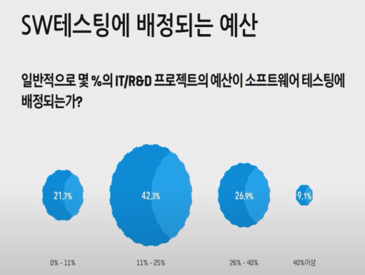

## 5. 스타트업에서 테스트의 어려움

- 테스트 팀/ 인력을 따로 둘 여력이 없음
- 빨리 개발 후 시도해 봐야 해서 테스트 작성하기 어려움
- 의사결정권자가 자동화 테스트가 왜 필요한지 잘 모름
- 개발자가 자동화 테스트가 뭔지 잘 모름

 ## 6.SI에서 테스트의 어려움

- 테스트를 불필요한 비용으로 인식
- 납기가 촉박하기 때문에 테스트를 작성할 여력이 없음
- 고객이 테스트 해 줄 것임

## 7.대기업에서 테스트의 어려움

- 테스트 프로세스 한 사이클이 너무 오래 걸림
- 테스트팀의 전문성이 부족
- 개발팀이 테스트팀을 적으로 인식

## 8.Mostly integration

- Guilermo Rauch
  - Socket.io를 만들었으며 Zeit.co의 파운더
  - 테스트를 작성하자, 너무 많이는 말고, 통합(integration) 테스트 위주로

## 9.단위 테스트

- 소프트웨어의 테스트 가능한 가장 작은 단위의 코드를 테스트하는 기법
- 객체지향 프로그래밍(object-oriented programming)에서는 주로 클래스나 메서드가 테스트 대상
- 하나의 테스트 대상에 대해서 세부적인 논리별로 각각 테스트 케이스를 작성

### 9.1 단위테스트의 문제

- 3/3 Success
  - 사람 머리는 눈을 보고 있고,
  - 팔은 움직이고
  - 다리는 뛰고있고

- 이렇게 세개가 각각 성공했다고 해서 성공한 것은 아님

## 10.통합테스트

- 통합 테스팅은 둘 이상의 시스템 구성요소가 통합되었을 때
  - 기대한 대로 동작하는지 검사하는 것
- 충분히 단위 테스트된 하위 시스템들이라도 상호작용에 문제가 발생할 수 있음
- 통합 테스팅의 목적은 상호작용의 오류들을 검출하는 것

### 10.1 통합테스트의 문제

- 다 각각의 머리 팔 다리가 부터있지만 정상적인 상태가 아닌 것

## 11.Test Pyramid

- 피라미드의 위로 올라갈수록 테스트를 실행하고 작성하는데 더 많은 시간이 들고,
  - 실행하고 유지보수하는데 비용이 많이 든다.
- 피라미드 위로 올라 갈수록 각 테스트의 신뢰성이 증가한다. 

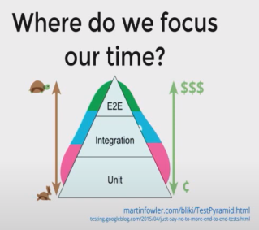

## 12.EndtoEndTest

- E2E(End-toEnd)테스트는 전체 시스템이 제대로 작동하는지 확인 하기 위한 테스트
- API와의 연동도 테스트 항목에 포함되기 때문에 최대한 실제 시스템을 사용하는 사용자 관점에서 시뮬레이션

### 12.1 End to End Test 장점

- 실제 상황에서 발생할 수 있는 에러를 사전에 발견할 수 있음
- 테스트 코드가 실제 코드 내부 구조에 영향을 받지 않기 때문에 큰 범위의 리팩토링에도 깨지지 않음

### 12.2 End to End  Test 단점

- 테스트 작성에 들어가는 비용이 너무 많음
- 테스트 수행 속도가 너무 느림
- 테스트가 주는 피드백의 질이 낮음
  - 실패라는 내용만 주고 그것에 대한 트레이스를 제공하지 않음 그래서 질이 낮음

## 13.CI/CD를 위한 E2E Test

- 주식회사 체커의 김동우씨가 처한 문제
  - TDD는 고사하고 단위테스트도 작성 해본적 없는 개발자
  - 전문테스트(QA) 인력의 부재
  - 고객의 피드백을 빠르게 반영하고 실험해야함

### 13.1 CI/CD

- CI는 개발자를 위한 자동화 프로세스인 지속적인 통합( Continuous integration)
- CD는 지속적인 서비스 제공 (Continuous Deployment)
- 개발자의 변경 사항을 리포지토리에서 고객이 사용 가능한 프로덕션 환경까지 자동으로 릴리스 하는 것

### 13.2 내린 결론

- 스타트업의 생존에 가장 필요한건 계속된 실험을 통한 개선

  - 하지만 제품의 안정성도 중요함

- 모든 테스트 단계를 작성할 수 없다면 E2E Test부터 작성 

  - 단위테스트, TDD 하고 싶다???

- **자동화 된 E2E Test를 통해 제품을 항상 배포 가능한 상태로 유지하자**

  / E2E Test를 통과한다면 배포해 버리자

### 13.3 E2E Test Tools

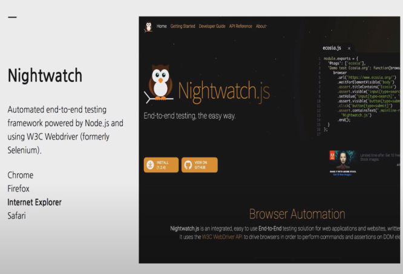

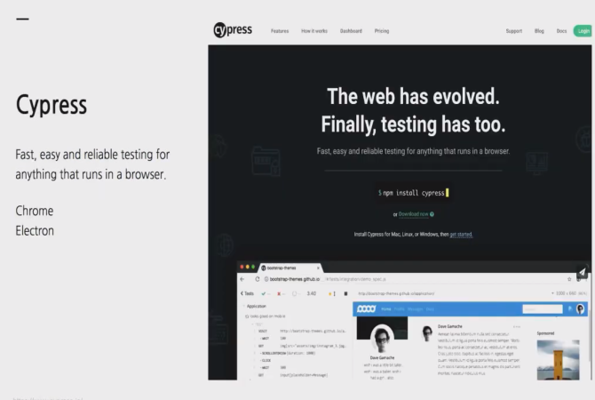

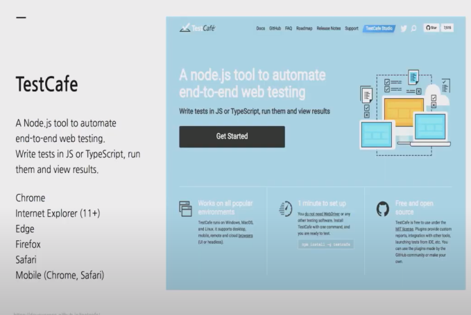

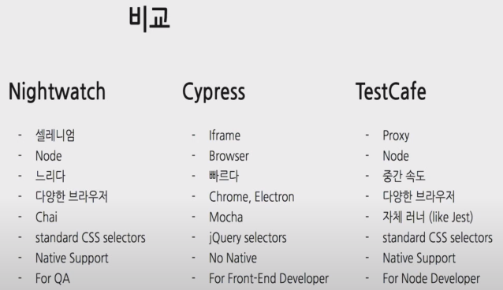

## 14.Testcafe + CI

### 14.1 원하는 프로세스

- 오픈소스처럼 Pull Request 방식으로 일하기
- Pull Request가 제출되면, macOS/ Windows/ Linux에서 E2E Test가 실행되고 결과를 Pull Request에 기록
- 새로운 커밋이 Pull Request에 제출되면 다시 테스트 수행

### 14.2 브랜치 전략

- Alpha 브랜치 : CI/ CD가 적용되어 항상 빌드되고 회사 내부에 계속 배포되는 브랜치 (개밥먹기)
- Feature 브랜치 : Alpha에서 갈라져서 특정한 이슈나 기능을 개발하기 위한 임시 브랜치
- Beta 브랜치 : Production과 같은 설정을 가지고 수동으로 배포되는 브랜치
  - Beta 채널을 수신하는 유저에게 배포됨
- Master 브랜치 : 고객에게 딜리버리 되는 프로덕션 브랜치

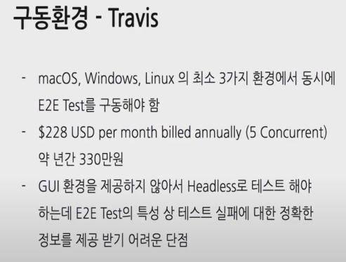

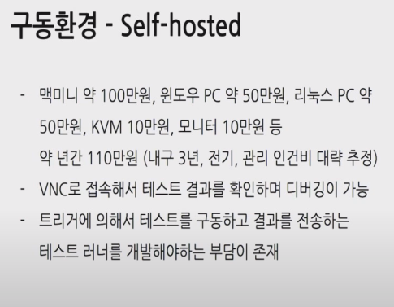

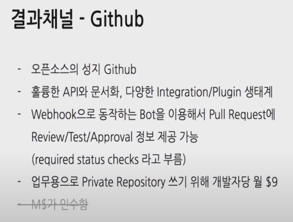

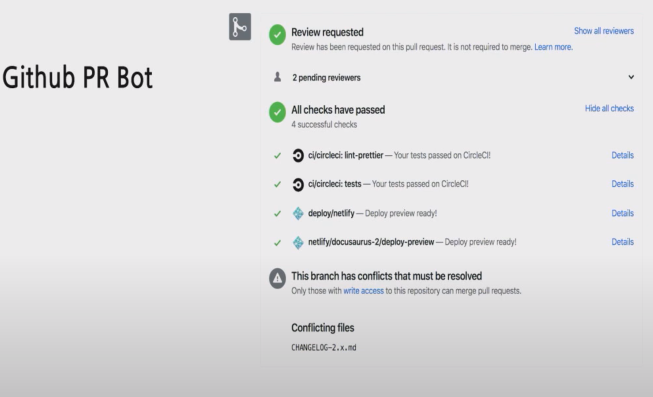

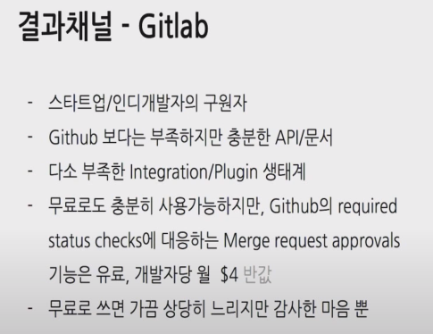

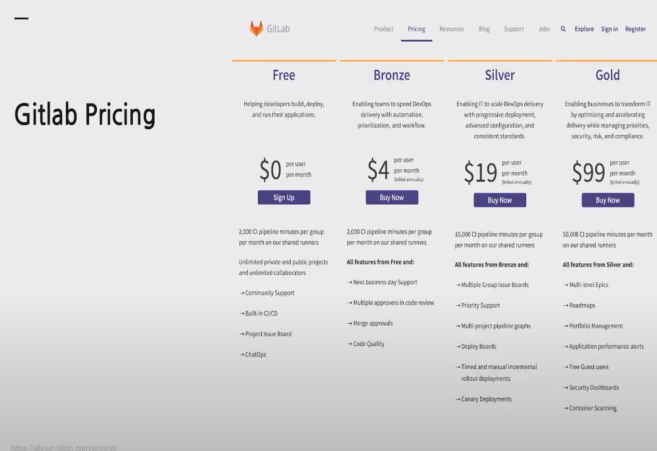

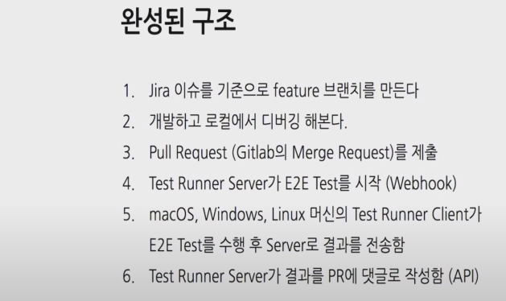

## 15.E2E Test Runner 개발

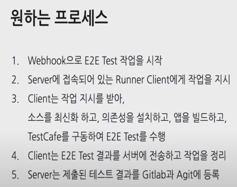

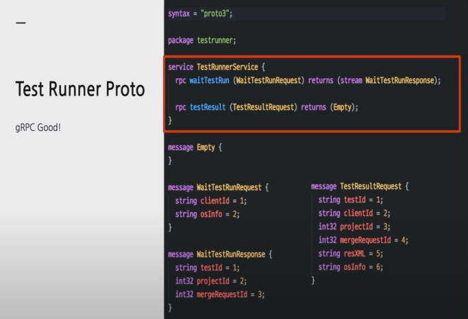

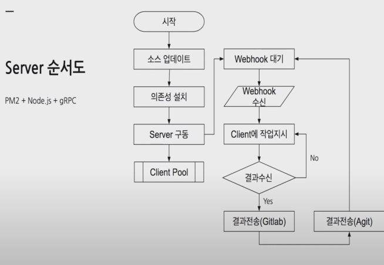

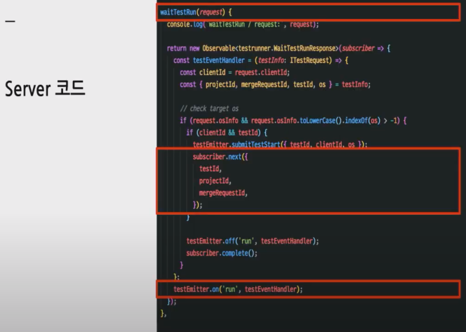

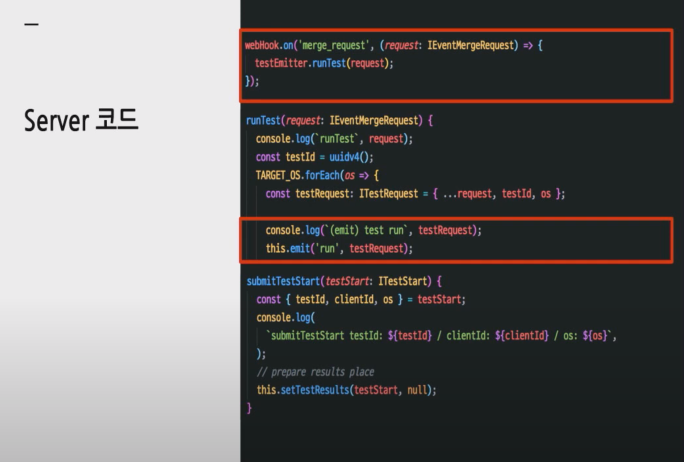

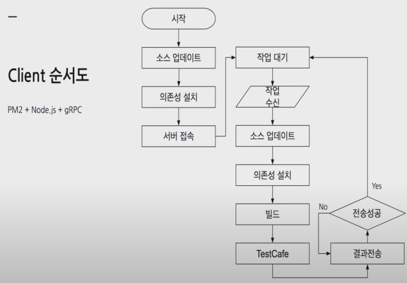

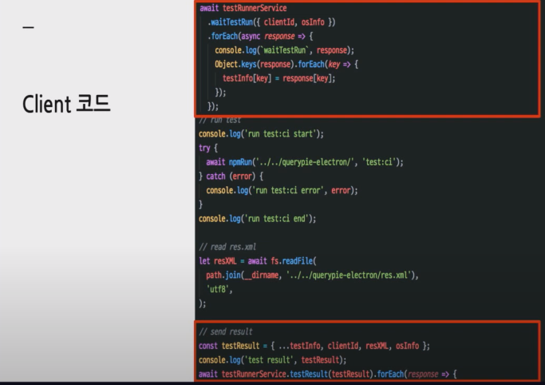

## 16.E2E테스트 작성

- 누가 작성하나?
  - 구조를 잘 알고 있는 프론트엔드 개발자가 유리
  - 셀렉터를 잘 이해하고 있는 여러분

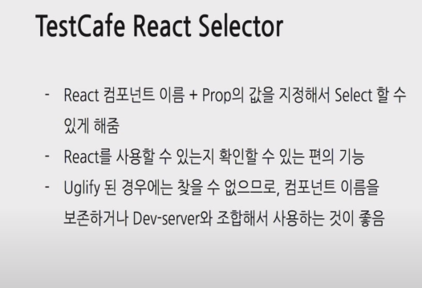

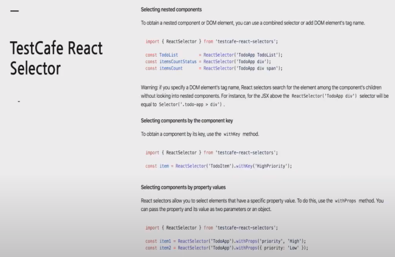

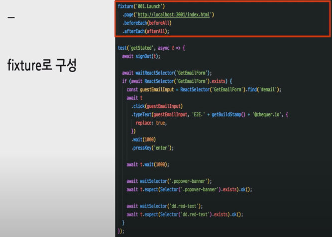

- 테스트의 시작은 fixture로 되어 있음
- page는 유알엘 이동위치 저 유알엘을 불러달라인것