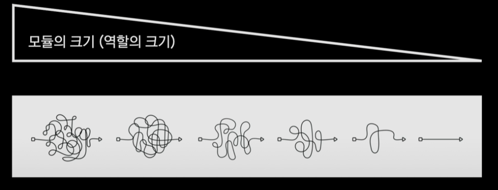
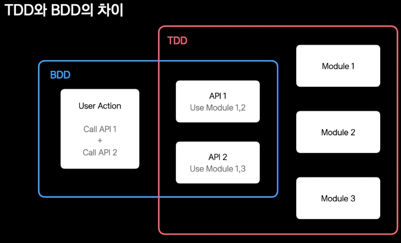
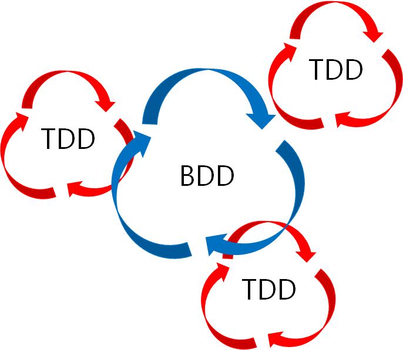
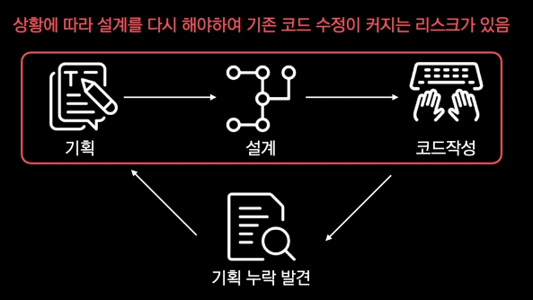
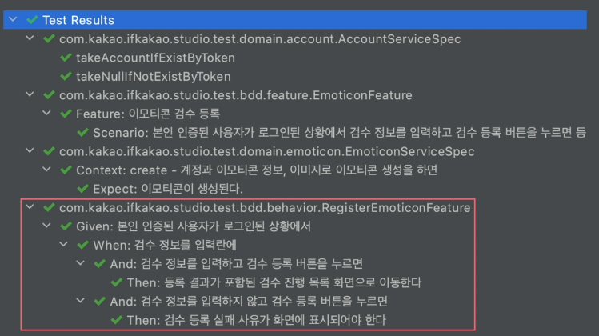
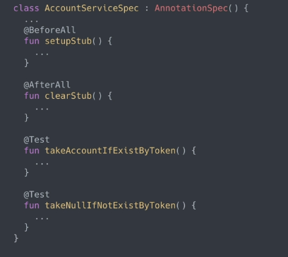
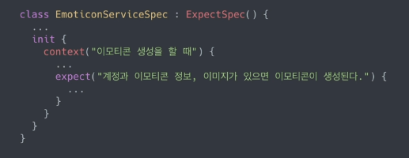
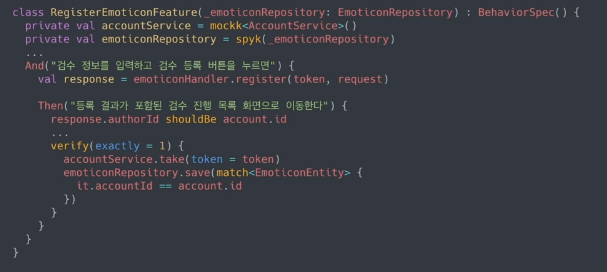
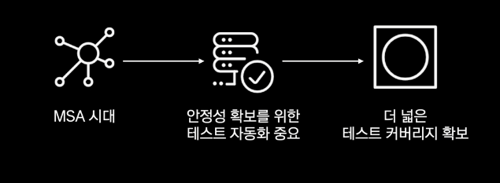

# 22.03.14_TDD, BDD

## 목차

> 01.TDD/BDD란?
>
> > 01.1 TDD
> >
> > > 01.1.1 Testable code
> > >
> > > 01.1.2 왜? TDD 안할까?
> >
> > 01.2 BDD
> >
> > > 01.2.1 테스트케이스로 옮기는 절차와 방법
>
> 02.TDD와 BDD의 차이
>
> > 02.1 목적의 관점에서 차이
>
> 03.kotest를 쓰자
>
> 04.mockk를 쓰자
>
> > 04.1 mockk - mocking
>
> 05.Tests Succeed

## 01.TDD/BDD란?

### 01.1 TDD

- 개발이 테스트 주도로 되는 것
  - 테스트 주도라는 것은?
    - 테스트를 작성하고 테스트가 정상이 될 때까지 개발을 진행한다는 것
    - 테스트를 작성하고 실패한 테스트 코드를 수정하고 다시 테스트 하는 이 반복을 반복하면서 개발하는 것
- 테스트 코드를 만들면 TDD인가?
  - 일반적으로 테스트 코드를 작성하는것은 구현된 코드를 테스트 하기 때문에 테스트코드를 작성하는것이 무조건 TDD가 아님
- TDD구분
  - TDD
    - 테스트 케이스 우선 그다음 코드
  - !TDD
    - 코드 우선 그다음 테스트

#### 01.1.1 Testable code

- `테스트 가능한` 설계로 짜여진 코드 작성
  - 테스트가 가능하려면 모듈의 역할이 명확해야함
  - 그래서 이 모듈을 단순화 하는 과정이 필요
- 그래서 테스트 가능한 코드는 
  - 모듈의 크기를 줄이는 설계를 유도하고
  - 모듈 또는 계층간의 커플링 적게 만들어서 유지보수와 확장에 장점이 있음



#### 01.1.2 왜? TDD 안할까?

- 기술 부채의 악순환
  - TC 창작의 고통
  - 일정 지연 압박
  - Test 포기한 개발/배포
- 필요성 < 비용
- 테스트 코드는 어떻게 ?
  - 이미 작성된 요구사항이나 기획서가 테스트 코드가 되면 고민이 줄어듦
    - BDD가 이것의 핵심

### 01.2 BDD

- Behavior Driven Development
  - TDD에서 파생된 개발 방법론
  - 개발자와 비개발자간의 협업 과정을 녹여낸 방법
  - 사용자의 행위를 작성하고 결과 검증을 진행
  - BDD로 테스트 코드를 작성함에 따라 설계 역시 행위 중심이 되는 도메인 기반 설계가 됨
- 사용자의 행위를 정의하고 그 정의에 따라 개발 하는 것
  - 어려워하는 테스트 케이스를 이미 정의된 사용자 행위로 작성
    - 사용자 행위는 기획자들이 작성한 요구사항이나 기획서에 적혀있는데 이를 토대로 작성하면됨


#### 01.2.1 테스트케이스로 옮기는 절차와 방법

- **Given(주어진 환경), When(행위), Then(기대결과)**
  - **Given(주어진 환경)**
    - 사용자 행위시 주어지는 환경을 서술
  - **When(행위)**
    - 실제 사용자의 행위를 서술 
  - **Then(기대결과)**
    - 그 행위에 따른 기대 결과 서술

- **예시**
  - 이모티콘 스튜디오 검수 등록 화면 기획서
    - 검수 등록 필수 조건: 서비스 사입 여부, 로그인 여부, 본인 인증 여부
    - 검수 등록 입력 사항: 이모티콘 정보, 이모티콘 이미지
    - 등록시 
      - 정상 등록된 경우 : 검수 진행 목록으로 이동하여 등록된 내용이 표시되어야함
      - 등록이 실패된 경우 : 등록 실패 사유가 표시되어야 함 

---

- **BDD 구조화하기 | 이모티콘 스튜디오 검수 등록 화면 기획서 기반 BDD TestCase**
  - **Given**
    - 본인 인증된 사용자가 로그인된 상황에서
  - **When**
    - 검수 정보를 입력하고 검수 등록 버튼을 누르면
    - 검수 정보를 미입력하고 검수 등록 버튼을 누르면
  - **Then**
    - 등록 결과가 포함된 검수 진행 목록 화면으로 이동
    - 검수 등록 실패 사유가 화면에 표시되어야함

## 02.TDD와 BDD의 차이

- TDD로도 충분할 것 같은데 왜? BDD로 하는가?

### 02.1 목적의 관점에서 차이

| TDD                                                | BDD                                                          |
| -------------------------------------------------- | ------------------------------------------------------------ |
| 테스트할 모듈의 기능을 확인하는 관점에서 작성이 됨 | 시나리오 주체를 기준으로 한 행위를 확인하기 위한 관점에서 작성이 됨 |
| 계산기로 이해는 차이                               |                                                              |
| add(1,1)이 2인지 확인                              | 사용자가 =를 눌렀을 때 1+1의 값 2가 화면에 표시되는 것       |



- BDD는 TDD에서 파생된 개념으로 TDD의 관점에서 보기 어려운 유저 시나리오의 흐름을 확인할 수 있음
  - 하지만, BDD의 테스트케이스로만 만족하지는 못함 
  - 그래서 BDD의 테스트 케이스로 시나리오 테스트를 진행하고,
    - 해당 시나리오에서 사용되는 각 모듈들은 TDD테스트로 검증을 해야 기대하는 테스트 커버리지를 가질 수 있음
- BDD와 TDD를 하나만 선택하는 것이 아닌 둘은 상호 보완 관계이다.





- 위의 리스크를 줄이기 위해서 기획 검토가 충분히 이루어져야함


- 기획시나리오를 테스트 케이스 작성시 누락되는 부분을 알 수 있음
  - 예를 들어서 위와 같이 BDD를 하면서 위의 예제에서 아래와 같은 부분이 누락되었음을 알 수 있게됨
    - 본인 인증 안된 사용자가 로그인된 상황에서
    - 본인 인증이 어려운 미성년 사용자가 로그인된 상황에서
      - 위의 두가지를 BDD를 이용하면 코드 작성시 발견하게 되어 크게 코드를 수정하는 일을 방지할 수 있음

|                            | TDD                                          | BDD                                        |
| -------------------------- | -------------------------------------------- | ------------------------------------------ |
| 테스트 코드의 목적?        | 기능 동작의 검증                             | 서비스 유저 시나리오 동작의 검증           |
| 테스트 코드의 설계 중심은? | 제공할 모듈의 기능 중심                      | 서비스 사용자 행위 중심                    |
| 테스트 코드 설계 재료는?   | 모듈 사양 문서(개발자가 작성)                | 서비스 기획서(서비스 기획자가 작성)        |
| 어떤 프로젝트에 적합한가?  | 모듈/ 라이브러리 프로젝트                    | 서비스 프로젝트                            |
| 장점은?                    | 설계 단계에서 예외 케이스들을 확인할 수 있음 | 설계 단계에서 누락된 기획을 확인할 수 있음 |

## 03.kotest를 쓰자

- 코틀린을 사용하는 경우 

  - kotest is a flexible and comprehensive testing tool for Kotlin with Multiplatform support

- BDD : 

  - BehaviorSpec

    - Given/ When/ Then 구조를 지원하는 BDD용 Style

      ```kotlin
      class RegisterEmoticonFeature : BehaviorSpec(){
      ...
          init{
              Given("본인 인증된 사용자가 로그인된 상황에서"){
      		...
              	When("검수 정보를 입력란에"){
                  ...
                      And("검수 정보를 입력하고 검수 등록 버튼을 누르면"){
                      ...
                          Then("등록 결과가 포함된 검수 진행 목록 화면으로 이동한다.")
      				}
                  }
                  	And("검수 정보를 입력하지 않고 검수 등록 버튼을 누르면"){
                      ...
                          Then("검수 등록 실패 사유가 화면에 표시되어야 한다."){
                          ...    
                          }
      			}
              }
          }
      }
      ```

      

  - FeatureSpec

    - Feature/ Scenario 구조를 지원하는 BDD용 Style
      - Givne, When, Then으로 구조화 하기 이전에 기능의 시나리오를 작성하게 되는데 더 구조화 하지 않고 테스트 케이스 작성시 사용
        - 행위자를 특정하기 어렵고 그 기능에 대해서 쓰여진 기획에서 유용함

    ```kotlin
    class EmoticonFeature : FeatureSpec(){
        ...
        init{
            feature("이모티콘 검수 이메일 발송"){
    		...
                scenario(""2022-03-14 10:00:00(KST)에 전날 생성된 이모티콘 목록을 검수자에게 이메일 발송 되어야 한다.""){
                   ...
                }
            }
        }
    }
    ```

- TDD

  - AnnotationSpec

    - JUnit형태의 Testcase작성을 하게 해주는 TDD용 Style

      

  - ExpectSpec

    - DSL로 Testcase 작성을 하게 해주는 TDD용 Style

      

## 04.mockk를 쓰자


- mocking library for Kotiln

### 04.1 mockk - mocking

- mock을 생성하여 어떠한 행위를 할 것 인지에 대하여 사전 정의

- 외부 서비스의 사용 등

  

  - every를 사용하여 사전 정의

- 해당하는 행위가 원하는 대로 시행이 되었는지 검증

  

  - [참고소스링크](https://github.com/harry-jk/ifkakao-2020-code)

## 05.Tests Succeed



- BDD를 통해서 필요성을 올리고 비용을 낮출수 있음
- **결론**
  - BDD는 기획서를 통한 TestCase작성으로 작성에 대한 비용 감소
  - TDD보다더 더 넓은 테스트 커버리지 확보가능
    - 설계 변경에 따른 리스크 최소화
    - 서비스의 이해도 증가
