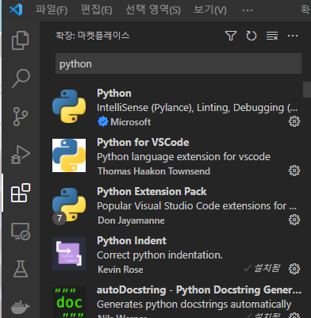
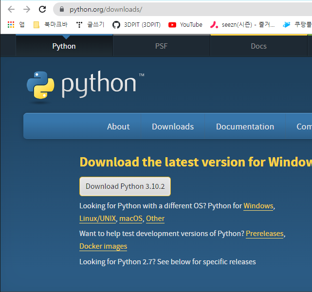

## 22.02.19_python설치및실행

## 목차

> 1.vscode의 extension설치
>
> 2.python설치 사이트
>
> 3.소스코드
>
> 4.실제 동작

## 1. vscode의extension설치



- python
- python for VSCode
- ptython Extension Pack
  - 세개 설치를 진행

## 2.python설치 사이트



- [설치링크](https://www.python.org/downloads/)

##  3.소스코드

```python
import turtle
import colorsys
t = turtle.Turtle()
s = turtle.Screen()
s.bgcolor('black')
t.speed(0)
n = 80
h = 0
for i in range (302):
  c = colorsys.hsv_to_rgb(h,1,0.8)
  h+= 1/n
  t.color(c)
  t.left(104)
  t.forward(i*3)
  for j in range (3) :
    t.left(5)
    t.forward(i*2)
    t.left(52)
```

## 4.실제 동작

