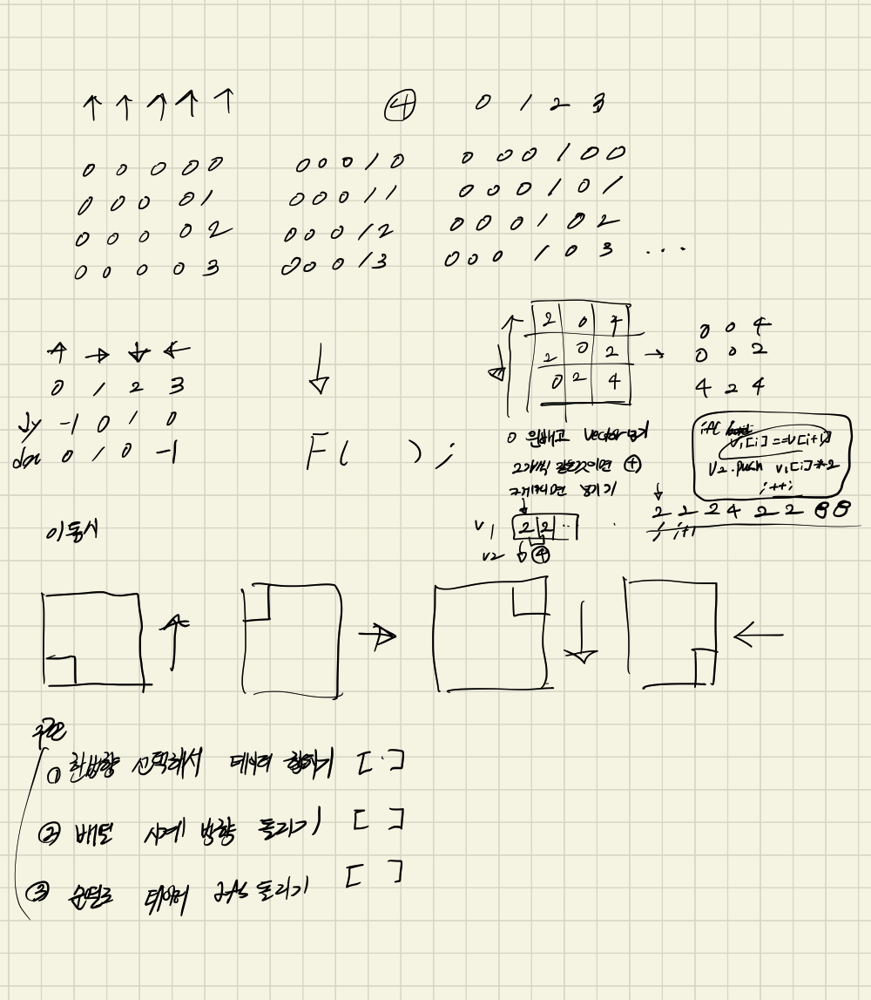
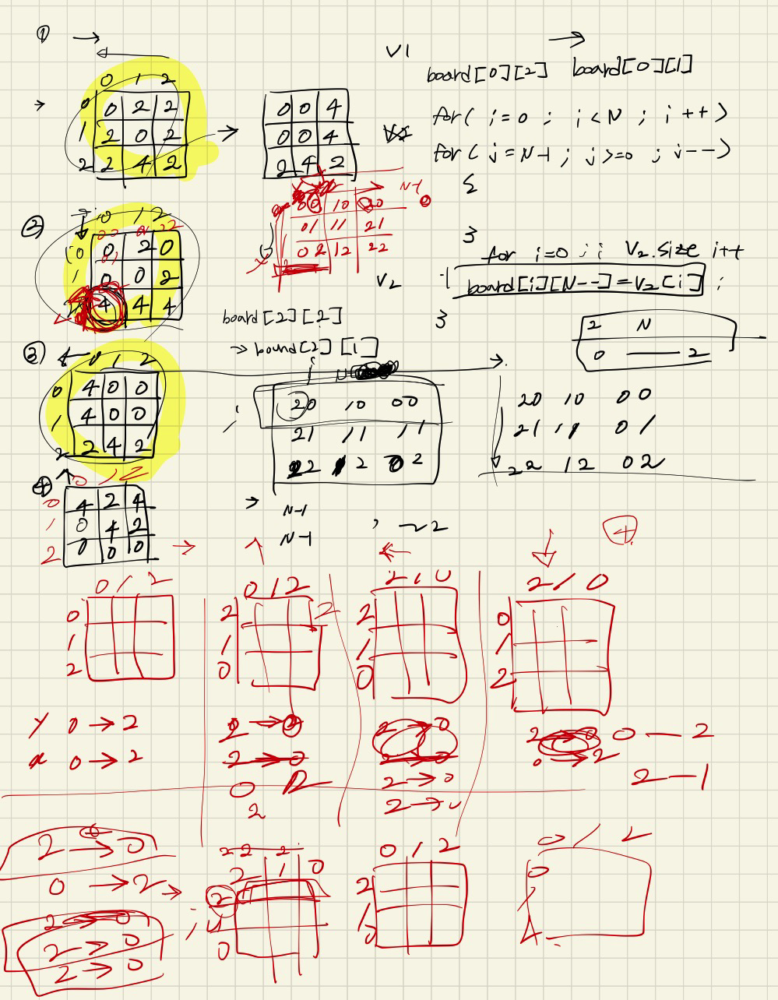
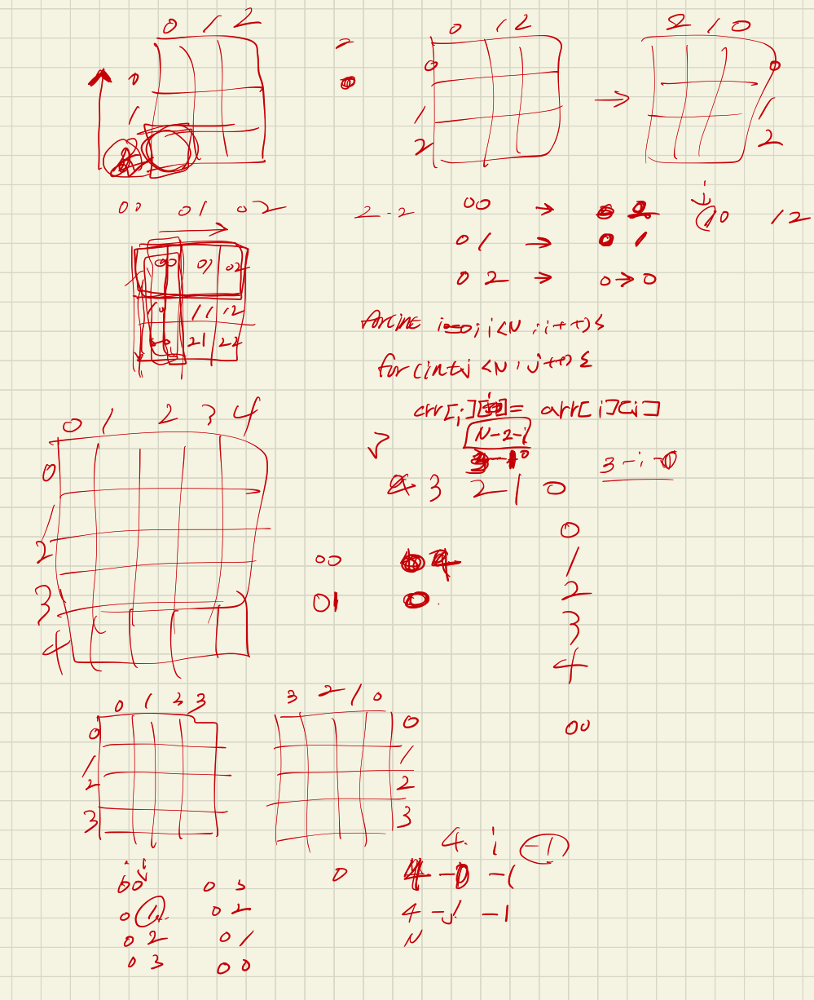

## 22.04.02_12100_2048Easy

## 목차

> 01.필수 알고리즘
>
> > 01.1 배열 회전
> >
> > 01.2 2개씩 비교해서 합치기  | 방향 오른쪽
> >
> > 01.3 dfs 구현
>
> 02.설계 과정
>
> 03.최종 소스

## 01.필수 알고리즘

### 01.1 배열 회전

- 방향 시계방향인 경우1

  ```c++
  void rotation(int arr[N_SIZE][N_SIZE])
  {
  	int crr[N_SIZE][N_SIZE] = { 0, };
  	for (int i = 0; i < N; i++) {
  		for (int j = 0; j < N; j++) {
  			crr[j][N - i -1] = arr[i][j];
  		}
  	}
  
  	for (int i = 0; i < N; i++) {
  		for (int j = 0; j < N; j++) {
  			arr[i][j] = crr[i][j];
  		}
  	}
  }
  ```

- 방향 시계방향인 경우2

  ```c++
  void rotation(int arr[N_SIZE][N_SIZE])
  {
  	int copy[N_SIZE][N_SIZE] = { 0, };
  	for (int i = 0; i < N; i++) {
  		for (int j = 0; j < N; j++) {
  			copy[i][j] = arr[N - j - 1][i];
  		}
  	}
  	for (int i = 0; i < N; i++) {
  		for (int j = 0; j < N; j++) {
  			arr[i][j] = copy[i][j];
  		}
  	}
  }
  ```

### 01.2 2개씩 비교해서 합치기  | 방향 오른쪽

- before

  ```c++
  void sumRight()
  {
  	for (int i = 0; i < N; i++)
  	{
  		vector<int>v1;
  		vector<int>v2;
  		for (int j = N - 1; j >= 0; j--)
  		{
  			if(board[i][j]!=0)
  			v1.push_back(board[i][j]);
  			board[i][j] = 0;
  		}
  
  		int k = 0;
  		for (k = 0; k < v1.size()-1; k++)
  		{
  			if (v1.size() ==0)break;
  			if (v1[k]!=0&&v1[k] == v1[k+1]) {
  				v2.push_back(v1[k]*2);
  				k++;
  			}
  			else 
  				v2.push_back(v1[k]);
  		}
  		if (k == v1.size() - 1) v2.push_back(v1[k]);
  		
  		int index = N - 1;
  		for (k = 0; k < v2.size(); k++)
  		{
  			board[i][index--] = v2[k];
  		}
  	}
  }
  ```

  

- 좀 위의 경우 비효율적으로 구현한듯

  - 무엇보다 0 인경우도 걸어줘야하고 또 그냥 한개만 있는경우 한개의 데이터도 넣어야하는 소스이기떄문에 개선이 필요

- after

  ```c++
  	vector<int>q;
  	for (int j = 0; j < N; j++) {
  		for (int i = N - 1; i >= 0; i--) {
  			if (board[i][j] != 0)q.push_back(board[i][j]);//일단 저장
  			board[i][j] = 0;//초기화 시키기
  		}
  		for (int i = 0; i < q.size() - 1; i++) {
  			if (q.size() == 0)break;
  			if (q[i] == q[i + 1] && q[i] != 0) {
  				q[i] += q[i + 1];
  				q.erase(q.begin() + i + 1);
  			}
  		}
  		for (int i = N - 1; q.size(); i--) {
  			board[i][j] = q.front();
  			q.erase(q.begin());
  		}
  	}
  ```

  

### 01.3 dfs 구현

- before

  ```c++
  void dfs(int idx)
  {
  	if (idx == 5) {
  		for (int i = 0; i < N; i++) {
  			for (int j = 0; j < N; j++) {
  				ret = ret < board[i][j] ? board[i][j] : ret;
  			}
  		}
  		return;
  	}
  	for (int i = 0; i < 4; i++) {
  		int crr[N_SIZE][N_SIZE] = { 0, };
  		copyBoard(crr, board);
  		sumRight();
  		dfs(idx + 1);
  		rotation();
  		copyBoard(board, crr);
  	}
  }
  ```

  - 이렇게 하면 rotation 때문에 틀림

- after

  ```c++
  void dfs(int idx)
  {
  	if (idx == 5) {
  		int maxNumber = 0x80000000;
  		for (int i = 0; i < N; i++) {
  			for (int j = 0; j < N; j++) {
  				maxNumber = maxNumber < board[i][j] ? board[i][j] : maxNumber;
  			}
  		}
  		ret = ret < maxNumber ? maxNumber : ret;
  
  		return;
  	}
  	for (int i = 0; i < 4; i++) {
  		int crr[N_SIZE][N_SIZE] = { 0, };
  		copyBoard(crr, board);
  		sumRight();
  		dfs(idx + 1);
  		rotation(crr);
  		copyBoard(board, crr);
  	}
  }
  ```

  

- 이렇게만 할 수 있는 이유 배열을 돌리기에 여러방향에서 합쳐지는것과 같음

## 02. 설계 과정

 





## 03.최종 소스

```c++
#include<stdio.h>
#include<iostream>
#include<string.h>
#include<vector>
using namespace std;
#define N_SIZE 21
int N;
int board[N_SIZE][N_SIZE];
void initValue();
void sumRight();
void sumBlock2();
void sumBlock3();
void sumBlock4();
void rotation(int arr[N_SIZE][N_SIZE]);
void printBlock();
void copyBoard(int crr[N_SIZE][N_SIZE],int arr[N_SIZE][N_SIZE]);
void dfs(int index);
int ret = 0x80000000;

int main()
{
	initValue();
	dfs(0);
	cout << ret << endl;
	return 0;
}

void dfs(int idx)
{
	if (idx == 5) {
		for (int i = 0; i < N; i++) {
			for (int j = 0; j < N; j++) {
				ret = ret < board[i][j] ? board[i][j] : ret;
			}
		}
		return;
	}
	for (int i = 0; i < 4; i++) {
		int crr[N_SIZE][N_SIZE] = { 0, };
		copyBoard(crr, board);
		sumRight();
		dfs(idx + 1);
		rotation(crr);
		copyBoard(board, crr);
	}
}

void initValue()
{
	scanf("%d", &N);
	for (int i = 0; i < N; i++)
	{
		for (int j = 0; j < N; j++)
		{
			scanf("%d", &board[i][j]);
		}
	}
}

void copyBoard(int crr[N_SIZE][N_SIZE], int arr[N_SIZE][N_SIZE]) {
	for (int i = 0; i < N; i++) {
		for (int j = 0; j < N; j++) {
			crr[i][j] = arr[i][j];
		}
	}
}

void rotation(int arr[N_SIZE][N_SIZE])
{
	int copy[N_SIZE][N_SIZE] = { 0, };
	for (int i = 0; i < N; i++) {
		for (int j = 0; j < N; j++) {
			copy[j][N - i -1] = arr[i][j];
		}
	}
	for (int i = 0; i < N; i++) {
		for (int j = 0; j < N; j++) {
			arr[i][j] = copy[i][j];
		}
	}
}


void sumRight()
{
	vector<int>q;
	for (int j = 0; j < N; j++) {
		for (int i = N - 1; i >= 0; i--) {
			if (board[i][j] != 0)q.push_back(board[i][j]);//일단 저장
			board[i][j] = 0;//초기화 시키기
		}
		for (int i = 0; i < q.size() - 1; i++) {
			if (q.size() == 0)break;
			if (q[i] == q[i + 1] && q[i] != 0) {
				q[i] += q[i + 1];
				q.erase(q.begin() + i + 1);
			}
		}
		for (int i = N - 1; q.size(); i--) {
			board[i][j] = q.front();
			q.erase(q.begin());
		}
	}
}

void printBlock()
{
	for (int i = 0; i < N; i++)
	{
		for (int j = 0; j < N; j++) {
			cout << board[i][j] << " ";
		}
		cout << endl;
	}
}
```

