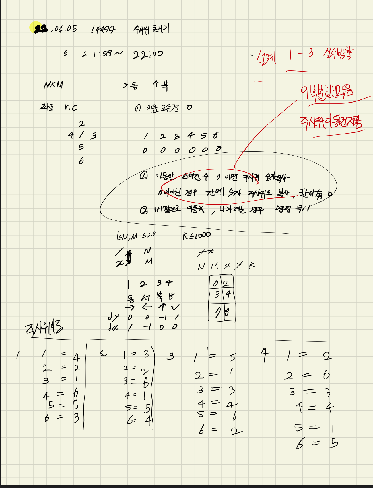

## 22-04-05-14499주사위굴리기

## 목차

> 01.문제설계
>
> 02.문제풀이중 실수
>
> 03.최종소스

## 01.문제설계



## 02.문제풀이중 실수

- 1,2,3,4 방향에 따른 주사위 의 순서 변경 누락함
- 주사위를 먼저 이동 시킴 순서를 틀림
- 이동칸이 0인 경우 주사위의 값을 복사하는 부분을 주사위의 값만 0으로 변경함

## 03.최종소스

```c++
#include<stdio.h>
#include<iostream>
using namespace std;
#define NS 21
#define MS 21
int board[NS][MS];
int ret;
int N, M, y, x, K;
int cube[7] = { 0, };//주사위 기록 초기 0
int dy[] = { 0,0,-1,1 };
int dx[] = { 1,-1,0,0 };
void init()
{
	scanf("%d %d %d %d %d", &N, &M, &y, &x, &K);
	for (int i = 0; i < N; i++) {
		for (int j = 0; j < M; j++) {
			scanf("%d", &board[i][j]);
		}
	}
}

void move(int dir) {
	if (dir == 0) {
		int copy = cube[1];
		cube[1] = cube[4];
		//cube[2] = cube[2];
		cube[4] = cube[6];
		cube[6] = cube[3];
		cube[3] = copy;
		//cube[5] = cube[5];
	}
	if (dir == 1)
	{
		int copy = cube[1];
		cube[1] = cube[3];
		//cube[2] = cube[2];
		cube[3] = cube[6];
		cube[6] = cube[4];
		cube[4] = copy;
		//cube[5] = cube[5];
	}
	if (dir == 2)
	{
		int copy = cube[1];
		cube[1] = cube[5];
		cube[5] = cube[6];
		cube[6] = cube[2];
		cube[2] = copy;
		//cube[3] = cube[3];
		//cube[4] = cube[4];

	}
	if (dir == 3)
	{
		int copy = cube[1];
		cube[1] = cube[2];
		cube[2] = cube[6];
		cube[6] = cube[5];
		cube[5] = copy;
		//cube[3] = cube[3];
		//cube[4] = cube[4];
	
	}
}

void play()
{
	int dir = 0;
	//1.이동하기
	//2. 이동한 칸에 0 이면 주사위 숫자를 칸에 복사
	//2.1 0이 아닌경우 칸의 숫자를 주사위로 복사, 그 칸의 숫자는 0으로 초기화
	//3.바깥으로는 이동안됨 나가려는 경우 명령 무시
	for (int k = 0; k < K; k++) {
		scanf("%d",&dir);
		dir--;
		int ny = y+dy[dir]; int nx =x+ dx[dir];
		if (ny < 0 || ny >= N || nx < 0 || nx >= M)continue;
		move(dir);//주사위 위치 변경

		if (board[ny][nx] == 0) {
			board[ny][nx] = cube[6];
		}
		else if (board[ny][nx] != 0) {
			cube[6] = board[ny][nx];
			board[ny][nx] = 0;
		}
		y = ny; x = nx;
		cout << cube[1] << " ";
	}
}

int main(void)
{
	init();
	play();
	return 0;
}
```

