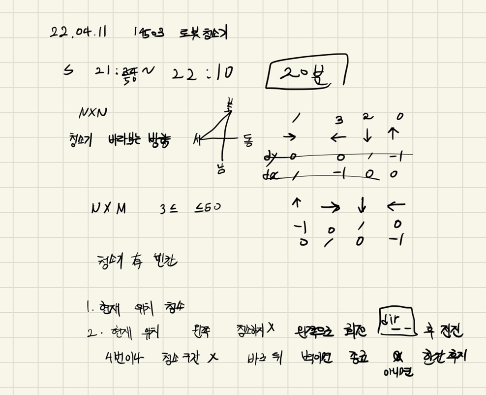

## 22-04-11-14503-로봇청소기

## 목차

> 01.청소방향 확인하는 소스
>
> 02.청소구간이 없는 경우 후진 또는 종료
>
> 03.전체소스



## 01.청소방향 확인하는 소스

```c++
		int idx = 0;
		int y = robot.y, x = robot.x;
		int dir = robot.dir;
		for (idx = 0; idx < 4; idx++) {
			dir--;
			if (dir == -1) dir = 3;
			pos next;
			next.y = y + dy[dir];
			next.x = x + dx[dir];
			if (board[next.y][next.x] == 0) { // 청소 공간이 있는경우 회전후 전진
				robot.y = next.y;
				robot.x = next.x;
				robot.dir = dir;
				break;
			}
		}
```

## 02.청소구간이 없는 경우 후진 또는 종료

```c++
		if (idx == 4)// 청소구간이 없는 경우 후진 또는 종료
		{
			pos prev;
			prev.y = robot.y - dy[dir];
			prev.x = robot.x - dx[dir];
			if (board[prev.y][prev.x] != 1)// 벽이 아닌 경우 후진
			{
				robot.y = prev.y;
				robot.x = prev.x;
			}
			else if (board[prev.y][prev.x] == 1)// 벽인 경우 종료
			{
				break;
			}
		
```

## 03.전체소스

```c++
#include<stdio.h>
#include<iostream>
#include<vector>
#include<string.h>
#define NS 51
using namespace std;
int N, M, ret;
int dy[] = { -1,0,1,0 };
int dx[] = { 0,1,0,-1 };
int board[NS][NS];
struct pos {
	int y, x, dir;
}robot;

void init() {
	N = M = ret = 0;
	scanf("%d %d", &N, &M);
	scanf("%d %d %d", &robot.y, &robot.x, &robot.dir);
	for (int i = 0; i < N; i++) {
		for (int j = 0; j < M; j++) {
			scanf("%d", &board[i][j]);
		}
	}
}

void cleanRoom()
{
	ret = 1;
	while (1)// 청소 시작
	{
		if (board[robot.y][robot.x] == 0) {
			board[robot.y][robot.x] = ++ret;
		}

		int idx = 0;
		int y = robot.y, x = robot.x;
		int dir = robot.dir;
		for (idx = 0; idx < 4; idx++) {
			dir--;
			if (dir == -1) dir = 3;
			pos next;
			next.y = y + dy[dir];
			next.x = x + dx[dir];
			if (board[next.y][next.x] == 0) { // 청소 공간이 있는경우 회전후 전진
				robot.y = next.y;
				robot.x = next.x;
				robot.dir = dir;
				break;
			}
		}

		if (idx == 4)// 청소구간이 없는 경우 후진 또는 종료
		{
			pos prev;
			prev.y = robot.y - dy[dir];
			prev.x = robot.x - dx[dir];
			if (board[prev.y][prev.x] != 1)// 벽이 아닌 경우 후진
			{
				robot.y = prev.y;
				robot.x = prev.x;
			}
			else if (board[prev.y][prev.x] == 1)// 벽인 경우 종료
			{
				break;
			}
		}
	}
}
int main(void)
{
	init();
	cleanRoom();
	printf("%d", ret-1);
	return 0;
}
```

- 여기서 포인트는 

  ```c++
  	ret = 1;
  	while (1)// 청소 시작
  	{
  		if (board[robot.y][robot.x] == 0) {
  			board[robot.y][robot.x] = ++ret;
  		}
  		...
  ```

  - ret를 1부터 시작하고 ++을 먼저하는 것은 벽이 1이기때문에 
    - 1부터시작하지 않은 2가 찍히게 해야지 제대로 동작을 하기 때문 
      - 안그러면 어떤 경우에는 청소한 1을 벽으로 생각해서 그전에 종료가되는 경우가 있으므로 주의하면 좋음