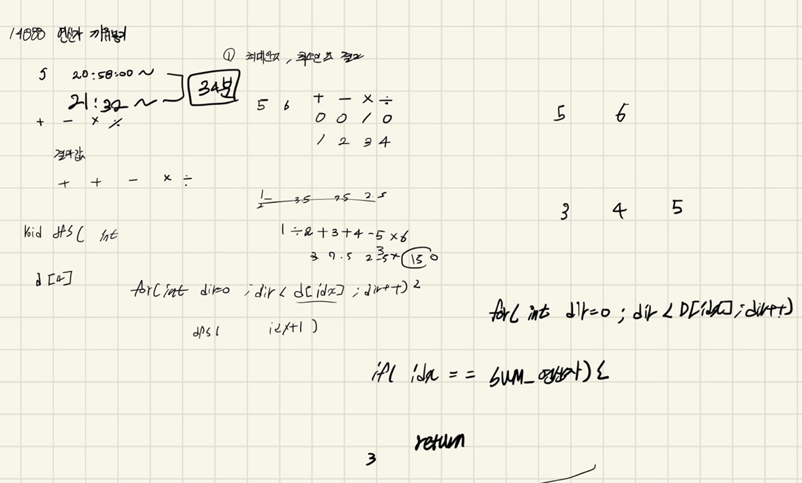
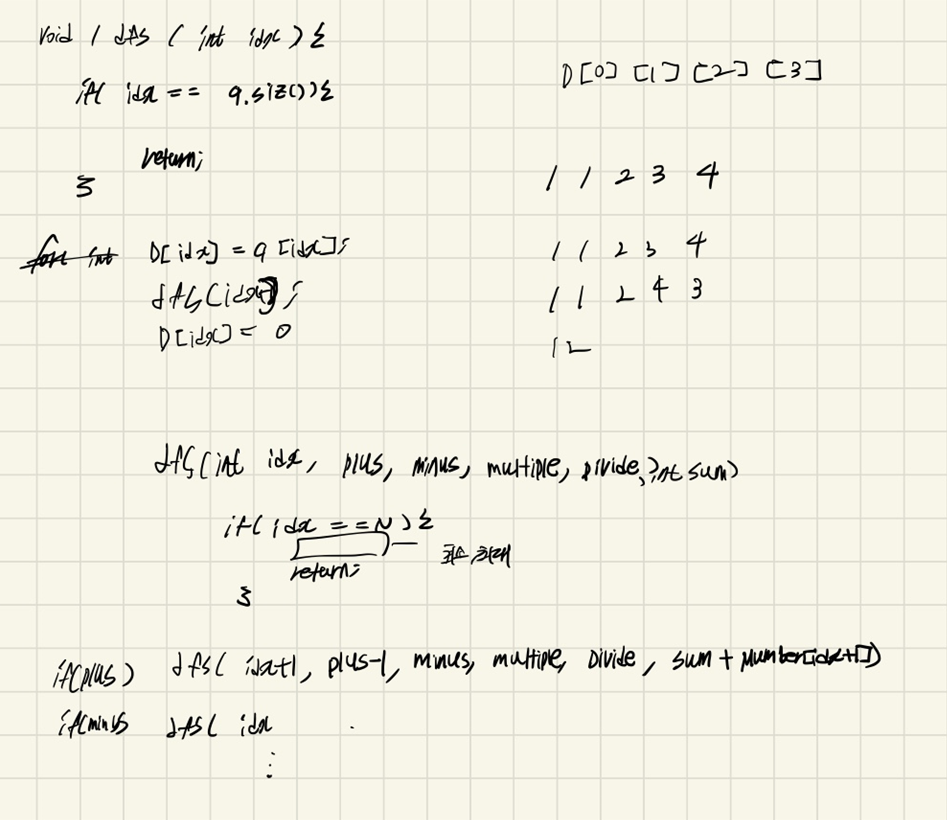

## 22-04-11-14888-연산자끼워넣기

## 목차

> 01.dfs를 이용한 계산
>
> 02.최댓값, 최솟값 산출 방법
>
> 03.전체소스





## 01.dfs를 이용한 계산

```c++
void dfs(int idx, int plus, int minus, int multiple, int divide, int sum)
{
	if (idx == sumNumber)
	{
		minNumber = minNumber > sum ? sum : minNumber;
		maxNumber = maxNumber < sum ? sum : maxNumber;
		return;
	}
	if (plus) dfs(idx + 1, plus - 1, minus, multiple, divide, sum + number[idx+1]);
	if (minus) dfs(idx + 1, plus, minus-1, multiple, divide, sum - number[idx + 1]);
	if (multiple) dfs(idx + 1, plus, minus, multiple-1, divide, sum * number[idx + 1]);
	if (divide) dfs(idx + 1, plus, minus, multiple, divide-1, sum / number[idx + 1]);
}
```

- 전체를 한개씩 보기 위한 방법
  - idx는 증가하지만 각 if문으로  참인 경우 즉, 데이터가 있는경우에만 dfs들어가서 sum값을 계산하는식으로 풀이 진행

## 02.최댓값, 최솟값 산출 방법

```c++
		minNumber = minNumber > sum ? sum : minNumber;
		maxNumber = maxNumber < sum ? sum : maxNumber;
```

- #include<algorithm>에  있는 max(minNumber,sum), min(maxNumber,sum) 으로 해도되고
  - 아예 #define해서 힙에 만들어서 해도 된다. 사실 속도차이는 나긴 하지만 크게 알고리즘 풀이에 영향을 주는것이 아니기에 여기까지 알아도 좋다.

## 03.전체소스

```c++
#include<stdio.h>
#include<iostream>
#include<vector>
#define NS 12
int N;
int number[NS];
int D[NS];
int sumNumber;
int minNumber;
int maxNumber;
void init()
{
	minNumber = 0x7fffffff;
	maxNumber = 0x80000000;
	scanf("%d", &N);
	for (int i = 0; i < N; i++)
	{
		scanf("%d", &number[i]);
	}
	for (int i = 0; i < 4; i++)
	{
		scanf("%d", &D[i]);
		sumNumber += D[i];
	}
}

void dfs(int idx, int plus, int minus, int multiple, int divide, int sum)
{
	if (idx == sumNumber)
	{
		minNumber = minNumber > sum ? sum : minNumber;
		maxNumber = maxNumber < sum ? sum : maxNumber;
		return;
	}
	if (plus) dfs(idx + 1, plus - 1, minus, multiple, divide, sum + number[idx+1]);
	if (minus) dfs(idx + 1, plus, minus-1, multiple, divide, sum - number[idx + 1]);
	if (multiple) dfs(idx + 1, plus, minus, multiple-1, divide, sum * number[idx + 1]);
	if (divide) dfs(idx + 1, plus, minus, multiple, divide-1, sum / number[idx + 1]);
}
int main(void)
{
	init();
	dfs(0, D[0], D[1], D[2], D[3], number[0]);
	printf("%d\n%d\n", maxNumber, minNumber);
	return 0;
}
```


