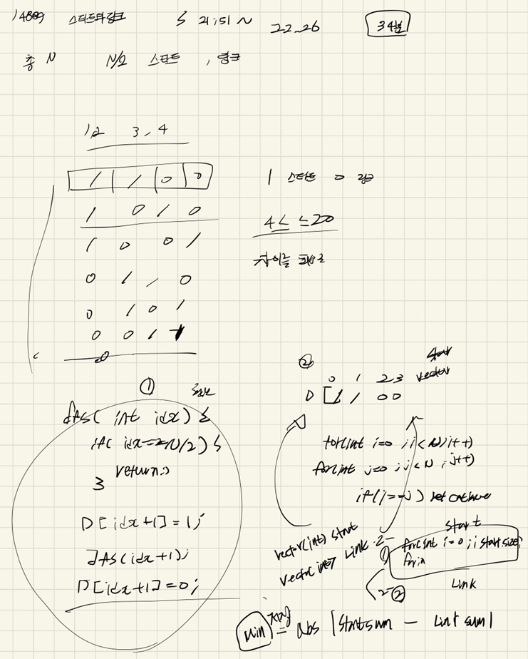

## 22-04-12-14889-스타트와링크

## 목차

> 01.DFS로 팀나누기
>
> 02.전체소스



## 01.DFS로 팀나누기

```c++
void dfs(int idx,int cnt)
{
	if (N / 2 == cnt)
	{
		vector<int>start;
		vector<int>link;
		for (int i = 0; i < N; i++)
		{
			if (D[i] == 1) start.push_back(i);
			else if (D[i] == 0)link.push_back(i);
		}

		int sumStart = 0;
		int sumLink = 0;
		for (int i = 0; i < start.size(); i++)
		{
			for (int j = 0; j < start.size(); j++)
			{
				if (start[i] == start[j]) continue;
				sumStart += board[start[i]][start[j]];
			}
		}
		
		for (int i = 0; i < link.size(); i++)
		{

			for (int j = 0; j < link.size(); j++)
			{
				if (link[i] == link[j]) continue;
				sumLink += board[link[i]][link[j]];
			}
		}
		int minusResult = abs(sumStart-sumLink);
		ret = min(minusResult, ret);
		return;
	}
```

- 팀을 1을 스타트팀
  - 0을 링크팀으로 구분하여 dfs를 돌려서 모든 경우 확인 하면서 계산 진행

## 02.전체소스

```c++
#include<stdio.h>
#include<iostream>
#include<vector>
#include<string.h>
#include<algorithm>
#define NS 21
using namespace std;
int N;
int ret;
int board[NS][NS];
int D[NS];
void initValue()
{
	N = 0;
	ret = 0x7fffffff;
	scanf("%d", &N);
	for (int i = 0; i < N; i++)
	{
		for (int j = 0; j < N; j++) 
		{
			scanf("%d", &board[i][j]);
		}
	}
}

void dfs(int idx,int cnt)
{
	if (N / 2 == cnt)
	{
		vector<int>start;
		vector<int>link;
		for (int i = 0; i < N; i++)
		{
			if (D[i] == 1) start.push_back(i);
			else if (D[i] == 0)link.push_back(i);
		}

		int sumStart = 0;
		int sumLink = 0;
		for (int i = 0; i < start.size(); i++)
		{
			for (int j = 0; j < start.size(); j++)
			{
				if (start[i] == start[j]) continue;
				sumStart += board[start[i]][start[j]];
			}
		}
		
		for (int i = 0; i < link.size(); i++)
		{

			for (int j = 0; j < link.size(); j++)
			{
				if (link[i] == link[j]) continue;
				sumLink += board[link[i]][link[j]];
			}
		}
		int minusResult = abs(sumStart-sumLink);
		ret = min(minusResult, ret);
		return;
	}

	for (int i = idx; i < N; i++) {
		if (D[i] == 0) {
			D[i] = 1;
			dfs(i+1,cnt+1);
			D[i] = 0;
		}
	}


}
int main(void)
{
	initValue();
	dfs(0,0);
	printf("%d\n", ret);
	return 0;
}
```
