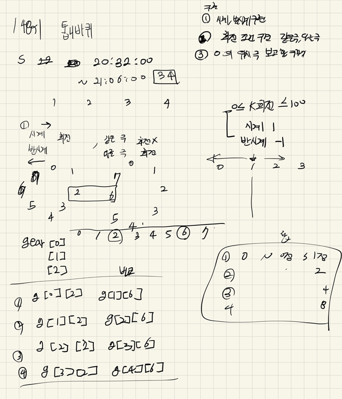

## 22-04-14

## 목차

> 01.시계, 반시계 방향 구현
>
> 02.회전조건 구현 (같은극, 다른극)
>
> 03.0번위치의 합구하기
>
> 04.전체소스



## 01.시계, 반시계 방향 구현

```c++
void clockMove(int idx)
{
	int copy = gear[idx][7];
	for (int i = 7; i >= 1; i--)
	{
		gear[idx][i] = gear[idx][i - 1];
	}
	gear[idx][0] = copy;
}

void clockMoveReverse(int idx)
{
	int copy = gear[idx][0];
	for (int i = 0; i < 7; i++)
	{
		gear[idx][i] = gear[idx][i + 1];
	}
	gear[idx][7] = copy;
}
```

## 02.회전조건 구현 (같은극, 다른극)

```c++
		int number, dir;
		scanf("%d %d", &number, &dir);
		number--;
		int gearDirs[4] = { 0 };
		gearDirs[number] = dir;
		for (int i = number; i >= 1; i--)
		{
			if (gear[i][6] != gear[i - 1][2]) {
				gearDirs[i - 1] = gearDirs[i] * -1;//다른 극인경우 방향 반대
			}
			else {
				gearDirs[i - 1] = 0;//같은 극인 경우 정지
			}
		}
		for (int i = number; i <= 2; i++)
		{
			if (gear[i][2] != gear[i + 1][6]){
				gearDirs[i + 1] = gearDirs[i] * -1;
			
```

## 03.0번위치의 합구하기

```c++
void sumClock() {
	for (int i = 0, sum=1; i < 4; i++,sum*=2)
	{
		if (gear[i][0] == 1) ret += sum;
	}
}
```

## 04.전체소스

```c++
#include<stdio.h>
#include<iostream>
#include<string.h>
#include<vector>
using namespace std;
int gear[4][8];
int ret;
int K;//회전
void init()
{
	K = ret=0;
	for (int i = 0; i < 4; i++) {
		for (int j = 0; j < 8; j++) {
			scanf("%1d", &gear[i][j]);
		}
	}
}

void clockMove(int idx)
{
	int copy = gear[idx][7];
	for (int i = 7; i >= 1; i--)
	{
		gear[idx][i] = gear[idx][i - 1];
	}
	gear[idx][0] = copy;
}

void clockMoveReverse(int idx)
{
	int copy = gear[idx][0];
	for (int i = 0; i < 7; i++)
	{
		gear[idx][i] = gear[idx][i + 1];
	}
	gear[idx][7] = copy;
}

void rotaionGear()
{
	scanf("%d", &K);
	for (int k = 0; k < K; k++)
	{
		int number, dir;
		scanf("%d %d", &number, &dir);
		number--;
		int gearDirs[4] = { 0 };
		gearDirs[number] = dir;
		for (int i = number; i >= 1; i--)
		{
			if (gear[i][6] != gear[i - 1][2]) {
				gearDirs[i - 1] = gearDirs[i] * -1;//다른 극인경우 방향 반대
			}
			else {
				gearDirs[i - 1] = 0;//같은 극인 경우 정지
			}
		}
		for (int i = number; i <= 2; i++)
		{
			if (gear[i][2] != gear[i + 1][6]){
				gearDirs[i + 1] = gearDirs[i] * -1;
			}
		}
		
		//기록된 방향대로 톱니바퀴 회전
		for (int i = 0; i < 4; i++){
			if (gearDirs[i] == 1) {
				clockMove(i);
			}
			else if (gearDirs[i] == -1){
				clockMoveReverse(i);
			}
		}
	}
}
void sumClock() {
	for (int i = 0, sum=1; i < 4; i++,sum*=2)
	{
		if (gear[i][0] == 1) ret += sum;
	}
}
int main(void)
{
	init();
	rotaionGear();
	sumClock();
	printf("%d\n", ret);
	return 0;
}
```

