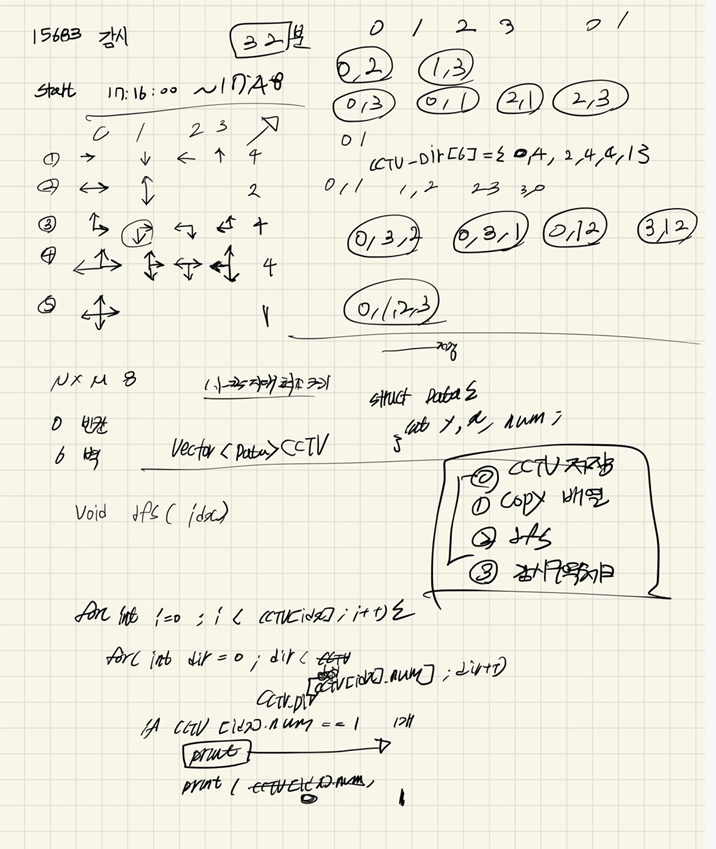

## 22-04-17-15683-감시



## 01.dfs

```c++
void dfs(int idx)
{
	if (idx == CCTV.size()) {
		int count = 0;

		for (int i = 0; i < N; i++) {
			for (int j = 0; j < M; j++) {
				if (board[i][j] == 0) {
					count++;
				}
			}
		}
		ret = ret > count ? count : ret;
		return;
	}

	for (int dir = 0; dir < cctv_dir[CCTV[idx].num]; dir++) {
		int cBoard[NS][MS] = { 0, };
		copyBoard(cBoard, board);
		if (CCTV[idx].num == 1) {
			lookSpace(CCTV[idx], dir);
		}
		if (CCTV[idx].num == 2) {
			lookSpace(CCTV[idx], dir);
			lookSpace(CCTV[idx], dir + 2);
		}
		if (CCTV[idx].num == 3) {
			lookSpace(CCTV[idx], dir);
			lookSpace(CCTV[idx], dir + 1);
		}
		if (CCTV[idx].num == 4) {
			lookSpace(CCTV[idx], dir);
			lookSpace(CCTV[idx], dir + 1);
			lookSpace(CCTV[idx], dir + 2);
		}
		if (CCTV[idx].num == 5) {
			lookSpace(CCTV[idx], dir);
			lookSpace(CCTV[idx], dir + 1);
			lookSpace(CCTV[idx], dir + 2);
			lookSpace(CCTV[idx], dir + 3);
		}
		dfs(idx + 1);
		copyBoard(board, cBoard);
	}
}
```

## 02.감시구역체크

```c++
void lookSpace(Data CCTV, int dir) {
	dir = (dir + 4) % 4;
	Data c = CCTV;
	while (1) {
		if (board[c.y][c.x] == 6 || (c.y<0||c.y>=N||c.x<0||c.x>=M)) {
			break;
		}
		if (board[c.y][c.x] == 0) {
			board[c.y][c.x] = -1;
		}

		c.y = c.y + dy[dir]; c.x = c.x + dx[dir];

	}
}
```

## 03.전체소스

```c++
#include<stdio.h>
#include<iostream>
#include<vector>
#define NS 8
#define MS 8
using namespace std;
int N, M, ret;
int board[NS][MS];
int cctv_dir[6] = { 0,4,2,4,4,1 };
int dy[] = { 0,1,0,-1 };
int dx[] = { 1,0,-1,0 };
struct Data {
	int y, x, num;
};
vector<Data>CCTV;//CCTV저장

void copyBoard(int cArr[NS][MS], int Arr[NS][MS]);
void init();
void dfs(int idx);
void lookSpace(Data CCTV, int dir);
int main(void) {

	init();
	dfs(0);
	printf("%d\n", ret);
	return 0;
}

void lookSpace(Data CCTV, int dir) {
	dir = (dir + 4) % 4;
	Data c = CCTV;
	while (1) {
		if (board[c.y][c.x] == 6 || (c.y<0||c.y>=N||c.x<0||c.x>=M)) {
			break;
		}
		if (board[c.y][c.x] == 0) {
			board[c.y][c.x] = -1;
		}

		c.y = c.y + dy[dir]; c.x = c.x + dx[dir];

	}
}

void dfs(int idx)
{
	if (idx == CCTV.size()) {
		int count = 0;

		for (int i = 0; i < N; i++) {
			for (int j = 0; j < M; j++) {
				if (board[i][j] == 0) {
					count++;
				}
			}
		}
		ret = ret > count ? count : ret;
		return;
	}

	for (int dir = 0; dir < cctv_dir[CCTV[idx].num]; dir++) {
		int cBoard[NS][MS] = { 0, };
		copyBoard(cBoard, board);
		if (CCTV[idx].num == 1) {
			lookSpace(CCTV[idx], dir);
		}
		if (CCTV[idx].num == 2) {
			lookSpace(CCTV[idx], dir);
			lookSpace(CCTV[idx], dir + 2);
		}
		if (CCTV[idx].num == 3) {
			lookSpace(CCTV[idx], dir);
			lookSpace(CCTV[idx], dir + 1);
		}
		if (CCTV[idx].num == 4) {
			lookSpace(CCTV[idx], dir);
			lookSpace(CCTV[idx], dir + 1);
			lookSpace(CCTV[idx], dir + 2);
		}
		if (CCTV[idx].num == 5) {
			lookSpace(CCTV[idx], dir);
			lookSpace(CCTV[idx], dir + 1);
			lookSpace(CCTV[idx], dir + 2);
			lookSpace(CCTV[idx], dir + 3);
		}
		dfs(idx + 1);
		copyBoard(board, cBoard);
	}
}
void copyBoard(int cArr[NS][MS], int Arr[NS][MS]) {
	for (int i = 0; i < N; i++) {
		for (int j = 0; j < M; j++) {
			cArr[i][j] = Arr[i][j];
		}
	}
}

void init() {
	N = M = 0;
	ret = 0x7fffffff;

	scanf("%d %d", &N, &M);
	for (int i = 0; i < N; i++) {
		for (int j = 0; j < M; j++) {
			scanf("%d", &board[i][j]);
			if (board[i][j] != 6&& board[i][j]!=0) {
				CCTV.push_back({ i,j,board[i][j] });
				board[i][j] = 0;
			}
		}
	}
}
```

